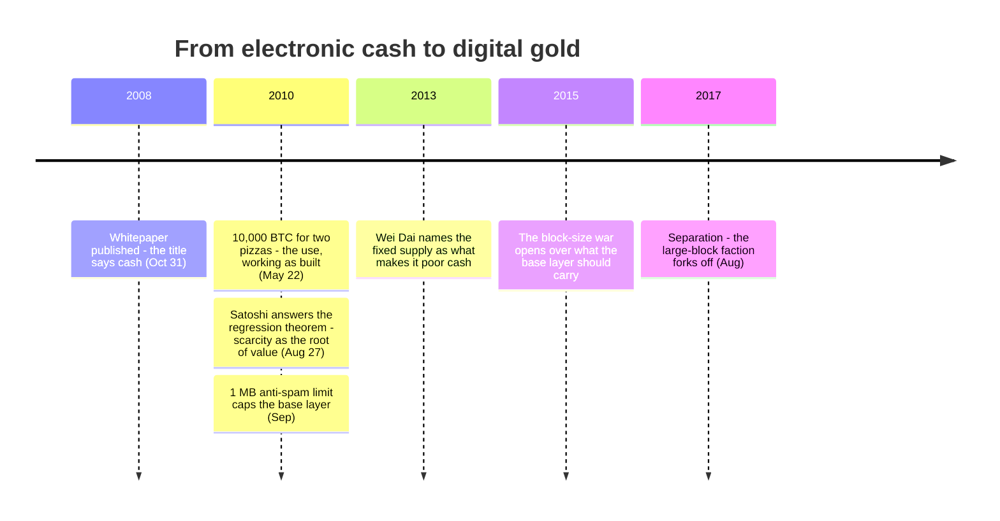

The whitepaper gives Bitcoin two images that seem to pull apart. Its [title](/BitcoinArchive/entries/emails/cryptography/2008-10-31-bitcoin-whitepaper-final/) promises electronic cash; §6 compares new coins with gold mined into circulation. The tension becomes useful only when we ask whether those lines describe the same axis. This page follows that distinction from the whitepaper to the first recorded purchase, then into the scarcity and scaling pressures that pushed the design toward digital gold.

| Axis | Satoshi's design | Where in the paper |
|---|---|---|
| Issuance (how it is made) | mined out, runs to a cap, can't be inflated | Section 6 |
| Use (how it is spent) | two parties pay each other directly | title, Section 1 |

And yet today Bitcoin is called "digital gold," rarely spent, mostly held. This is not a betrayal of the design. **The hardness inside the design — the scarcity — wore away the cash use inside the design, from within.** Here is how.

## Why it has value at all — Satoshi's answer

The clearest statement of why a thing like Bitcoin could have value is not in the whitepaper. It is a [BitcoinTalk post from August 27, 2010](/BitcoinArchive/entries/forum/bitcointalk/topic-583/2010-08-27-re-bitcoin-does-not-violate-mises-regression-theorem/). The Mises regression theorem holds that a money's value traces back to some use the good had before it was money — for gold, ornament and industry. Bitcoin had no such prior use, so by the theorem it could never have become money. And yet it did. That apparent paradox — Bitcoin seeming to defy the theorem — is what the thread argued over, and Satoshi answered it with a thought experiment:

<!-- quote: q1 -->
> "As a thought experiment, imagine there was a base metal as scarce as gold but ... not useful for any practical or ornamental purpose ... and one special, magical property: can be transported over a communications channel."

Both faces of the design are here. The root of value is **scarcity** — as impossible to mine out as gold. The use is **transmission** — you can send it across distance. He added "(I would definitely want some)" because the scarcity was where he saw the value. Hard like gold, moving like cash. Two things in one.

## It worked as cash, exactly as built

That use was not a fantasy. On [May 22, 2010, Laszlo Hanyecz paid 10,000 BTC for two Papa John's pizzas](/BitcoinArchive/entries/aftermath/2010-05-22-bitcoin-pizza-day/) — about $41 then, the first recorded purchase of a real good with Bitcoin. This is not proof that "the cash dream was real." It is simply the use Satoshi designed, working as designed. The way it was dug out was gold; the way it was spent was cash. Exactly as written.

## Then it tilted toward gold

But the same transaction is now the one people cite as "if only you'd held." Ten thousand coins became hundreds of millions of dollars. And here is the seed the design planted in itself: no one pays for today's pizza with something worth more tomorrow. **The scarcity that makes Bitcoin gold is the same scarcity that removes the reason to spend it.** An asset that climbs is held, not used.

Scaling constraints pushed the same way. The 1 MB limit Satoshi added in September 2010 as anti-spam capped what the base layer could carry and became the issue of the [2015–2017 block-size war](/BitcoinArchive/entries/analysis/2015-08-15-block-size-war-2015-2017-overview/). It resolved by separation: in August 2017 the large-block faction [forked off as Bitcoin Cash](/BitcoinArchive/entries/aftermath/2017-08-01-bitcoin-cash-fork/), choosing to keep everyday payments on chain, while the main chain went to SegWit and the Lightning Network — base layer as a settlement floor, daily payments stacked above it or priced out by fees. Scarcity says "hold"; congestion says "don't spend here." The use slid from cash to holding.

## A precursor saw the mechanism

This is not hindsight. [Wei Dai](/BitcoinArchive/participants/wei-dai/), cited as reference [1] in the whitepaper, [said the same thing in 2013](/BitcoinArchive/entries/analysis/2008-10-31-fixed-supply-vs-adjustable-money/): the fixed supply causes high price volatility that imposes a heavy cost on users — so it makes a poor everyday currency. The author of the elastic-supply b-money (1998) named Bitcoin's very hardness as the thing that makes it unfit for cash. The property that makes it digital gold and the property that makes it bad cash are the same property.

## Two faces of one coin

The [digital-gold structural-features reading](/BitcoinArchive/entries/analysis/2008-10-31-bitcoin-digital-gold-structural-features/) argues that the gold status comes from design — fixed supply and the rest. The [design-vs-current-reality reading](/BitcoinArchive/entries/analysis/2026-05-24-satoshi-design-vs-current-reality/) records the use sliding from cash to a settlement layer. The primary record ties them together: **the scarcity that made Bitcoin digital gold is the same scarcity that wore down its cash use.** Satoshi did not set out to "make gold." He made it hard — and the hardness had a gold face on one side and an unspent-cash face on the other. "Digital gold" is not the intent; it is that face winning, later.

## So does it still dream of electronic cash?

So this question stands in the present tense, not the past. Now that it is held as gold, does Bitcoin still reach for the use it was designed for — electronic cash? The Lightning Network, [El Salvador's legal-tender experiment](/BitcoinArchive/entries/analysis/2026-07-28-bitcoin-nation-state-policy-history/), the on-chain-cash efforts — the hand is still out. The cash face of the design did not vanish; it is only covered by the gold one. It was not built to be hoarded. It was built hard, and the hardness made it hoardable. And still it dreams of being spent.

## Limits of this reading

- This is an editorial reading of design from a sparse record, not a claim about Satoshi's private intentions.
- The section 6 gold is an analogy for **issuance** — new coins enter like mined gold — not a claim that Bitcoin is gold to be held.
- "Scarcity wears down cash use" is the classic argument that a deflationary asset is hoarded rather than spent.
- The Lightning Network, El Salvador, and other on-chain-cash efforts are live; a future in which everyday spending returns would not falsify this reading, but it would change its tense.

The [digital-gold structural-features analysis](/BitcoinArchive/entries/analysis/2008-10-31-bitcoin-digital-gold-structural-features/) and the [design-vs-current-reality analysis](/BitcoinArchive/entries/analysis/2026-05-24-satoshi-design-vs-current-reality/) leave one question between them, and the primary record answers it: were the property that made it gold and the property that wore down its cash use one and the same all along? [The twelve-chain design comparison](/BitcoinArchive/entries/analysis/2026-07-26-altcoin-count-and-design-comparison/) puts that same question to eleven other chains' own issuance designs.

*[Context: The tension this entry reads — the gold face and the cash face of a single design — runs through the novel [*Genesis: The Disappearance of the Founder and the Promise*](/BitcoinArchive/novel/), which imagines the founder behind the design.]*

<!-- entry-closing -->

The narrower issue is not whether Bitcoin is cash or gold. It is whether the scarcity that made the system durable still leaves room for spending. The whitepaper fixed the design; how the network is used now is deciding which face of that design remains visible.
