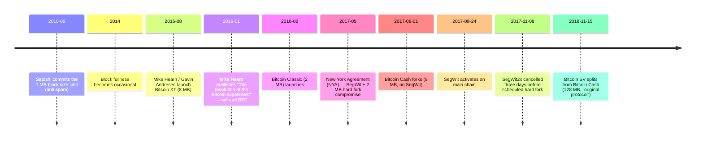

This entry catalogs (a) every protocol fork of Bitcoin that produced a chain that survived the launch event with non-trivial network share, and (b) the adjacent cryptocurrencies whose design lineage starts from Bitcoin's source code or design. Out of scope: failed-launch forks (no surviving chain) and chains whose technical design originates independently of Bitcoin. The latter category is large — thousands of such chains exist (Ripple's federated consensus, Monero's CryptoNote ring signatures, IOTA's DAG, Cardano's Ouroboros PoS are commonly-cited examples in mainstream discourse, but they are illustrations of the category, not its boundary).

The list is observational. It does not endorse any one chain as "the real Bitcoin"; the canonical chain in this archive is the one whose Genesis block was mined on January 3, 2009 with hash `000000000019d6689c085ae165831e934ff763ae46a2a6c172b3f1b60a8ce26f` ([genesis-block analysis](/BitcoinArchive/entries/analysis/2009-01-03-genesis-block-hardcode-analysis/)).

The interactive chart at the top of this entry plots every listed chain on a true time axis: the launch date, the parent chain it forked from, the operational range, and whether the chain is still producing blocks today or halted within months of launch. Each chain row in the chart links to the corresponding archive entry where one exists. The §1 and §2 tables below record each chain's per-attribute status (block-size cap, hashrate share, governance, etc.).

## 1. Bitcoin protocol forks

Hard forks of the Bitcoin protocol that produced a separate chain. Soft forks (SegWit, Taproot) that activated on the main chain are not listed here.

| Fork date | Chain name | Origin | Protocol change | Outcome (as of 2026) |
|---|---|---|---|---|
| 2015-08-15 | [Bitcoin XT](/BitcoinArchive/entries/aftermath/2015-08-15-bitcoin-xt-launch/) | [Mike Hearn](/BitcoinArchive/participants/mike-hearn/), [Gavin Andresen](/BitcoinArchive/participants/gavin-andresen/) | BIP 101: 8 MB blocks, doubling every 2 years | Effectively dead by 2016-01 ([Hearn's resolution essay](/BitcoinArchive/entries/aftermath/2016-01-14-mike-hearn-resolution-bitcoin-experiment/)) |
| 2016-02-10 | Bitcoin Classic | Jonathan Toomim et al. | 2 MB blocks via hard fork | Effectively dead by late 2016 |
| 2016-10-13 | Bitcoin Unlimited | Andrew Stone et al. | Flexible block size, miner-driven | Negligible share by 2018 |
| 2017-08-01 | [Bitcoin Cash (BCH)](/BitcoinArchive/entries/aftermath/2017-08-01-bitcoin-cash-fork/) | Roger Ver, Jihan Wu, Amaury Séchet | 8 MB blocks, no SegWit, fork at block 478558 | Surviving smaller chain; further split in 2018 |
| 2017-10-24 | Bitcoin Gold (BTG) | Jack Liao (LightningASIC) | Equihash PoW (ASIC-resistant), fork at block 491407 | Surviving niche chain; suffered 51% attacks 2018 / 2020 |
| 2017-11-08 | [SegWit2x — cancelled](/BitcoinArchive/entries/aftermath/2017-11-08-segwit2x-cancellation/) | Mike Belshe et al. (New York Agreement) | Planned 2 MB hard fork at block 494784 | Cancelled three days before activation; no fork occurred |
| 2018-11-15 | [Bitcoin SV (BSV)](/BitcoinArchive/entries/aftermath/2018-11-15-bitcoin-sv-fork/) | Craig Wright, Calvin Ayre (nChain) | 128 MB blocks, restored "original" opcodes | Survived 2018 hash war split from BCH; further reduced share after Wright loses COPA v Wright (2024) |

The 2015-2017 entries are the **block-size war** chapter — block size was the explicit issue, but the deeper question was protocol governance: who decides Bitcoin's parameters when the network's developers, miners, and businesses disagree. The eventual answer was that the conservative Bitcoin Core development culture held the main chain (with SegWit instead of a block-size hard fork), and the proposers who wanted larger blocks split off via Bitcoin Cash. SegWit2x was the New York Agreement compromise that would have shipped a 2 MB hard fork on the main chain three months after SegWit; its 11th-hour cancellation by [Mike Belshe](https://lists.linuxfoundation.org/pipermail/bitcoin-segwit2x/2017-November/000685.html) ended the dispute on the main-chain side.

The 2018 BSV split from BCH was a separate war within the BCH community, ultimately resolved by hashrate (the SV chain split off and continued separately). [Craig Wright](/BitcoinArchive/participants/craig-wright/)'s extended Satoshi-claim — refuted in [COPA v Wright (2024)](/BitcoinArchive/entries/aftermath/2024-03-14-copa-v-wright-ruling/) — and the BSV chain are tightly coupled in popular reception, but the chain itself is a technical artifact of the 2018 hash war and continues to operate independently of the COPA outcome.

## 2. Adjacent cryptocurrencies

Cryptocurrencies whose design lineage starts from Bitcoin's source code or core design. Chains whose design originates independently of Bitcoin (Ripple's federated consensus, Monero's CryptoNote, IOTA's Tangle, and many thousands of others) are not included — they predate Bitcoin or were built on different cryptographic / consensus foundations.

| Launch | Coin | Founder(s) | Lineage from Bitcoin | Distinguishing design |
|---|---|---|---|---|
| 2011-04-18 | [Namecoin](/BitcoinArchive/entries/aftermath/2011-04-18-namecoin-launch/) | Vincent Durham | Direct codebase fork (first known altcoin); originated from the [BitDNS thread on BitcoinTalk](/BitcoinArchive/entries/forum/bitcointalk/topic-1790/2010-11-14-bitdns-and-generalizing-bitcoin/) | Decentralized DNS / name registration; merge-mined with Bitcoin |
| 2011-10-13 | [Litecoin (LTC)](/BitcoinArchive/entries/aftermath/2011-10-13-litecoin-launch/) | Charlie Lee | Codebase fork of Bitcoin | Scrypt PoW (intended ASIC-resistant), 2.5-minute blocks, 84 M cap |
| 2013-12-06 | [Dogecoin (DOGE)](/BitcoinArchive/entries/aftermath/2013-12-06-dogecoin-launch/) | Billy Markus, Jackson Palmer | Codebase fork of Litecoin (which forked Bitcoin) | Initially joke / meme; large inflationary supply; cultural impact |
| 2015-07-30 | Ethereum (ETH) | Vitalik Buterin et al. | Independent codebase, design influenced by Bitcoin | Turing-complete smart contracts, account model (vs. UTXO) |

Ethereum is included because it is the most-cited "next-generation" chain whose design starts from observing Bitcoin's strengths and limits, even though the codebase is independent. The numerous Bitcoin-codebase forks not listed here (Peercoin, Primecoin, dozens of ERC-20-era altcoins built on Bitcoin code, etc.) are out of scope; this table records the ones whose cultural or technical significance recurs in mainstream Bitcoin discourse.

## 3. Block-size war timeline (2010–2017)

The critical sequence that produced the 2017 hard-fork rupture:

After 2018-11 no further protocol-fork chains have produced lasting share; Bitcoin Core's conservative protocol-evolution model (soft-fork only, Taproot 2021) has held the main chain.

## 4. Why the canonical chain endured

Three structural factors are commonly cited to explain why none of the breakaway chains displaced Bitcoin:

- **Network effect on hashrate.** The breakaway chains entered with proportionally smaller hashrate, making them cheaper to attack and slower-confirming. Bitcoin Gold suffered two 51% attacks (2018, 2020); BSV suffered repeated reorgs.
- **Brand / exchange listing inertia.** Major exchanges retained the Bitcoin ticker and address scheme on the main chain. New tickers (BCH, BSV, BTG) drew distinct but smaller markets.
- **Conservative-evolution culture.** Bitcoin Core's policy of soft-fork-only changes, slow review, and explicit unwillingness to rush hard forks under political pressure became a feature, not a bug, in the post-2017 reception. SegWit (soft fork, 2017-08-24) and Taproot (soft fork, 2021-11) were both shipped without splitting the chain.

These observations are descriptive, not prescriptive. They do not rule out a future fork that gains share, only record what happened in the 2009-2024 record.

## 5. Limits of this entry

- **Coverage.** This entry catalogs the protocol forks that left surviving chains and the adjacent cryptocurrencies that recur in mainstream Bitcoin discourse. The hundreds of thinly-traded Bitcoin-codebase forks (Peercoin, Primecoin, Auroracoin, etc.) are out of scope; the thousands of independently-designed chains whose origin does not trace back to Bitcoin (Ripple, Monero, IOTA, Cardano are commonly-cited examples in this category) are also out of scope.
- **End-state status.** Surviving-chain status is recorded as of the entry's last edit. A chain listed here as "surviving" can stop producing blocks at any time; the genealogy is historical, not a forward-looking endorsement.
- **Sociopolitical framing.** The block-size war narrative above leans on documents the participants themselves left behind ([Hearn 2016-01 essay](/BitcoinArchive/entries/aftermath/2016-01-14-mike-hearn-resolution-bitcoin-experiment/), [Belshe 2017-11 cancellation post](https://lists.linuxfoundation.org/pipermail/bitcoin-segwit2x/2017-November/000685.html), GitHub PR threads). It does not claim to settle which side was correct on the technical merits; that is a separate normative question, not within this catalog's scope.
