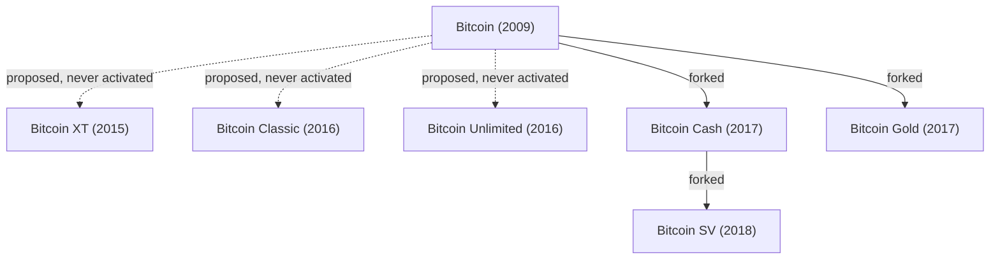
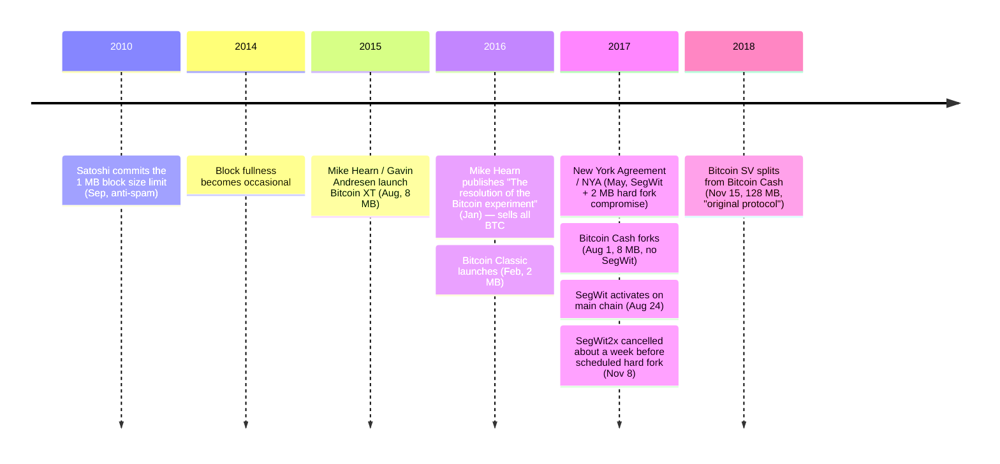

Every protocol fork of Bitcoin that produced a chain still producing blocks today, plus every adjacent cryptocurrency whose design lineage starts from Bitcoin's source code. The interactive chart at the top of this entry plots them on a true time axis. The canonical chain in this archive is the one whose Genesis block was mined on January 3, 2009 with hash `000000000019d6689c085ae165831e934ff763ae46a2a6c172b3f1b60a8ce26f` ([genesis-block analysis](/BitcoinArchive/entries/analysis/2009-01-03-genesis-block-hardcode-analysis/)). Out of scope: failed-launch forks (no surviving chain) and chains whose technical design originates independently of Bitcoin — [Ripple](/BitcoinArchive/entries/currency/2026-07-27-xrp-currency-overview/)'s federated consensus, [Monero](/BitcoinArchive/entries/currency/2026-07-27-monero-currency-overview/)'s CryptoNote ring signatures, IOTA's DAG, [Cardano](/BitcoinArchive/entries/currency/2026-07-27-cardano-currency-overview/)'s Ouroboros PoS are illustrative examples of that wider category, not its boundary.

The interactive chart at the top of this entry plots every listed chain on a true time axis: the launch date, the parent chain it forked from, the operational range, and whether the chain is still producing blocks today or halted within months of launch. Each chain row in the chart links to the corresponding archive entry where one exists. The §1 and §2 tables below record each chain's per-attribute status (block-size cap, hashrate share, governance, etc.).

<!-- chart: fork-genealogy -->

## 1. Bitcoin protocol forks

Hard forks of the Bitcoin protocol that produced a separate chain. Soft forks (SegWit, Taproot) that activated on the main chain are not listed here.

| Fork date | Chain name | Origin | Protocol change | Outcome (as of 2026) |
|---|---|---|---|---|
| 2015-08-15 | [Bitcoin XT](/BitcoinArchive/entries/aftermath/2015-08-15-bitcoin-xt-launch/) | [Mike Hearn](/BitcoinArchive/participants/mike-hearn/), [Gavin Andresen](/BitcoinArchive/participants/gavin-andresen/) | BIP 101: 8 MB blocks, doubling every 2 years | Effectively dead by 2016-01 ([Hearn's resolution essay](/BitcoinArchive/entries/aftermath/2016-01-14-mike-hearn-resolution-bitcoin-experiment/)) |
| 2016-02-10 | Bitcoin Classic | Jonathan Toomim et al. | 2 MB blocks via hard fork | Effectively dead by late 2016 |
| 2016-10-13 | Bitcoin Unlimited | Andrew Stone et al. | Flexible block size, miner-driven | Negligible share by 2018 |
| 2017-08-01 | [Bitcoin Cash (BCH)](/BitcoinArchive/entries/aftermath/2017-08-01-bitcoin-cash-fork/) | [Roger Ver](/BitcoinArchive/participants/roger-ver/) (early Bitcoin investor, bitcoin.com operator), [Jihan Wu](/BitcoinArchive/participants/jihan-wu/) (Bitmain co-founder, Bitcoin mining hardware), [Amaury Séchet](/BitcoinArchive/participants/amaury-sechet/) (Bitcoin Core contributor, Bitcoin ABC lead) | 8 MB blocks, no SegWit, fork at block 478558 | Surviving smaller chain; further split in 2018 |
| 2017-10-24 | Bitcoin Gold (BTG) | Jack Liao (LightningASIC) | Equihash PoW (ASIC-resistant), fork at block 491407 | Surviving niche chain; suffered 51% attacks 2018 / 2020 |
| 2017-11-08 | [SegWit2x — cancelled](/BitcoinArchive/entries/aftermath/2017-11-08-segwit2x-cancellation/) | [Mike Belshe](/BitcoinArchive/participants/mike-belshe/) (BitGo co-founder, Bitcoin custody) et al. (New York Agreement signatories from major Bitcoin companies) | Planned 2 MB hard fork at block 494784 | Cancelled about a week before activation; no fork occurred |
| 2018-11-15 | [Bitcoin SV (BSV)](/BitcoinArchive/entries/aftermath/2018-11-15-bitcoin-sv-fork/) | Craig Wright, Calvin Ayre (nChain) | 128 MB blocks, restored "original" opcodes | Survived 2018 hash war split from BCH; further reduced share after Wright loses COPA v Wright (2024) |

Not every attempt above produced a lasting split, and not every split came directly from Bitcoin:

```mermaid
flowchart TD
    BTC["Bitcoin (2009)"]
    BTC -.->|"proposed, never activated"| XT["Bitcoin XT (2015)"]
    BTC -.->|"proposed, never activated"| CLASSIC["Bitcoin Classic (2016)"]
    BTC -.->|"proposed, never activated"| UNLIMITED["Bitcoin Unlimited (2016)"]
    BTC -->|"forked"| BCH["Bitcoin Cash (2017)"]
    BTC -->|"forked"| BTG["Bitcoin Gold (2017)"]
    BCH -->|"forked"| BSV["Bitcoin SV (2018)"]
    %% link: BTC /BitcoinArchive/entries/analysis/2009-01-03-genesis-block-hardcode-analysis/
    %% link: XT /BitcoinArchive/entries/aftermath/2015-08-15-bitcoin-xt-launch/
    %% link: BCH /BitcoinArchive/entries/aftermath/2017-08-01-bitcoin-cash-fork/
    %% link: BSV /BitcoinArchive/entries/aftermath/2018-11-15-bitcoin-sv-fork/
```

Bitcoin SV is a fork of a fork, not a fork of Bitcoin itself — the hash war that produced it was fought inside the Bitcoin Cash chain, over a year after Bitcoin Cash had already split from Bitcoin.

The 2015-2017 entries are the **block-size war** chapter — block size was the explicit issue, but the deeper question was protocol governance: who decides Bitcoin's parameters when the network's developers, miners, and businesses disagree. The eventual answer was that the conservative Bitcoin Core development culture held the main chain (with SegWit instead of a block-size hard fork), and the proposers who wanted larger blocks split off via Bitcoin Cash. SegWit2x was the New York Agreement compromise that would have shipped a 2 MB hard fork on the main chain three months after SegWit; its 11th-hour cancellation by [Mike Belshe](/BitcoinArchive/entries/aftermath/2017-11-08-segwit2x-cancellation/) ended the dispute on the main-chain side.

For a structural reading of *why* the 2015-2017 disputes ran as identity contests rather than ordinary OSS disagreements — covering the post-2011 authority vacuum, the economic weight on rule choices, and Bitcoin's three-layer separation (protocol / software / currency) that has no analogue in ordinary OSS — see [the fork-wars-as-not-OSS analysis](/BitcoinArchive/entries/analysis/2015-08-15-bitcoin-fork-wars-as-not-oss/).

The 2018 BSV split from BCH was a separate war within the BCH community, ultimately resolved by hashrate (the SV chain split off and continued separately). [Craig Wright](/BitcoinArchive/participants/craig-wright/)'s extended Satoshi-claim — refuted in [COPA v Wright (2024)](/BitcoinArchive/entries/aftermath/2024-03-14-copa-v-wright-ruling/) — and the BSV chain are tightly coupled in popular reception, but the chain itself is a technical artifact of the 2018 hash war and continues to operate independently of the COPA outcome.

## 2. Adjacent cryptocurrencies

Cryptocurrencies whose design lineage starts from Bitcoin's source code or core design. Chains whose design originates independently of Bitcoin (Ripple's federated consensus, Monero's CryptoNote, IOTA's Tangle, and many thousands of others) are not included — they predate Bitcoin or were built on different cryptographic / consensus foundations.

| Launch | Coin | Founder(s) | Lineage from Bitcoin | Distinguishing design |
|---|---|---|---|---|
| 2011-04-18 | [Namecoin](/BitcoinArchive/entries/aftermath/2011-04-18-namecoin-launch/) | Vincent Durham (BitcoinTalk member `vinced`) | Direct codebase fork (first known altcoin); originated from the [BitDNS thread on BitcoinTalk](/BitcoinArchive/entries/forum/bitcointalk/topic-1790/2010-11-14-bitdns-and-generalizing-bitcoin/) | Decentralized DNS / name registration; merge-mined with Bitcoin |
| 2011-10-13 | [Litecoin (LTC)](/BitcoinArchive/entries/aftermath/2011-10-13-litecoin-launch/) | Charlie Lee (Google engineer, BitcoinTalk member `coblee`) | Codebase fork of Bitcoin | Scrypt PoW (intended ASIC-resistant), 2.5-minute blocks, 84 M cap |
| 2013-12-06 | [Dogecoin (DOGE)](/BitcoinArchive/entries/aftermath/2013-12-06-dogecoin-launch/) | Billy Markus (IBM engineer, Bitcoin enthusiast), Jackson Palmer (Adobe Sydney marketing) | Codebase fork of Litecoin (which forked Bitcoin) | Initially joke / meme; large inflationary supply; cultural impact |
| 2015-07-30 | [Ethereum (ETH)](/BitcoinArchive/entries/forum/bitcointalk/topic-428589/2014-01-23-vbuterin-ethereum-welcome-to-the-beginning/) | [Vitalik Buterin](/BitcoinArchive/participants/vitalik-buterin/) et al. — Buterin entered the Bitcoin community at 17, [co-founded Bitcoin Magazine](/BitcoinArchive/entries/aftermath/2012-05-01-bitcoin-magazine-launch/), wrote Bitcoin software (`pybitcointools`), and advocated extending Bitcoin's scripting language before pivoting to Ethereum | Independent codebase, design originating in the Bitcoin community | Turing-complete smart contracts, account model (vs. UTXO) |

[Ethereum](/BitcoinArchive/entries/currency/2026-07-27-ethereum-currency-overview/) is included because the chain's origin story runs *through* Bitcoin. [Vitalik Buterin](/BitcoinArchive/participants/vitalik-buterin/) first encountered Bitcoin in 2011 at age 17, [co-founded *Bitcoin Magazine*](/BitcoinArchive/entries/aftermath/2012-05-01-bitcoin-magazine-launch/) with Mihai Alisie (first print issue May 2012), contributed Bitcoin software including the widely-used `pybitcointools` library, and through 2013 wrote extensively about, and discussed, extending Bitcoin's scripting language with general-purpose computation — primarily in Bitcoin Magazine articles and in conversations with the Mastercoin team. The Bitcoin development community did not converge on that direction; the Mastercoin proposal to broaden its protocol was not adopted. Buterin documented his conclusion in the preface to the Ethereum whitepaper (late 2013) and helped launch a separate chain that would carry the scripting idea into a fresh codebase. Ethereum's account model, EVM design, and gas metering are independent engineering, but the *motivation* — making Bitcoin-like consensus carry arbitrary computation — comes directly out of Buterin's Bitcoin-Magazine-era thinking.

The other Ethereum co-founders (Gavin Wood, Charles Hoskinson, Joseph Lubin, Anthony Di Iorio, Mihai Alisie, Amir Chetrit) were similarly active in the Bitcoin / cypherpunk space before Ethereum.

The numerous Bitcoin-codebase forks not listed in the table above (Peercoin, Primecoin, dozens of ERC-20-era altcoins built on Bitcoin code, etc.) are out of scope; the table records the chains whose cultural or technical significance recurs in mainstream Bitcoin discourse.

## 3. Block-size war timeline (2010–2017)

The critical sequence that produced the 2017 hard-fork rupture:

```mermaid
timeline
    2010 : Satoshi commits the 1 MB block size limit (Sep, anti-spam)
    %% link: /BitcoinArchive/entries/forum/bitcointalk/topic-1347/2010-10-03-re-increase-block-size-limit/
    2014 : Block fullness becomes occasional
    2015 : Mike Hearn / Gavin Andresen launch Bitcoin XT (Aug, 8 MB)
    %% link: /BitcoinArchive/entries/aftermath/2015-08-15-bitcoin-xt-launch/
    2016 : Mike Hearn publishes "The resolution of the Bitcoin experiment" (Jan) — sells all BTC
    %% link: /BitcoinArchive/entries/aftermath/2016-01-14-mike-hearn-resolution-bitcoin-experiment/
         : Bitcoin Classic launches (Feb, 2 MB)
    2017 : New York Agreement / NYA (May, SegWit + 2 MB hard fork compromise)
         : Bitcoin Cash forks (Aug 1, 8 MB, no SegWit)
    %% link: /BitcoinArchive/entries/aftermath/2017-08-01-bitcoin-cash-fork/
         : SegWit activates on main chain (Aug 24)
    %% link: /BitcoinArchive/entries/bip/2015-12-21-bip-0141/
         : SegWit2x cancelled about a week before scheduled hard fork (Nov 8)
    %% link: /BitcoinArchive/entries/aftermath/2017-11-08-segwit2x-cancellation/
    2018 : Bitcoin SV splits from Bitcoin Cash (Nov 15, 128 MB, "original protocol")
    %% link: /BitcoinArchive/entries/aftermath/2018-11-15-bitcoin-sv-fork/
```

After 2018-11 no further protocol-fork chains have produced lasting share; Bitcoin Core's conservative protocol-evolution model (soft-fork only, Taproot 2021) has held the main chain.

## 4. Why the canonical chain endured

Three structural factors are commonly cited to explain why none of the breakaway chains displaced Bitcoin:

- **Network effect on hashrate.** The breakaway chains entered with proportionally smaller hashrate, making them cheaper to attack and slower-confirming. Bitcoin Gold suffered two 51% attacks (2018, 2020); BSV suffered repeated reorgs.
- **Brand / exchange listing inertia.** Major exchanges retained the Bitcoin ticker and address scheme on the main chain. New tickers (BCH, BSV, BTG) drew distinct but smaller markets.
- **Conservative-evolution culture.** Bitcoin Core's policy of soft-fork-only changes, slow review, and explicit unwillingness to rush hard forks under political pressure became a feature, not a bug, in the post-2017 reception. SegWit (soft fork, 2017-08-24) and Taproot (soft fork, 2021-11) were both shipped without splitting the chain.

These observations are descriptive, not prescriptive. They do not rule out a future fork that gains share, only record what happened between 2009 and 2024.

<!-- chart: crypto-race -->

<!-- chart: eth-btc-ratio -->

One entry in that race drew close to Bitcoin's own valuation. CoinMarketCap's snapshot for June 12, 2017 puts Ethereum's market capitalisation at about 85% of Bitcoin's — $37.1bn against $43.6bn — the period in which the prospect of an overtake acquired a name, "the flippening." No overtake appears in the later snapshots cited here: the same source shows about 48% on May 12, 2021, and the figures consulted when this entry was last revised put the ratio near 17.5%. What that ratio can and cannot say about the two chains' opposite issuance designs is taken up in [the fixed-supply-vs-adjustable-money analysis](/BitcoinArchive/entries/analysis/2008-10-31-fixed-supply-vs-adjustable-money/).

## 5. Limits of this entry

- **Coverage.** This entry catalogs the protocol forks that left surviving chains and the adjacent cryptocurrencies that recur in mainstream Bitcoin discourse. The hundreds of thinly-traded Bitcoin-codebase forks (Peercoin, Primecoin, Auroracoin, etc.) are out of scope; the thousands of independently-designed chains whose origin does not trace back to Bitcoin (Ripple, Monero, IOTA, Cardano are commonly-cited examples in this category) are also out of scope.
- **End-state status.** Surviving-chain status is recorded as of the entry's last edit. A chain listed here as "surviving" can stop producing blocks at any time; the genealogy is historical, not a forward-looking endorsement.
- **Sociopolitical framing.** The block-size war narrative above leans on documents the participants themselves left behind ([Hearn 2016-01 essay](/BitcoinArchive/entries/aftermath/2016-01-14-mike-hearn-resolution-bitcoin-experiment/), [Belshe 2017-11 cancellation post](/BitcoinArchive/entries/aftermath/2017-11-08-segwit2x-cancellation/), GitHub PR threads). It does not claim to settle which side was correct on the technical merits; that is a separate normative question, not within this catalog's scope.

The people behind the block-size war and the Bitcoin Cash split have their own records — [Roger Ver](/BitcoinArchive/participants/roger-ver/), [Vitalik Buterin](/BitcoinArchive/participants/vitalik-buterin/), [Mike Belshe](/BitcoinArchive/participants/mike-belshe/) and [Amaury Séchet](/BitcoinArchive/participants/amaury-sechet/). What the naming dispute did to authority is in [the Core-rebrand analysis](/BitcoinArchive/entries/analysis/2014-03-19-bitcoin-core-rebrand-authority-effects/); what the splits did to the monetary claim is in [the digital-gold structural-features analysis](/BitcoinArchive/entries/analysis/2008-10-31-bitcoin-digital-gold-structural-features/); and what each chain's own issuance rule does and does not settle about price is in [the twelve-chain design comparison](/BitcoinArchive/entries/analysis/2026-07-26-altcoin-count-and-design-comparison/).

<!-- entry-closing -->
Fifteen years of forks, and the genealogy I can draw has one thick line in it. The tree is wide at the branches and narrow at the trunk, and the trunk has never moved. What the map records is not that alternatives were impossible, but that none of them has yet displaced the chain it was measured against.
