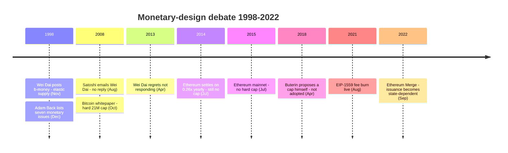
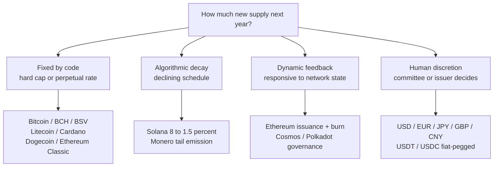
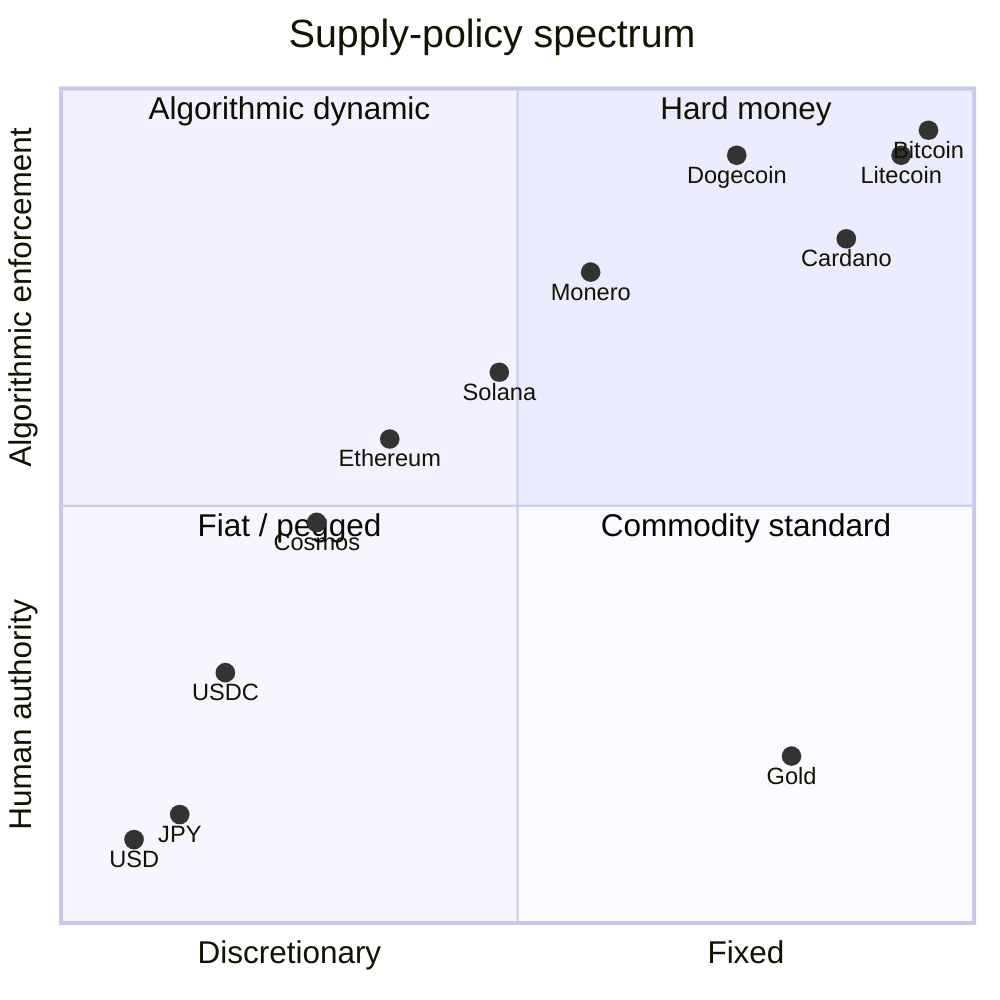

How much new money should exist next year, and who decides? Bitcoin's answer — a hard cap of about 21 million coins, written into consensus code and enforced by every full node — is one specific position in a debate that long predates Bitcoin, runs through the cypherpunk monetary-design literature of the 1990s, and continues today across both the cryptocurrency landscape and the central-banking world.
## 1. The question: who and how decides the money supply

Any monetary system has to answer two questions:

- **Who decides** how much new money exists at each moment (a person, a committee, an institution, a protocol, an algorithm).
- **How they decide** (discretion responsive to economic conditions, a fixed schedule, a pegged formula, a hard cap).

The two questions are independent. A central bank can run a fixed schedule. A protocol can implement a discretionary feedback loop. Bitcoin's specific combination — decided by a protocol, on a fixed schedule with a hard cap — is one of several internally consistent answers, not the only one.

The chronology of the debate, from b-money's 1998 elastic-supply proposal through the [Ethereum](/BitcoinArchive/entries/analysis/2008-10-31-bitcoin-fork-and-altcoin-genealogy/) Merge:

## 2. The cypherpunk baseline: b-money's elastic supply (1998)

The first detailed cypherpunk monetary-design proposal that informs Bitcoin's lineage is [Wei Dai's b-money (November 1998)](/BitcoinArchive/entries/aftermath/1998-11-26-wei-dai-pipenet-b-money-announcement/), cited as reference [1] in the [Bitcoin whitepaper](/BitcoinArchive/entries/emails/cryptography/2008-10-31-bitcoin-whitepaper-final/). On the question of *how much new money exists*, b-money's answer was explicitly elastic: new money creation was to be proportioned to the cost of a standard basket of goods, so the purchasing power of one unit of b-money would track real prices rather than a fixed coin schedule.

The mechanism was a distributed cost-estimation protocol: participants would publish estimates of the cost-of-living change, the protocol would aggregate them, and new issuance would be calibrated to keep the basket-denominated price of one b-money stable. The design treated *price stability* as the primary monetary-policy goal, not *fixed coin supply*.

[Adam Back's December 1998 reply](/BitcoinArchive/entries/aftermath/1998-12-06-adam-back-b-money-monetary-critique/) on [the cypherpunks list](/BitcoinArchive/entries/threads/emails/cypherpunks/b-money-protocol/) raised seven monetary-design issues with the proposal, including the technical difficulty of decentralizing the cost-basket estimation. [Wei Dai's response a day later](/BitcoinArchive/entries/aftermath/1998-12-07-wei-dai-re-b-money-protocol/) treated the open questions explicitly: price stability, business cycles, optimal inflation rates were all listed as live problems for any wider-adoption monetary system. The exchange recorded both that the elastic-supply approach was the considered design and that its implementation difficulties were known.

## 3. Bitcoin's choice: hard cap, fixed schedule, no discretion (2008–2009)

[Bitcoin's whitepaper](/BitcoinArchive/entries/emails/cryptography/2008-10-31-bitcoin-whitepaper-final/) took the opposite position on both questions. The supply schedule is fixed at the protocol level: 50 BTC per block at launch, halving every 210,000 blocks. The total approaches but never exceeds approximately 20,999,999.9769 BTC — the sum of a finite geometric series that the consensus rules enforce mechanically. The mechanical derivation of that figure — 33 halvings of an integer-satoshi subsidy that truncates to zero around 2140 — is worked out in [Bitcoin's monetary design](/BitcoinArchive/entries/design/2009-01-03-bitcoin-monetary-design/); this entry treats it only as one *fixed* position on the supply-policy spectrum. No mechanism for discretionary adjustment exists; changing the schedule would be a backwards-incompatible consensus change, requiring broad coordination across node operators and the wider economic actors that depend on the network.

The whitepaper's Section 6 ("Incentive") names the fee market as the policy variable once new issuance ends, but never argues for the *fixed* form of the schedule. It treats the cap as a design choice rather than as a derived result, and the [Satoshi self-statements record](/BitcoinArchive/entries/analysis/2008-08-20-satoshi-self-statements/) contains no extended defense of *why* fixed supply was preferred over the alternatives.

## 4. Wei Dai's regret (April 2013)

In [an April 2013 LessWrong comment](/BitcoinArchive/entries/aftermath/2013-04-21-wei-dai-bitcoin-monetary-policy-critique/), Wei Dai made three statements that bear directly on the question of this entry:

<!-- audit:quote-skip -->
> "I would consider Bitcoin to have failed with regard to its monetary policy (because the policy causes high price volatility which imposes a heavy cost on its users, who have to either take undesirable risks or engage in costly hedging in order to use the currency)."

<!-- audit:quote-skip -->
> "One possible impact of Bitcoin might be that due to its deficient monetary policy and associated price volatility it can't grow to very large scales, and by taking over the cryptocurrency niche, it has precluded a future where a cryptocurrency does grow to very large scales."

<!-- audit:quote-skip -->
> "This may have been partially my fault because when Satoshi wrote to me asking for comments on his draft paper, I never got back to him. Otherwise perhaps I could have dissuaded him (or them) from the 'fixed supply of money' idea."

The third statement is uncommon in the historical record: the author of the protocol's cited precursor naming the fixed-supply choice as a specific design decision he might have argued against, had he replied to [Satoshi's August 22, 2008 email](/BitcoinArchive/entries/correspondence/wei-dai/2008-08-22-satoshi-to-wei-dai/) that included a pre-release draft of the whitepaper. The statement is a personal retrospective, not a verdict — but it locates the design choice as one that was reachable, not foreordained, in the August 2008 window.

## 5. The fiat baseline: central-bank discretion

The dominant supply-design pattern in the world today is neither b-money's elastic algorithm nor Bitcoin's fixed cap, but central-bank discretion. The major reserve currencies and their issuance frameworks:

| Currency | Issuer | Supply ceiling | Issuance rule | Policy target |
|---|---|---|---|---|
| USD | Federal Reserve | None | Open-market operations, interest-rate policy, balance-sheet expansion / contraction | ~2% inflation, full employment |
| EUR | European Central Bank | None | Same instrument set | ~2% inflation (HICP medium-term) |
| JPY | Bank of Japan | None | Same instrument set, plus large-scale asset purchases | 2% inflation (introduced 2013) |
| GBP | Bank of England | None | Same instrument set | 2% inflation (CPI) |
| CNY | People's Bank of China | None | Same instrument set, plus capital controls and currency-band management | Multi-objective (growth, employment, exchange-rate stability) |
| Gold (historical) | Mining | ~effectively bounded | Annual mining ~1.5% of stock | Algorithmic by mining cost |

The defining feature of the post-1971 fiat regime is *discretion* — a small committee decides each policy step, in response to current economic conditions, within a stated long-run target. Hard caps do not exist; balance sheets expand and contract in response to policy.

Two boundary cases inform the comparison:

- **Pre-1971 gold standard.** When major currencies were convertible to gold at fixed parity, the effective supply ceiling was the global gold stock, which grew at roughly the mining rate (~1.5% per year). The system delivered the property Bitcoin's hard cap aims at (constraint on discretionary expansion) and the property b-money aimed at (some price stability through stock-flow ratios), but it failed in a different direction: it transmitted shocks across countries through capital flows and proved incompatible with active counter-cyclical policy, contributing to the abandonment of fixed-rate convertibility in 1971.

- **Hyperinflations.** Weimar Germany (1922-23), Zimbabwe (2007-09), Venezuela (2016-present) are the canonical illustrations of discretionary supply expansion taken to its destructive limit. The hard-money camp routinely cites these as the failure mode that *any* discretionary system can in principle reach; the discretionary camp responds that these are political failures of central-bank independence, not failures of the discretionary tool itself.

The fiat baseline matters because it is the *contrast* against which Bitcoin's design choice reads. "Hard cap, no discretion" is a meaningful position only against the existence of "no cap, full discretion." Both extremes are present and operating in the world; the cryptocurrency landscape distributes itself across the spectrum between them.

## 6. The post-2009 cryptocurrency landscape

Once Bitcoin's hard-cap pattern existed as a reference, subsequent cryptocurrencies took explicit positions either by following it, modifying it, or diverging from it. The 15-currency comparison below covers the most-cited variants across the spectrum.

The supply-policy decisions cluster into four archetypes, which the table then populates:

| Currency | Supply ceiling | Issuance schedule | Governance | Design archetype |
|---|---|---|---|---|
| **Bitcoin** | 21 M (hard cap) | Halving every 210K blocks; subsidy → 0 around 2140 | Protocol, conservative consensus | Hard money, fixed |
| **Litecoin** | 84 M (hard cap) | Halving (4× faster than Bitcoin) | Protocol | Hard money, scaled |
| **Bitcoin Cash** | 21 M (hard cap) | Same as Bitcoin | Protocol | Hard money, inherited |
| **Bitcoin SV** | 21 M (hard cap) | Same as Bitcoin | Protocol | Hard money, inherited |
| **Cardano (ADA)** | 45 B (hard cap) | Exponential decay | Protocol + treasury | Hard money, decaying issuance |
| **Monero (XMR)** | 18.4 M + tail emission | Smooth emission → 0.6 XMR/block in perpetuity (mild long-run inflation) | Protocol | Hybrid: bounded + tail |
| **Dogecoin** | None (cap removed 2014) | Fixed 5 B / year in perpetuity | Protocol | Mild inflation, fixed-rate |
| **Solana (SOL)** | None | Inflation 8% → 1.5% over 10 years (−15% per year) | Protocol + foundation | Declining inflation |
| **Ethereum (ETH)** | None | Issuance + EIP-1559 fee burn (turns net-deflationary in high-use periods) | Protocol + EIP governance | Dynamic, market-mediated |
| **Ethereum Classic (ETC)** | ~210.7 M (cap introduced via fork) | Fixed-supply schedule | Protocol | Hard money (post-fork) |
| **Polkadot (DOT)** | None | ~10% annual inflation target | Protocol + governance | Mild inflation, fixed-rate |
| **Cosmos (ATOM)** | None | Bonded-ratio-targeted inflation (7-20% range) | Protocol + governance | Inflation, feedback-targeted |
| **b-money (1998 proposal)** | Dynamic | Pegged to standard-basket cost-of-living | Distributed cost-estimation | Elastic, basket-pegged |
| **USDT (Tether)** | Set by collateral | Mint / burn against fiat reserves | Centralized issuer (Tether Ltd) | Fiat-pegged stablecoin |
| **USDC (Circle)** | Set by collateral | Same mechanism | Centralized issuer (Circle) | Fiat-pegged stablecoin |

The distribution across this table reads as a *spectrum* rather than a consensus around any one design. Hard-cap inheritance from Bitcoin is one cluster (Bitcoin / BCH / BSV / Litecoin / Cardano / ETC); declining-issuance variants are another (Solana, Monero's emission curve); the no-cap-with-discretionary-feedback variants (Ethereum, Cosmos, Polkadot) are a third; the fiat-pegged stablecoins are a fourth, and they functionally inherit the fiat issuer's discretion.

<!-- chart: supply-curve-comparison -->

## 7. Ethereum's divergent path

[Vitalik Buterin's](/BitcoinArchive/participants/vitalik-buterin/) Ethereum (mainnet July 2015) is the most-cited explicit counterpoint to Bitcoin's hard-cap model.

The absence of a cap is not a later reversal; it is written into the founding document. The 2014 whitepaper states the choice against Bitcoin by name — "the existence of a permanently growing linear supply, as opposed to a capped supply as in Bitcoin" — and gives its reason in the same passage: to blunt what some read as excessive wealth concentration in Bitcoin, and to leave people born into later eras a fair chance at acquiring units.

What moved was the annual rate. A January 2014 proposal set issuance at 0.50x the amount sold; the Foundation's April blog fixed it at 18,000,000 ETH per year (0.3x); the July sale terms cut it to 0.26x. Three revisions in six months, each of them stating a figure for how much is minted each year; none of the three states a total beyond which no more would exist.

Three moves then shaped the supply curve as it stands:

1. **Original issuance (2015-2022)**: the proof-of-work block reward was a flat figure. It opened at 5 ETH and was cut twice by hard fork — to 3 ETH at Byzantium on October 16, 2017 ([EIP-649](https://eips.ethereum.org/EIPS/eip-649)), and to 2 ETH at Constantinople on February 28, 2019 ([EIP-1234](https://eips.ethereum.org/EIPS/eip-1234)). Each EIP specifies the new reward as a literal constant taking effect at a fork block; neither ties the figure to any measure of network state.
2. **EIP-1559 (August 2021)**: introduced base-fee burning. Every transaction's base fee is destroyed rather than paid to the miner / validator, creating a net-deflationary pressure proportional to network usage. During periods of high activity, ETH supply contracts.
3. **The Merge (September 2022)**: the move to proof-of-stake took execution-layer issuance to zero and cut new issuance from roughly 13,000 ETH/day to roughly 1,700 — about 88%.

The Merge changed more than the quantity. **It replaced the way issuance is decided.** Under proof-of-stake a validator's base reward is computed each epoch from a formula whose denominator is the square root of all ETH staked: the more that is staked, the thinner each unit of issuance becomes. Issuance stopped being a number written in the protocol and became a number derived from the network's own state — not a schedule, but a response.

The combined effect — no hard cap, but supply that answers to the state of the network — is closer to b-money's *responsive-to-conditions* principle than to Bitcoin's *fixed-by-schedule* principle, though what it answers to is stake and demand rather than the basket price b-money aimed at. Ethereum's own community vocabulary ("Ultra Sound Money", a play on Bitcoin's "Sound Money" framing) makes the contrast explicit.

The reference to b-money runs past design philosophy. Ethereum's smallest unit, the wei — one quintillionth of an ETH, and the base of the gwei that gas prices are quoted in — is, [in Ethereum's own documentation, "named after Wei Dai, creator of b-money"](https://ethereum.org/en/developers/docs/gas/). Bitcoin put b-money in its whitepaper's reference [1]; Ethereum put its author's name in the denomination of the currency itself. Naming a unit is not the same as inheriting an issuance rule, though: the basket-price stability Wei Dai was actually aiming at is implemented by neither chain.

And the person who ruled out a cap later filed one. On April 1, 2018 Buterin submitted [EIP-960](https://github.com/ethereum/EIPs/issues/960), proposing to bound the total at 120,204,432 ETH — exactly twice the amount sold at launch. It was not adopted; the issue was closed as stale. The filing date is April Fools' Day, and the issue text does not present the proposal as a joke. How to read the intent is open; what the issue records is that a concrete total cap — down to a formula thinning issuance exponentially as supply approaches the ceiling — was written up four years on, by the author of the design that had declined one.

## 8. Why a cap, why none — the monetary bet each design makes

The difference between supply designs is not a ranking. It is a set of different answers to one question: what is money *for*? A fixed cap and an uncapped, variable supply each fear a different failure, and each picks its mechanism to avoid the failure it fears. The full landscape, positioned on two axes — fixed-vs-discretionary supply on the horizontal, human-vs-algorithmic enforcement on the vertical:

Behind that distribution sit several monetary worldviews that do not reconcile.

**Hard cap = sound money (Bitcoin, Litecoin, Cardano, Bitcoin Cash, Ethereum Classic).** What it fears is discretion. Leave issuance to human judgment, the argument runs, and political pressure bends it toward inflation sooner or later — and §5's record of fiat is the evidence: hyperinflations, and the roughly 85% the dollar has lost to cumulative inflation since 1971. So a scarcity that cannot be reprinted is burned into the code and treated as the one durable defense against debasement. Satoshi's 21-million cap is the original form of this bet; the hard-cap coins that followed either inherited it or kept it while changing the scale.

**Tail emission = security budget (Monero).** Here the fear is the one the hard cap did not carry. After new issuance falls to zero, can the network's security be paid for by fees alone? That is the question the [mining-reward-exhaustion analysis](/BitcoinArchive/entries/analysis/2026-05-18-mining-reward-exhaustion-fee-only-future/) raises — its theoretical spine is Carlsten et al. (ACM CCS 2016) on the instability of a fee-only equilibrium. Monero bet on "no." Since May 2022 it issues a flat 0.6 XMR per block, forever, so miner rewards never come to rest on fees alone. The security budget that sound money gave up for the sake of scarcity, Monero keeps buying with a gentle, permanent issuance.

**Dynamic response + burn = usage-linked (Ethereum).** As §7 lays out, Ethereum sets no cap, holds issuance down to what validator security needs, and burns the base fee under EIP-1559. The aim is a scarcity that runs the opposite way from a hard cap: the more the network is used, the more supply shrinks. The community's own term — "ultrasound money," a jab at Bitcoin's "sound money" — states the bet out loud: make scarcity out of usage, not out of a ceiling.

**Fixed-rate inflation = a spending currency that resists hoarding (Dogecoin).** The scarcity sound money counts as a virtue, this design counts as a defect: a thing worth more tomorrow gets held, not spent — which, for a currency, is death. So Dogecoin removed its cap in 2014 and issues 10,000 DOGE per block, about 5 billion a year, forever — a mild inflation that nudges spending over hoarding and keeps fees low. The bet is on "a currency you use," not "an asset you hold."

**Elastic supply = price stability (b-money).** As §2 shows, the first cypherpunk design never aimed at a fixed supply at all. It adjusted issuance against the cost of living to hold purchasing power steady. When Wei Dai, thirteen years later (§4), named Bitcoin's fixed supply a failure of monetary policy, he was standing on that starting point.

What this reveals is not a ranking but a chain of bets reacting to one another's failures. Sound money reacts to the debasement fiat discretion produced; the variable-supply designs — tail emission, dynamic response, fixed-rate inflation, elastic supply — react to the different failures a hard cap produces: hoarding, the [erosion of cash use](/BitcoinArchive/entries/analysis/2008-10-31-bitcoin-electronic-cash-vs-digital-gold/), and the thinning security budget after issuance ends. Every design looks at the price another is visibly paying in the record and tries to avoid it. Fifteen years on, no consensus has formed about which is right — not because no one asked in earnest, but because each camp saw exactly what the others pay, and chose a different cost.

## 9. What the record supports, and what stays open

This is as far as the record reaches. How to decide supply was a genuinely open fork in 2008 — Wei Dai, whom Bitcoin cited, calls fixed supply "a particular design decision Satoshi could have been argued out of" (§4). And each side of the fork reacts to the other's real harm, not to a hypothetical: the hard cap to the debasement fiat discretion produced; the variable-supply designs — dynamic response, tail emission, elastic supply, fixed-rate inflation — to the hoarding, the eroded cash use, and the thinning post-issuance security budget a hard cap produces. Each looked at the cost the other is visibly paying in the record, and chose a different cost. This is not a both-sides draw. It is the shape of distinct monetary worldviews, each internally consistent, each avoiding a different failure.

So how did the market move? Set the two designs side by side by market capitalisation and CoinMarketCap's dated snapshots record this: Ethereum, the one that declined a cap, stood against Bitcoin at roughly 9% on July 1, 2016 ($0.99bn against $10.6bn); at about 85% on June 12, 2017 ($37.1bn against $43.6bn), the stretch when people talked about "the flippening"; at about 16% on December 15, 2018 ($8.8bn against $56.4bn); at about 48% on May 12, 2021 ($438.6bn against $919.5bn); and at about 22% on January 1, 2025 ($404.0bn against $1,869.9bn). At the figures consulted when this entry was last revised, the ratio was near 17.5%.

That series cannot be read as a scorecard on supply design. The 85% reading carries a date earlier than the burn mechanism (August 2021), and earlier still than the transition that cut issuance by 88% (September 2022); every reading quoted above from after those two changes sits well below it. Market capitalisation moves on regulation, institutional flows, rival chains, the existence of listed products, and much else at once, and nothing in the figures above separates out how much belongs to an issuance rule. What can be set beside each other is only this: how each of the two designs walked its fifteen years.

One question stays open past that. Which worldview lasts is not something the record so far can yield. This is not the safe, opening "we can't know"; it is the residue left after weighing each design's cost and still not settling. Whether a hard cap's security budget holds after issuance ends, whether Ethereum's dynamic-response scarcity survives the swings of usage, whether an elastic supply can actually be implemented in a decentralized way — each is a question that 2140, or the decades before it, will answer, and fifteen years of record cannot.

Two notes on scope. **Comparable data** — the supply figures in §6 are protocol rules as of mid-2026; several chains (Ethereum, Solana, Cosmos, Polkadot) have governance that can change issuance, so the table is a current state, not a frozen future. Bitcoin's cap is the most credibly fixed because changing it would be a backwards-incompatible consensus change, and that network's conservative tradition has rejected far smaller changes. **Stablecoins** (USDT, USDC, DAI) are a separate category — their supply policy sits downstream of their backing's monetary policy, not a primary design choice; they appear in §6's table for completeness.

The Hayekian framing of the hard-cap-vs-adjustable debate — Hayek's 1976 *Denationalisation of Money* argued for *competing adjustable* private issuance, which Bitcoin replaces with a *single algorithmic fixed* schedule — is treated as a longer ideological-lineage analysis in [the Hayek-Extropian lineage entry](/BitcoinArchive/entries/analysis/1976-10-25-hayek-extropians-bitcoin-lineage/).

This fixed-supply analysis is anchored in two adjacent readings. [The Hayek-Extropian lineage analysis](/BitcoinArchive/entries/analysis/1976-10-25-hayek-extropians-bitcoin-lineage/) names this entry as the "companion" that elaborates the Hayek-Bitcoin divergence on issuer competition vs algorithmic commitment, returning to it across §3.2. [The mining-reward-exhaustion analysis](/BitcoinArchive/entries/analysis/2026-05-18-mining-reward-exhaustion-fee-only-future/) positions itself explicitly as the post-issuance counterpart of this fixed-supply argument — the question the 21-million cap forces the network to answer once new issuance ends.
Where those supply designs sit against the other axes each chain chose — consensus, initial distribution, ledger privacy, and who can change the rules — is tabulated in [the altcoin count and design comparison](/BitcoinArchive/entries/analysis/2026-07-26-altcoin-count-and-design-comparison/), which borrows this entry's issuance column rather than restating it.
