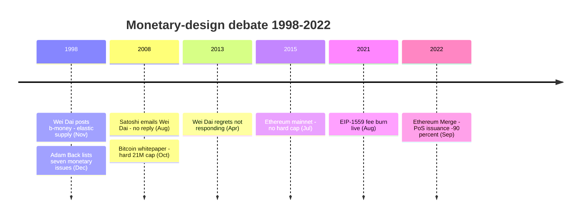
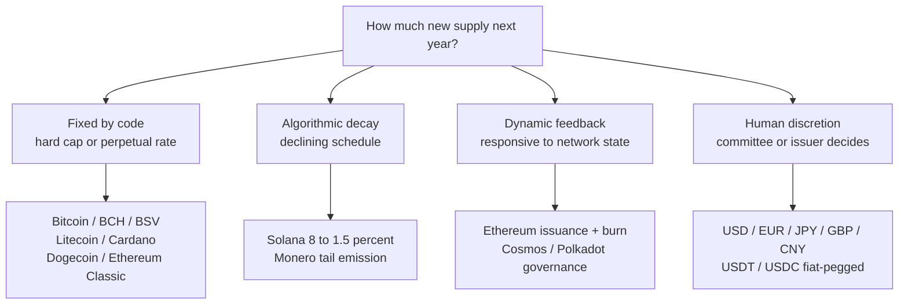
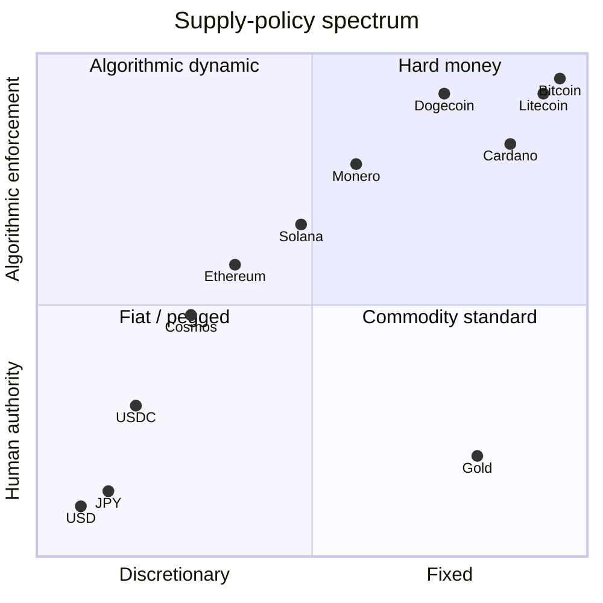

How much new money should exist next year, and who decides? Bitcoin's answer — a hard cap of about 21 million coins, written into consensus code and enforced by every full node — is one specific position in a debate that long predates Bitcoin, runs through the cypherpunk monetary-design literature of the 1990s, and continues today across both the cryptocurrency landscape and the central-banking world. This entry reads the position as one answer among several, alongside the alternatives that existed before it and the variants that emerged after.

The entry takes no view on whether Bitcoin's choice was correct. It records what the choice was, what the documented critique of it looks like, what fiat money does instead, and how the post-2009 cryptocurrency landscape distributed itself across the same axis.

## 1. The question: who and how decides the money supply

Any monetary system has to answer two questions:

- **Who decides** how much new money exists at each moment (a person, a committee, an institution, a protocol, an algorithm).
- **How they decide** (discretion responsive to economic conditions, a fixed schedule, a pegged formula, a hard cap).

The two questions are independent. A central bank can run a fixed schedule. A protocol can implement a discretionary feedback loop. Bitcoin's specific combination — decided by a protocol, on a fixed schedule with a hard cap — is one of several internally consistent answers, not the only one.

The chronology of the debate, from b-money's 1998 elastic-supply proposal through the [Ethereum](/BitcoinArchive/entries/analysis/2008-10-31-bitcoin-fork-and-altcoin-genealogy/) Merge:

## 2. The cypherpunk baseline: b-money's elastic supply (1998)

The first detailed cypherpunk monetary-design proposal that informs Bitcoin's lineage is [Wei Dai's b-money (November 1998)](/BitcoinArchive/entries/aftermath/1998-11-26-wei-dai-pipenet-b-money-announcement/), cited as reference [1] in the [Bitcoin whitepaper](/BitcoinArchive/entries/emails/cryptography/2008-10-31-bitcoin-whitepaper-final/). On the question of *how much new money exists*, b-money's answer was explicitly elastic: new money creation was to be proportioned to the cost of a standard basket of goods, so the purchasing power of one unit of b-money would track real prices rather than a fixed coin schedule.

The mechanism was a distributed cost-estimation protocol: participants would publish estimates of the cost-of-living change, the protocol would aggregate them, and new issuance would be calibrated to keep the basket-denominated price of one b-money stable. The design treated *price stability* as the primary monetary-policy goal, not *fixed coin supply*.

[Adam Back's December 1998 reply](/BitcoinArchive/entries/aftermath/1998-12-06-adam-back-b-money-monetary-critique/) on the cypherpunks list raised seven monetary-design issues with the proposal, including the technical difficulty of decentralizing the cost-basket estimation. [Wei Dai's response a day later](/BitcoinArchive/entries/aftermath/1998-12-07-wei-dai-re-b-money-protocol/) treated the open questions explicitly: price stability, business cycles, optimal inflation rates were all listed as live problems for any wider-adoption monetary system. The exchange recorded both that the elastic-supply approach was the considered design and that its implementation difficulties were known.

## 3. Bitcoin's choice: hard cap, fixed schedule, no discretion (2008–2009)

[Bitcoin's whitepaper](/BitcoinArchive/entries/emails/cryptography/2008-10-31-bitcoin-whitepaper-final/) took the opposite position on both questions. The supply schedule is fixed at the protocol level: 50 BTC per block at launch, halving every 210,000 blocks. The total approaches but never exceeds approximately 20,999,999.9769 BTC — the sum of a finite geometric series that the consensus rules enforce mechanically. No mechanism for discretionary adjustment exists; changing the schedule would be a backwards-incompatible consensus change, requiring broad coordination across node operators and the wider economic actors that depend on the network.

The whitepaper's Section 6 ("Incentive") names the fee market as the policy variable once new issuance ends, but never argues for the *fixed* form of the schedule. It treats the cap as a design choice rather than as a derived result, and the [Satoshi self-statements record](/BitcoinArchive/entries/analysis/2008-08-20-satoshi-self-statements/) contains no extended defense of *why* fixed supply was preferred over the alternatives.

## 4. Wei Dai's regret (April 2013)

In [an April 2013 LessWrong comment](/BitcoinArchive/entries/aftermath/2013-04-21-wei-dai-bitcoin-monetary-policy-critique/), Wei Dai made three statements that bear directly on the question of this entry:

<!-- audit:quote-skip -->
> "I would consider Bitcoin to have failed with regard to its monetary policy (because the policy causes high price volatility which imposes a heavy cost on its users, who have to either take undesirable risks or engage in costly hedging in order to use the currency)."

<!-- audit:quote-skip -->
> "One possible impact of Bitcoin might be that due to its deficient monetary policy and associated price volatility it can't grow to very large scales, and by taking over the cryptocurrency niche, it has precluded a future where a cryptocurrency does grow to very large scales."

<!-- audit:quote-skip -->
> "This may have been partially my fault because when Satoshi wrote to me asking for comments on his draft paper, I never got back to him. Otherwise perhaps I could have dissuaded him (or them) from the 'fixed supply of money' idea."

The third statement is uncommon in the historical record: the author of the protocol's cited precursor naming the fixed-supply choice as a specific design decision he might have argued against, had he replied to [Satoshi's August 22, 2008 email](/BitcoinArchive/entries/correspondence/wei-dai/2008-08-22-satoshi-to-wei-dai/) that included a pre-release draft of the whitepaper. The statement is a personal retrospective, not a verdict — but it locates the design choice as one that was reachable, not foreordained, in the August 2008 window.

## 5. The fiat baseline: central-bank discretion

The dominant supply-design pattern in the world today is neither b-money's elastic algorithm nor Bitcoin's fixed cap, but central-bank discretion. The major reserve currencies and their issuance frameworks:

| Currency | Issuer | Supply ceiling | Issuance rule | Policy target |
|---|---|---|---|---|
| USD | Federal Reserve | None | Open-market operations, interest-rate policy, balance-sheet expansion / contraction | ~2% inflation, full employment |
| EUR | European Central Bank | None | Same instrument set | ~2% inflation (HICP medium-term) |
| JPY | Bank of Japan | None | Same instrument set, plus large-scale asset purchases | 2% inflation (introduced 2013) |
| GBP | Bank of England | None | Same instrument set | 2% inflation (CPI) |
| CNY | People's Bank of China | None | Same instrument set, plus capital controls and currency-band management | Multi-objective (growth, employment, exchange-rate stability) |
| Gold (historical) | Mining | ~effectively bounded | Annual mining ~1.5% of stock | Algorithmic by mining cost |

The defining feature of the post-1971 fiat regime is *discretion* — a small committee decides each policy step, in response to current economic conditions, within a stated long-run target. Hard caps do not exist; balance sheets expand and contract in response to policy.

Two boundary cases inform the comparison:

- **Pre-1971 gold standard.** When major currencies were convertible to gold at fixed parity, the effective supply ceiling was the global gold stock, which grew at roughly the mining rate (~1.5% per year). The system delivered the property Bitcoin's hard cap aims at (constraint on discretionary expansion) and the property b-money aimed at (some price stability through stock-flow ratios), but it failed in a different direction: it transmitted shocks across countries through capital flows and proved incompatible with active counter-cyclical policy, contributing to the abandonment of fixed-rate convertibility in 1971.

- **Hyperinflations.** Weimar Germany (1922-23), Zimbabwe (2007-09), Venezuela (2016-present) are the canonical illustrations of discretionary supply expansion taken to its destructive limit. The hard-money camp routinely cites these as the failure mode that *any* discretionary system can in principle reach; the discretionary camp responds that these are political failures of central-bank independence, not failures of the discretionary tool itself.

The fiat baseline matters because it is the *contrast* against which Bitcoin's design choice reads. "Hard cap, no discretion" is a meaningful position only against the existence of "no cap, full discretion." Both extremes are present and operating in the world; the cryptocurrency landscape distributes itself across the spectrum between them.

## 6. The post-2009 cryptocurrency landscape

Once Bitcoin's hard-cap pattern existed as a reference, subsequent cryptocurrencies took explicit positions either by following it, modifying it, or diverging from it. The 15-currency comparison below covers the most-cited variants across the spectrum.

The supply-policy decisions cluster into four archetypes, which the table then populates:

| Currency | Supply ceiling | Issuance schedule | Governance | Design archetype |
|---|---|---|---|---|
| **Bitcoin** | 21 M (hard cap) | Halving every 210K blocks; subsidy → 0 around 2140 | Protocol, conservative consensus | Hard money, fixed |
| **Litecoin** | 84 M (hard cap) | Halving (4× faster than Bitcoin) | Protocol | Hard money, scaled |
| **Bitcoin Cash** | 21 M (hard cap) | Same as Bitcoin | Protocol | Hard money, inherited |
| **Bitcoin SV** | 21 M (hard cap) | Same as Bitcoin | Protocol | Hard money, inherited |
| **Cardano (ADA)** | 45 B (hard cap) | Exponential decay | Protocol + treasury | Hard money, decaying issuance |
| **Monero (XMR)** | 18.4 M + tail emission | Smooth emission → 0.6 XMR/block in perpetuity (mild long-run inflation) | Protocol | Hybrid: bounded + tail |
| **Dogecoin** | None (cap removed 2014) | Fixed 5 B / year in perpetuity | Protocol | Mild inflation, fixed-rate |
| **Solana (SOL)** | None | Inflation 8% → 1.5% over 10 years (−15% per year) | Protocol + foundation | Declining inflation |
| **Ethereum (ETH)** | None | Issuance + EIP-1559 fee burn (turns net-deflationary in high-use periods) | Protocol + EIP governance | Dynamic, market-mediated |
| **Ethereum Classic (ETC)** | ~210.7 M (cap introduced via fork) | Fixed-supply schedule | Protocol | Hard money (post-fork) |
| **Polkadot (DOT)** | None | ~10% annual inflation target | Protocol + governance | Mild inflation, fixed-rate |
| **Cosmos (ATOM)** | None | Bonded-ratio-targeted inflation (7-20% range) | Protocol + governance | Inflation, feedback-targeted |
| **b-money (1998 proposal)** | Dynamic | Pegged to standard-basket cost-of-living | Distributed cost-estimation | Elastic, basket-pegged |
| **USDT (Tether)** | Set by collateral | Mint / burn against fiat reserves | Centralized issuer (Tether Ltd) | Fiat-pegged stablecoin |
| **USDC (Circle)** | Set by collateral | Same mechanism | Centralized issuer (Circle) | Fiat-pegged stablecoin |

The distribution across this table reads as a *spectrum* rather than a consensus around any one design. Hard-cap inheritance from Bitcoin is one cluster (Bitcoin / BCH / BSV / Litecoin / Cardano / ETC); declining-issuance variants are another (Solana, Monero's emission curve); the no-cap-with-discretionary-feedback variants (Ethereum, Cosmos, Polkadot) are a third; the fiat-pegged stablecoins are a fourth, and they functionally inherit the fiat issuer's discretion.

## 7. Ethereum's divergent path

[Vitalik Buterin's](/BitcoinArchive/participants/vitalik-buterin/) Ethereum (mainnet July 2015) is the most-cited explicit counterpoint to Bitcoin's hard-cap model. Three design moves shaped the current Ethereum supply curve:

1. **Original issuance (2015-2022)**: ~4-5% annual inflation under Proof-of-Work, with no hard supply cap defined.
2. **EIP-1559 (August 2021)**: introduced base-fee burning. Every transaction's base fee is destroyed rather than paid to the miner / validator, creating a net-deflationary pressure proportional to network usage. During periods of high activity, ETH supply contracts.
3. **The Merge (September 2022)**: transition to Proof-of-Stake reduced new issuance from ~13K ETH/day to ~1.7K ETH/day, a ~90% reduction. Combined with EIP-1559 burn, periods of high network use have driven ETH supply *net deflationary* during stretches since the Merge.

The combined effect — no hard cap, but dynamic supply that responds to network usage — is closer to b-money's *responsive-to-conditions* principle than to Bitcoin's *fixed-by-schedule* principle, but the response variable is network demand rather than basket-price stability. Ethereum's own community vocabulary ("Ultra Sound Money", a play on Bitcoin's "Sound Money" framing) makes the contrast explicit.

## 8. The argument map: hard-money vs flexible-policy

The full landscape, positioned on two axes — fixed-vs-discretionary supply on the horizontal, human-vs-algorithmic enforcement on the vertical:

The 15 years since Bitcoin's launch have not produced a consensus on which supply-design archetype is correct. The two main argument lines, in summary form:

**Hard-money / sound-money line (Bitcoin-aligned):**
- Discretionary issuance, given political incentives, tends to inflate over time; a credible hard cap is the only durable defense against debasement.
- Predictable issuance supports long-horizon planning and savings; volatility from monetary policy is a worse cost than volatility from market pricing.
- The historical record of fiat regimes (hyperinflations, currency debasements, post-1971 cumulative USD inflation ~85%) is treated as the dominant evidence.
- Wei Dai's price-volatility criticism is acknowledged but treated as a transitional issue that resolves as the asset's market capitalization grows.

**Flexible-policy line (b-money / Ethereum / fiat-aligned):**
- A monetary system whose purchasing power is left to market forces will experience price volatility that imposes real costs on users (Wei Dai's 2013 point); a system that targets *price stability* serves transactional use better.
- Fixed supply with growing demand produces deflationary pressure, which incentivizes hoarding over spending; this is a known argument against gold-standard regimes that the hard-cap design inherits.
- Discretionary tools allow counter-cyclical response to shocks (recessions, financial crises); a hard-capped system has no such tool and must absorb shocks through price.
- Hyperinflations are political failures of central-bank independence, not inherent failures of the discretionary tool.

The two lines have been articulated at length on both sides; the documentary record (Wei Dai 2013, [Adam Back's monetary writings](/BitcoinArchive/participants/adam-back/), various Ethereum and Solana foundation publications) preserves them as live positions rather than settled questions.

The [security-budget literature](/BitcoinArchive/entries/analysis/2026-05-18-mining-reward-exhaustion-fee-only-future/) — Carlsten et al. (ACM CCS 2016) and follow-ups — adds a third axis the early debate did not explicitly engage: whether a fixed-supply regime can sustain proof-of-work security after issuance ends, or whether the fee-only equilibrium is unstable. This is a *consequence* question downstream of the supply-design choice rather than a position in the original debate.

## 9. Limits of this entry

- **No verdict.** This entry does not assert that fixed supply, elastic supply, or central-bank discretion is the correct design. It records that the three approaches exist, that named designers have advocated each, and that the 15-year cryptocurrency landscape distributes itself across the spectrum.
- **No prediction.** What the cryptocurrency landscape will look like in 2050 is not knowable from the documentary record this entry summarizes. The hard-cap vs flexible-policy debate is unresolved; the entry does not pretend otherwise.
- **Comparable data caveats.** The supply numbers in §6 reflect protocol rules as of mid-2026. Several protocols (Ethereum, Solana, Cosmos, Polkadot) have governance processes that can change issuance; the table records the current state rather than a frozen future. Bitcoin's hard cap is the most credibly fixed, because changing it would be a backwards-incompatible consensus change requiring broad coordination across node operators and the wider economic actors of the network — and that network's conservative-consensus tradition has rejected far smaller parameter changes.
- **Stablecoins are a separate category.** USDT, USDC, DAI and similar tokens inherit the monetary properties of their backing (fiat reserves for USDT/USDC, on-chain collateral for DAI). They appear in the table for completeness, but their supply policy is downstream of someone else's monetary policy, not a primary design choice.

The Hayekian framing of the hard-cap-vs-adjustable debate — Hayek's 1976 *Denationalisation of Money* argued for *competing adjustable* private issuance, which Bitcoin replaces with a *single algorithmic fixed* schedule — is treated as a longer ideological-lineage analysis in [the Hayek-Extropian lineage entry](/BitcoinArchive/entries/analysis/1976-10-25-hayek-extropians-bitcoin-lineage/).

This fixed-supply analysis is anchored in two adjacent readings. [The Hayek-Extropian lineage analysis](/BitcoinArchive/entries/analysis/1976-10-25-hayek-extropians-bitcoin-lineage/) names this entry as the "companion" that elaborates the Hayek-Bitcoin divergence on issuer competition vs algorithmic commitment, returning to it across §3.2. [The mining-reward-exhaustion analysis](/BitcoinArchive/entries/analysis/2026-05-18-mining-reward-exhaustion-fee-only-future/) positions itself explicitly as the post-issuance counterpart of this fixed-supply argument — the question the 21-million cap forces the network to answer once new issuance ends.
