This entry is descriptive. It catalogs three observables in the public record — (a) repeated public attempts to identify Satoshi Nakamoto, (b) the surviving material Satoshi left behind, and (c) the persistent identification gap — and reads the relationship between them as a structural asymmetry. The entry does not propose a new identification, does not rule out an existing candidate, and does not assert that any specific actor is conducting an off-record pursuit. Conjectural inferences are kept out of the main argument and confined to §6 (Limits).

This entry is the **third pair** to the [identity-hypotheses overview](/BitcoinArchive/entries/analysis/2008-10-31-satoshi-identity-hypotheses-overview/) ("who is Satoshi") and the [anonymity architecture](/BitcoinArchive/entries/analysis/2008-10-31-satoshi-anonymity-architecture/) ("how did Satoshi remain anonymous"). The two existing entries focus on the candidate space and the means of remaining unidentified, respectively. This entry asks the inverse question — **given so many documented attempts and so much surviving material, why does the gap persist** — and reads the answer as an empirical observation rather than a positive claim.

## 1. Repeated public attempts and recorded interest

Documented attempts to identify Satoshi Nakamoto, or to put Bitcoin under the attention of named institutions, span the early 2010s through the present (the earliest entries in the list below are the WikiLeaks pressure dynamic of late 2010 and the In-Q-Tel / CIA conference invitation of April–June 2011). The list below restricts itself to attempts and interest that are part of the public record.

**Public attempts and recorded interest, 2010-2026**

```mermaid
timeline
    2010 : WikiLeaks pressure dynamic begins (state)
    %% link: /BitcoinArchive/entries/forum/bitcointalk/topic-2216/2010-12-11-re-wikileaks-hornet-nest/
    2011 : Andresen presents Bitcoin at CIA / In-Q-Tel (state)
    2013 : Lerner — Patoshi mining pattern (technical)
    %% link: /BitcoinArchive/entries/aftermath/2013-04-17-sergio-lerner-patoshi-analysis/
         : FBI — Silk Road takedown (state)
         : Skye Grey — first stylometric Szabo case (technical)
    %% link: /BitcoinArchive/entries/aftermath/2013-12-05-techcrunch-skye-grey-szabo-stylometric/
    2014 : Newsweek — Dorian Nakamoto (journalism)
    %% link: /BitcoinArchive/entries/aftermath/2014-03-06-newsweek-dorian-nakamoto/
         : Forbes — Greenberg / Hal Finney (journalism)
    %% link: /BitcoinArchive/entries/aftermath/2014-03-25-greenberg-forbes-nakamotos-neighbor/
         : Aston University — Project Bitcoin (technical)
    %% link: /BitcoinArchive/entries/aftermath/2014-04-16-aston-university-szabo-stylometric-study/
    2015 : NYT / Popper — Szabo (journalism)
    %% link: /BitcoinArchive/entries/aftermath/2015-05-15-popper-nyt-szabo-satoshi-investigation/
         : Wright self-claims begin — Wired / Gizmodo (self-claim)
    %% link: /BitcoinArchive/entries/aftermath/2015-12-08-wired-gizmodo-craig-wright-claims/
    2016 : Wright — BBC / Economist (self-claim)
    %% link: /BitcoinArchive/entries/aftermath/2016-05-02-craig-wright-bbc-economist-claim/
    2017 : China — ICO and exchange ban (state)
    %% link: /BitcoinArchive/entries/aftermath/2017-09-04-china-ico-ban/
    2021 : PLOS ONE — Strangely Mined Bitcoins (technical)
    %% link: /BitcoinArchive/entries/aftermath/2021-09-30-plos-one-patoshi-anomaly-study/
    2022 : Lopp — Was Satoshi Greedy? (technical)
    %% link: /BitcoinArchive/entries/aftermath/2022-09-16-lopp-was-satoshi-greedy-miner/
    2023 : Lopp — Hal Finney race-day analysis (technical)
    %% link: /BitcoinArchive/entries/aftermath/2023-10-21-lopp-hal-finney-not-satoshi/
    2024 : US SEC — Bitcoin ETP approval (state)
         : COPA v Wright — four rulings against (litigation)
    %% link: /BitcoinArchive/entries/aftermath/2024-03-14-copa-v-wright-ruling/
         : van Dorst — Where is Satoshi corpus (technical)
    %% link: /BitcoinArchive/entries/aftermath/2024-04-13-van-dorst-where-is-satoshi-stylometric-corpus/
         : HBO — Money Electric / Peter Todd (journalism)
    %% link: /BitcoinArchive/entries/aftermath/2024-10-08-hbo-money-electric-peter-todd/
    2025 : US Strategic Bitcoin Reserve (state)
    2026 : NYT / Carreyrou — Adam Back (journalism)
    %% link: /BitcoinArchive/entries/aftermath/2026-04-08-nyt-carreyrou-adam-back-satoshi-investigation/
         : Bitcoin Institute — van Dorst reanalysis (technical)
    %% link: /BitcoinArchive/entries/analysis/2026-05-03-van-dorst-corpus-reanalysis-named-candidates/
```

### 1.1 Journalism

- **Newsweek (March 6, 2014)** — Leah McGrath Goodman identified Dorian Prentice Satoshi Nakamoto as the Bitcoin creator on the basis of name match and a doorstep encounter. Dorian denied the claim repeatedly, including via the Associated Press. See [the Newsweek/Dorian entry](/BitcoinArchive/entries/aftermath/2014-03-06-newsweek-dorian-nakamoto/).
- **Forbes (March 25, 2014)** — Andy Greenberg's investigation [*"Nakamoto's Neighbor"*](/BitcoinArchive/entries/aftermath/2014-03-25-greenberg-forbes-nakamotos-neighbor/), including the Hal Finney "race-day alibi" element that was later formalized by Jameson Lopp (see §1.3). Forbes treated Hal Finney as the strongest candidate at the time and presented the case in long-form journalism. Full hypothesis treatment in the [Hal Finney = Satoshi hypothesis entry](/BitcoinArchive/entries/analysis/2014-03-25-hal-finney-satoshi-identity-hypothesis/).
- **The New York Times — Nathaniel Popper / *Digital Gold* (May 15, 2015)** — Popper's NYT piece, an excerpt from his book *Digital Gold*, named Nick Szabo as the most likely Satoshi candidate. Szabo denied the identification by email, repeating the denial when Popper followed up a year later. The most-cited mainstream-press identification of Szabo before the 2026 NYT/Carreyrou Adam Back investigation. See [the Popper NYT entry](/BitcoinArchive/entries/aftermath/2015-05-15-popper-nyt-szabo-satoshi-investigation/).
- **HBO *Money Electric: The Bitcoin Mystery* (October 8, 2024)** — Cullen Hoback's documentary named Peter Todd as a Satoshi candidate, drawing on a December 2010 BitcoinTalk thread reading. Todd publicly denied the claim and the technical community widely critiqued the evidence as circumstantial. See [the HBO documentary entry](/BitcoinArchive/entries/aftermath/2024-10-08-hbo-money-electric-peter-todd/).
- **The New York Times — John Carreyrou investigation (April 8, 2026)** — Pulitzer Prize–winning journalist Carreyrou named Blockstream CEO Adam Back as the strongest candidate after an 18-month stylometric investigation. Back denied the identification publicly, and the analysis's own commissioned linguistic review was internally described as inconclusive (Hal Finney nearly tied). See [the NYT investigation entry](/BitcoinArchive/entries/aftermath/2026-04-08-nyt-carreyrou-adam-back-satoshi-investigation/).

### 1.2 Litigation

- **COPA v Wright (UK High Court, March 14, 2024)** — Justice James Mellor ruled four findings against Craig Wright: he is not the author of the Bitcoin whitepaper, not the person operating as Satoshi 2008–2011, not the creator of the Bitcoin system, and not the author of the initial Bitcoin software. The judgment also concluded Wright had engaged in "deliberate and extensive forgery of documents to support his false claim of being Satoshi Nakamoto." See [the COPA ruling entry](/BitcoinArchive/entries/aftermath/2024-03-14-copa-v-wright-ruling/).

The COPA ruling closed one of the longest and most heavily resourced public efforts to claim the Satoshi identity. It demonstrates both the scale at which the question is contested and the role of formal institutions (a national high court, a multi-firm patent alliance) in adjudicating identification claims.

### 1.3 Technical and academic

- **Sergio Demian Lerner — Patoshi mining pattern (April 2013, follow-ups in 2019 and 2020)** — Lerner identified two independent fingerprints in the early-block coinbase data (the ExtraNonce slope and the nonce least-significant-byte distribution restricted to ~50 specific values) that consistently mark a single early miner. The analysis estimates the Patoshi miner's holdings at roughly 1.1 million BTC across 22,503 blocks. See [the Patoshi analysis entry](/BitcoinArchive/entries/aftermath/2013-04-17-sergio-lerner-patoshi-analysis/).
- **Jameson Lopp — *Was Satoshi Greedy?* (2022) and the Hal Finney race-day analysis (2023)** — Lopp's 2022 study reconstructs the Patoshi miner's behavior (deliberate hashrate throttling, network-defense rather than profit maximization). The 2023 Hal Finney analysis formalizes the "race-day alibi" — Finney was running a 10-mile race in Santa Barbara during a window when Satoshi was active on the Bitcoin network — into a structured argument against the Hal-Finney = Satoshi hypothesis.
- **University of Iceland — *Strangely Mined Bitcoins*, PLOS ONE (2021)** — A peer-reviewed paper that found additional statistical anomalies in the early Bitcoin nonce distribution (the leading nibble), corroborating Lerner's Patoshi pattern at a different methodological level.
- **Stylometric attribution attempts (2013–2026)** — A separate methodological tradition has used stylometric and forensic-linguistic analysis to identify Satoshi from writing patterns. The four most-cited efforts: [Skye Grey's December 2013 LikeInAMirror investigation](/BitcoinArchive/entries/aftermath/2013-12-05-techcrunch-skye-grey-szabo-stylometric/) (manual phrase comparison, single-hypothesis test of Szabo); [Aston University's April 2014 'Project Bitcoin' study](/BitcoinArchive/entries/aftermath/2014-04-16-aston-university-szabo-stylometric-study/) (forensic-linguistics class project under Dr. Jack Grieve, 11 candidates, ranked Szabo highest); [Bas van Dorst's April 2024 'Where is Satoshi?' open-source corpus](/BitcoinArchive/entries/aftermath/2024-04-13-van-dorst-where-is-satoshi-stylometric-corpus/) (75,000+ mailing-list authors plus 7.5M+ Reddit comments, full numerical data release, declines to name a leading candidate); the 2026 Carreyrou/Cafiero NYT investigation (above in §1.1). Three of the four investigations place Szabo highest among the named candidates (Skye Grey 2013 named Szabo, Aston 2014 named Szabo, and the [Bitcoin Institute reanalysis](/BitcoinArchive/entries/analysis/2026-05-03-van-dorst-corpus-reanalysis-named-candidates/) of van Dorst's published data places Szabo top of 5). Cafiero / Carreyrou 2026 is the outlier in naming Adam Back, with Cafiero himself qualifying the result as inconclusive (Hal Finney near tie). The within-named-candidates convergence is partial: van Dorst's full 75,000-author corpus has 594 unnamed authors closer to Satoshi than Szabo, so stylometric attribution narrows the candidate space without uniquely identifying a person.

### 1.4 State and quasi-state institutional interest

The following are documented in the public record. They are listed here as state-actor interest in Bitcoin in general, not as state-actor pursuit of Satoshi specifically. The latter is conjectural and is treated in §6.

- **CIA / In-Q-Tel (June 14, 2011)** — Gavin Andresen presented Bitcoin at CIA headquarters in Langley, Virginia, as part of an In-Q-Tel emerging-technology conference. Andresen had informed Satoshi of the invitation in advance, on April 26, 2011, in the same email that delivered the CAlert key. Satoshi never replied. **The CIA conference invitation is the last topic Satoshi was confirmed to have received from a project participant before going silent.** See [the Andresen biography (CIA Visit section)](/BitcoinArchive/participants/gavin-andresen/) and [the final-known-email entry](/BitcoinArchive/entries/aftermath/2011-04-26-satoshi-final-known-email/).
- **United States Securities and Exchange Commission (January 10, 2024)** — The SEC approved spot Bitcoin exchange-traded products. The approval brought Bitcoin onto US-regulated equity exchanges and is a public regulatory milestone.
- **United States Strategic Bitcoin Reserve (March 6, 2025)** — A presidential executive order established a Strategic Bitcoin Reserve and a United States Digital Asset Stockpile, formally placing Bitcoin in US sovereign reserve policy.
- **People's Republic of China — ICO and exchange ban (September 4, 2017)** — Chinese regulators banned ICOs and shut down domestic Bitcoin exchanges. See [the China ICO ban entry](/BitcoinArchive/entries/aftermath/2017-09-04-china-ico-ban/).
- **United States — WikiLeaks pressure dynamic (December 2010 — June 2011)** — After US-government-led financial-services pressure cut off WikiLeaks's payment channels, Satoshi publicly objected to a community proposal that WikiLeaks should accept Bitcoin donations ("No, don't 'bring it on'..."), citing the project's vulnerability. WikiLeaks began accepting Bitcoin in June 2011, after Satoshi's withdrawal. See [the WikiLeaks acceptance entry](/BitcoinArchive/entries/aftermath/2011-06-14-wikileaks-accepts-bitcoin/).
- **DPRK / Lazarus Group cryptocurrency operations** — A series of large-scale cryptocurrency thefts attributed by the FBI and the United Nations Panel of Experts to the DPRK-affiliated Lazarus Group (multiple incidents 2017 onward). These attribute Bitcoin-related criminal activity to a state actor on the public record.
- **United States Federal Bureau of Investigation — Silk Road takedown (October 2013)** — The FBI seized the Silk Road darknet marketplace and arrested Ross Ulbricht; a major US federal Bitcoin-related law-enforcement operation entering the public record.

### 1.5 Self-claims and name-match challenges

- **Craig Wright** — Self-claimed to be Satoshi from late 2015 / 2016 (Wired, Gizmodo, BBC, *The Economist*). The cryptographic 'proof' Wright produced in May 2016 was a copy of an existing 2009 transaction signature, not a new signing. The COPA judgment (§1.2) ruled four findings against the claim and characterized Wright's evidence as deliberate forgery.
- **Dorian Prentice Satoshi Nakamoto** — Surfaced in journalism on name match (§1.1, Newsweek 2014). Repeatedly self-denied. The Bitcoin community raised over 67 BTC for Dorian after the Newsweek piece.
- **Peter Todd** — Named in HBO 2024 (§1.1). Denied; community response: "Of course I'm Satoshi, and I'm Craig Wright."

## 2. Surviving material

The body of public material attached to Satoshi Nakamoto is, by the standards of any public-figure investigation, very large.

| Material | Quantity | Window | Reference |
|---|---|---|---|
| BitcoinTalk forum posts | 575 | Nov 22, 2009 – Dec 12, 2010 | [migration entry](/BitcoinArchive/entries/aftermath/2011-08-01-bitcointalk-org-migration/) |
| Emails to known correspondents | ~304 | 2008 – 2011 | breakdown table below |
| Bitcoin C++ codebase | 19,901 → 31,909 lines | v0.1 → v0.3.19 | [code analysis](/BitcoinArchive/entries/analysis/2009-01-09-satoshi-code-analysis/) |
| SVN commits as `s_nakamoto` | 160 unique | 2009 – 2010 | (same as above) |
| Git commits signed `Satoshi Nakamoto <satoshin@gmx.com>` | 34 | (post-SVN-migration) | (same as above) |
| Whitepaper PDF metadata + 3 pseudonymous email aliases (`satoshi@anonymousspeech.com`, `satoshi@vistomail.com`, `satoshin@gmx.com`) | 1 PDF; timestamps; TZ offsets `-07:00` (Oct 2008), `-06:00` (Mar 2009); `Language: en-GB` | Oct 2008 – Mar 2009 | (PDF metadata + correspondence) |
| Genesis-block hardcoded constants | 4 (timestamp, nonce, hash, coinbase) | Jan 3, 2009 onward, verbatim | [hardcode analysis](/BitcoinArchive/entries/analysis/2009-01-03-genesis-block-hardcode-analysis/) |

Email correspondents breakdown:

| Recipient | Email count | Source |
|---|---|---|
| Martti Malmi | 260+ | `mmalmi.github.io/satoshi` |
| Mike Hearn | 33 | `plan99.net/~mike/satoshi-emails/` |
| Adam Back | 5 | Bitcoin Magazine release, COPA exhibit |
| Hal Finney | 4 | (multiple sources) |
| Wei Dai | 3 | Gwern archive |
| Dustin Trammell, Gavin Andresen, Laszlo Hanyecz, Nicholas Bohm, others | smaller batches | (various) |

The forensic surface is not the surface of an absent figure. Every category that adversarial-attribution research normally relies on — long-form prose at scale, programming style, time-zone signatures, version-control history, and language-register inconsistencies — is present in the documentary record on Satoshi.

## 3. The persistent identification gap

After the attempts in §1 and against the material in §2, the public record's current state is:

- The [identity-hypotheses overview](/BitcoinArchive/entries/analysis/2008-10-31-satoshi-identity-hypotheses-overview/) holds named candidates in parallel; none has been ruled in.
- The strongest cypherpunk-cited candidates (Adam Back, Wei Dai) are ruled out by their own pre-launch correspondence (third-party reception, not authorship), and have self-denied.
- The strongest capability-fit candidates (Hal Finney, Nick Szabo) are ruled out by alibi (Finney's race-day) and by self-denial respectively.
- The single court-tested self-claim (Wright) has been ruled against on four findings (§1.2).
- The single name-match journalism claim (Dorian Nakamoto) has been refuted by the subject's own repeated denial (§1.5).
- The most prominent recent journalism claim (Peter Todd, HBO 2024) has been denied by the subject and critiqued by the technical community as circumstantial.

Seventeen years after the whitepaper, no candidate has been established as Satoshi by either the public-record outline (§1 of the identity-hypotheses overview) or by any external decisive event.

## 4. The asymmetry, as observation

Putting §1, §2, and §3 next to each other yields an empirical observation that does not require any conjecture about off-record actors:

- The attempts (§1) are not few in number, nor concentrated in one venue, nor confined to one method. They span journalism, litigation, statistical forensics, peer-reviewed academic methodology, and recorded institutional attention from multiple states.
- The material (§2) is, by the standards of attribution research on real-world figures, abundant. 575 long-form forum posts; ~300 published emails; almost 32 thousand lines of authored code; metadata; a multi-year operational pattern.
- The result (§3) is a candidate field where every named name has been ruled out or is hedged with reasonable counter-evidence.

The asymmetry is between the visible work spent on the question and the visible result. It is not, in this entry's framing, an asymmetry between Satoshi and "the world's adversaries" — that framing requires conjecture about the size of off-record pursuit, which the entry does not adopt.

This observation has analytic value precisely because it is calibrated only against the public record. Stronger framings (e.g., "the world's intelligence agencies have failed to find Satoshi") require evidence of off-record agency activity that is not in the public record and so are confined to §6.

## 5. Interpretive options

Three interpretations of the §4 observation are consistent with the public record. They are presented in parallel; the entry does not adopt one and does not rank them.

### (a) The anonymity architecture is genuinely strong enough

Read against the [anonymity architecture entry](/BitcoinArchive/entries/analysis/2008-10-31-satoshi-anonymity-architecture/), Satoshi's six layers (pseudonym, communication channels, linguistic and temporal traces, development environment, genesis-block parameter constants, staged withdrawal) are independent, and breaking any single layer does not collapse the others. The §4 asymmetry is then the predictable result of a layered, multi-dimensional anonymity construction operating at a level that the visible attempts have not been able to reach. This is the most conservative reading: it explains the asymmetry within the public record alone, with no off-record conjecture.

### (b) Detection methods have not yet caught up to the forensic surface

Stylometry, time-zone analysis, code-style fingerprinting, and statistical-pattern matching have advanced steadily, but the surviving material has resisted statistically meaningful concentration on a single named candidate. Even the strongest forensic signal in the record — the Patoshi mining pattern — identifies *a miner with specific operational behavior*, not *a person with a specific public identity*. The §4 asymmetry is then a statement about the current state of detection, not about the strength of the anonymity architecture per se.

### (c) The public-attempt set is not exhaustive

It is possible that off-record investigative resources are larger than the public record reflects. If so, the asymmetry §4 describes is bounded by the entry's choice of evidence base (public record) and would diminish under a wider evidence base. This entry does not adopt this reading as the primary explanation, because the off-record claim is itself unverifiable from public material; it is preserved as a stated alternative because excluding it entirely would overstate the entry's epistemic reach.

## 6. Limits

- **Off-record state-actor pursuit is not in scope.** Sustained intelligence-agency or law-enforcement effort directed specifically at identifying Satoshi may exist; it is not in the public record at the time of writing. The entry does not assert it does, and does not assert it does not. It is held outside the main argument because evidence-free claims about state-actor activity are not the kind of statement an archive should make.
- **Conspiratorial readings are not in scope.** Specifically, this entry does not entertain the reading that any state actor or institution has already identified Satoshi but is withholding the result. Such a claim has no public evidence and would, if added to the record, change the entry's relationship to verifiable history. Other readers are free to draw such inferences from the §4 observation; this entry does not.
- **§4 is correlational, not causal.** The asymmetry is between visible attempts and visible result. Mapping that to a causal mechanism requires choosing one of the §5 interpretations; the entry's role is to lay out the choice, not to make it.
- **The §1 list is open-ended.** New attempts continue to enter the public record. The entry should be updated when material additions occur (new judgments, new state-actor events, new academic work). Listing closure as of the entry's last commit is not a claim that further attempts will not appear.
- **No conclusion is drawn.** Consistent with the limits sections of the [identity-hypotheses overview (§5)](/BitcoinArchive/entries/analysis/2008-10-31-satoshi-identity-hypotheses-overview/) and the [anonymity architecture (§9)](/BitcoinArchive/entries/analysis/2008-10-31-satoshi-anonymity-architecture/), this entry presents observation and stated alternatives, and does not commit to one.
