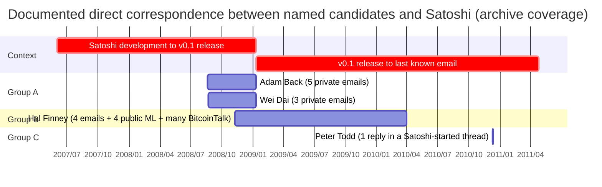
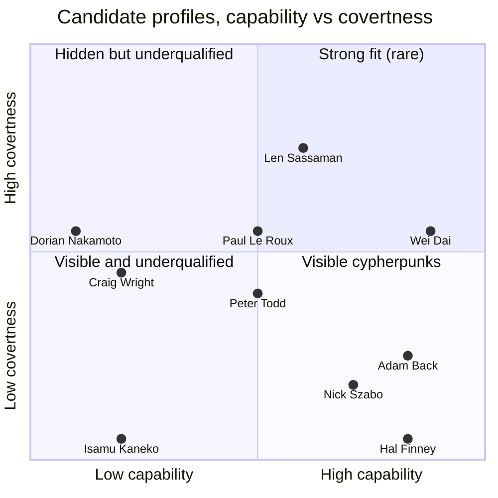

This entry compares the ten named candidates for Satoshi Nakamoto's identity that recur in public discourse. Each candidate is measured against the documented public-record outline of Satoshi:

- the whitepaper's explicit citation of Hashcash and b-money;
- the August 2008 pre-launch correspondence with Adam Back and Wei Dai;
- Wei Dai's 2014 identifiability argument that Satoshi was *not* a publicly active cypherpunk during the 2007–2008 development window (consistent with the [cypherpunk-independent-arrival analysis](/BitcoinArchive/entries/analysis/2008-10-31-cypherpunk-independent-arrival/));
- the 19,901-line v0.1 C++ codebase;
- the near-native English register;
- the 18-month intensive development window from mid-2007 through August 2008;
- the April 2011 withdrawal.

The seven-dimension profile comparison table (§1) aligns the candidates against this outline. Candidates with dedicated hypothesis entries in this archive are treated more deeply there (see the "Individual" column in the table); the other candidates are treated within this entry.

This entry does not name "the most likely Satoshi candidate."

## 1. Candidate profile comparison

| Candidate | Entry | Cypherpunk fora | BTC lineage | Implementation | Monetary design | English level | Timing | Low visibility | External status |
|---|---|---|---|---|---|---|---|---|---|
| [Adam Back](/BitcoinArchive/participants/adam-back/) | [Identity](/BitcoinArchive/entries/analysis/2026-04-08-adam-back-satoshi-identity-hypothesis/) | 🟢 | 🟢 | 🟢 | 🟡 | 🟢 | 🔴 | 🟡 | Self-denied (NYT 2026 investigation) |
| [Wei Dai](/BitcoinArchive/participants/wei-dai/) | [Identity](/BitcoinArchive/entries/analysis/2008-08-22-wei-dai-satoshi-identity-hypothesis/) | 🟢 | 🟢 | 🟢 | 🟢 | 🟢 | 🔴 | 🟢 | Self-denied; pre-launch correspondence reads third-party |
| [Hal Finney](/BitcoinArchive/participants/hal-finney/) | [Identity](/BitcoinArchive/entries/analysis/2014-03-25-hal-finney-satoshi-identity-hypothesis/) | 🟢 | 🟢 | 🟢 | 🟡 | 🟢 | 🔴 | 🔴 | Self-denied; Patoshi mismatch; race-day alibi |
| [Nick Szabo](/BitcoinArchive/participants/nick-szabo/) | [Identity](/BitcoinArchive/entries/analysis/2013-12-05-szabo-satoshi-identity-hypothesis/) | 🟢 | 🟢 | 🔴 | 🟢 | 🟢 | 🔴 | 🟡 | Self-denied |
| [Dorian Nakamoto](/BitcoinArchive/participants/dorian-nakamoto/) | — | 🔴 | 🔴 | 🔴 | 🔴 | 🟡 | 🔴 | 🟢 | Self-denied; p2pfoundation return |
| [Craig Wright](/BitcoinArchive/participants/craig-wright/) | — | 🔴 | 🔴 | 🔴 | 🔴 | 🟢 | 🔴 | 🟢 | COPA v Wright (2024) ruled against |
| [Paul Le Roux](/BitcoinArchive/participants/paul-le-roux/) | — | 🟡 | 🔴 | 🟢 | 🔴 | 🟢 | 🔴 | 🟢 | Open (incarcerated 2012–) |
| [Len Sassaman](/BitcoinArchive/participants/len-sassaman/) | [Identity](/BitcoinArchive/entries/analysis/2011-07-03-sassaman-satoshi-identity-hypothesis/) | 🟢 | 🔴 | 🟢 | 🔴 | 🟢 | 🟢 | 🟡 | Open |
| [Peter Todd](/BitcoinArchive/participants/peter-todd/) | [Identity](/BitcoinArchive/entries/analysis/2024-10-08-todd-satoshi-identity-hypothesis/) | 🔴 | 🔴 | 🟢 | 🟡 | 🟢 | 🔴 | 🟢 | Self-denied (HBO 2024 doc) |
| [Isamu Kaneko](/BitcoinArchive/participants/isamu-kaneko/) | [Identity](/BitcoinArchive/entries/analysis/2013-07-06-kaneko-isamu-satoshi-identity-hypothesis/) | 🔴 | 🔴 | 🟢 | 🔴 | 🔴 | 🔴 | 🔴 | Open |

**Color meaning:** 🟢 matches Satoshi's documented profile; 🔴 does not; 🟡 mixed or partial fit (per-column criteria in §2 Methodology).

**How to read the table:**

- The dimensions split into two groups that pull against each other (background-and-capability vs covertness). Counting 🟢 across all columns and treating the total as a single Satoshi-likeness score is misleading. See §2 Methodology.
- Profile-comparison is *necessary but not sufficient*. The *External status* column shows external evidence (self-denials, court rulings, technical disproofs) that can rule out a candidate independently of the profile comparison.
- Cells corresponding to candidates without a dedicated hypothesis entry in this archive reflect the most widely-held reading of the public record.

### Stylometric attribution record (separate layer, reference)

Stylometric Satoshi-identification work is a separate methodological tradition from the structural profile matrix above. The four most-cited investigations have produced different leading candidates depending on candidate-pool design, distance metric, and corpus boundaries. The structural matrix (English level, cypherpunk fora, etc.) describes preconditions; the stylometric record below describes results — the two layers are not interchangeable.

| Candidate | [Skye Grey 2013](/BitcoinArchive/entries/aftermath/2013-12-05-techcrunch-skye-grey-szabo-stylometric/) (single-hypothesis) | [Aston 2014](/BitcoinArchive/entries/aftermath/2014-04-16-aston-university-szabo-stylometric-study/) (11 candidates) | [van Dorst 2024](/BitcoinArchive/entries/aftermath/2024-04-13-van-dorst-where-is-satoshi-stylometric-corpus/) (75,000+) / [reanalysis](/BitcoinArchive/entries/analysis/2026-05-03-van-dorst-corpus-reanalysis-named-candidates/) | [Cafiero / Carreyrou NYT 2026](/BitcoinArchive/entries/aftermath/2026-04-08-nyt-carreyrou-adam-back-satoshi-investigation/) (12; broader pool 620) |
|---|---|---|---|---|
| [Adam Back](/BitcoinArchive/participants/adam-back/) | — | rank not published | 3rd | **top** |
| [Wei Dai](/BitcoinArchive/participants/wei-dai/) | — | rank not published | 4th | rank not published |
| [Hal Finney](/BitcoinArchive/participants/hal-finney/) | — | rank not published | 2nd | 2nd |
| [Nick Szabo](/BitcoinArchive/participants/nick-szabo/) | **top match** | **top match** | **top** | rank not published |
| [Len Sassaman](/BitcoinArchive/participants/len-sassaman/) | — | not in candidate set | 5th | not in candidate set |

**Reading the stylometric layer:** Szabo emerges as the most-frequently-top-ranked candidate — three of the four investigations place Szabo highest among the named candidates: Skye Grey 2013 (named), Aston 2014 (named), and the [Bitcoin Institute reanalysis](/BitcoinArchive/entries/analysis/2026-05-03-van-dorst-corpus-reanalysis-named-candidates/) of van Dorst's published data (Szabo top of 5). Cafiero / Carreyrou 2026 is the outlier in naming Adam Back, with Cafiero describing that result as inconclusive (Hal Finney near tie). The convergence is partial, however: [van Dorst's full 75,000-author corpus](/BitcoinArchive/entries/aftermath/2024-04-13-van-dorst-where-is-satoshi-stylometric-corpus/) contains 594 unnamed authors closer to Satoshi than Szabo, and van Dorst himself declines to name a leading candidate. Stylometric attribution narrows the candidate space but does not select a unique person.

### Direct-correspondence record (separate layer, reference)

How much each candidate actually exchanged words with Satoshi is an observable fact independent of capability profile and stylometric distance. Tabulating the archive's documented communication per candidate makes the contrast clear: four candidates have some form of documented exchange (one of them only as a reply in a Satoshi-started thread), and six candidates have no record of direct contact with Satoshi at all.

Broken down by **type of contact**, the structure differs:

| Type | Candidates | Character |
|---|---|---|
| **Private email exchange** | Adam Back, Wei Dai | Satoshi reached out as a third party shortly before the whitepaper, citing prior-art lineage |
| **Email + public discourse** | Hal Finney | Sustained technical engagement as the RPOW author, across private email, the cryptography mailing list, and BitcoinTalk |
| **Reply in a Satoshi-started forum thread** | Peter Todd | One reply by the `retep` account in a Satoshi proposal thread. Not "direct contact" in the private sense, but cited as identification evidence by the [HBO documentary](/BitcoinArchive/entries/aftermath/2024-10-08-hbo-money-electric-peter-todd/) |
| **No record of direct contact** | Nick Szabo, Len Sassaman, Isamu Kaneko, Dorian Nakamoto, Craig Wright, Paul Le Roux | Satoshi's pre-launch outreach traced the prior-art lineage via **Adam Back → Wei Dai** only and reached none of these six |

**Reading the direct-correspondence layer:** the presence or absence of correspondence is double-edged for hypothesis evaluation:
- **Contact exists** can also serve as evidence that Satoshi treated them as third parties — Satoshi's pre-launch emails to Back and Wei Dai function as the central counter-evidence in both hypotheses (Back-as-Satoshi, Wei-Dai-as-Satoshi) (see [Satoshi identification asymmetry](/BitcoinArchive/entries/analysis/2008-10-31-satoshi-identification-asymmetry/) §2).
- **No contact** splits into two readings — successful concealment or non-overlap of activity. Szabo was active in public discourse but had no direct exchange with Satoshi; Sassaman and Kaneko were active in adjacent but non-overlapping technical fields; Dorian, Wright, and Le Roux are name-match or self-claim with no operational presence.

The presence-or-absence of correspondence does not by itself select a hypothesis, but combined with the capability profile and the stylometric layer it functions as a third structural layer that locates each candidate's position in the candidate space.

## 2. Methodology

**Profile-match dimensions.** The seven dimensions in §1's comparison table are derived from the public-record outline of Satoshi:

- *Cypherpunk forum participation*: documented presence in the cypherpunks mailing list, metzdowd Cryptography List, or related fora. Wei Dai's 2014 identifiability argument (in his LessWrong AALWA thread) suggests Satoshi was *not* visibly active in these fora during the 2007–2008 development period.
- *Bitcoin-adjacent intellectual lineage*: documented work in or extended citation of Hashcash, b-money, Bit Gold, RPOW, or related digital-cash / proof-of-work proposals.
- *Implementation capability*: documented lifetime track record of shipping software at a scale comparable to Bitcoin v0.1's 19,901-line C++ codebase — cryptographic libraries, P2P systems, anonymity networks, or complete shipping applications of similar size and engineering complexity. The dimension is specifically about *Bitcoin-source-level* capability, not general programming literacy. Lifetime rather than strictly pre-2008: Satoshi-as-pseudonym hides any pre-2008 implementation work the actual person had done, so demonstrated post-launch capability (in Bitcoin Core, related cryptographic projects, or major engineering positions) counts as evidence of the underlying capability. The dimension distinguishes candidates with a documented multi-thousand-line shipping record from theorists, scholars, or small-scale contributors.
- *Monetary system design*: documented thinking about digital-cash / monetary-system mechanisms — proof-of-work tokens, scarcity mechanisms, fee markets, mining incentives, distributed issuance schemes. Bitcoin v0.1 required not only cryptographic and distributed-systems engineering (covered by Implementation) but also coherent thinking about monetary mechanism design; this dimension separates that aspect. A theorist who designed a monetary mechanism without shipping code (Szabo with Bit Gold, for example) scores 🟢 here even with 🔴 on Implementation; an implementer with no monetary-system work in their record (Sassaman with Mixmaster, Le Roux with E4M, Kaneko with Winny) scores the inverse.
- *Near-native English register*: idiom, register-shift, and literary fluency comparable to Satoshi's white paper, BitcoinTalk posts, and email correspondence.
- *Tight timing vs Satoshi's silence*: closeness of a documented major life event (death, retirement, etc.) to Satoshi's last known correspondence (April 26, 2011 email to Gavin Andresen).
- *Low public visibility during 2007–2008 development*: degree to which the candidate could plausibly have undertaken the 18-month intensive development period without leaving public traces in their documented activity.

**Two-group structure.** The seven dimensions split into two groups that pull against each other:

1. *Background and capability* — Cypherpunk fora, BTC lineage, Implementation, Monetary design, English level. 🟢 here means the candidate had what Bitcoin's design required: cypherpunk-style intellectual milieu, digital-cash thinking, code-shipping ability at the relevant scale, and a near-native English register.
2. *Covertness* — Timing, Low visibility. 🟢 here means the candidate's documented profile fits Wei Dai's 2014 identifiability argument that Satoshi was *not* a publicly active cypherpunk during the 2007–2008 development window, and that some life event aligns with Satoshi's April 2011 silence.

The more visibly active a candidate was as a cypherpunk thinker (group 1), the less plausibly they could also have been hidden enough to escape identification (group 2). Reading the comparison requires holding the two groups separately rather than summing green counts. An "all-🟢" candidate is structurally rare: someone simultaneously deeply embedded in cypherpunk capability *and* completely invisible during the development window.

**Profile-match is necessary but not sufficient.** Profile-match alone never decides a hypothesis. The *External status* column (self-denials, court rulings, technical disproofs) operates independently and is in some cases decisive. Cross-cutting observations on how profile-match and external status combine for individual candidates are in §4.

### Capability vs covertness map

Each candidate plotted in the 2D space of capability score (x-axis, average of the 5 capability dimensions) vs covertness score (y-axis, average of the 2 covertness dimensions), using 🟢 = 1, 🟡 = 0.5, 🔴 = 0. The map makes the §4 cross-cutting observations spatial: most cypherpunk-cited candidates (Adam Back, Wei Dai, Hal Finney, Szabo) cluster in the high-capability strip, mostly at low covertness; Sassaman is the only candidate sitting in the high-capability + high-covertness quadrant; Wright, Dorian Nakamoto, and Kaneko sit in the low-capability regions.

The cluster pattern is the same observation §4 makes in prose: capability and covertness pull against each other, so the high-capability + high-covertness quadrant is structurally hard to populate. Sassaman is in that quadrant because of specialty-separation (visible in anonymity research, invisible in digital-cash); Wei Dai approaches it through specialty-shift (mailing-list active 1990s, Crypto++ maintenance during 2007 - 2008). Most candidates pay the trade-off more directly.

## 3. Candidate profiles

The candidates fall into three groups by how they entered Satoshi-identity discourse:

- **A. Cypherpunks Satoshi explicitly cited** — Adam Back, Wei Dai
- **B. Cypherpunks with capability fit** — Hal Finney, Nick Szabo, Len Sassaman
- **C. Third-party discovery, self-claim, or name-match** — Dorian Prentice Satoshi Nakamoto, Craig Wright, Peter Todd, Isamu Kaneko, Paul Le Roux

Each profile shares the same micro-structure: background, the hypothesis (proposer and timing), the strongest argument for, the strongest argument against, external status. For candidates with a dedicated hypothesis entry (linked from the "Hypothesis entry" column above), the §3 profile here keeps only background and external status — the full claim/arguments/counter-evidence/broader-record treatment is in the dedicated entry, which follows the same template (§1 claim → §2 arguments → §3 counter-evidence → §4 broader documentary record → §5 limits) at greater depth.

### A. Cypherpunks Satoshi explicitly cited

#### Adam Back

**Background.** British cryptographer (born 1970), PhD in computer science from the University of Exeter, inventor of *Hashcash* (1997). Co-founder and CEO of Blockstream (2014). The first known person Satoshi contacted about Bitcoin (August 20, 2008).

**External status.** Self-denied (most prominently via [February 2024 COPA v Wright testimony](/BitcoinArchive/entries/aftermath/2024-02-21-adam-back-retrospective-testimony/) submitting his Satoshi correspondence as witness evidence under oath); the pre-launch correspondence reads as third-party reception. → See [Adam Back = Satoshi hypothesis entry](/BitcoinArchive/entries/analysis/2026-04-08-adam-back-satoshi-identity-hypothesis/) for the Hashcash authorship-correlation argument, the August 2008 email-structure counter-evidence, and the [April 2026 NYT stylometric investigation](/BitcoinArchive/entries/aftermath/2026-04-08-nyt-carreyrou-adam-back-satoshi-investigation/) treatment.

#### Wei Dai

**Background.** Chinese-American cryptographer, author of the Crypto++ library (a widely-deployed open-source cryptographic library), designer of *b-money* (1998), the digital-cash proposal Bitcoin's whitepaper cites alongside Hashcash. Active cypherpunk-mailing-list presence in the late 1990s.

**External status.** Self-denied (most prominently via the [January 2014 AALWA retrospective on LessWrong](/BitcoinArchive/entries/aftermath/2014-01-12-wei-dai-retrospective-on-satoshi/) explicitly distinguishing himself from Satoshi); the August 2008 pre-launch correspondence reads as third-party reception; the 2014 retrospective's "not previously active" framing is inconsistent with Wei Dai's own candidacy. → See [Wei Dai = Satoshi hypothesis entry](/BitcoinArchive/entries/analysis/2008-08-22-wei-dai-satoshi-identity-hypothesis/) for the b-money conceptual-proximity argument, the Crypto++ codebase-dependency argument, the August 2008 email-structure counter-evidence, and the broader-corpus stylometric distance (Wei Dai ranks at top 22.99% of the 12,739-author corpus, the most distant of the named candidates) at full detail.

### B. Cypherpunks with capability fit

#### Hal Finney

**Background.** Cypherpunk (Harold Thomas Finney II, May 4, 1956 – August 28, 2014), Caltech engineering graduate, principal developer of PGP 2.0, creator of Reusable Proof-of-Work (RPOW). On January 9, 2009 (Bitcoin v0.1 release day) Finney downloaded the software and became the first person other than Satoshi to run a Bitcoin node; on January 11, 2009 he tweeted "Running bitcoin"; on January 12, 2009 he received 10 BTC from Satoshi in Block 170 — the first person-to-person Bitcoin transaction. He lived for almost a decade in Temple City, California — the same town where Newsweek would later identify Dorian Prentice Satoshi Nakamoto, "blocks apart."

**External status.** Self-denied (March 2013 [*Bitcoin and Me*](/BitcoinArchive/entries/aftermath/2013-03-19-bitcoin-and-me-hal-finney/) treats Satoshi as a separate person); [Patoshi mining-pattern](/BitcoinArchive/entries/aftermath/2013-04-17-sergio-lerner-patoshi-analysis/) inconsistent with Finney's modest documented holdings; April 18, 2009 race-day alibi documented contemporaneously. → See [Hal Finney = Satoshi hypothesis entry](/BitcoinArchive/entries/analysis/2014-03-25-hal-finney-satoshi-identity-hypothesis/) for the RPOW-precursor argument, the race-day alibi (originally reported in [Greenberg's 2014 Forbes feature](/BitcoinArchive/entries/aftermath/2014-03-25-greenberg-forbes-nakamotos-neighbor/) and formalized by [Lopp 2023](/BitcoinArchive/entries/aftermath/2023-10-21-lopp-hal-finney-not-satoshi/)), the *Bitcoin and Me* third-party framing, the Patoshi-scale inconsistency, and the August 2010 Singularity Summit / ALS-progression alibi at full detail.

#### Nick Szabo

**Background.** Computer scientist, legal scholar, and cryptographer (born 1964). Coined the term "smart contracts" (1994). Designer of [*Bit Gold*](/BitcoinArchive/entries/aftermath/2008-04-27-nick-szabo-bit-gold-implementation-request/), a decentralized digital-currency proposal based on proof-of-work conceived in 1998 and published in full on his Unenumerated blog on December 29, 2005.

**External status.** Self-denied (multiple times: Frisby email 2014, NYT/Popper email response 2015, Tim Ferriss Show 2017). → See the [Szabo = Satoshi hypothesis entry](/BitcoinArchive/entries/analysis/2013-12-05-szabo-satoshi-identity-hypothesis/) for the Bit Gold conceptual-proximity argument, stylometric analyses (Skye Grey 2013, Aston University 2014, NYT/Popper 2015), circumstantial pattern matches (April 5 birthday coincidence, Hungarian descent, Tim Ferriss "I designed bitcoi…gold" slip), and the counter-evidence (the April 2008 Bit Gold implementation-request comment, the May 2011 "Nakamoto improved my design" blog, continuous Unenumerated activity during 2007–2008, and the absence of a C++ shipping record).

#### Len Sassaman

**Background.** Cypherpunk cryptographer (1980–2011), lead developer of the Mixmaster anonymous remailer, KU Leuven PhD candidate. Died by suicide on July 3, 2011 — three months after Satoshi's last documented private email.

**External status.** Open. → See the [Sassaman = Satoshi hypothesis entry](/BitcoinArchive/entries/analysis/2011-07-03-sassaman-satoshi-identity-hypothesis/) for the timing argument, the cypherpunk-credentials argument, and the counter-evidence (no direct documentary link, KU Leuven workload, Patterson's silence on the identity question).

### C. Third-party discovery, self-claim, or name-match

#### Dorian Prentice Satoshi Nakamoto

**Background.** Japanese-American engineer (born 1949 in Beppu, Japan; immigrated to the United States 1959) with a defense-systems background. Lived in Temple City, California, a few blocks from Hal Finney.

**The hypothesis.** [Newsweek (Leah McGrath Goodman, March 6, 2014)](/BitcoinArchive/entries/aftermath/2014-03-06-newsweek-dorian-nakamoto/) identified Dorian Nakamoto as a Satoshi candidate primarily on name match.

**Argument for.** Name match (literally "Satoshi Nakamoto"). Defense-systems engineering background. Geographic proximity to Hal Finney could support a pseudonym-source theory.

**Argument against.** No technical evidence connects him to the codebase. No cypherpunk credentials, no BTC-adjacent intellectual lineage, no documented programming work at Bitcoin v0.1 scale. Dorian Nakamoto firmly and repeatedly denied any involvement with Bitcoin in interviews after the Newsweek article (he retained a lawyer and gave a detailed interview to the Associated Press reaffirming his denial); he said he had misunderstood Goodman's doorstep question and thought she was asking about his prior classified defense work. The day after the Newsweek piece, [the Satoshi p2pfoundation account briefly returned to post "I am not Dorian Nakamoto"](/BitcoinArchive/entries/aftermath/2014-03-07-satoshi-p2p-foundation-return/) (post authenticity remains debated; the account may have been compromised). The Bitcoin community raised over 67 BTC in donations for Dorian Nakamoto.

**External status.** Self-denied; p2pfoundation return.

#### Craig Wright

**Background.** Australian computer-security figure.

**The hypothesis.** Wright began claiming to be Satoshi in late 2015 / 2016 ([initial Wired and Gizmodo identification, December 2015](/BitcoinArchive/entries/aftermath/2015-12-08-wired-gizmodo-craig-wright-claims/); [BBC and *The Economist* self-claim, May 2016](/BitcoinArchive/entries/aftermath/2016-05-02-craig-wright-bbc-economist-claim/)). The hypothesis rests entirely on self-claim — there is no other line of evidence supporting it.

**Argument for.** Self-claim (no other supporting evidence).

**Argument against.** Wright's attempted [cryptographic 'proof' (May 2016)](/BitcoinArchive/entries/aftermath/2016-05-02-craig-wright-bbc-economist-claim/) was quickly debunked — he had reused a signature from a 2009 transaction rather than producing a new one. The [COPA v Wright trial (UK High Court, judgment by Justice Mellor, March 14, 2024)](/BitcoinArchive/entries/aftermath/2024-03-14-copa-v-wright-ruling/) ruled four findings: Wright is not the author of the Bitcoin whitepaper, not the person operating as Satoshi 2008–2011, not the creator of the Bitcoin system, and not the author of the initial Bitcoin software. The judgment concluded Wright had engaged in "deliberate and extensive forgery of documents to support his false claim of being Satoshi Nakamoto." No documented cypherpunk-mailing-list presence in the 1990s; no pre-2008 BTC-adjacent intellectual work in his public record.

**External status.** COPA v Wright (2024) ruled against on four findings; deliberate document forgery established by court; debunked cryptographic proof.

#### Peter Todd

**Background.** Canadian Bitcoin Core developer (born 1985), contributor since around 2012, known for Replace-by-Fee (RBF) and other Core protocol work. OCAD University graduate (Integrated Media, 2011). Joined BitcoinTalk on December 7, 2010 as "retep".

**External status.** Self-denied (post-HBO); community critique of evidence as circumstantial. → See the [Peter Todd = Satoshi hypothesis entry](/BitcoinArchive/entries/analysis/2024-10-08-todd-satoshi-identity-hypothesis/) for the analytical treatment of the [HBO 2024 documentary's claims](/BitcoinArchive/entries/aftermath/2024-10-08-hbo-money-electric-peter-todd/).

#### Isamu Kaneko

**Background.** Japanese researcher (1970–2013), developer of the *Winny* P2P file-sharing system (2002), defendant in a high-profile criminal case from 2004 to 2011 (acquitted by the Supreme Court of Japan, December 2011). Died of myocardial infarction on July 6, 2013.

**External status.** Open. → See the [Kaneko Isamu = Satoshi hypothesis entry](/BitcoinArchive/entries/analysis/2013-07-06-kaneko-isamu-satoshi-identity-hypothesis/) for the analytical treatment.

#### Paul Le Roux

*[Context: This archive does not hold dedicated Le Roux entries (biography, E4M announcement, criminal-case documents, or Mastermind references). The summary below is drawn from external sources — primarily journalist Evan Ratliff's *The Mastermind* (Random House, 2019) and accompanying Atavist long-form journalism — and from public records. Treat the specific dates and claims as externally sourced rather than archive-verified.]*

**Background.** South African / Zimbabwean ex-encryption-software developer (creator of *E4M* open-source disk encryption in 1999, later forked into TrueCrypt). Transitioned around 2002 to running an international criminal enterprise (online pharmacies, weapons trafficking, methamphetamine production). Arrested by US authorities in September 2012; serving a long federal prison sentence per public reporting.

**The hypothesis.** Identified as a possible Satoshi candidate primarily through journalist Evan Ratliff's investigation in *The Mastermind* (Random House, 2019) and accompanying Atavist long-form journalism.

**Argument for.** Technical-skill match: open-source encryption software experience (E4M). Public reporting documents cypherpunks-mailing-list presence in 1999 (E4M announcement) and broader Usenet encryption-discussion activity in the late 1990s. Low public visibility during the development period (operating covertly), fitting "structurally outside the visible cypherpunk community" during 2007–2008. Possible motive: separating his cryptographic past from his criminal present.

**Argument against.** Cypherpunks-mailing-list presence in 1999 was limited compared to long-tenure cypherpunks like Adam Back or Hal Finney — single E4M announcement and a few discussions, not sustained participation (per public reporting). No documented monetary-design work in his record. His criminal operations from 2002 onwards focused on logistics and operations, not cryptographic engineering — no public Bitcoin-source-level shipping after E4M. The hypothesis rests on capability + covertness + motive alignment, all circumstantial. No documentary link, no leaked correspondence.

**External status.** Open (incarcerated). Le Roux has not publicly addressed the hypothesis from prison.

## 4. Cross-cutting observations

- **Wei Dai is the candidate closest to "all-🟢" — and external status still rules him out.** Six of seven dimensions are 🟢; only Timing is 🔴. After the 1998 b-money proposal, his mailing-list posting frequency dropped and during 2007–2008 he focused on Crypto++ maintenance, naturally placing him in the "invisible" zone. However, he has self-denied, and the August 2008 pre-launch correspondence reads as Wei Dai receiving Satoshi's proposal as a third party (the same argument that applies to Adam Back). Profile-match alone, even at near-maximum, does not decide.
- **Sassaman is the only externally-open high-scorer — and his pattern is a specialty-separation byproduct.** His 2007–2008 public activity was in the anonymity-research specialty (Mixmaster, KU Leuven, 24C3 and Black Hat 2007), adjacent to but distinct from Bitcoin's digital-cash specialty. He could be visible in his own field while remaining invisible in Bitcoin's. Most candidates do not get this specialty-separation benefit and pay the capability-vs-covertness trade-off more directly.
- **An "all-🟢" candidate is structurally rare.** The capability-vs-covertness opposition makes it nearly impossible to be simultaneously deeply embedded in cypherpunk capability *and* completely invisible during the development window. Wei Dai approaches it through specialty-shift (active mailing-list participation in late 1990s, retreat to Crypto++ maintenance during 2007–2008). Sassaman approaches it through specialty-separation (visible in anonymity research, invisible in digital-cash).
- **Name-match (Dorian) and self-claim (Wright) have both been publicly refuted.** Group C's two highest-profile claims share a structural pattern: both relied on a single line of evidence (name or self-claim) without underlying technical or intellectual fit. The Newsweek identification was demolished by Dorian's repeated denial (with lawyer and AP interview), the p2pfoundation account post "I am not Dorian Nakamoto," and broad criticism of the journalistic methodology. The Wright self-claim was demolished by the COPA v Wright ruling. Group C candidates who remain open (Le Roux, Kaneko, Todd) do so on capability + covertness arguments rather than identification-by-claim.
- **Profile-match is necessary but not sufficient.** No candidate is ruled in by profile-match alone, and no candidate is ruled out by profile-match alone. The combination of profile-match with external status (and, for low-scoring candidates, the absence of supporting evidence) is what determines current discourse standing.

## 5. Limits of this entry

- This entry does not present new evidence. It compiles publicly available material into one comparison.
- This entry does not name "the most likely Satoshi candidate." Profile-comparison is necessary but not sufficient; external status is in some cases decisive.
- Profile-comparison labels (🟢, 🔴, 🟡) are qualitative summaries, not numerical scores. They visualize judgments stated elsewhere (in individual hypothesis entries, or in widely-held readings of the public record). Different qualified readers may place individual cells differently.
- This entry assumes the public record is the relevant evidence base. Hypotheses based on private channels, claimed unverifiable communications, or unsourced personal recollection are not addressed here.
- The set of named candidates is not closed. Hypotheses involving other named persons or groups exist in public discourse; this entry covers the ten most-discussed.
- For full treatment of candidates with dedicated entries, see the "Individual" column in the table. Other candidates do not have dedicated hypothesis entries in this archive.
