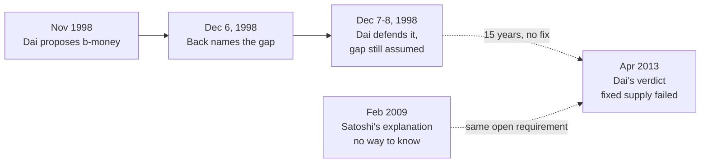

In April 2013, [Wei Dai](/BitcoinArchive/participants/wei-dai/) — the cypherpunk whose b-money proposal Bitcoin's whitepaper cites as reference [1] — delivered a verdict on Bitcoin's monetary policy: its fixed supply was a failure. He went further, saying he regretted never replying to Satoshi's 2008 email asking for comments on the whitepaper draft, because he might have talked Satoshi out of it.

The verdict has circulated for over a decade as evidence that Bitcoin's most-cited precursor thought fixed supply was a mistake. What it leaves out is the February 2009 post where Satoshi explained, in his own words, exactly why he never attempted the alternative — and what happened to that alternative when Dai himself proposed it, ten years before Bitcoin existed.

## The reason Satoshi gave

Satoshi's supply schedule is fixed at the protocol level: no committee, no feedback loop, no mechanism for the money supply to track anything about the world. In February 2009, explaining on the P2P Foundation forum why the system doesn't adjust supply to match demand, he gave the reason directly:

<!-- quote: q1 -->
> "That would have required a trusted party to determine the value, because I don't know a way for software to know the real world value of things."

This is not a hedge. It is a specific, falsifiable claim: Satoshi did not have a working method for decentralized software to learn what something is actually worth in the world, without appointing someone to just say so — and, as the next section traces, neither did the one detailed alternative design that had already tried. A supply rule that responds to real value needs that method. Without it, "elastic supply" is a design on paper, not a working system.

## What Wei Dai's own alternative required

Ten years before that P2P Foundation post, Wei Dai had already designed the alternative — and it needed exactly the thing Satoshi said he had no way to build. Dai [announced b-money on the Cypherpunks list in November 1998](/BitcoinArchive/entries/aftermath/1998-11-26-wei-dai-pipenet-b-money-announcement/); the [full proposal text](/BitcoinArchive/entries/emails/cypherpunks/b-money-protocol/1998-12-05-adam-back-b-money-protocol-repost/), reposted to the list nine days later, made new-money creation elastic, pegged to the cost of the computation that created it, priced in real goods:

<!-- quote: q2 -->
> "The number of monetary units created is equal to the cost of the computing effort in terms of a standard basket of commodities. For example if a problem takes 100 hours to solve on the computer that solves it most economically, and it takes 3 standard baskets to purchase 100 hours of computing time on that computer on the open market, then upon the broadcast of the solution to that problem everyone credits the broadcaster's account by 3 units."

Read the mechanism closely and the gap is exactly where Satoshi later pointed: the formula needs to know, in a way every participant can verify without trusting any one of them, what 100 hours of computing time costs "on the open market" in a "standard basket of commodities." The proposal names the inputs. It does not say how a decentralized network agrees on them.

## The gap gets a name, ten days later

[Adam Back](/BitcoinArchive/participants/adam-back/) read the proposal and replied on the Cypherpunks list before the month was out, naming seven monetary-design problems. The first one is this exact gap:

<!-- quote: q3 -->
> "Inflation -- the cost of hardware to compute a given collision falls in line with Moores law. Perhaps one could get around this by defining a b-money unit to require more computational effort over time. Say define 1 b-money unit to be the computational effort of 1 months compute on the most efficient hardware that can be bought for $1000 at current prices and state of hardware."

Notice what Back's own proposed fix does: it does not remove the need for a real-world price reference, it just relocates it, to "$1000 at current prices." Ten days into the design's public life, the person best positioned to defend it instead confirmed the flaw by trying to patch around it with the same unresolved input.

## Wei Dai's own defense — and what it still assumes

The next day, Dai replied to Back directly on point (1), and he did not concede it. He said the protocol already handled it:

<!-- quote: q4 -->
> "Actually this problem has already been accounted for in the protocol. The amount of b-money you create when you burn some CPU time depends on the relative cost of CPU time verses a standard basket of goods. As the cost of computation falls relative to that basket, the amount of CPU time needed to create a unit of b-money automaticly rises. So the result is that there should be no inflation with b-money, unless the b-money economy shrinks or the velocity of b-money increases (because it's not possible to reduce the b-money money supply)."

Read this reply on its own terms and it is a real rebuttal to Moore's-Law inflation specifically: if the unit is defined relative to a basket-of-goods price rather than an absolute CPU-cycle count, cheaper hardware alone does not debase it. But the rebuttal defends the *symptom* by re-asserting the *mechanism* — it still needs "the relative cost of CPU time versus a standard basket of goods," which is the same real-world price figure the original proposal never explained how a decentralized network would agree on. Dai answered Back's inflation objection without ever touching the harder question underneath it: not "does the formula prevent inflation if the exchange rate is known," but "how does the software come to know the exchange rate in the first place."

On the same thread's other points, Dai was less confident. Replying to Back's remaining concerns the following day, he was candid about the design's reach:

<!-- quote: q5 -->
> "I think b-money will at most be a niche currency/contract enforcement mechanism, serving those who don't want to or can't use government sponsored ones."

He raised price stability, business cycles, and optimal inflation rates as open questions for any wider-adoption monetary system — not as problems he had already solved. Fifteen years later, in a 2014 LessWrong thread reflecting on why he never built b-money, he confirmed the design had stayed exactly that unfinished:

<!-- audit:quote-skip -->
> "Part of it was because b-money wasn't a complete practical design yet."

## Fifteen years, no fix in between

Nothing in the public record of this design and its author — from the December 1998 proposal through Dai's April 2013 verdict — shows him, or Adam Back, ever specifying how a decentralized network determines a real-world price without appointing someone to report it. B-money was never implemented. No working mechanism shipped in the interim. When Dai wrote his 2013 verdict, he was not pointing at a demonstrated alternative Satoshi had passed over — he was pointing at the same unresolved requirement his own design had needed and defended, without closing, since 1998.

That does not make Dai's diagnosis of Bitcoin's volatility wrong; the price swings he named are real, and traced further in [the fixed-supply-vs-adjustable-money analysis](/BitcoinArchive/entries/analysis/2008-10-31-fixed-supply-vs-adjustable-money/), which surveys fifteen years of cryptocurrency supply designs against Bitcoin's cap. What it does mean is narrower and more specific: the 2013 verdict carries the weight of an implemented, working alternative that could have been chosen instead. The record does not support that weight. B-money's own mechanism needed the same thing Satoshi said he didn't know how to build, and the one person positioned to demonstrate otherwise never did.

The gap proves absence, not impossibility. No decentralized real-world-value oracle existed in 1998 or in 2013; later cryptographic and oracle-network research sits outside this fifteen-year window. That Satoshi lacked an answer explains why he chose a fixed schedule — it does not prove the fixed schedule was right on other grounds. And Dai himself did not put b-money's end down to the mechanism alone: by the time he finished writing it up, he says, he had grown "disillusioned with cryptoanarchy."

<!-- entry-closing -->

Wei Dai's name sits in Bitcoin's whitepaper as reference [1], and his verdict on its monetary policy has traveled for over a decade as a credentialed dissent — the precursor's own author, saying the successor got it wrong. The credential is real. The dissent rests on a mechanism its own designer never finished building, for a reason its own designer named on the record within ten days of proposing it. Satoshi's answer to "why not something smarter" was "because I don't know how." Fifteen years on, neither did the person asking the question.
