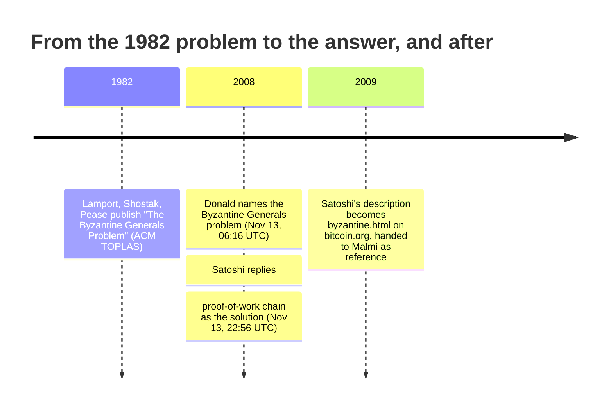

![A dark navy infographic headed "The Byzantine Generals Problem," subtitled "A 1982 classic, answered with the proof-of-work chain." A horizontal timeline links three icons: 1982 (Lamport, Shostak, Pease, ACM TOPLAS), November 13 2008 06:16 UTC (James A. Donald names the problem), and November 13 2008 22:56 UTC (Satoshi Nakamoto: the proof-of-work chain), with a speech-bubble quote reading "A solution to the Byzantine Generals Problem." A small panel in the top right contrasts classical BFT (known set, bounded rounds) with Bitcoin proof of work (open set, probabilistic finality).](/BitcoinArchive/images/analysis/2008-11-13-byzantine-generals-problem-hero.png)

November 13, 2008, 06:16 UTC — thirteen days after the whitepaper went public. In the mailing-list thread discussing it, James A. Donald gave a name to the difficulty he had been pressing Satoshi on: the Byzantine Generals Problem, the classic agreement problem of distributed computing. Satoshi answered at 22:56 that day. Neither the whitepaper's October 3 draft nor its October 31 final text uses the word "Byzantine," and none of the thread's earlier replies do either: Donald's message is the first to tie the phrase to Bitcoin, and the answer outlived the thread — within months Satoshi had turned it into a [standalone page on bitcoin.org](/BitcoinArchive/entries/web-document/satoshi/2009-03-09-byzantine-generals-problem/).

## 1. The 1982 problem

The Byzantine Generals Problem is Lamport, Shostak, and Pease's 1982 paper in *ACM Transactions on Programming Languages and Systems*. Several generals surround an enemy city, communicating only by messenger, and must agree on a single plan — attack or retreat — even though some of them may be traitors actively trying to prevent agreement. The paper's central result is specific and unforgiving: with only oral messages, no protocol can guarantee agreement unless more than two-thirds of the generals are loyal. With three generals and one traitor, nothing works.

By 2008 this was a standard reference point for distributed-systems people — a fixed, known, named group of participants, some of whom might lie, trying to reach one shared decision.

## 2. Donald's challenge

James A. Donald had been pushing on the same question since his first reply eleven days earlier: not whether nodes could be trusted, but how any set of nodes — trusted or not — arrives at one shared view of who owns what. Satoshi's paper had framed its problem as double-spending; it was Donald who kept pulling the argument down to the agreement layer underneath:

<!-- quote: q1 -->
> The process for arriving at a globally shared view of who owns what bitgold coins is insufficiently specified.

*[Context: "bitgold coins" is a naming conflation shared by the thread's earliest repliers, not a reference to Nick Szabo — [the Szabo–Satoshi hypothesis entry](/BitcoinArchive/entries/analysis/2013-12-05-szabo-satoshi-identity-hypothesis/) traces it.]*

[Replying to Satoshi's explanation of transaction finality](/BitcoinArchive/entries/emails/cryptography/bitcoin-p2p-e-cash-paper/2008-11-13-james-donald-byzantine-generals-problem/), he gave the difficulty its classical name:

<!-- speaker: James A. Donald -->
> It is not sufficient that everyone knows X. We also need everyone to know that everyone knows X, and that everyone knows that everyone knows that everyone knows X - which, as in the Byzantine Generals problem, is the classic hard problem of distributed data processing.

This is the nested-knowledge core of Lamport's problem, not just its costume — Donald is not reaching for a dramatic label, he is pointing at the actual mathematical difficulty and naming where it comes from.

## 3. "Arguably the harder part": Finney sizes the question

That afternoon, before Satoshi's reply landed, Hal Finney answered Donald in the same thread — and weighed exactly how much was riding on the question:

<!-- quote: q2 -->
> One thing I might mention is that in many ways bitcoin is two independent ideas: a way of solving the kinds of problems James lists here, of creating a globally consistent but decentralized database; and then using it for a system similar to Wei Dai's b-money (which is referenced in the paper) but transaction/coin based rather than account based. Solving the global, massively decentralized database problem is arguably the harder part, as James emphasizes.

On Finney's reading, the currency was the familiar half — b-money had sketched it a decade earlier. The shared-view problem Donald kept pressing was the half that made Bitcoin new.

## 4. Satoshi's answer: the King's wi-fi

At 22:56, [Satoshi replied](/BitcoinArchive/entries/emails/cryptography/bitcoin-p2p-e-cash-paper/2008-11-13-re-bitcoin-p2p-e-cash-paper-satoshi-2/) — and did not deflect the framing, he adopted it:

<!-- quote: q3 -->
> The proof-of-work chain is a solution to the Byzantine Generals' Problem. I'll try to rephrase it in that context.

What follows is the now-famous King's wi-fi analogy: a number of Byzantine Generals, each with a computer, want to crack the King's wi-fi password, but only have enough combined CPU power to do it if a majority attack at once. They don't care when the attack happens, only that they all agree on the same time — and they reach that agreement by racing to solve a proof-of-work problem that embeds the proposed time, broadcasting the winning solution, and having everyone extend the longest resulting chain. After enough proof-of-work has accumulated, any general can verify — from the difficulty alone — that a majority must have worked on it, without needing to trust any individual message.

It is a direct answer to Donald's nested-knowledge problem: nobody needs to know that everyone knows the agreed time. They only need to see a chain of work that could not exist unless a majority had already converged on it.

## 5. What kind of solution it is

Satoshi's own words license reading Bitcoin's consensus as a Byzantine Generals answer — but it answers a differently-shaped version of the problem than the 1982 paper poses. Lamport, Shostak, and Pease assumed a fixed, known set of generals and asked for a guarantee, reached in a bounded number of message rounds, that would hold as long as fewer than a third of them lied. Bitcoin's participant set is neither fixed nor known in advance, so the guarantee it offers is a different shape too.

| | Lamport, Shostak, Pease (1982) | Nakamoto consensus (Bitcoin) |
|---|---|---|
| Who can participate | Fixed, known set of generals | Open; anyone can join or leave |
| Guard against fake identities | Not needed — generals are already identified | Proof-of-work — a vote costs real computation |
| How agreement is reached | Signed or oral messages, counted across rounds | Extend whichever chain represents the most accumulated work |
| When agreement is final | Deterministic, within a bounded number of rounds | Probabilistic — gets stronger with each additional block |

The open, permissionless participant set is what Sybil-resistant proof-of-work is for: in a system where anyone can create as many identities as they can afford hardware for, counting messages or votes is meaningless without a cost attached to each one. [The consensus design entry](/BitcoinArchive/entries/design/2009-01-03-bitcoin-consensus-design/) covers the mechanism itself — difficulty adjustment, fork resolution, why finality here is probabilistic rather than a hard guarantee. The comparison itself has a traceable origin: not a citation in a paper, but a live argument on a public mailing list.

## 6. From reply to the project's own site

Satoshi did not treat the answer as a passing remark. A snapshot of bitcoin.org from March 2009 already carries a standalone page titled ["The Byzantine Generals' Problem"](/BitcoinArchive/entries/web-document/satoshi/2009-03-09-byzantine-generals-problem/) — the King's wi-fi explanation, lightly reworked, hosted on the project's own site. And on May 3, 2009, [handing Martti Malmi reference material for the site's planned FAQ](/BitcoinArchive/entries/correspondence/martti-malmi/2009-05-03-bitcoin-003/), Satoshi listed that page as "My description of how Bitcoin solves the Byzantine Generals' problem." What began as a reply to a skeptic had become a page Satoshi himself pointed people to as his description of the solution.

<!-- entry-closing -->

What I see in this exchange is a move that accepts the name and rebuilds what it names. Satoshi did not push back on the classical framing — he called his system a solution outright, then answered by swapping the fixed world of known generals for one that anyone can enter or leave. Each of the three left his own reading of the moment in the record: Donald pressed the agreement layer under the currency, Finney called it the harder half on the spot, and Satoshi kept the answer on the project's own site. And inside the analogy, what agreement rests on has changed. Lamport's generals reach agreement by counting what identified comrades tell them; the generals of the King's wi-fi converge on the hour of the attack without trusting a single message — the accumulated work carries the agreement for them. Thirteen days earlier, the whitepaper had asked for a payment system ["based on cryptographic proof instead of trust"](/BitcoinArchive/entries/emails/cryptography/2008-10-31-bitcoin-whitepaper-final/); the King's wi-fi is where that line first speaks, in Bitcoin's public record, in the vocabulary of 1982.
