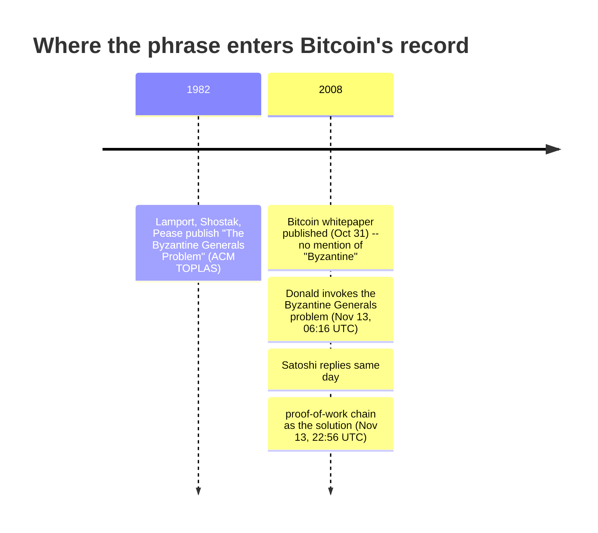

![A dark navy infographic headed "The Byzantine Generals Problem," subtitled "Not in the whitepaper. Named thirteen days later, in a mailing-list reply." A horizontal timeline links four icons: 1982 (Lamport, Shostak, Pease, ACM TOPLAS), October 31 2008 (the Bitcoin whitepaper, no "Byzantine Generals" phrase), November 13 2008 06:16 UTC (James A. Donald invokes the problem), and November 13 2008 22:56 UTC (Satoshi Nakamoto adopts the framing), with a "16h40m later" tag between the last two and a speech-bubble quote reading "A solution to the Byzantine Generals Problem." A small panel in the top right contrasts classical BFT (known set, bounded rounds) with Bitcoin proof of work (open set, probabilistic finality).](/BitcoinArchive/images/analysis/2008-11-13-byzantine-generals-problem-hero.png)

Search "Bitcoin Byzantine Generals Problem" and the whitepaper gets cited as the source. It is not. Neither the October 3 draft nor the October 31 final version contains the word "Byzantine." The phrase enters Bitcoin's own documented history thirteen days after publication, in a mailing-list exchange — and the record of who said it first, and why, is still there to read.

## 1. What the whitepaper actually says

Satoshi's paper frames the problem as double-spending and describes the solution as a timestamp server and a proof-of-work chain. It never names the classical distributed-systems problem it happens to resemble. That framing came from a reader, thirteen days into the paper's public life, and Satoshi picked it up and answered in its own terms. Both messages are preserved here [as the two halves of one exchange](/BitcoinArchive/entries/emails/cryptography/bitcoin-p2p-e-cash-paper/2008-11-13-re-bitcoin-p2p-e-cash-paper-satoshi-2/).

## 2. The 1982 problem

The Byzantine Generals Problem is Lamport, Shostak, and Pease's 1982 paper in *ACM Transactions on Programming Languages and Systems*. Several generals surround an enemy city, communicating only by messenger, and must agree on a single plan — attack or retreat — even though some of them may be traitors actively trying to prevent agreement. The paper's central result is specific and unforgiving: with only oral messages, no protocol can guarantee agreement unless more than two-thirds of the generals are loyal. With three generals and one traitor, nothing works.

By 2008 this was a standard reference point for distributed-systems people — a fixed, known, named group of participants, some of whom might lie, trying to reach one shared decision.

## 3. Donald's challenge

James A. Donald had been pushing on the same question since his first reply eleven days earlier: not whether nodes could be trusted, but how any set of nodes — trusted or not — arrives at one shared view of who owns what. On November 13, 2008 at 06:16 UTC, [replying to Satoshi's explanation of transaction finality](/BitcoinArchive/entries/emails/cryptography/bitcoin-p2p-e-cash-paper/2008-11-13-james-donald-byzantine-generals-problem/), he named the actual difficulty:

<!-- quote: q1 -->
> It is not sufficient that everyone knows X. We also need everyone to know that everyone knows X, and that everyone knows that everyone knows that everyone knows X - which, as in the Byzantine Generals problem, is the classic hard problem of distributed data processing.

This is the nested-knowledge core of Lamport's problem, not just its costume — Donald is not reaching for a dramatic label, he is pointing at the actual mathematical difficulty and naming where it comes from.

## 4. Satoshi's answer, same day

Less than seventeen hours later, Satoshi replied, and did not deflect the framing — he adopted it:

<!-- quote: q2 -->
> The proof-of-work chain is a solution to the Byzantine Generals' Problem. I'll try to rephrase it in that context.

What follows is the now-famous King's wi-fi analogy: a number of Byzantine Generals, each with a computer, want to crack the King's wi-fi password, but only have enough combined CPU power to do it if a majority attack at once. They don't care when the attack happens, only that they all agree on the same time — and they reach that agreement by racing to solve a proof-of-work problem that embeds the proposed time, broadcasting the winning solution, and having everyone extend the longest resulting chain. After enough proof-of-work has accumulated, any general can verify — from the difficulty alone — that a majority must have worked on it, without needing to trust any individual message.

It is a direct answer to Donald's nested-knowledge problem: nobody needs to know that everyone knows the agreed time. They only need to see a chain of work that could not exist unless a majority had already converged on it.

## 5. What changed, and what didn't

Satoshi's own words license reading Bitcoin's consensus as a Byzantine Generals answer — but it answers a differently-shaped version of the problem than the 1982 paper poses. Lamport, Shostak, and Pease assumed a fixed, known set of generals and asked for a guarantee, reached in a bounded number of message rounds, that would hold as long as fewer than a third of them lied. Bitcoin's participant set is neither fixed nor known in advance, so the guarantee it offers is a different shape too.

| | Lamport, Shostak, Pease (1982) | Nakamoto consensus (Bitcoin) |
|---|---|---|
| Who can participate | Fixed, known set of generals | Open; anyone can join or leave |
| Guard against fake identities | Not needed — generals are already identified | Proof-of-work — a vote costs real computation |
| How agreement is reached | Signed or oral messages, counted across rounds | Extend whichever chain represents the most accumulated work |
| When agreement is final | Deterministic, within a bounded number of rounds | Probabilistic — gets stronger with each additional block |

The open, permissionless participant set is what Sybil-resistant proof-of-work is for: in a system where anyone can create as many identities as they can afford hardware for, counting messages or votes is meaningless without a cost attached to each one. [The consensus design entry](/BitcoinArchive/entries/design/2009-01-03-bitcoin-consensus-design/) covers the mechanism itself — difficulty adjustment, fork resolution, why finality here is probabilistic rather than a hard guarantee. The comparison itself has a traceable origin: not a citation in a paper, but a live argument, settled the same day it was raised.

<!-- entry-closing -->

I read the same-day timing as the most telling detail in the whole exchange. Satoshi did not have a rehearsed answer waiting — he had a system that, when pressed on the hardest classical framing available, could be re-explained in that framing within hours and still hold up. That is a stronger claim than "the whitepaper solves the Byzantine Generals Problem," and it is the one the record actually supports.
