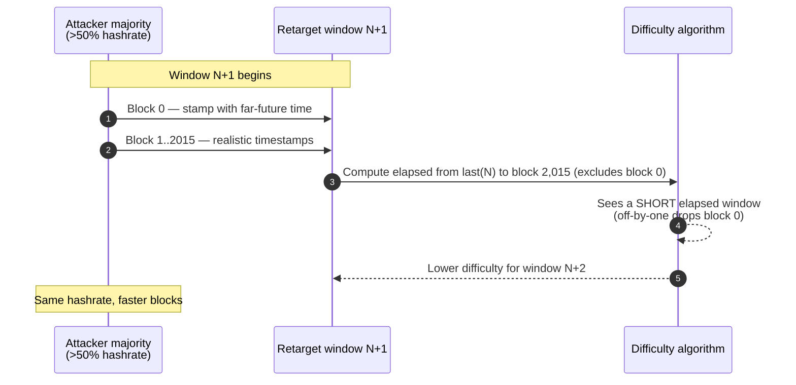

Bitcoin's difficulty-adjustment algorithm contains a long-known off-by-one bug in Satoshi's original code. The retarget window is documented as 2,016 blocks — two weeks at 10-minute block intervals — but the code that actually computes the elapsed-time delta measures the gap between **block 0 and block 2,015** of each window. The first block of every retarget window is therefore not included in the timing calculation. The bug is small, the consequences are not.

## 1. The mechanic

When a majority of hashrate cooperates, miners can stamp the first block of a retarget window with a far-future timestamp, then stamp the remaining 2,015 blocks with realistic (or even slightly past) timestamps. Because the difficulty formula uses the timestamp of the **last** block in the previous window as its anchor — and the off-by-one excludes the first block of the new window — the elapsed time the algorithm "sees" can be made far shorter than the actual elapsed time. Difficulty drops on the next retarget; the colluding majority then mines blocks at faster-than-10-minute pace without adding any hashrate.

The attack is not free or instant. The published descriptions place the cost-effective minimum at roughly **four weeks of sustained majority operation** before meaningful exploitation. That is long enough that any real attempt would be visible to the rest of the network well before the difficulty distortion materialized — which is the main reason the bug has remained unfixed for so long: it is exploitable in principle but expensive in practice, and a coordinating majority that visible would face far easier and more profitable mischief than gaming the retarget window.

## 2. Why this is in Satoshi's code

Examination of the v0.1.0 source — preserved in trottier/original-bitcoin's pinned `src/main.cpp` at commit `4184ab2`, lines 685–707 — shows the bug present from the initial release in January 2009. The loop that walks the previous retarget window starts at the latest block and counts back 2,015 entries, then takes the time delta between that 2,015-block-earlier ancestor and the current block. The intent was clearly to span 2,016 blocks; the implementation spans 2,015. There is no surviving evidence that Satoshi was aware of the discrepancy. The bug was first publicly described on BitcoinTalk in 2011 and has been periodically rediscovered since.

## 3. The Great Consensus Cleanup

Antoine Poinsot has championed a soft-fork proposal known as the **Great Consensus Cleanup** that bundles a fix for the time-warp bug with several other long-known protocol curiosities. The proposal would constrain the timestamp of the first block of each retarget window so that the off-by-one cannot be exploited regardless of hashrate share. As of 2026 the proposal remains in active community discussion: it has support from several Bitcoin Core developers but has not reached the level of operator consensus that triggered SegWit (BIP148) or Taproot (BIP341). The bug this proposal targets is documented as one of two known quirks in [the consensus design's difficulty-adjustment section](/BitcoinArchive/entries/design/2009-01-03-bitcoin-consensus-design/), alongside the related off-by-one in the retarget window count.

The pace of activation reflects Bitcoin's institutional caution. Soft-fork changes to the consensus rules require both broad developer agreement and clear miner / node-operator readiness, and the bar for a "cleanup" fork — one that does not deliver any new user-facing feature — is higher than for capability-adding forks. The community has thus been content to leave a known but expensive-to-exploit bug in place rather than mobilize a fork that, in absolute terms, only closes an attack vector that has never been used.

## 4. Editorial significance

The time-warp bug is one of the most-cited examples of "Satoshi's code as historical artifact": a piece of running mainnet logic, fifteen years old and still in place, that nobody is in a hurry to touch. It illustrates both the resilience of Bitcoin's design (a real bug that has not threatened the chain) and the conservatism that defines its protocol-evolution culture (no rush to fix what has not broken). The Great Consensus Cleanup, when and if it activates, will be a small but symbolically important moment — the first soft fork dedicated to retroactively correcting Satoshi's own mistakes.
