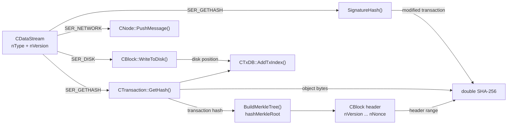

`CTransaction::GetHash()` and `CBlock::GetHash()` do not hash the same kind of object. The first serializes a transaction object. The second hashes the memory range from `nVersion` through `nNonce`; the transaction vector is outside that range. Its contents enter the header through `hashMerkleRoot` instead.

That split controls every path that follows. The same serialization framework serves network messages, block files, object identifiers, and signature digests, but each caller selects a context or transforms the object first. “Serialized transaction” is not one universal byte sequence in v0.1.

## 1. One serializer, three primary contexts

`src/serialize.h` declares three primary actions:

| Context | Role in v0.1 |
|---|---|
| `SER_NETWORK` | Serialize objects carried in peer-to-peer messages. |
| `SER_DISK` | Serialize objects stored in block files and database records. |
| `SER_GETHASH` | Serialize the bytes used as an object or signature-hash input. |

`SER_SKIPSIG` and `SER_BLOCKHEADERONLY` are modifiers rather than separate serialization worlds. The `IMPLEMENT_SERIALIZE` macro expands one field description into three operations: calculate its size, write it, and read it. The stream passes `nType` and `nVersion` into that description, so the object can make context-sensitive choices without maintaining separate field lists.

The design is compact, but the consequences are not. A field can be present in a network or disk record and absent from a hash input. The caller's context is part of the byte-level meaning.

The implementation ranges are fixed in the v0.1 source: `src/serialize.h:28–79` carries the stream contexts; `src/main.h:193–395` defines transaction fields and hashing; `src/main.h:805–884` defines the block header, Merkle root, and block hash; `src/script.cpp:692–712, 818–901` handles signature checking and `SignatureHash`; `src/net.h:434–494, 565–675` frames network messages; `src/main.h:919–959` frames block-file records; `src/db.cpp:186–201` creates the transaction index; and `src/util.h:363–390` supplies the hash functions.

The byte paths divide at the stream type. `SER_GETHASH` reaches the transaction identifier and signature digest, `SER_NETWORK` reaches peer payloads, and `SER_DISK` reaches stored records. The block identifier is the separate header-range path; the Merkle root carries transaction hashes into that header.



## 2. The transaction hash covers the v0.1 transaction object

`CTransaction` in `src/main.h` contains four top-level serialized fields, in order:

1. `nVersion`
2. `vin`
3. `vout`
4. `nLockTime`

Each input contributes its `prevout`, `scriptSig`, and `nSequence`. Each output contributes `nValue` and `scriptPubKey`. `CTransaction::GetHash()` calls `SerializeHash(*this)`. `SerializeHash` creates a `CDataStream` with `SER_GETHASH`, serializes the object, and applies the source's double-SHA-256 `Hash` function.

There is no witness field in v0.1 and no separate `txid`/`wtxid` path. Because the v0.1 input serializer includes `scriptSig` and does not exclude it for `SER_GETHASH`, the transaction hash covers the signature bytes as they exist in the transaction object. That is a statement about this implementation, not a description of every later Bitcoin transaction identifier.

The [transaction design](/BitcoinArchive/entries/design/2009-01-03-bitcoin-transaction-design/) explains what those inputs and outputs mean as a payment system. The narrower question is which bytes become the object's identifier.

## 3. The block hash stops at the header

`CBlock` declares its header first:

`nVersion`, `hashPrevBlock`, `hashMerkleRoot`, `nTime`, `nBits`, and `nNonce`.

The `vtx` transaction vector follows as network and disk data. Its serializer writes `vtx` unless `nType` contains `SER_GETHASH` or `SER_BLOCKHEADERONLY`. `CBlock::GetHash()` calls `Hash(BEGIN(nVersion), END(nNonce))`, so the direct hash input is the header range, not the full block object.

`BuildMerkleTree()` supplies the missing connection. It starts with `tx.GetHash()` for each transaction, combines the hashes pairwise, and returns the final root. Changing a transaction changes `hashMerkleRoot`; changing that header field changes the block hash. The transaction list is therefore committed indirectly, through the header, rather than by being included in the block-hash byte range.

The [block and chain design](/BitcoinArchive/entries/design/2009-01-03-bitcoin-block-chain-design/) follows that root into chain linking and proof of work. Earlier in the path, the Merkle root is the boundary between transaction data and the block identifier.

## 4. A signature digest is a transformed transaction

`OP_CHECKSIG` does not ask for `txTo.GetHash()` directly. In `src/script.cpp`, the interpreter takes the script from the most recent `OP_CODESEPARATOR`, removes the signature being checked, and passes that `scriptCode` to `CheckSig`.

`SignatureHash` then copies the transaction and changes the copy before hashing it:

- it clears every input's `scriptSig`;
- it assigns the selected `scriptCode` to the current input;
- `SIGHASH_NONE` removes every output and zeroes the other input sequences;
- `SIGHASH_SINGLE` keeps outputs through the current input index and nulls the earlier outputs;
- `SIGHASH_ANYONECANPAY` keeps only the current input;
- it serializes the altered transaction with `SER_GETHASH` and appends `nHashType` before applying the double hash.

The signature therefore commits to a deliberately constructed view of the transaction. Three byte sequences must be kept apart:

1. the original serialized transaction used by `CTransaction::GetHash()`;
2. the modified copy used by `SignatureHash`;
3. the network or disk serialization of the transaction object.

Calling all three simply “the transaction bytes” hides the rule that controls signature validity.

## 5. Network delivery reuses the object serializer

The `CNode` constructor sets both `vSend` and `vRecv` to `SER_NETWORK`. `BeginMessage` writes a `CMessageHeader` into the send stream. `PushMessage` then serializes its arguments with `operator<<`, and `EndMessage` patches the payload size into the header.

The path is:

```text
CNode::PushMessage(command, object)
    → CMessageHeader(command, size)
    → CDataStream(SER_NETWORK) << object
    → serialized payload
```

The message header is transport framing. It is not part of `CTransaction::GetHash()` or `CBlock::GetHash()`. A transaction can use the same object serializer for network delivery and for other paths while its identifier remains independent of the message command and peer-specific framing.

## 6. Disk storage adds framing and position

`CBlock::WriteToDisk` obtains a block file, optionally sets `SER_BLOCKHEADERONLY`, calculates the serialized size, writes the network magic and size prefix, and then writes the block. `ReadFromDisk` reverses that operation and checks the header hash after deserialization. The file record wraps the object; it does not create a second block identifier.

The transaction database uses the same distinction. `CTxDB::AddTxIndex` calculates `tx.GetHash()` as the key, then stores a `CTxIndex` containing the disk position and output count:

```text
transaction object
    → CTransaction::GetHash()
    → Berkeley DB key: ("tx", transaction hash)
    → CTxIndex: disk position + output count
    → serialized transaction in the block file
```

The hash identifies the transaction. The index tells the node where to recover its serialized bytes. Those are related operations, not interchangeable ones.

## 7. The boundaries in one view

| Path | Context or operation | Direct input or result |
|---|---|---|
| Transaction identifier | `SerializeHash` with `SER_GETHASH` | Full serialized `CTransaction`, including v0.1 `scriptSig` bytes |
| Block identifier | `CBlock::GetHash()` | Header range from `nVersion` through `nNonce` |
| Merkle commitment | `BuildMerkleTree()` | Pairwise hashes beginning with each `tx.GetHash()` |
| Signature digest | `SignatureHash()` | Modified transaction plus `nHashType` |
| Network payload | `CDataStream(SER_NETWORK)` | Object payload inside a `CMessageHeader` |
| Block-file record | `SER_DISK`, optionally `SER_BLOCKHEADERONLY` | Framed object bytes and a disk position |
| Transaction index | `CTxDB::AddTxIndex()` | Database key `("tx", tx.GetHash())` plus `CTxIndex` |

The [Satoshi code analysis](/BitcoinArchive/entries/analysis/2009-01-09-satoshi-code-analysis/) studies coding style, commit patterns, and codebase evolution. Those questions concern who changed the code and when; the field and call boundaries concern what the early implementation does when it runs.

## 8. What the v0.1 source establishes

The source leaves four implementation facts unambiguous:

- transaction identity is tied to the complete legacy transaction serialization, including `scriptSig`;
- block identity is tied to the header, with transaction contents entering through `hashMerkleRoot`;
- signature verification uses a transformed transaction and a hash-type integer, not the transaction identifier directly;
- network delivery, disk persistence, and database indexing reuse serialization primitives without redefining those identifiers.

These statements belong to the fixed v0.1 source. They do not imply that current Bitcoin Core retains the same source layout or every internal call path. Later changes to transaction formats, witness handling, and chainstate storage need their own source and version boundaries.
