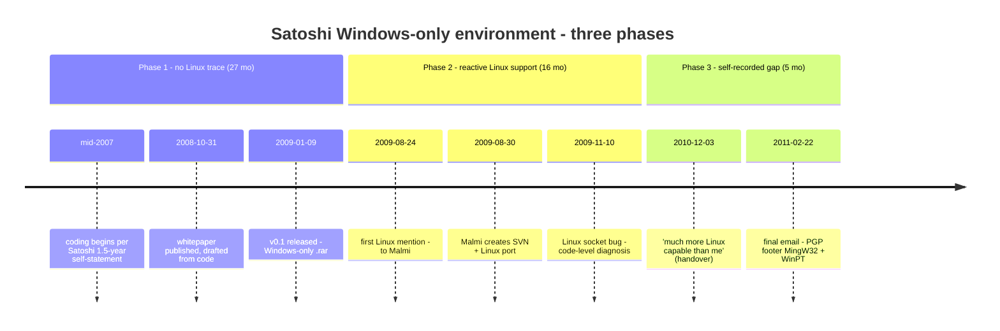

Satoshi's correspondence and forum posts contain extensive Linux discussion, which can suggest a Linux-literate developer working across platforms. Read chronologically, the same record tells a sharper story: for the entire design period and the first seven months after the v0.1 release — twenty-seven months in total — the public record contains no Linux engagement of any kind. Linux first appears in August 2009 as reactive support for Martti Malmi's Linux port. By December 2010 Satoshi himself names the gap in writing: Gavin Andresen is "technically much more Linux capable than me." The final email two months later is PGP-signed with `GnuPG v1.4.7 (MingW32) - WinPT 1.2.0` — a Windows-only toolchain — closing the recorded period without any sign that the Windows-only stack was ever displaced.

This entry organizes that record by period.

## 1. Overview — three phases

| Phase | Window | Length | Linux engagement |
|---|---|---|---|
| **Phase 1** — Design + release + early period | mid-2007 → 2009-08-23 | ~27 months | **None on the public record** |
| **Phase 2** — Reactive support for Malmi's port | 2009-08-24 → 2010-12-02 | ~16 months | Linux discussion appears, all in the context of supporting Malmi's port and user reports |
| **Phase 3** — Self-recorded gap + final email | 2010-12-03 → 2011-04-26 | ~5 months | "Much more Linux capable than me"; final PGP signature footer still names a Windows-only client |



The phases are anchored on three public-record events: the first dated Linux-tagged email in the Archive (2009-08-24, beginning of Phase 2), Satoshi's December 3, 2010 handover note to Malmi (beginning of Phase 3), and the February 22, 2011 message that carries the final-period PGP signature footer.

## 2. Phase 1 — design, release, and early period (~27 months): no Linux trace

Satoshi himself stated in his August 2008 email to Adam Back that he had "worked through every detail in the last year and a half while coding it," and later told Mike Hearn he needed "a break from it after 18 months development." A self-attested 18-month coding span ending around the v0.1 release places the start of work in mid-2007 at the latest — the full self-statement timeline is collected in [the cypherpunk-independent-arrival analysis](/BitcoinArchive/entries/analysis/2008-10-31-cypherpunk-independent-arrival/). The v0.1 release ships on January 9, 2009 as a Windows-only `.rar` archive on SourceForge. For another seven months after that — until the very end of August 2009 — Bitcoin's source code lives only on Satoshi's local machine, distributed as successive `.rar` releases. Across this entire twenty-seven-month window, the Archive contains:

- **No Linux discussion in Satoshi's email.** The earliest Linux-tagged Satoshi email is [2009-08-24 to Malmi](/BitcoinArchive/entries/correspondence/martti-malmi/2009-08-24-bitcoin-029/). Nothing earlier surfaces Linux as a topic.
- **No Linux build, port, or user-side commentary.** The first "Linux build" thread in the archive is the late-October 2009 series with Malmi.
- **No mention of running Bitcoin on a non-Windows machine.** The first cross-platform release follows Malmi's port; Satoshi's own machine remains Windows-side throughout.

### 2.0 Cross-platform consideration is structurally absent — three observations

1. **v0.1 is Windows-only.** From [v0.1 (January 9, 2009)](/BitcoinArchive/entries/aftermath/2009-01-09-bitcoin-v01-released/) through the v0.1.x minor series until [v0.2 added Linux support on December 16, 2009](/BitcoinArchive/entries/aftermath/2009-12-16-bitcoin-v02-released/) — roughly eleven months — Satoshi shipped only the Windows-only `.rar`.
2. **The whitepaper and early documents are platform-silent.** No mention of OS, no portability goal, no stated intention to ship multi-platform implementations, no strategic framing like "of the available platforms, we chose Windows because…" — none of these appear.
3. **All cross-platform ports came from collaborators.** Martti Malmi did the Linux port in August 2009; Laszlo Hanyecz did the macOS fix in August 2010. No cross-platform release ever came from Satoshi's own hands on the public record.

Observations 1 and 3 are consistent with two competing readings: (a) Satoshi's design horizon did not foreground non-Windows users in the early period, or (b) Satoshi deliberately targeted Windows general consumers as the initial adopter base. Reading (b) coheres with the `.rar` packaging (a Windows-consumer-familiar format), the no-installer extract-and-run pattern, and the Windows-only initial scope — a self-consistent "download, double-click, run" strategy. [The Warez-scene parallel entry](/BitcoinArchive/entries/analysis/2009-01-09-satoshi-distribution-and-tooling-anomalies/) documents the overlap with Windows-consumer informal-distribution conventions. The two readings are not mutually exclusive.

What neither reading fully explains is observation 2 — the **complete platform-silence** in the whitepaper, the v0.1 release announcement, and the early correspondence. Even a deliberate Windows-first commercial strategy would normally come with some explicit framing ("we chose Windows for adopter reach; cross-platform ports welcome later"). Satoshi made no such framing. The choice itself was never raised as a topic in any visible artifact. The Phase 2 record does show Satoshi reading Linux source and diagnosing Linux-specific behavior at the code level — but that level of focused capability can be acquired through a few days of investigation on a specific problem and does not, by itself, attest to prior Linux experience; a developer pushed by Malmi's port work and Linux-side user reports could plausibly arrive at the same diagnoses through just-in-time learning. The cautious reading is: **during Phase 1** Satoshi did not surface non-Windows platforms as a design concern in the public record, chose consumer-side Windows conventions for distribution, and did not articulate the choice itself. Phase 2 brings community-driven contact with OSS conventions (autoconf consideration, Apache configuration, license comparison), but Satoshi continues to choose minimalist responses.

Four pieces of Windows-specific evidence are visible during this period, all independent of one another:

### 2.1 Visual C++ 6.0 SP6 + MinGW GCC 3.4.5 — the build toolchain

The Bitcoin v0.1 source archive's `readme.txt` records the supported compilers in Satoshi's own words:

```text
Compilers Supported
-------------------
MinGW GCC (v3.4.5)
Microsoft Visual C++ 6.0 SP6
```

Visual C++ 6.0 was released by Microsoft in 1998; SP6 — the final service pack — shipped in 2004. MinGW GCC 3.4.5 (the Windows port of GCC, last release in the 3.4.x series) shipped in early 2006. By 2008–2009, all three were several years past their replacements — Visual C++ 2003 / 2005 / 2008 had been shipping for years and the Visual C++ 6.0 IDE was widely regarded as obsolete; GCC 4.x had replaced 3.4.x on most distributions. The [SVN repository history entry](/BitcoinArchive/entries/aftermath/2009-08-30-bitcoin-svn-repository-committers/) confirms the same toolchain from the porting side: "the Bitcoin codebase — which Satoshi had developed on Windows using Visual C++ 6.0 — to Linux." A workflow anchored on an eleven-year-old IDE plus a 2006 MinGW build is unlikely to have been freshly assembled for Bitcoin. Professional development practice is to follow toolchain updates for bug fixes and security patches; staying this far behind the replacement series points to a workflow not actively tracking the toolchain landscape — long-running by inertia rather than "stable" in any forward-looking sense. The `readme.txt` itself records a corroborating trace: "You may need Boost version 1.35 to build with MSVC 6.0. I couldn't get version 1.37 to compile with MSVC 6.0" — Satoshi tried the newer Boost, hit a VC6 wall, and downgraded the dependency to fit the existing compiler rather than the other way around.

### 2.2 Hungarian notation — the late-1990s Windows C++ style

Variable names throughout v0.1 follow Microsoft's Hungarian notation (type-prefix conventions like `nValue`, `strHash`, `vTransactions`). In August 2014, Wladimir van der Laan filed [PR #4641](/BitcoinArchive/entries/forum/github/pr-4641/2014-08-06-pr-4641-doc-remove-satoshi-s-variable-naming-style/) to remove the convention from new code, calling it a style that "has bugged me since the beginning." Hungarian notation is the stylistic marker of the Win32 / MFC tradition of the late 1990s through the early 2000s — the same era as Visual C++ 6.0. (Full statistical breakdown of Satoshi's coding-style fingerprint across v0.1.0 → v0.3.19 is in [the Satoshi code analysis](/BitcoinArchive/entries/analysis/2009-01-09-satoshi-code-analysis/).)

### 2.3 `.rar` packaging and Windows-only first releases

Bitcoin v0.1 and the v0.1.x minor series — from January 2009 until v0.2 added Linux support in December 2009 — shipped on SourceForge as Windows-only `.rar` archives. The format is treated in detail in [the Warez-scene parallel entry](/BitcoinArchive/entries/analysis/2009-01-09-satoshi-distribution-and-tooling-anomalies/); the relevant point here is that the Windows-only initial scope is consistent with — and dated to — Phase 1.

### 2.4 Eight months without any team-development tooling

Within Phase 1, the seven post-release months (January–August 2009) overlap with an unbroken solo-developer pattern: no version control, no test suite, no issue tracker, no second-reviewer process. Each release was a fresh `.rar` of the current source tree; the public commit history begins only when Malmi opens the SVN repository at the boundary of Phase 1 and Phase 2. The [SVN-history entry](/BitcoinArchive/entries/aftermath/2009-08-30-bitcoin-svn-repository-committers/) records the toolchain transition: when team-development infrastructure arrived in August 2009, it arrived because Malmi built it.

Four independent observations — Visual C++ 6.0 as build toolchain, Hungarian notation throughout the code, `.rar` Windows-only packaging, and the absence of any team-development tooling — all fit a single Windows-side, individually-working developer profile across the full 27-month period.

### 2.5 OSS library dependencies — active as a consumer

The same `readme.txt` lists Bitcoin v0.1.3's external library dependencies:

| Library | Role | License |
|---|---|---|
| **wxWidgets** | Cross-platform GUI framework | LGPL 2.1 |
| **OpenSSL** | Cryptography (ECDSA, SHA, BIGNUM) | Old BSD |
| **Berkeley DB** | Embedded key-value store (`wallet.dat` etc.) | New BSD |
| **Boost** | General C++ utilities (thread, asio, filesystem) | MIT-like |

Bitcoin itself ships under MIT/X11 — a permissive OSS license also documented at the top of the same `readme.txt`.

This places Satoshi unambiguously in the OSS-*user* population. "Did not know OSS exists" is not a tenable reading: v0.1 wires four major OSS libraries together and ships under an OSS license itself. What Phase 2 (§3 below) documents is a different observation — Satoshi was reluctant on the OSS *community-conventions* layer (autoconf, license-thread participation, etc.). The shape is **active as a library consumer, passive as a community participant** — a configuration not unusual for solo developers who treat OSS as a toolset rather than as a culture to join.

## 3. Phase 2 — reactive Linux support (~16 months)

Linux enters the record on August 24, 2009. From this point through late 2010, every Linux mention in Satoshi's correspondence sits in the context of supporting work that someone else is doing — almost entirely Martti Malmi's port and NewLibertyStandard's user-side testing on the resulting Linux build.

- [2009-08-24 to Malmi](/BitcoinArchive/entries/correspondence/martti-malmi/2009-08-24-bitcoin-029/): the first Linux-tagged email. The context is Malmi-side preparation work.
- [Late October to early November 2009 "linux-build" series](/BitcoinArchive/entries/correspondence/martti-malmi/2009-10-29-linux-build-048/): Malmi is doing the actual port; Satoshi is reviewing patches.
- [2009-11-08 to Malmi](/BitcoinArchive/entries/correspondence/martti-malmi/2009-11-08-linux-build-ready-for-testing-066/): analyzing NewLibertyStandard's `debug.log` from a Linux test machine — not Satoshi's own machine.
- [2009-11-10 to Malmi](/BitcoinArchive/entries/correspondence/martti-malmi/2009-11-10-linux-dead-sockets-problem-073/): diagnosing a zombie-socket problem at the code level ("clearly something about socket handling on Linux that's affecting it"). The diagnosis is code-level, not "I reproduced this on my Linux machine."

The pattern is consistent across Phase 2: Satoshi can read Linux source, diagnose Linux-specific behavior in code, and review Linux-targeted patches, but every visible exposure is reactive — driven by Malmi's port work and Linux-side user reports. Nothing in the record shows Satoshi running Bitcoin on a Linux machine of his own. The Windows-side Phase 1 evidence — Visual C++ 6.0, Hungarian notation, the `.rar` release habit — continues unbroken through Phase 2.

The team-development tooling absence partially closes during Phase 2: Malmi creates the SVN repository, Laszlo Hanyecz contributes a one-off macOS fix in August 2010, Gavin Andresen joins as a committer in October 2010. But the [SVN committer history](/BitcoinArchive/entries/aftermath/2009-08-30-bitcoin-svn-repository-committers/) makes the asymmetry clear: of 252 SVN revisions over the full 2009–2011 lifetime, Satoshi accounts for roughly 160, the SVN repository itself is Malmi's initiative, and the Linux port within those commits is Malmi's work.

**Contact with OSS conventions also first appears in Phase 2.** Phase 1 contains no Satoshi mention of Apache, GNU, autoconf, license-selection criteria, or similar OSS-convention topics. Phase 2 first surfaces them, in each case driven by external prompts:

- **2009-11-23**: Satoshi [asks Malmi for Apache configuration access](/BitcoinArchive/entries/correspondence/martti-malmi/2009-11-23-access-permissions-required-to-fix-drupal-108/) to fix mod_rewrite on bitcoin.org's Drupal install — server-admin context, demonstrating Apache configuration knowledge.
- **2009-12-12 (BitcoinTalk topic 12)**: a community contributor (The Madhatter) asks "given any thought to using autoconf?" Satoshi replies: ["Considered autoconf. Autoconf is a necessity for large projects with a quagmire makefile, but I think we're small enough that it's more optimal without it. I'd rather keep the makefile simple as long as possible."](/BitcoinArchive/entries/forum/bitcointalk/topic-12/2009-12-12-sni21-re-a-few-suggestions/). The reply records that autoconf (the OSS canonical cross-platform tool) was "considered" — but whether this reflects prior familiarity with the tool or a quick post-suggestion look that ended at "not worth the complexity for our size" cannot be decided from the message alone. The shape is also consistent with the common pattern of a developer encountering a new tool, briefly investigating, and concluding "looks like overkill / hassle / unnecessary."
- **2010-09-12 (BitcoinTalk "Switch to GPL")**: in the [community-initiated license thread](/BitcoinArchive/entries/forum/bitcointalk/topic-989/2010-09-12-re-switch-to-gpl/), Satoshi compares MIT / Boost / new-BSD / public domain / GPL trade-offs and remarks that for small projects "the fear of a closed-source takeover is overdone." License-comparison competence is on display, at the practical-not-theoretical level.

The weaker claim these three datapoints establish is only that Satoshi was not entirely OSS-conventions-ignorant. Whether each response reflects prior familiarity or just-in-time investigation after the prompt cannot be decided from the messages themselves. What is clear is the response *shape*: across all three, the choice was to keep adoption minimal. They are also all **reactive**: each surfaces because a community participant raised it, not because Satoshi initiated the topic. The pattern matches the Linux one — Phase 1 silence, Phase 2 reactive engagement, minimalist responses.

Read together with [§2.5](#25-oss-library-dependencies--active-as-a-consumer), the picture sharpens: at the library layer Satoshi was an active OSS consumer (wxWidgets / OpenSSL / Berkeley DB / Boost, all from Phase 1), but at the community-conventions layer (autoconf, license-thread participation, GitHub culture) Satoshi remained passive. The split is *consumer-active, contributor-passive* — a real and recurrent profile among solo developers, not a contradiction.

**Almost every non-Windows / non-Microsoft technical contact in Satoshi's record was introduced by a third party.** A consolidated view across Phase 2 and Phase 3:

| Technology / infrastructure | Brought in by | When | Source |
|---|---|---|---|
| SVN repository | Martti Malmi (created at r1) | 2009-08 | [SVN-committer history](/BitcoinArchive/entries/aftermath/2009-08-30-bitcoin-svn-repository-committers/) |
| Linux build / port | Martti Malmi (port); NewLibertyStandard (user testing) | 2009-08–11 | linux-build email series |
| macOS build | The Madhatter (trial report) → Laszlo Hanyecz (upstreamed at r123) | 2009-12 / 2010-08 | [BitcoinTalk topic 12](/BitcoinArchive/entries/forum/bitcointalk/topic-12/2009-12-12-sni21-re-a-few-suggestions/) / SVN history |
| autoconf consideration | The Madhatter (proposal) | 2009-12 | same thread (Satoshi declined) |
| Drupal / Apache server admin | (Satoshi-initiated, bitcoin.org ops) | 2009-11– | [Drupal access email](/BitcoinArchive/entries/correspondence/martti-malmi/2009-11-23-access-permissions-required-to-fix-drupal-108/) |
| License comparison (MIT / GPL / Boost / BSD / PD) | Community ("Switch to GPL" thread) | 2010-09 | [BitcoinTalk topic 989](/BitcoinArchive/entries/forum/bitcointalk/topic-989/2010-09-12-re-switch-to-gpl/) |
| "Linux capable than me" admission | Gavin Andresen (the successor) | 2010-12 | [Handover email](/BitcoinArchive/entries/aftermath/2010-12-03-handover-to-gavin/) |
| Java / JVM ecosystem | Mike Hearn (bitcoinj release) | 2011-03 | [Hearn → Satoshi bitcoinj release](/BitcoinArchive/entries/correspondence/mike-hearn/bitcoinj/2011-03-07-hearn-to-satoshi-bitcoinj-release/) |
| Git migration (SourceForge SVN → GitHub) | Gavin Andresen (post-Satoshi-withdrawal) | 2011-09 | r252 "Development has moved to github" |

The pattern is consistent: SVN, Linux, macOS, autoconf, GPL-vs-others license discussion, Java/JVM, and Git all arrive in Satoshi's recorded scope through other named people. The one exception is Apache configuration, which Satoshi handled directly — but the context is bitcoin.org server operation, not the Bitcoin development stack. Satoshi's pre-Bitcoin computing horizon appears to have been completed inside the Windows / Microsoft sphere; Phase 2 onward shows the outside being introduced one piece at a time, by community members rather than by Satoshi's own initiative.

## 4. Phase 3 — recorded gap and final period (~5 months)

On December 3, 2010, Satoshi writes to Malmi explaining the choice of Gavin Andresen as project successor. The [handover note](/BitcoinArchive/entries/aftermath/2010-12-03-handover-to-gavin/) contains the most direct self-positioning on the Linux axis anywhere in Satoshi's correspondence:

<!-- speaker: Satoshi Nakamoto -->
<!-- audit:quote-skip -->
> "I think it should be Gavin. I trust him, he's responsible, professional, and technically much more Linux capable than me."

This is the only place in the Archive's Satoshi record where Satoshi names a concrete other person and places himself on a Linux-skill axis below that person. The framing is calmly comparative; the substance is that, after sixteen months of Phase 2 Linux engagement, Satoshi still does not consider himself a Linux-capable developer at Gavin's level.

The final known email, sent two months later, closes the period without any visible change. [On February 22, 2011](/BitcoinArchive/entries/correspondence/martti-malmi/2011-02-22-0-3-20-release-shipped-260/), Satoshi sends two PGP-encrypted blocks to Gavin and Malmi handing over the bitcoin-list mailman password. Both encrypted blocks carry the header:

```
Version: GnuPG v1.4.7 (MingW32) - WinPT 1.2.0
```

`MingW32` is the Windows port of GnuPG. `WinPT` (Windows Privacy Tray) was a Windows-only GUI wrapper for GPG, popular in the late-2000s Windows GPG ecosystem. The signature footer is automatically emitted by the client and does not have to be set by hand — it is a passive trace of the host operating system. The recorded period closes the same way it began: Satoshi is on Windows.

## 5. Cypherpunk-era context — limited claims

Was a Windows-only stack unusual for an individual cryptographer in 2008–2009? The Archive does not contain a systematic survey of operating-system preferences in the cypherpunks community, and this entry will not pretend to settle the question. What it can do is collect what the Archive records for several adjacent figures:

- **Hal Finney** worked at PGP Corporation (later Symantec) until his 2011 retirement. PGP / GnuPG ecosystem development of that era was multi-platform but with heavy Windows orientation. His [2004 Reusable Proof-of-Work (RPOW)](/BitcoinArchive/participants/hal-finney/) targeted IBM 4758 secure coprocessors with Windows-side host code. Finney is one of the more directly comparable cases to Satoshi's profile.

- **Wei Dai** authored [Crypto++](/BitcoinArchive/participants/wei-dai/), a C++ cryptographic library whose early development centered on Visual C++ on Windows. b-money (1998) was a paper-only proposal with no reference implementation, so direct OS evidence is limited, but the Crypto++ lineage points Windows-side.

- **Adam Back** released [Hashcash (1997)](/BitcoinArchive/entries/aftermath/1997-03-28-adam-back-hashcash-announcement/) primarily as a Perl reference implementation, which is cross-platform; Back's academic and industry background gives him exposure to both Unix and Windows environments without an obvious primary tell.

What this scattered evidence supports: an individual cryptographer using Windows as a primary development environment in the late 2000s was not strange. Hal Finney is a direct precedent; Wei Dai's library lineage points the same way. The cypherpunk-equals-Linux assumption, common in retrospective accounts, is not well supported by what the Archive shows for the actual people in Satoshi's intellectual orbit.

What this evidence does **not** support: any quantified claim about the cypherpunks community as a whole. The sample is small (three named individuals), and each individual's environment evidence is partial. The honest statement is "Satoshi's Windows-only stack is consistent with several documented cypherpunk-era cryptographers' environments, not a contradiction of them" — not "the cypherpunks were mostly Windows."

## 6. What the cluster suggests

Read chronologically across the three phases, the cluster supports a structural reading of Satoshi's pre-Bitcoin background:

- **Long-established Windows C++ workflow.** Visual C++ 6.0 (1998) plus Hungarian notation places the formative period of Satoshi's C++ habits in the late 1990s to early 2000s Windows ecosystem. The stack was stable long before Bitcoin.
- **Individual developer, not team developer.** Twenty-seven months without VCS, without tests, without an issue tracker, without a second reviewer — none of these are habits a team-embedded developer of 2008 would shed for a side project. They are habits of someone who had not been carrying those habits in the first place.
- **Assumed adopter base also Windows-side.** The Windows-only `.rar` release pattern is consistent with Satoshi assuming node operators and P2P participants would themselves be on Windows. Cross-platform reach only became possible in Phase 2 once Malmi ported the code.
- **Linux engagement only as reactive support, not as workstation.** Satoshi's Linux competence visible in Phase 2 — reading Linux code, diagnosing Linux-specific behavior, reviewing Linux patches — developed in the context of supporting Malmi's port. Phase 3 records that even after sixteen months of that support work, Satoshi did not consider himself Linux-capable at Gavin's level.

Bundled together, this fits the profile of **an individual developer without team or enterprise cross-platform development experience**. That type is not rare: among solo developers without exposure to corporate cross-platform projects, a Windows-centered mental model of the computing world is common enough that the assumption ("of course my Windows workflow is the default") often passes without friction or awareness. That profile explains both the Phase 1 structural absences (no team tooling, no platform discussion, Windows-only release) and the Phase 2 reactive Linux learning under user-driven pressure.

The reading characterizes Satoshi's **working environment** and **practice patterns**. It does not narrow identity to any country, employment status, or specific person — multiple kinds of developer (independent consultant, hobbyist with a long Windows C++ history, ex-corporate Windows engineer working outside hours) fit this profile.

## 7. Limits

- **"Linux capable than me" could be self-deprecating.** The Gavin quote is a sincerely held comparative judgment in context, but the framing leaves room for understatement. Even so, the structural admission — that Gavin is being entrusted with day-to-day project leadership in part because of Linux-side competence Satoshi does not match — is robust.
- **Visual C++ 6.0 could be inherited rather than chosen.** A developer can carry an old toolchain across projects out of habit or compatibility constraints, not active preference. The age of the toolchain is a tell about *when* the workflow stabilized, not about whether the developer could have moved to something newer.
- **Absence of Phase 1 Linux trace is not proof of Linux ignorance.** The 27-month window contains no public-record Linux activity, but absence of public trace does not strictly entail absence of private exposure. The claim of this entry is the cautious one: **no public evidence** of Linux engagement in Phase 1, and what does appear in Phase 2 is reactive rather than indicative of a prior Linux workflow.
- **The Phase 2 reactive pattern could mask underlying skill — but the reverse is equally possible.** A developer capable of code-level Linux diagnosis is normally not a "Linux beginner," but a competent developer like Satoshi could plausibly reach diagnosis-level capability through a short burst of focused investigation. At the limit, the public record cannot rule out that Satoshi was effectively Linux-novice up to the day before the first Linux-tagged email and acquired the visible capability between then and the next exchange. What the record does establish is the asymmetry: Satoshi engages with Linux at the code-review and bug-diagnosis level while never (visibly) running Linux as a workstation, and continues to use Windows-only PGP tooling at the close of the period.

## 8. Summary

- The public record splits cleanly into three phases. Phase 1 (mid-2007 to August 23, 2009; about twenty-seven months covering design, release, and the post-release solo period) contains no Linux engagement of any kind. Phase 2 (August 24, 2009 to December 2, 2010; about sixteen months) contains reactive Linux support work in the context of Malmi's port. Phase 3 (December 3, 2010 onward) records Satoshi's own "much more Linux capable than me" self-assessment and closes with a Windows-only PGP signature footer in February 2011.
- Four independent Windows-specific observations — Visual C++ 6.0 as build toolchain, Hungarian notation, Windows-only `.rar` packaging, and the GnuPG MingW32 + WinPT 1.2.0 PGP signature — are present from Phase 1 and visible unbroken through the final period.
- For the first seven months after release (January–August 2009), Bitcoin had no version control, no test suite, no issue tracker, and no collaborative review process. The team-development infrastructure arrived in August 2009 because Martti Malmi built it.
- The Windows-only pattern is consistent with what the Archive records for Hal Finney and Wei Dai's working environments. It is not in contradiction with the cypherpunk lineage Satoshi cited, but it should not be inflated into a claim about the community as a whole.
- The reading characterizes Satoshi's working environment and habits formed before Bitcoin. It does not narrow identity beyond what those habits naturally suggest.

*[Context: The three-phase chronological reading of the protagonist's working environment in this analysis is referenced in the novel [*Genesis: The Disappearance of the Founder and the Promise*](/BitcoinArchive/novel/) — the 27-month Linux-silent Phase 1 corresponds to the novel's "writing in unseen Windows" framing of the 2007–2009 period.]*
