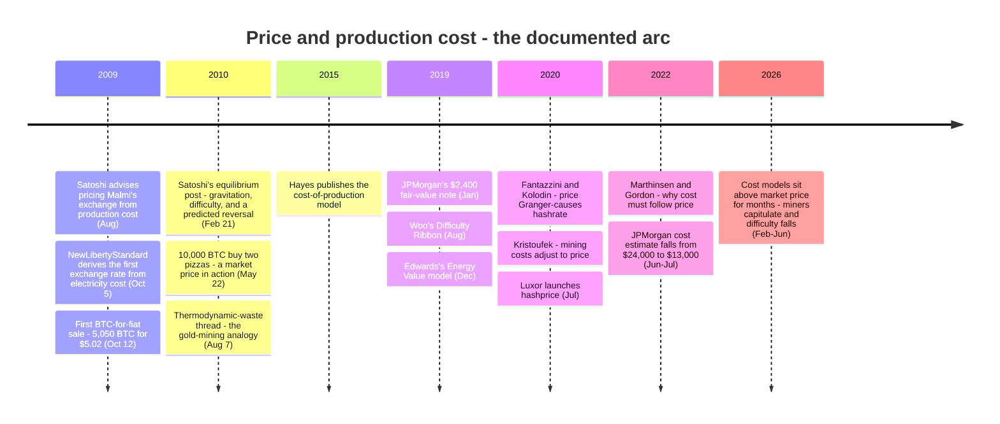

On October 5, 2009, Bitcoin's first published price was not discovered by a market — it was [calculated from an electricity bill](/BitcoinArchive/entries/aftermath/2009-10-05-newlibertystandard-first-exchange-rate/). Sixteen years later, mining cost and market price still track each other closely enough that "production cost" remains a standing fixture of Bitcoin market commentary. The natural question is which side leads: does the cost of mining anchor the price, or does the price command the cost? The archive's record holds both the original practice — a price derived from cost, in 2009 — and the original theory: Satoshi's February 2010 statement of the equilibrium, including a prediction that the direction would reverse. This entry sets out that record and the later literature that tested it.

## 1. 2009: pricing without a market

When [Martti Malmi proposed the first exchange service in July 2009](/BitcoinArchive/entries/aftermath/2009-07-22-bitcoin-exchange-proposal/), Satoshi's feedback was to base the pricing on production cost rather than pure auction mechanics. The project site's FAQ, [quoted back at Satoshi on BitcoinTalk the following February](/BitcoinArchive/entries/forum/bitcointalk/topic-57/2010-02-17-the-current-bitcoin-economic-model-doesnt-work/), stated the same relationship — with the causality already pointing from value to cost:

<!-- speaker: Satoshi Nakamoto -->
<!-- audit:quote-skip -->
> "When Bitcoins start having real exchange value, the competition for coin creation will drive the price of electricity needed for generating a coin close to the value of the coin."

[NewLibertyStandard's October 5, 2009 exchange rate](/BitcoinArchive/entries/aftermath/2009-10-05-newlibertystandard-first-exchange-rate/) applied the same principle independently: $1 = 1,309.03 BTC, a dollar divided through the electricity budget of a mining computer. A week later the estimate met its first market test — [Malmi sold him 5,050 BTC for $5.02](/BitcoinArchive/entries/aftermath/2009-10-12-martti-malmi-first-btc-sale/), about $0.00099 per coin, roughly 30% above the cost-formula figure of $0.000764. For a price with no order book behind it, the estimate had landed in the right range.

None of this was new with Bitcoin. Classical economics had treated cost of production as the anchor of value since Adam Smith's *The Wealth of Nations* (1776): the "natural price" — the sum of the costs of bringing a good to market — is the central price toward which market prices are "continually gravitating." Where no market price exists yet, the natural price is the only number available. Bitcoin in 2009 was the textbook case.

## 2. February 2010: Satoshi states the equilibrium — and predicts its reversal

In February 2010, the poster Suggester opened [BitcoinTalk topic 57, "The current Bitcoin economic model doesn't work"](/BitcoinArchive/entries/forum/bitcointalk/topic-57/2010-02-17-the-current-bitcoin-economic-model-doesnt-work/), quoting the FAQ line above and warning that a currency whose generation cost doubles on schedule would be hoarded, not spent. Among the replies, [the pseudonymous xc](/BitcoinArchive/entries/forum/bitcointalk/topic-57/2010-02-20-xc-msg412/) reframed the direction of the relationship:

<!-- speaker: xc -->
<!-- quote: q1 -->
> The number of nodes and associated computational cpu power will be in flux, and that competitive flux will allow for costs to approximate value (not the other way around.)  Value being set by the markets and the demand for use of bitcoin as a trade intermediary (a money).

[Satoshi's reply the next day](/BitcoinArchive/entries/forum/bitcointalk/topic-57/2010-02-21-re-current-bitcoin-economic-model-is-unsustainable/) opened with "Excellent analysis, xc" and stated the full equilibrium:

<!-- speaker: Satoshi Nakamoto -->
<!-- quote: q2 -->
> In the absence of a market to establish the price, NewLibertyStandard's estimate based on production cost is a good guess and a helpful service (thanks).  The price of any commodity tends to gravitate toward the production cost.  If the price is below cost, then production slows down.  If the price is above cost, profit can be made by generating and selling more.  At the same time, the increased production would increase the difficulty, pushing the cost of generating towards the price.
>
> In later years, when new coin generation is a small percentage of the existing supply, market price will dictate the cost of production more than the other way around.

Three claims are packed into those two paragraphs. First, the gravitation itself: Satoshi's "tends to gravitate toward the production cost" is Smith's own verb, 234 years on. Second, the mechanism that makes the gravitation work in Bitcoin — not a supply response, but the difficulty adjustment "pushing the cost of generating towards the price": the cost moves toward the price, not only the reverse. Third, an explicit prediction: once new coin generation became small relative to the existing supply, market price would dictate the cost of production, and not the other way around.

NewLibertyStandard himself [replied in the same thread](/BitcoinArchive/entries/forum/bitcointalk/topic-57/2010-02-21-newlibertystandard-msg418/) that his cost-derived rate would not keep rising forever: generation would grow only while it remained encouraging, and would sometimes decline as discouraged users switched off — miner entry and exit, described by the man maintaining the price list.

## 3. The valve that gold has and Bitcoin lacks

For an ordinary commodity, "price above cost" triggers two corrections at once: existing producers expand output and new producers enter, so supply rises and the price itself is pushed back down. Half of the correction happens on the price side.

Bitcoin removes that half entirely. The issuance schedule is a consensus rule, and the difficulty retargets every 2,016 blocks so that more hashpower produces the same number of coins. Miner entry cannot increase the supply of new coins, and miner exit cannot decrease it. What entry and exit move is the difficulty — and therefore everyone's cost per coin.

| Adjustment channel | Gold (classical commodity) | Bitcoin |
|---|---|---|
| Price rises above cost | Mines expand and new mines open — supply rises, price is pushed back down | Hashrate rises — issuance unchanged |
| What absorbs the imbalance | Partly the price (more supply), partly the cost (harder deposits) | The cost alone (difficulty rises) |
| Price falls below cost | High-cost mines close, supply tightens, price is supported | Hashrate falls — issuance unchanged, difficulty falls, cost falls |
| Long-run resting point | Price ≈ marginal cost, reached from both sides | Cost ≈ price, reached from the cost side only |

This is the structural reading later formalised in Marthinsen and Gordon's "The Price and Cost of Bitcoin" (2022): because the protocol fixes the flow of new coins regardless of hashrate, miner entry and exit cannot alter the supply reaching the market and therefore cannot drive the price; what excess mining profit attracts is hashrate, which raises difficulty and marginal cost until the excess is gone. The halving schedule makes the same point as a scheduled experiment: every 210,000 blocks, the per-coin cost of the same hashpower doubles overnight, and the market price does not double on cue — the adjustment lands on the cost side, through miner margins and the subsequent difficulty moves. The per-halving record is tabulated in the [monetary design entry](/BitcoinArchive/entries/design/2009-01-03-bitcoin-monetary-design/).

## 4. August 2010: the energy objection

[The thread "Bitcoin minting is thermodynamically perverse"](/BitcoinArchive/entries/forum/bitcointalk/topic-721/2010-08-05-bitcoin-minting-is-thermodynamically-perverse/) attacked the same relationship from the energy side: if coins are valued near the electricity burned to mint them, is the system not wasting real resources by design? The opening post already contained both period positions — that generators' willingness to spend electricity gives coins at least that much value to them, and that cost of production is simply a different thing from market value. [Satoshi's reply](/BitcoinArchive/entries/forum/bitcointalk/topic-721/2010-08-07-re-bitcoin-minting-is-thermodynamically-perverse/) answered with the commodity precedent:

<!-- speaker: Satoshi Nakamoto -->
<!-- quote: q3 -->
> It's the same situation as gold and gold mining.  The marginal cost of gold mining tends to stay near the price of gold.  Gold mining is a waste, but that waste is far less than the utility of having gold available as a medium of exchange.
>
> I think the case will be the same for Bitcoin.  The utility of the exchanges made possible by Bitcoin will far exceed the cost of electricity used.  Therefore, *not* having Bitcoin would be the net waste.

Note the direction inside the analogy: the marginal cost of gold mining stays near the price of gold — cost tracking price, again.

Two days later, [in the same thread](/BitcoinArchive/entries/forum/bitcointalk/topic-721/2010-08-09-re-bitcoin-minting-is-thermodynamically-perverse/), Satoshi added the operational corollary: generation should end up wherever it is cheapest, perhaps in cold climates with electric heat, where the waste heat is not wasted at all. The miner is a price-taker hunting the lowest cost — the cost side doing the adjusting.

## 5. The modern literature: cost models and their critics

From 2015 onward, the 2010 forum equilibrium became an academic and market-desk research programme. One line took cost seriously as a driver or floor of price; the other measured the causality and found it running the opposite way.

| Work | Year | Direction argued | Core claim |
|---|---|---|---|
| Hayes — cost-of-production model (working paper, then Telematics and Informatics, then Applied Economics Letters) | 2015 / 2017 / 2019 | cost → price | Marginal electricity cost per coin models a fundamental value; the 2017 bubble resolved back toward the model value rather than to zero |
| JPMorgan strategy notes (Panigirtzoglou team) | 2019 / 2022 | cost as floor | Fair value of $2,400 derived from mining cost (January 2019); production cost "perceived by some market participants as the lower bound" — while a falling estimate ($24,000 → $13,000, mid-2022) weakens the floor itself |
| Edwards — Bitcoin Energy-Value Equivalence | 2019 | energy → value | Fair value modelled from energy input, supply growth rate, and a dollar-per-joule constant; price mean-reverts to it |
| Kristoufek — Energy Economics | 2020 | price → cost | Price and mining cost are cointegrated; mining costs adjust to price over several months up to a year, not (or only weakly) the reverse |
| Fantazzini and Kolodin — Journal of Risk and Financial Management | 2020 | price → cost | Granger causality is always uni-directional, from price to hashrate, at lags of one to six weeks |
| Marthinsen and Gordon — The Quarterly Review of Economics and Finance | 2022 | price → cost | Fixed issuance means entry and exit cannot move supply; excess profit attracts hashrate until cost catches price |

Alongside the models came instrumentation. Luxor's hashprice index (2020) made miner revenue per unit of hashpower a quoted market number. Willy Woo's Difficulty Ribbon (2019) read miner capitulation from compressing moving averages of difficulty. CoinShares' quarterly mining reports measure realised cost per coin from listed miners' financial statements — for late 2025, a weighted-average all-in cost near $80,000 per coin, with per-company figures running from cash costs around $71,000 to all-in costs above $150,000. The spread is itself a finding: "the" production cost is a distribution, not a number.

The floor claim then met a live test. From early 2026, widely followed difficulty-regression estimates put average all-in production cost near $87,000 while the market price sat near $70,000, and the price stayed below the modelled cost for months. What gave way was the cost side: miners sold reserves to cover operations, capitulated, and difficulty fell by the most since 2021 — the adjustment described by Satoshi's 2010 post and measured by the 2020–2022 studies, running in real time.

*[Editor: the 2026 readings above are a snapshot of a moving market. They test the mechanism; the argument does not depend on the specific dollar levels.]*

## 6. What the record supports

The question "does production cost drive the price, or does the price drive the cost?" has a documented answer in two halves.

- **Co-movement is real.** From the first exchange rate to current desk research, cost and price have tracked each other closely enough that each has repeatedly been used to estimate the other.
- **Before a market existed, cost led.** In 2009 the cost formula was the only anchor available; Satoshi endorsed it as exactly that, and the first market trade — [and soon a famous pizza](/BitcoinArchive/entries/aftermath/2010-05-22-bitcoin-pizza-day/) — priced within the range the formula suggested.
- **Once a market existed, price led.** Fixed issuance removes the supply response that lets cost prop up price in ordinary commodities. What remains is hashrate entering and exiting in pursuit of price, dragging difficulty and cost behind it — with measured lags of weeks for hashrate and months for costs. The 2022 and 2026 episodes, in which price fell far below modelled cost and cost then followed it down, are the mechanism observed, not refuted.
- **Satoshi said both halves in one post.** The February 2010 reply endorsed the cost anchor for a marketless economy and predicted the reversal — market price dictating the cost of production — that the later empirical literature confirmed.

## 7. Limits of this entry

- "Production cost" is not one number. Electricity prices, hardware vintage, and accounting choices (cash cost vs all-in cost) spread realised costs across a wide band; any single per-coin figure is a weighted model output.
- The models cited in §5 disagree with one another, and each has fitted parameters. The archive records what each claims, not which is correct.
- Later work treats price and hashrate as an endogenous system in which the causality verdict depends on horizon and regime; the asymmetry documented here is the dominant direction, not the only one.
- Nothing in this entry is valuation guidance. It is the documentary record of an issue the archive's primary sources happen to illuminate unusually well: which side leads, cost or price.

The event this analysis reads is recorded in [the first-exchange-rate entry](/BitcoinArchive/entries/aftermath/2009-10-05-newlibertystandard-first-exchange-rate/), and the primary posts are held in [topic 57](/BitcoinArchive/entries/forum/bitcointalk/topic-57/2010-02-21-re-current-bitcoin-economic-model-is-unsustainable/) and [the thermodynamics thread](/BitcoinArchive/entries/forum/bitcointalk/topic-721/2010-08-07-re-bitcoin-minting-is-thermodynamically-perverse/); [the Malmi exchange advice](/BitcoinArchive/entries/aftermath/2009-07-22-bitcoin-exchange-proposal/) and [the first sale](/BitcoinArchive/entries/aftermath/2009-10-12-martti-malmi-first-btc-sale/) supply the 2009 chain.

The consensus-rule side — the halving schedule, the difficulty adjustment, and the fee-market future of miner revenue — is covered by the [monetary design entry](/BitcoinArchive/entries/design/2009-01-03-bitcoin-monetary-design/), the [fixed-supply-vs-adjustable-money analysis](/BitcoinArchive/entries/analysis/2008-10-31-fixed-supply-vs-adjustable-money/), and the [fee-only-future analysis](/BitcoinArchive/entries/analysis/2026-05-18-mining-reward-exhaustion-fee-only-future/), which together explain why the valve of §3 stays shut and what replaces the subsidy when it ends.

<!-- entry-closing -->
Alfred Marshall's *Principles of Economics* (1890) gave the classical debate its standard resolution: asking whether utility or cost of production governs value is like disputing "whether it is the upper or the under blade of a pair of scissors that cuts a piece of paper" — demand rules the short run, cost the long run. Bitcoin is the unusual case in which one blade is bolted in place. With supply fixed by consensus rule, the cost blade cannot cut the price even in the long run; it can only be sharpened or dulled until it matches where the demand blade already cut.
