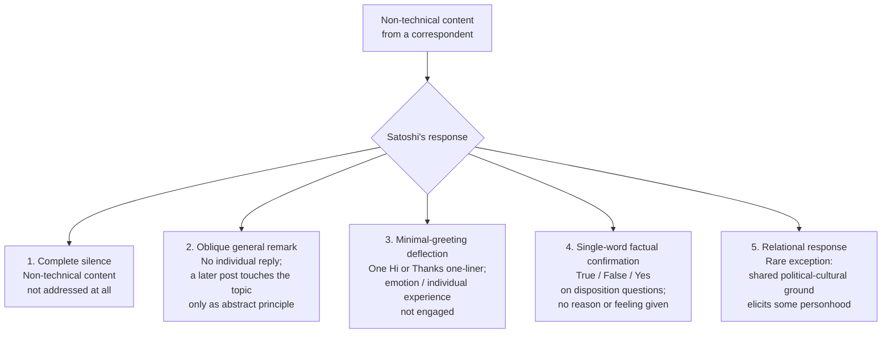

On December 27, 2010, Mike Hearn opened an email to Satoshi Nakamoto with:

<!-- audit:quote-skip -->
> "Happy Christmas Satoshi, assuming you celebrate it wherever you are in the world :-)"

Two days later, Satoshi's reply began:

<!-- speaker: Satoshi Nakamoto -->
<!-- audit:quote-skip -->
> "The simplified payment verification in the paper imagined you would receive transactions directly, as with sending to IP address which nobody uses, or a node would index all transactions by public key..."

No "Happy Christmas." No "thanks." No "you too." The reply opened with SPV client-mode design, walked through eight paragraphs of technical detail, and ended without ever circling back to the season's greeting. This is not an isolated incident. Across roughly two and a half years of recorded correspondence (April 2009 to April 2011), Satoshi's responses to non-technical content from his correspondents follow a small number of identifiable patterns — and from one of them in particular almost never deviate.

The resulting communication discipline reads as a layer of Satoshi's anonymity architecture distinct from the technical layer (Tor, anonymising email, metadata stripping) treated in [Satoshi's anonymity architecture](/BitcoinArchive/entries/analysis/2008-10-31-satoshi-anonymity-architecture/). The technical layer keeps the *channel* opaque. This layer keeps the *content* opaque.

## 1. Catalogue of observed cases

The table below catalogues the cases this Archive has primary-source-confirmed. It is not exhaustive — the full Mike Hearn corpus is 33 messages, the Martti Malmi corpus is 257, and the BitcoinTalk forum and `cryptography@metzdowd.com` archive add hundreds more contexts. The selection here is the set of clearly non-technical moves the senders made.

| Date | Sender → recipient | Non-technical content from the sender | Satoshi's reply opener | Reply's handling of the non-technical content | Pattern |
|---|---|---|---|---|---|
| 2010-12-27 → 12-29 | [Mike Hearn → Satoshi](/BitcoinArchive/entries/correspondence/mike-hearn/more-questions/2010-12-27-hearn-to-satoshi-more-questions/) | "Happy Christmas Satoshi, assuming you celebrate it wherever you are in the world :-)" | "The simplified payment verification in the paper imagined you would receive transactions directly..." | **Not addressed at all** | 1. Complete silence |
| 2009-01-10 → 01-16 | [Hal Finney → cryptography ML](/BitcoinArchive/entries/emails/cryptography/bitcoin-v0-1-released/2009-01-10-re-bitcoin-v0-1-released-finney/) | "As an amusing thought experiment, imagine Bitcoin is successful... each coin a value of about $10 million... 100 million to 1 odds..." | [015014 is addressed to Dustin Trammell, not Finney](/BitcoinArchive/entries/aftermath/2009-01-16-satoshi-to-trammell-electronic-currency/) | **No individual reply.** Satoshi's later message in the same thread reaches the topic only obliquely: "It might make sense just to get some in case it catches on. If enough people think the same way, that becomes a self fulfilling prophecy." Finney's $10M figure and 100-million-to-one odds are never engaged | 2. Oblique general remark |
| 2009-04-12 → 04-12 | [Mike Hearn → Satoshi](/BitcoinArchive/entries/correspondence/mike-hearn/questions/2009-04-12-hearn-to-satoshi-questions/) | "So many questions :) But it's rare that I encounter truly revolutionary ideas. The last time I was this excited about a new monetary scheme was when I discovered Ripple." | [Satoshi: "Hi Mike, I'm glad to answer any questions you have."](/BitcoinArchive/entries/correspondence/mike-hearn/questions/2009-04-12-satoshi-to-hearn-scalability/) | **Minimal formal greeting only.** "revolutionary," "excited," and Ripple-discovery moment are not engaged emotionally; Ripple is engaged as a technical comparator at the end | 3. Minimal-greeting deflection |
| 2011-03-07 → 03-09 | [Mike Hearn → Satoshi](/BitcoinArchive/entries/correspondence/mike-hearn/bitcoinj/2011-03-07-hearn-to-satoshi-bitcoinj-release/) | "I hope you are doing well... Hope you can find the time/energy to rejoin us soon!... it's exciting times for the network!" + BitcoinJ open-source announcement | [Satoshi: "That's great news! ... I'm happy to answer any questions."](/BitcoinArchive/entries/correspondence/mike-hearn/bitcoinj/2011-03-09-satoshi-to-hearn-contracts/) | **Single acknowledgement of the technical-release news**; "doing well," "rejoin us," "exciting times" are all bypassed; remainder is dense technical discussion of merkle branches, sequence numbers, nLockTime, contracts | 3. Minimal-greeting deflection |
| 2011-01-06 → 01-06 | [Gavin Andresen → Satoshi](/BitcoinArchive/entries/correspondence/gavin-andresen/2011-01-06-writing-about-bitcoin/) | "Satoshi, I assume you don't want to deal with press/PR/interviews?" — a personal-disposition question, not a technical one | Satoshi reply (Malmi archive #254): **"True"** | **One word.** No reason given, no concern aired, no preference explained. Confirmation of the disposition is recorded; the disposition itself is not unpacked | 4. Single-word factual confirmation |
| 2009-05-02 → 05-02 | [Martti Malmi → Satoshi](/BitcoinArchive/entries/correspondence/martti-malmi/2009-05-02-malmi-initial-contact/) | First contact via SourceForge: "I'm Trickstern from the anti-state.com forum, and I would like to help with Bitcoin..." (introduces himself, no technical question) | [Satoshi: "Thanks for starting that topic on ASC, your understanding of bitcoin is spot on. Some of their responses were rather Neanderthal..."](/BitcoinArchive/entries/correspondence/martti-malmi/2009-05-02-bitcoin-001/) | **Exception.** Satoshi engages socially: praises Malmi's understanding, characterises ASC respondents as "Neanderthal," shares a "flammable but no spark" metaphor, indicates his own view on what to say publicly | 5. Relational response (rare exception) |
| 2009-12-22 → 12-25 | [Martti Malmi ↔ Satoshi (holiday-period exchanges)](/BitcoinArchive/entries/correspondence/martti-malmi/2009-12-25-bitcoin-stuff-138/) | Several exchanges across Dec 22–25 about VPS memory, RPC, exchange-service setup — both sides stay technical; neither party introduces a holiday greeting | Satoshi 12-25 reply: "You're right, I was looking at a test run with 250,000 blocks... duh." (technical correction + light self-deprecation) | **Both sides keep the channel technical.** The absence of a greeting here is symmetric: Malmi did not open one either | 1. Complete silence (mutual) |
| 2010-12-30 → (Satoshi reply not preserved as separate entry) | [Mike Hearn → Satoshi](/BitcoinArchive/entries/correspondence/mike-hearn/more-questions/2010-12-30-hearn-to-satoshi-spv-progress/) | "By the way, your code is easy to read and has been an invaluable reference. So thanks for that." | Acknowledged only insofar as the technical thread continues; the code-praise compliment receives no targeted return | **Praise not addressed.** Pattern continues into 2011 thread | 1. Complete silence |

## 2. Five patterns

The patterns differ in their surface mechanics but share a structural property: **the specific person, the specific feeling, the specific prediction is never engaged**. Pattern 1 refuses the chance entirely. Pattern 2 launders the topic into a sufficiently general statement that no individual is being responded to. Pattern 3 returns the social ritual just enough to keep the exchange polite. Pattern 4 confirms an external fact about Satoshi (preference, disposition) without supplying the why. Pattern 5 — the exception — is restricted to a domain (shared anti-fiat-money cypherpunk ground) where personhood can be expressed without disclosing personal information.

## 3. Why Hearn's Christmas greeting reads as a soft probe

Read at face value, Mike Hearn's December 27 greeting is a friendly seasonal note. Read against Satoshi's known information posture, the same sentence is also — without Hearn necessarily intending it — a **soft probe** of two identification-relevant facts:

| Probe surface | What an answer would disclose |
|---|---|
| "wherever you are in the world" | Geographic location (continent, country, region) |
| "assuming you celebrate it" | Cultural / religious frame (Christian-tradition country, secular country, non-Christian-majority country) |
| `:-)` | The smiley signals that the sender knows the question is light and that no answer is required — a polite acknowledgement that personal information is being touched |

Any direct reply forks information:

| Hypothetical Satoshi reply | What it would leak |
|---|---|
| "Merry Christmas, you too" | Christian-tradition / Western cultural frame likely |
| "I don't celebrate it, but happy holidays" | Non-Christian-tradition / different cultural frame likely |
| "I'm not in your timezone, but thanks anyway" | Timezone / region |
| "I celebrate it differently here" | Distinct geographic / cultural marker |
| Any acknowledgement at all | At minimum, signals that Satoshi *received and processed* a social opening — establishing a baseline against which future openings can be probed |

The only zero-information reply is no reply to that line at all. Satoshi takes it. This is a degenerate case of a classical information-theory result: when every possible output of a channel carries information about the sender, the only way to send nothing about the sender is to close that channel. Satoshi's "communication-layer" anonymity discipline keeps the personal-information channel closed on demand.

This reading does not require Hearn to have intended a probe — the smiley suggests he likely did not. It only requires that an answer would have leaked, and that Satoshi behaved as if he knew it would.

## 4. How this layer relates to the technical anonymity layer

| Anonymity layer | Tools | Threat addressed |
|---|---|---|
| [Technical layer](/BitcoinArchive/entries/analysis/2008-10-31-satoshi-anonymity-architecture/) | Tor, vistomail / anonymousspeech.com webmail, PGP, header / metadata stripping, no IP-traceable identifiers | Network-level deanonymization (linking an IP, mail server, or header to a real person) |
| **Communication layer (this entry)** | Subject-matter restriction (technical-only), minimal-greeting deflection, single-word factual confirmation, refusal to discuss personal preference / location / culture / opinion on non-technical topics | Content-level deanonymization (linking *what is said* to a real person — culture, geography, age, political stance, emotional register) |

The two layers are complementary: the technical layer can be broken by adversaries with infrastructure access; the communication layer cannot be broken by infrastructure at all, because nothing is in the channel to expose. Even an attacker who fully decrypted every Satoshi message would find primarily technical correspondence with the personal-information channels held closed.

## 5. The Malmi exception — and what it suggests

The May 2, 2009 first-contact exchange with Martti Malmi is the cleanest exception this Archive has surfaced. Satoshi tells Malmi that his understanding of Bitcoin is "spot on," labels the ASC forum's anti-fiat-money skeptics "Neanderthal," and shares a "flammable but no spark" metaphor for monetary adoption — engaging on **political-cultural** ground rather than personal-information ground.

The distinction matters. The exception does *not* break the discipline; it operates within a strict additional constraint:

| What Satoshi engages in the Malmi exception | What is still withheld |
|---|---|
| Political-cultural stance (anti-fiat-money sympathy, view of monetary skeptics) | Location, age, profession, schedule, family, language background |
| Strategic judgement ("I'd probably better refrain from mentioning that in public anymore until we're closer to ready to start") | Personal preference about specific issues outside Bitcoin |
| Self-characterisation ("My writing is not that great, I'm a much better coder") | Identifying details of either the coding or the writing capability |

The Malmi exception is read most parsimoniously as **selective engagement on shared ideological ground that does not itself disclose identification-relevant information**. Satoshi could indicate sympathy with anti-state-money politics without disclosing any of: country, age, language, profession, family situation. The exception is structurally consistent with the discipline rather than against it.

## 6. Why the recipients did not protest

A possible objection: if Satoshi was systematically refusing to engage with personal content, one would expect at least some correspondent to push back ("not even a Merry Christmas? :-)"). The Archive's recorded correspondence does not contain any such pushback.

Reasons consistent with the record:

- **Technical reciprocation was generous.** Satoshi's technical replies are unusually long, careful, and helpful — the December 29 SPV explanation Hearn received in lieu of a greeting is eight paragraphs of design discussion. Receiving substantive technical help is, for the kind of correspondent Satoshi attracted, more valuable than a Christmas greeting.
- **The pattern is consistent, not erratic.** A pattern that holds 100% of the time reads as a known constraint rather than as a slight. Once a correspondent had received two or three responses, the discipline would have been visible, and probing it further would have read as poor form.
- **The recipients' own writing style adjusts over time.** Hearn's later 2011 messages still contain personal asides ("I hope you are doing well," "Hope you can find the time/energy to rejoin us soon!"), but Hearn does not phrase them as demands for response; they are offered as polite framing that the recipient is free to ignore. Malmi's 2009-12 exchanges contain no greeting at all on Christmas day — the most parsimonious reading is that he had already internalised the channel norm.

## 7. Limits and counter-readings

- **The pattern is read from the discipline's *consistency*, not from any single message.** Any one of the cases above could be explained as Satoshi being busy, terse, or focused. The reading rests on dozens of opportunities to break the discipline being declined.
- **"Studied" is an inferred characterisation, not a documented one.** Satoshi never describes the discipline. Whether it was conscious training, ingrained habit, or operational policy is not directly recoverable. The reading is restricted to the observed behaviour and its consistency.
- **The exception class may be larger than the Malmi case alone.** A full sweep of the 257-message Malmi corpus and the BitcoinTalk forum may surface additional relational moves. This entry's catalogue is anchored on representative cases rather than exhaustive enumeration; further examples should be added to the matrix in §1 as they are surfaced.
- **No identity claim follows.** The discipline characterises *how* Satoshi communicated, not who he was. The same discipline is consistent with intelligence-trained operatives, lifelong introverts, security-conscious researchers, and anyone with a long-standing personal practice of public-private separation. It selects against identities that would be expected to leak emotion or geography casually; it does not select for any specific identity.

## 8. Summary

- Across the ~2.5-year recorded correspondence (April 2009 to April 2011), Satoshi's replies to non-technical content from his correspondents fall into five identifiable patterns, four of which keep the personal-information channel closed.
- The December 27 / December 29, 2010 Hearn–Satoshi exchange (the "Happy Christmas Satoshi" → SPV-only reply) is the framing case: a friendly seasonal opening met with eight paragraphs of design discussion and no acknowledgement of the greeting.
- The 2009-01-10 Hal Finney "$10 million per coin / 100-million-to-one odds" message receives no individual reply; Satoshi's later post in the same thread reaches the topic only via the abstract "self fulfilling prophecy" remark, never engaging Finney's specific prediction.
- The 2009-05-02 Malmi first-contact exchange is the cleanest exception, but it engages **political-cultural** ground rather than personal-information ground — preserving the discipline along the dimensions that would actually deanonymise.
- The discipline is best read as a **communication-layer anonymity architecture**, complementary to the [technical anonymity layer](/BitcoinArchive/entries/analysis/2008-10-31-satoshi-anonymity-architecture/) (Tor, anonymising mail, header stripping). Where the technical layer keeps the *channel* opaque, this layer keeps the *content* opaque.
- The pattern's consistency over hundreds of opportunities is the load-bearing observation; no single message would carry the reading.

This non-technical-silence analysis is treated as a complementary reading by [the cypherpunk-independent-arrival analysis](/BitcoinArchive/entries/analysis/2008-10-31-cypherpunk-independent-arrival/) — the independent-arrival entry covers the technical-axis side of Satoshi's documented practice, and references this entry as the behavioural-axis counterpart that records the same pattern on non-technical openings.

*[Editor: this entry catalogues representative cases rather than enumerating every recorded exchange. A complete sweep of the Malmi 257-message corpus and the BitcoinTalk record is left as a future expansion; any additional exception cases that surface should be added to the §1 matrix and assessed against the five-pattern classification in §2.]*
