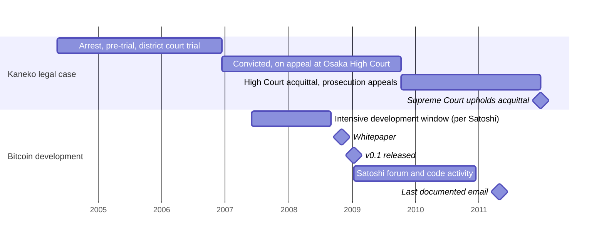

The Kaneko-as-Satoshi hypothesis is the only major Satoshi-identity claim that exists almost entirely in Japanese-language discourse — extensive in 2ch / 5ch forums and Japanese tech press, essentially absent from English-language Bitcoin coverage. Its subject, Isamu Kaneko (1970–2013), was a University of Tokyo research associate who released the Winny peer-to-peer file-sharing system on 2channel in May 2002, spent seven and a half years (2004–2011) as the defendant in a Japanese criminal trial that became a landmark on the criminal liability of tool-developers, and died of a myocardial infarction in July 2013, two years after his Supreme Court acquittal. This entry lays out the [Kaneko = Satoshi](/BitcoinArchive/participants/isamu-kaneko/) hypothesis, the supporting arguments as their Japanese-language advocates make them, and the counter-evidence at the same level of detail. For comparison with other named candidates see the [Satoshi-identity hypotheses overview](/BitcoinArchive/entries/analysis/2008-10-31-satoshi-identity-hypotheses-overview/).

## 1. Who Kaneko was

For readers outside Japan, brief background (per [Kaneko's Wikipedia entry](https://en.wikipedia.org/wiki/Isamu_Kaneko) and the [Winny Wikipedia entry](https://en.wikipedia.org/wiki/Winny); for full biographical and trial-timeline coverage see the [Isamu Kaneko biography](/BitcoinArchive/participants/isamu-kaneko/). This hypothesis entry covers the hypothesis only and is not a substitute for the biography):

Isamu Kaneko (金子勇, 1970–2013) was a Japanese researcher and software developer. He served as a research assistant at the University of Tokyo's Graduate School of Information Science and Technology and was the developer of **Winny**, a peer-to-peer file-sharing system released on the 2channel forum in May 2002. His first post on the announcement thread carried sequence number 47, and the community knew him as [**「47 氏」** ("Mr. 47")](/BitcoinArchive/participants/isamu-kaneko/) — he sustained that anonymous handle through the entire Winny development cycle until his real name was disclosed (origin detail in the biography). Winny used a routing scheme designed for plausible deniability of who originated each piece of content, and at peak the network had on the order of millions of users in Japan.

In May 2004, Kaneko was arrested by the Kyoto Prefectural Police on charges of *aiding* copyright infringement — the prosecution's theory was that by writing and distributing Winny he had aided the actions of users who used Winny to share copyrighted material. The Kyoto District Court convicted him in December 2006 with a ¥1.5 million fine; the Osaka High Court reversed and acquitted him in October 2009; the Supreme Court of Japan upheld the acquittal in December 2011. The case is widely cited in Japanese tech-policy discourse as a landmark on the criminal liability of tool-developers.

Kaneko died on July 6, 2013, of myocardial infarction. He was 42.

This entry treats the Winny criminal case as historical fact. The *legal merits* of the case (whether Kaneko intended infringement, whether Winny itself was unlawful, the moral implications of the verdict) are **not used as arguments about the Satoshi identity question** — speculation that uses the criminal case to make a character claim against Kaneko is editorial overreach this entry avoids. However, an *empirical consequence* of the case — Kaneko's high public visibility during 2007–2008 as a convicted defendant on appeal under sustained scrutiny from police, prosecution, his legal team, the Japanese technical press, and the academic community — is a documentary fact that the visibility analysis in §4.1 has to engage with. The editorial line this entry holds: the trial's legal substance is not weaponized; the trial's observable visibility effect is a fact the hypothesis must contend with.

## 2. What the hypothesis claims

The hypothesis is that Kaneko was the person behind the Satoshi Nakamoto pseudonym during the period 2007–2010, withdrew from active project work around the time of the prosecution's appeal to the Supreme Court (2010–2011), and that his death in July 2013 marked the de facto end of the Satoshi-era Bitcoin involvement.

The hypothesis is most active in Japanese-language forums (variants on 2channel / 5channel from roughly 2013 onward) and Japanese-language tech-press discussion. It has not received the same level of English-language coverage as the other named-candidate hypotheses.

## 3. The arguments the hypothesis rests on

### 3.1 The Japanese name

This is the unique argument the hypothesis can make that no other named-candidate hypothesis can: "Satoshi Nakamoto" is a plausible Japanese name, and Kaneko was Japanese. The argument runs that, while a non-Japanese pseudonymizer would have to choose a Japanese name as a deliberate symbolic gesture (the kind of gesture the [techno-orientalist signature analysis](/BitcoinArchive/entries/analysis/2008-10-31-satoshi-name-techno-orientalism/) addresses), a Japanese author would simply *use* a Japanese-form pseudonym without any external symbolism required.

The objection: this argument transforms one of the things-to-be-explained (why a Japanese-form pseudonym?) into evidence rather than into something that still needs to be explained. The pseudonym's form is consistent with a Japanese author, but it is also consistent with multiple other readings (deliberate techno-orientalist gesture, group choice for genre association, etc.). The argument narrows the candidate space substantially, but only if one accepts the prior that the pseudonym indicates real authorial nationality — a prior the public record does not establish.

### 3.2 P2P expertise

Kaneko's documented work on Winny demonstrates substantial capability with peer-to-peer protocol design and adversarial-environment software (Winny was specifically designed to resist takedown). The hypothesis argues this capability is consistent with what Bitcoin v0.1's networking layer demonstrates.

The objection: P2P-protocol capability narrows the candidate set, but the relevant adjacent skills for being Satoshi are *cryptographic* (proof-of-work, ECDSA, transaction-script design, the chained-hash structure). Winny used cryptographic primitives as a means rather than as a research domain; Kaneko was not a cryptographer in the cypherpunk-research sense that the [cypherpunk independent-arrival analysis](/BitcoinArchive/entries/analysis/2008-10-31-cypherpunk-independent-arrival/) treats as Satoshi's evident intellectual lineage.

### 3.3 Bilingual capability

Kaneko was a research assistant at the University of Tokyo and published academic papers in English. This establishes that he could function in technical English. The hypothesis argues this is consistent with Satoshi's English-language posting and code-comment work.

The objection: functional academic English and Satoshi's documented English are different registers. Satoshi's white paper, BitcoinTalk posts, and email correspondence read as the work of a near-native English writer with literary registers (idiom, irony, ease of register-shift) that academic-second-language English does not typically reach. This is not a decisive disqualifier on its own — Satoshi could have been a non-native speaker with unusually strong English, or could have used editing — but it shifts the prior away from a Japanese-domestic-academic profile.

### 3.4 Anti-establishment posture

Kaneko's position in the Winny criminal case — defending the principle that tool-developers are not criminally liable for users' actions — is consistent with a broadly cypherpunk-aligned political stance, which the [cypherpunk independent-arrival analysis](/BitcoinArchive/entries/analysis/2008-10-31-cypherpunk-independent-arrival/) identifies as Satoshi's evident philosophical orientation.

The objection: ideological alignment with cypherpunk principles is widespread among technically capable developers of the period. It narrows nothing without further evidence. This argument is in the same family as the Sassaman cypherpunk-credentials argument and has the same limitation: it places Kaneko inside a population, not at one specific point.

## 4. The counter-evidence

### 4.1 Active criminal-case scrutiny during Bitcoin's development period

The strongest counter-evidence is the timing of Kaneko's legal proceedings against Bitcoin's development and launch period:

| Period | Kaneko status | Bitcoin status |
|---|---|---|
| 2004-05 to 2006-12 | Arrested, pre-trial, district-court trial | (pre-development) |
| 2006-12 to 2009-10 | Convicted, on appeal at Osaka High Court | **Bitcoin development; white paper Oct 2008; v0.1 released Jan 2009** |
| 2009-10 to 2011-12 | Acquitted at High Court, prosecution appealed to Supreme Court | **Satoshi most active forum/code period; departs Dec 2010 / Apr 2011** |

**Kaneko legal case timeline overlaid on Bitcoin development**

The visual overlap is the §4.1 argument made spatial: the Kaneko legal case lane occupies the entire 2004 - 2011 horizontal span, and the Bitcoin development lane sits inside that span. The whitepaper, v0.1 release, and Satoshi's most-active period all land while Kaneko was a convicted defendant on appeal under sustained scrutiny. The hypothesis requires that during this period he secretly developed a system that, if attributed to him, would have constituted a major item of personal news. The probability of this remaining undisclosed across his counsel, his university supervisors, and his social environment is low.

### 4.2 Intellectual-lineage gap

Bitcoin's intellectual genealogy — Hashcash (Adam Back, 1997), b-money (Wei Dai, 1998), Bit Gold (Nick Szabo, 2005), the cryptographic-primitives discussion in the cypherpunks mailing list, and the metzdowd Cryptography List where Satoshi first announced — is documented in the public record. Kaneko has no documented presence in this conversation. Winny's design (2002) drew on a different lineage (Freenet, Gnutella, anonymous-routing literature), and Kaneko's published academic work concerns P2P routing, not digital cash or distributed ledgers.

**Freenet reference angle (primary source).** Kaneko's Winny opening announcement (2002-04-01, 2channel download-software board, post number 47; [full text in the biography](/BitcoinArchive/participants/isamu-kaneko/)) names Freenet as the **starting point of the design**. Satoshi's archive-internal Freenet reference, by contrast, sits in the [2010-05 BitcoinTalk URI-scheme thread](/BitcoinArchive/entries/forum/bitcointalk/topic-55/2010-05-16-re-uri-scheme-for-bitcoin/), where he adopts another participant's Freenet URI example as the model for the `bitcoin:` URI scheme — a single point of contact at the URI-design level, never cited in the whitepaper. That both knew Freenet is unremarkable for any P2P-system designer in this era (= neither support nor counter); the difference in angle — declared starting point (Kaneko) vs URI-design reference (Satoshi) — pins the lineage divergence in primary-source material.

### 4.3 Code and prose register

- **Code language**: Bitcoin v0.1 source contains no Japanese in identifiers, comments, or commit metadata. Winny source contains Japanese identifiers and comments. A Japanese developer could of course write English-only code by choice, but the absence of any cultural-linguistic trace is a data point against same-author identification.
- **Prose register**: Satoshi's English sustains near-native idiomatic fluency and register switching across the mailing-list academic, BitcoinTalk casual, private-correspondence intimate, and release-note technical contexts over 32 months, without showing a single Japanese-substrate trace (awkward word order, non-native article/preposition patterns, English-as-translation-of-Japanese-concept marks). Kaneko's documented English (academic papers) is competent but does not show the same range. This is, again, not a decisive disqualifier on its own — but combined with the absence of any Japanese-lineage trace in the Bitcoin record, it shifts the prior.
- **L1 register primary-source pin (Mr. 47 post)**: Kaneko's most native register is preserved in his Winny opening announcement (2002-04-01, Mr. 47, [thread archive](https://winny.info/2ch/47.html); [full text in the biography](/BitcoinArchive/participants/isamu-kaneko/)). The 2channel-subculture insider vocabulary (`2chネラー`), the sentence-final particles (`わ` / `なー`), and the self-deprecating opening (`暇なんで`, "I'm a bit bored…") for what would become a major P2P system are deep embeddings in L1 Japanese and a specific subculture (the 2channel download-software board). The recurring closing `少しまちなー` ("hang on a bit") across later thread posts shows the register is natural recurrence, not performance. Reconciling the two voices requires Kaneko to sustain L1=Japanese plus near-L1 English with zero register-switching slip for 32 months — theoretically possible, but the Mr. 47 voice pins Kaneko's L1 to deep Japanese at the primary-source level.

### 4.4 Loose timing

Kaneko's death (July 6, 2013) is two years and two months after Satoshi's last documented email (April 26, 2011). The [Sassaman hypothesis](/BitcoinArchive/entries/analysis/2011-07-03-sassaman-satoshi-identity-hypothesis/)'s strongest argument is the three-month interval between Satoshi's last email and Sassaman's death; the equivalent argument for Kaneko depends on a much longer interval, and the intervening period contains his Supreme Court acquittal (December 2011), his return to active commercial software work (joining the Dreamboat / SAMURAI development effort, 2012), and roughly eighteen months of public technical activity. The "withdrawal followed by death" narrative that gives the Sassaman timing argument its rhetorical force does not transfer to Kaneko: the public record shows him *re-engaging* with software work after Satoshi's silence, not withdrawing.

## 5. Within the broader documentary record

The strongest claim the public record supports about Satoshi himself is that he was [structurally outside the visible cypherpunk community during the Bitcoin development period](/BitcoinArchive/entries/analysis/2008-10-31-cypherpunk-independent-arrival/), wrote near-native English, and worked from the Hashcash / b-money / Bit Gold intellectual lineage.

Kaneko fits the "outside the visible cypherpunk community" condition (he was not in those forums) but does not fit the "near-native English" or "Hashcash / b-money / Bit Gold lineage" conditions on the documentary evidence available.

The [techno-orientalist signature analysis](/BitcoinArchive/entries/analysis/2008-10-31-satoshi-name-techno-orientalism/) is independent of any specific identity hypothesis and applies regardless of whether the person behind the pseudonym was Japanese, used a Japanese-form pseudonym deliberately, or some other configuration.

For comparison with other named-candidate Satoshi-identity hypotheses, see the [Satoshi-identity hypotheses overview](/BitcoinArchive/entries/analysis/2008-10-31-satoshi-identity-hypotheses-overview/), which provides a single candidate profile comparison and external-status notes for each candidate.

## 6. Limits of this entry

- This entry does not present new evidence. It compiles publicly available material and frames the case at the same level of detail on both sides.
- This entry sets out the hypothesis fairly and the counter-evidence fairly, leaving the reader to weigh.
- This entry does not name "the most likely Satoshi candidate."
- This entry does not engage with statements made by Kaneko's surviving family. The editorial choice is to keep family commentary out of the hypothesis frame; if those statements eventually become part of the documentary public record on the identity question (rather than personal recollection), that decision should be revisited.
- This entry does not draw any narrative connection between Kaneko's death and the Bitcoin-authorship question. The cause of death (myocardial infarction) is documented, the timing relative to Satoshi's silence is two years, and the entry does not treat the death as material to the hypothesis.

*[Editor: this entry is one of the individual hypothesis entries; the Kaneko hypothesis is unique among the named candidates in being discussed only in Japanese-language coverage and being largely unknown to English-language Bitcoin readers. The framing is deliberately conservative: no death-date narrative, the *legal merits* of the Winny criminal case are not used as arguments about the Satoshi identity question (the case is treated as historical fact about Kaneko's 2007–2008 public visibility, which §4.1 engages with as documentary evidence — that is a different use than weaponizing the trial against Kaneko's character), and statements from surviving family are deliberately left outside the frame. The entry does not draw an editorial conclusion about whether the hypothesis is more likely true or false. Updates should preserve those constraints unless the public record changes materially.]*
