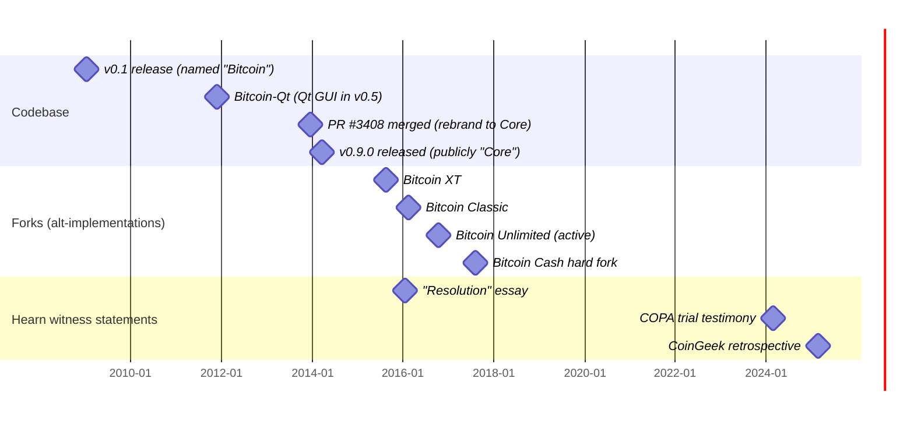

This entry assembles a documentary record around one event — the December 16, 2013 merge of [pull request #3408](https://github.com/bitcoin/bitcoin/pull/3408) renaming Bitcoin-Qt to "Bitcoin Core," released publicly in version 0.9.0 on March 19, 2014 — and reads it together with three later witnesses ([Hearn 2016](/BitcoinArchive/entries/aftermath/2016-01-14-mike-hearn-resolution-bitcoin-experiment/), [Hearn 2024 COPA](/BitcoinArchive/entries/aftermath/2024-02-22-mike-hearn-copa-trial-testimony/), [Hearn 2025 CoinGeek](/BitcoinArchive/entries/aftermath/2025-02-21-mike-hearn-coingeek-retrospective/)) to ask whether the rename, presented at the time as disambiguation, became something more consequential.

Under the reading offered here, the answer is yes — but the claim is narrower than it may sound. The lexical claim is that the chosen name "Bitcoin Core" does not behave as a synonym for "reference client": it carries a centripetal weight that "Bitcoin-Qt" did not. Whether the rename caused later effects, or merely named a structure that already existed, is a separate and harder question (§6).

## 1. The rebrand: documentary record

### 1.1 Names before December 2013

From v0.1 (January 9, 2009) through 2013, the official software was referred to in three overlapping ways:

| Term | Use |
|---|---|
| "Bitcoin" | Used by Satoshi in his announcements, including [the v0.1 release post on the cryptography mailing list](/BitcoinArchive/entries/emails/cryptography/bitcoin-v0-1-released/2009-01-08-bitcoin-v0-1-released/) and in [Hal Finney's "Running bitcoin" tweet](/BitcoinArchive/entries/aftermath/2009-01-11-hal-finney-running-bitcoin-tweet/) of January 11, 2009 |
| "bitcoind" | The headless daemon command name; carried forward from Satoshi's repository |
| "bitcoin-qt" | Added when the Qt GUI was integrated; in use as the executable name through 2013 |

The phrase "reference implementation" appears in some contemporary writeups but was not adopted in the software's own branding. Mike Hearn's [January 2016 departure essay](/BitcoinArchive/entries/aftermath/2016-01-14-mike-hearn-resolution-bitcoin-experiment/) refers to "the program we now call Bitcoin Core" — phrasing that itself acknowledges the name was newer than the software it described.

### 1.2 PR #3408 (merged December 16, 2013)

[Pull request #3408](https://github.com/bitcoin/bitcoin/pull/3408) was opened by [Wladimir van der Laan](/BitcoinArchive/participants/wladimir-van-der-laan/) (handle: laanwj) and merged December 16, 2013. The stated motivation in the PR and in the subsequent 0.9.0 release notes is identical:

> "To reduce confusion between Bitcoin-the-network and Bitcoin-the-software we have renamed the reference client to Bitcoin Core."
>
> — bitcoin.org, [Bitcoin Core 0.9.0 release notes](https://bitcoin.org/en/release/v0.9.0), March 19, 2014

The PR limited its scope to user-visible strings (program messages, documentation); the executable filenames `bitcoind` and `bitcoin-qt` were not changed in the merge.

### 1.3 Internal disagreement at the rename

The PR thread records a substantive objection from [Peter Todd](/BitcoinArchive/participants/peter-todd/), summarized in the [PR #3408 discussion](https://github.com/bitcoin/bitcoin/pull/3408): "core" should refer specifically to consensus-critical code, not to the entire codebase. Wladimir's reply pointed to a prior discussion (issue #3203) and noted that no name would achieve universal agreement.

Peter Todd's objection deserves attention because his proposed reading of "core" — as the minimal, irreducible consensus rules — is exactly the distinction that the broader name "Bitcoin Core" later failed to maintain. After 2014, "Bitcoin Core" came to denote both (a) the consensus-critical code and (b) the surrounding software project, in a single label that did not separate the two.

### 1.4 Version 0.9.0 (March 19, 2014)

Version 0.9.0 was the first release distributed under the new name. The release notes presented the rename as housekeeping — disambiguation between the network and the software. The contemporaneous record contains no statement, in either the PR thread or the release notes, framing the rebrand as a positioning decision; by the documented intent it was descriptive.

**Bitcoin Core rebrand timeline**

## 2. The semantic shift the name introduced

This section is the interpretive core. The factual claims of §1 stand on the cited record. What follows is an editorial reading; it is offered as a reading and is open to disagreement.

A name "Bitcoin-Qt" or "bitcoind" carries no claim about authority. It identifies an implementation. The name "Bitcoin Core" introduces three semantic vectors that the prior names did not:

1. **"Core" implies a center against which other things are peripheral.** Once one project is "Core," the lexical space for naming alternatives without sounding peripheral is narrow: "fork," "alternative," "minority client." The implicit gradient is built into the term.
2. **"Core" suggests irreducible necessity.** The word's etymology (Latin *cor*, "heart") and its English idiom ("core curriculum," "core values") freight the term with notions of essentiality. A "core" implementation is structurally harder to leave than a "reference" implementation, because the words mean different things.
3. **The chosen name elides the distinction the rename was meant to clarify.** The release notes' stated motivation was to separate "Bitcoin-the-network" from "Bitcoin-the-software." The chosen label uses "Bitcoin" as the project prefix and "Core" as the modifier — placing the software inside the umbrella term, not outside it. A name that fully completed the disambiguation (e.g., "Genesis Client," "Satoshi Client," "Reference Bitcoind") would have lexically separated the two things. "Bitcoin Core" did not.

Point (3) is the architectural one. Peter Todd's PR #3408 comment registered a closely related concern from a different angle: he wanted "core" reserved for the consensus rules — the part that is genuinely irreducible — rather than applied to the entire project. The merged choice did not preserve that distinction; nor, by 2015-2017, did the broader vocabulary used in the press and on social media.

## 3. Three witnesses on the effect

The interpretive reading above is corroborated, in different registers, by three later witnesses — all from [Mike Hearn](/BitcoinArchive/participants/mike-hearn/), who [corresponded with Satoshi](/BitcoinArchive/entries/aftermath/2011-04-23-mike-hearn-satoshi-email-exchange/) during the early period and remained in the project through the 2015-2016 governance crisis.

### 3.1 Hearn, January 2016 ("Resolution of the Bitcoin experiment")

[In his January 2016 departure essay](/BitcoinArchive/entries/aftermath/2016-01-14-mike-hearn-resolution-bitcoin-experiment/), Hearn writes:

> "When Satoshi left, he handed over the reins of the program we now call Bitcoin Core to Gavin Andresen, an early contributor."

The phrasing is informative. Hearn — writing two years after the rebrand — feels the need to flag the name as a recent label rather than treating it as the software's identity. By 2016 the name had become operative enough that Hearn is conscious of using a label that did not exist in 2010-2013.

### 3.2 Hearn, February 2024 (COPA v. Wright trial witness statement)

[Hearn's COPA testimony](/BitcoinArchive/entries/aftermath/2024-02-22-mike-hearn-copa-trial-testimony/) does not directly address the rebrand, but it documents Hearn's account of the project's authority structure during 2009-2014, providing the contemporaneous frame against which the 2014 rebrand should be read.

### 3.3 Hearn, February 2025 ("CoinGeek retrospective")

[In the CoinGeek interview](/BitcoinArchive/entries/aftermath/2025-02-21-mike-hearn-coingeek-retrospective/), Hearn — looking back from a longer distance — states that he "regretted adopting the term 'Bitcoin Core,' suggesting the naming reinforced an unhealthy power dynamic within the project."

This is the only one of the three witnesses where Hearn explicitly frames the rebrand as a problem. He does not detail the mechanism in the interview; his pairing the regret with regrets about the [Bitcoin Foundation](#5-bitcoin-foundation-parallel)'s handling suggests he sees both as instances of the same pattern — turning experimental machinery into institutional machinery prematurely.

## 4. The 2015-2017 fork episodes as case study

Between 2015 and 2017, a series of alternative implementations forked the Bitcoin codebase. The vocabulary that surrounded each is informative:

| Year | Name | Position framed by the active vocabulary |
|---|---|---|
| August 2015 | Bitcoin XT | "Alternative client," "fork project" |
| February 2016 | Bitcoin Classic | "Fork" |
| October 2016 | Bitcoin Unlimited (active phase) | "Fork" |
| August 1, 2017 | Bitcoin Cash (BCH) | Hard-fork chain split |

A pattern is observable: Bitcoin Core retained the name "Bitcoin"; the alternatives received qualifiers that lexically positioned them as departures. To run Bitcoin XT or Bitcoin Classic was, by the active vocabulary, to leave Bitcoin — even though all four were forks of the same v0.1 lineage. The vocabulary loaded the asymmetry.

The argument is not that the name caused the scaling debate's outcome. Multiple structural factors — exchange policy, miner economics, network effects, the BIP process itself — shaped that outcome. The argument is more limited: when participants in 2015-2017 attempted to describe the situation in plain English, the available vocabulary was already weighted. There was no neutral term, in 2016, for "Bitcoin participants who follow a larger-block rule set." Every available term placed those participants outside something else called "Bitcoin Core" — or, more damagingly, outside something just called "Bitcoin."

Mike Hearn's own departure ([Bitcoin XT, 2015-2016](/BitcoinArchive/entries/aftermath/2016-01-14-mike-hearn-resolution-bitcoin-experiment/)) is one such case: his departure was framed publicly as leaving Bitcoin, not as advocating one rule set within it.

## 5. Bitcoin Foundation parallel

In the same 2025 CoinGeek interview, Hearn pairs his Bitcoin Core regret with a regret about the Bitcoin Foundation's handling. The Foundation's documented timeline:

| Date | Event |
|---|---|
| September 27, 2012 | Founded by Gavin Andresen, Peter Vessenes, Mark Karpeles, Charlie Shrem, Patrick Murck, Jon Matonis |
| April 2014 | Mt. Gox bankruptcy; Karpeles resigns from board |
| April 2015 | Olivier Janssens, newly elected board member, [publicly states the Foundation is "effectively bankrupt"](https://coinjournal.net/news/recently-elected-board-member-olivier-janssens-reveals-all-bitcoin-foundation-broke-gavin-seems-to-confirm/), confirmed by Gavin Andresen and Patrick Murck |
| 2015-2022 | Effectively defunct; 501(c)(6) status revoked May 15, 2022 |

Read alongside the rebrand, the Foundation has the same structural property: it converted an experimental software project into a single institutional locus. Once that locus existed, "Bitcoin policy" had a venue. That the Foundation was financially fragile and managed poorly (the Janssens charge) is contingent. That it existed at all, as a single representative body, was the structural choice. Hearn pairs the two regrets because, on his reading, both were premature institutional crystallizations — naming the experimental in a way that locked in a center.

## 6. What stays open

The reading offered here is interpretive. Three counter-readings deserve explicit acknowledgment:

**(a) "The name was descriptive."** The 0.9.0 release notes and the PR #3408 motivation are mutually consistent: the rename was disambiguation, not positioning. On this reading the 2015-2017 effects were caused by other factors (block-size disagreement, miner economics, exchange policy) and the name was downstream coloration, not upstream cause. This reading is defensible. It does not, however, explain why Hearn — a participant — singled out the rebrand specifically as a regret in 2025.

**(b) "There was no neutral name available."** No name fully solves the disambiguation problem in a peer-to-peer system whose protocol and software are co-extensive at the moment of release. Any name would have accumulated authority over time. This reading is partly correct, and is why §2's argument is offered as a reading rather than a verdict. The same argument would, however, apply weakly to "Bitcoin-Qt": "Qt" referred to the GUI toolkit and did not freight the software with claims about being central to the protocol.

**(c) "The authority was already concentrated."** From [December 2010 (Andresen's lead-maintainer announcement)](/BitcoinArchive/entries/aftermath/2010-12-19-andresen-lead-maintainer-announcement/) through 2013, the small group of core developers — Andresen, Wladimir, Pieter Wuille, and others — was already the de facto deciding authority. The 2014 rebrand named a structure that was already in place; it did not create it. Under this reading, Hearn's regret is misdirected. This reading is also partly correct, and is why this entry frames the rebrand as a *reshaping* of vocabulary rather than as a creation of authority.

The reading offered in §2 — that the name removed a vocabulary which had distinguished implementation from network, and replaced it with one that does not — survives all three counter-readings, because the lexical claim is independent of who held authority before 2014 or why the alternatives failed in 2015-2017. The lexical claim is that, after March 19, 2014, the active vocabulary made it harder to discuss disagreement without lexically positioning one side as a departure from Bitcoin. The witnesses (§3), the case study (§4), and the parallel (§5) each make that lexical claim more legible without depending on it.

A counterfactual that would falsify the reading: if a 2015-2017 alternative implementation had succeeded in retaining the name "Bitcoin" in mainstream usage while running a different rule set, then the lexical asymmetry would not have been operative, and the name would have been only a label. None of the four alternative implementations cataloged in §4 achieved that. That fact is consistent with — though not proof of — the reading.

*[Editor: This entry analyzes the rebrand event as one factor among several in Bitcoin's governance history. It is not a claim that the name alone produced the project's later authority structure, nor a claim about the merits of the 2015-2017 scaling positions. The factual claims of §1 are sourced; the readings of §2-§5 are offered as readings. See [Mike Hearn 2025 CoinGeek retrospective](/BitcoinArchive/entries/aftermath/2025-02-21-mike-hearn-coingeek-retrospective/) for the originating witness statement that prompted this analysis.]*
