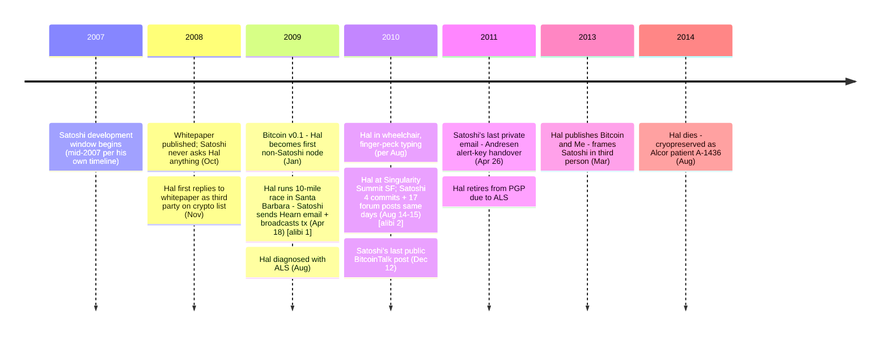

This entry documents the recurring public hypothesis that [Hal Finney](/BitcoinArchive/participants/hal-finney/) — Caltech-trained cryptographer, principal developer of PGP 2.0, creator of [Reusable Proof-of-Work (RPOW, 2004)](/BitcoinArchive/entries/aftermath/2019-08-21-hal-finney-rpow-recognition/), the first person other than Satoshi to run Bitcoin, recipient of the first person-to-person Bitcoin transaction (10 BTC, January 12, 2009), and a longtime Temple City, California resident living blocks from Dorian Nakamoto — was the person behind the Satoshi pseudonym. The most-cited public articulation is Andy Greenberg's [March 25, 2014 Forbes feature *"Nakamoto's Neighbor"*](/BitcoinArchive/entries/aftermath/2014-03-25-greenberg-forbes-nakamotos-neighbor/), which structured the speculation around the geographic coincidence and presented Fran Finney's race-day photographs as the principal counter-evidence. The hypothesis surfaced again in Florian Cafiero's 2026 stylometric analysis commissioned for the New York Times investigation into Adam Back, in which Finney was reported as nearly tied with Back for closest match. The claim is laid out, the supporting arguments are described as their advocates make them, and the counter-evidence is set out at equal detail. The reader is left to weigh.

## 1. What the hypothesis claims

The hypothesis is that Finney is the person behind the Satoshi Nakamoto pseudonym, and that his documented public-record interactions with "Satoshi" — including the [January 2009 email exchange](/BitcoinArchive/entries/correspondence/hal-finney/2009-01-08-satoshi-to-finney-release/), the [first Bitcoin transaction](/BitcoinArchive/entries/aftermath/2009-01-12-first-bitcoin-transaction/) on January 12, 2009, and the 2013 [*Bitcoin and Me*](/BitcoinArchive/entries/aftermath/2013-03-19-bitcoin-and-me-hal-finney/) retrospective — were stagecraft to maintain the pseudonym. Under this reading, Finney operated as Satoshi from the development phase (2007–2008) until at least his August 2009 ALS diagnosis, and possibly until his early-2011 retirement. A stronger variant must additionally explain the post-2011 Satoshi correspondence (the [April 2011 Mike Hearn email](/BitcoinArchive/entries/correspondence/mike-hearn/holding-coins/2011-04-23-satoshi-to-hearn-moved-on/) and the [April 2011 Gavin Andresen alert-key handover](/BitcoinArchive/entries/correspondence/gavin-andresen/2011-04-26-satoshi-to-andresen-alert-key/)) via a co-author or scheduled drafts.

Two events are alibi-class for the hypothesis: the April 18, 2009 race-day window and the August 14–15, 2010 Singularity Summit window. Their position relative to Satoshi's documented activity:

**Hal vs Satoshi - alibi-relevant events**

## 2. The arguments the hypothesis rests on

### 2.1 RPOW (2004) — direct conceptual precursor

In 2004, Finney built [Reusable Proof-of-Work (RPOW)](/BitcoinArchive/entries/aftermath/2019-08-21-hal-finney-rpow-recognition/), a system that took Adam Back's [Hashcash](/BitcoinArchive/entries/aftermath/1997-03-28-adam-back-hashcash-announcement/) tokens (single-use by design) and made them transferable through a server-validated reuse mechanism. Of all named Satoshi candidates, Finney is the only one who actually built a working proof-of-work-based digital-token system before Bitcoin. The conceptual lineage is direct: Hashcash → RPOW → Bitcoin's mining reward.

The objection: RPOW is server-mediated. The architectural distance to Bitcoin is large.

| Component | RPOW (2004) | Bitcoin (2009) |
|---|---|---|
| Proof of work | ✅ | ✅ |
| Transferable tokens | ✅ | ✅ |
| Trusted issuer (IBM 4758 secure coprocessor) | ✅ — required | ❌ — eliminated |
| Distributed ledger | ❌ | ✅ |
| Decentralized longest-chain consensus | ❌ | ✅ |
| UTXO model | ❌ | ✅ |
| Mining-reward minting | ❌ — no minting | ✅ |
| Fixed supply cap | ❌ | ✅ — 21 million |
| Operational P2P network | ❌ — server clients | ✅ |

Bitcoin's central design move — eliminating the trusted issuer entirely — is precisely what RPOW does *not* do. RPOW authorship demonstrates capability and engagement with the problem space, but the gap between "transferable PoW token via attested server" and "trustless P2P digital cash with longest-chain consensus" is substantial. See [Bitcoin design lineage](/BitcoinArchive/entries/analysis/2008-10-31-bitcoin-design-lineage/) for the per-component sourcing of Bitcoin v0.1.

### 2.2 Geographic proximity to Dorian Nakamoto

Finney lived for almost a decade in Temple City, California — the same town where [Newsweek had identified Dorian Nakamoto](/BitcoinArchive/entries/aftermath/2014-03-06-newsweek-dorian-nakamoto/) as a Satoshi candidate weeks before Greenberg's 2014 Forbes piece. Finney and Dorian Nakamoto lived "blocks apart." The argument: "Satoshi Nakamoto" was a pseudonym constructed from a real person's name living a few blocks from the actual author — a more elaborate version of the [pseudonym-construction analysis](/BitcoinArchive/entries/analysis/2008-10-31-satoshi-anonymity-architecture/).

The objection: Temple City is a small suburb in the San Gabriel Valley with a population of roughly 36,000; coincidences happen. The argument requires accepting both that Finney chose a pseudonym derived from a neighbor's name (rather than a name unconnected to himself) and that he then maintained the pseudonym for years without further geographic giveaways. [Greenberg's article](/BitcoinArchive/entries/aftermath/2014-03-25-greenberg-forbes-nakamotos-neighbor/) documents geographic adjacency without behavioral confirmation — Fran Finney was emphatic that Hal had no connection to or knowledge of Dorian Nakamoto.

### 2.3 The 2026 stylometric near-tie and broader-corpus rank

Florian Cafiero's [2026 stylometric review for the New York Times investigation](/BitcoinArchive/entries/aftermath/2026-04-08-nyt-carreyrou-adam-back-satoshi-investigation/) reported Finney as nearly tied with Adam Back among 12 candidates. Cafiero himself characterized the result as inconclusive. The [Bitcoin Institute reanalysis](/BitcoinArchive/entries/analysis/2026-05-03-van-dorst-corpus-reanalysis-named-candidates/) of Bas van Dorst's 75,000-author corpus places Finney's writing at top 6.89% (rank 878 of 12,739) — second-highest of the five most-cited named candidates after Nick Szabo.

| Stylometric study | Hal Finney's result |
|---|---|
| Skye Grey 2013 (single-hypothesis test of Szabo) | Not in candidate set |
| Aston University 2014 (11 candidates) | Rank not published |
| van Dorst 2024 / Bitcoin Institute reanalysis (75,000+ authors) | Rank 878 / 12,739 — top 6.89%, 2nd of named candidates |
| Cafiero / Carreyrou NYT 2026 (12 candidates) | Nearly tied with Adam Back; Cafiero called result inconclusive |

Across the four most-cited stylometric investigations, Finney appears as a consistently strong-but-not-top match. The pattern is consistent with substantial writing-register overlap with Satoshi: both wrote in clean, technical, native-level English with cypherpunk-list vocabulary in common.

### 2.4 First-recipient and earliest collaborator status

Finney was the first person other than Satoshi to run Bitcoin, the [recipient of the first person-to-person Bitcoin transaction](/BitcoinArchive/entries/aftermath/2009-01-12-first-bitcoin-transaction/), and one of the earliest substantive technical correspondents with Satoshi. His [November 2008 reply to the cryptography mailing list whitepaper announcement](/BitcoinArchive/entries/correspondence/hal-finney/2008-11-19-finney-to-satoshi-scalability/) was substantive and supportive at a moment when most cryptographers were skeptical. The argument: any author of a complex system tends to keep a known, trusted, and capable engineer close at the launch — and the candidate who fits that profile most precisely is the one who appears in this role.

The objection: launching a system anonymously while having a trusted technical collaborator visible at the launch is exactly the pattern an anonymous author would choose if they had a trusted collaborator. It is also exactly the pattern of a high-quality first user identifying a high-quality system on the cryptography mailing list. Finney's documented self-account — *"I think I was the first person besides Satoshi to run bitcoin"* in [*Bitcoin and Me*](/BitcoinArchive/entries/aftermath/2013-03-19-bitcoin-and-me-hal-finney/) — describes the latter, and the first-recipient role is consistent with both readings.

### 2.5 Cypherpunk credentials, capability, and English level

Finney is a long-tenure cypherpunk with documented cryptographic-protocol implementation experience (PGP 2.0, RPOW, the first cryptographically-based anonymous remailer), a Caltech engineering background, and a native US English background. The technical-coding profile (deep cryptographic libraries, working systems implementations, decades of low-level programming) is consistent with what Bitcoin v0.1 demonstrates.

The objection: this profile applies to several senior cypherpunks of the period and narrows the candidate set without selecting Finney specifically. Cafiero's "Hal Finney nearly tied [with Adam Back]" outcome makes precisely this point — multiple candidates fit the writing-register profile, and stylometric methods cannot uniquely select among them. See the [identification-asymmetry analysis](/BitcoinArchive/entries/analysis/2008-10-31-satoshi-identification-asymmetry/) for the broader treatment.

## 3. The counter-evidence

### 3.1 The April 18, 2009 race-day alibi

The strongest archive-internal counter-evidence is a chronological alibi first reported by Andy Greenberg in the [2014 Forbes feature](https://www.forbes.com/sites/andygreenberg/2014/03/25/satoshi-nakamotos-neighbor-the-bitcoin-ghostwriter-who-wasnt/) and formalized by [Jameson Lopp in 2023](/BitcoinArchive/entries/aftermath/2023-10-21-lopp-hal-finney-not-satoshi/). On Saturday April 18, 2009, Finney was running a 10-mile race in Santa Barbara, California, while Satoshi was active on the Bitcoin network.

| Time (Pacific) | Hal Finney | Satoshi |
|---|---|---|
| 8:00 AM | Race start (timing-chip data, race-photographer images, race result ID 591, Fran's photographs) | — |
| 8:55 AM | Running the course | Block 11,408 confirms a transaction sending 32.5 BTC to Mike Hearn |
| 9:16 AM | ~2 minutes from finish line | Email to Mike Hearn ("I sent back 32.51 and 50.00") sent at 9:16 AM PT |
| ~9:18 AM | Race finish (~78 minutes after start) | — |

The race is documented with timing-chip data, the race photographer's images, race result ID 591, and an additional photograph taken by Fran Finney. The Archive holds [the Satoshi-to-Hearn email from April 18, 2009](/BitcoinArchive/entries/correspondence/mike-hearn/questions/2009-04-18-satoshi-to-hearn-ecdsa/) whose timestamp falls inside the race window. The same individual could not have been broadcasting transactions and replying to email while running a 10-mile race.

The alibi requires that Finney's race photographs and timing-chip data were genuine (not fabricated by Fran in 2014), and that the email and on-chain transaction timestamps are accurate (not subject to clock drift or manipulation). Both are routinely the case — and the on-chain record (block 11,408 timestamp) is independent of any private record Fran could have manipulated. The 2014 Forbes record predates the 2023 Lopp formalization by nearly a decade — Fran showed Greenberg the photographs in person, and Greenberg published them in print. This is not an alibi constructed retrospectively for the purpose of denying the hypothesis; it is a contemporaneously documented activity that happened to coincide with Satoshi-network activity.

Lopp's 2023 analysis and Peter Miller's 2026 follow-up add four further structural observations against the hypothesis:

- **IP address divergence.** The January 10, 2009 Bitcoin debug log records Finney's IRC node at IP `207.71.226.132`, while Satoshi's IP appears as `68.164.57.219` — different ISPs and different geographic regions. If Finney were Satoshi, the two endpoints would not appear simultaneously as distinct peers in the same debug log.
- **Coding-style divergence.** Finney's published code uses tabs for indentation and `snake_case` for identifiers; Satoshi's Bitcoin v0.1 source uses spaces and `camelCase` (with Hungarian-notation prefixes typical of Visual C++ on Windows). Comment formatting and function-naming conventions also diverge systematically.
- **British vs. American spelling.** Satoshi's writing consistently uses British / Commonwealth spellings (`colour`, `favour`, `optimise`, `maths`); Finney's writing is American throughout. Stylometric comparison of Satoshi's email register against Hal's writing finds the email register matches the whitepaper better than Hal does.
- **Operating-system divergence.** Bitcoin v0.1 was released as a Windows-only `.rar` archive built with Visual C++ 6.0 SP6 + MinGW GCC 3.4.5; Satoshi's documented December 2010 self-statement to Andresen — *"[Gavin is] technically much more Linux capable than me"* — confirms a Windows-centered work environment. Finney was a documented long-term Mac user. The development-environment record points to two different machines.

### 3.2 Finney's 2013 *Bitcoin and Me* first-person framing of Satoshi

In March 2013, Finney published [*Bitcoin and Me*](/BitcoinArchive/entries/aftermath/2013-03-19-bitcoin-and-me-hal-finney/) on BitcoinTalk — written from late-stage ALS, with eye-tracking software, a year before his death. The essay describes his interactions with Satoshi consistently in the third person:

> Today, Satoshi's true identity has become a mystery. But at the time, I thought I was dealing with a young man of Japanese ancestry who was very smart and sincere. I've had the good fortune to know many brilliant people over the course of my life, so I recognize the signs.

> I think I was the first person besides Satoshi to run bitcoin.

For the hypothesis to be true, this essay would have to be a sustained self-deception written from a hospital bed by a dying man, addressed to a Bitcoin community he had been part of for four years, with no audience benefit and no plausible motive. The simpler reading: Finney is recalling Satoshi as a person he interacted with — someone whose identity remained a mystery to him as well.

Compared to the [self-statement framework applied to other candidates](/BitcoinArchive/entries/analysis/2008-08-20-satoshi-self-statements/), Finney's framing is unusually clear: a candidate whose entire framing of the Bitcoin-launch period treats Satoshi as a separate person.

### 3.3 The Patoshi mining-scale inconsistency

[Sergio Lerner's Patoshi analysis](/BitcoinArchive/entries/aftermath/2013-04-17-sergio-lerner-patoshi-analysis/) identifies a single dominant early miner — almost certainly Satoshi — with approximately 22,503 blocks mined and roughly 1,148,800 BTC remaining unspent. [Jameson Lopp's 2022 *Was Satoshi Greedy?*](/BitcoinArchive/entries/aftermath/2022-09-16-lopp-was-satoshi-greedy-miner/) reconstructs the Patoshi pattern as deliberate hashrate suppression for network defense.

| Dimension | Patoshi (Satoshi) | Hal Finney's documented record |
|---|---|---|
| Blocks mined | ~22,503 | "several blocks" — small handful at difficulty 1 |
| BTC accumulated | ~1.1 million | Modest early holdings consolidated into offline wallet for heirs |
| Mining behavior | Sustained, defensive throttling for network protection | Ran briefly, then stopped because computer ran hot and fan was annoying |
| Mining duration | Continuous through 2009-early 2010 | Off by early 2009; rediscovered wallet only in late 2010 |

Finney's own [*Bitcoin and Me*](/BitcoinArchive/entries/aftermath/2013-03-19-bitcoin-and-me-hal-finney/) is explicit about his Bitcoin holdings: he describes mining "several blocks" before turning Bitcoin off because his computer ran hot, then forgetting Bitcoin until late 2010 when he was "surprised to find that it was not only still going" and "dusted off [his] old wallet." Fran Finney's [2019 *Cryonics Magazine* profile](/BitcoinArchive/entries/aftermath/2019-04-01-fran-finney-hal-finney-profile/) corroborates the family's modest Bitcoin holdings.

The hypothesis would require Finney to have concealed Patoshi-scale holdings from his wife, his estate, and Alcor (which interacts with patient finances post-cryopreservation) for the entire ALS period, while writing a public retrospective that explicitly contradicts that scale. The defensive-mining behavior is also at odds with Finney's own description of stopping Bitcoin in early 2009 because of fan noise.

### 3.4 The identifiability argument

[Wei Dai's 2014 retrospective on the AALWA thread](/BitcoinArchive/entries/aftermath/2014-01-12-wei-dai-retrospective-on-satoshi/) argues that Satoshi was "not previously active" in the visible cypherpunk community during the development period — a framing that selects against any candidate visibly active in cypherpunk discussion during 2007–2008. Finney was visibly active throughout this period: he ran an anonymous remailer, posted to Extropy and LessWrong, and engaged with cryonics and life-extension communities under his own name. His [October 2009 *Dying Outside*](/BitcoinArchive/entries/aftermath/2009-10-05-hal-finney-dying-outside/) essay on LessWrong is part of the public record of his activity during the launch period.

Under the [identifiability argument](/BitcoinArchive/entries/analysis/2008-10-31-cypherpunk-independent-arrival/), Finney's continuous visible cypherpunk activity is structurally the same problem that applies to Adam Back, Sassaman, and other visibly-active candidates of the period.

### 3.5 ALS progression and the August 2010 Singularity Summit

A second alibi-class observation covers a longer window. Finney's ALS diagnosis was confirmed in August 2009; by August 2010 — fifteen months later — the disease had progressed visibly. Fran Finney's August 22, 2010 public post records that Hal and Fran attended the Singularity Summit in San Francisco on August 14–15, 2010. By that period, contemporaneous accounts and Hal's own description in [*Bitcoin and Me*](/BitcoinArchive/entries/aftermath/2013-03-19-bitcoin-and-me-hal-finney/) document that his typing speed had dropped from a rapid-fire 120 WPM to a slow finger-peck, and he was spending much of his day in a power wheelchair.

During the same August 14–15, 2010 window, Satoshi was highly active online: 4 SVN code check-ins and 17 BitcoinTalk forum posts. The activity is a normal Satoshi-busy-period footprint — substantive technical engagement, sustained typing volume, and posting times consistent with the West Coast diurnal pattern (peak around 10 AM, dip around noon) the [anonymity architecture entry](/BitcoinArchive/entries/analysis/2008-10-31-satoshi-anonymity-architecture/) documents.

The hypothesis would require Hal to have been doing both — physically attending a multi-day conference in San Francisco while finger-pecking, and producing 4 commits + 17 long-form forum posts on Bitcoin design issues in the same window. The combination is implausible without a second person operating under the Satoshi handle, which collapses into the co-author variant of the hypothesis introduced in §1.

### 3.6 Family-witness consistency

Fran Finney has consistently denied that Hal was Satoshi across multiple interviews — Greenberg's 2014 Forbes piece (where she showed him the race photographs in person), the [2019 *Cryonics Magazine* profile](/BitcoinArchive/entries/aftermath/2019-04-01-fran-finney-hal-finney-profile/), and subsequent press contact. Family witnesses are imperfect evidence on their own — a Satoshi who lied to his wife is conceivable — but Fran's account is photograph-supported and decade-spanning. The race-day photographs Fran preserved are direct primary-source evidence; her interview testimony is consistent corroborating record across years. For the hypothesis to survive, Hal would have to have maintained a years-long deception of his wife in addition to the public deception, while leaving photographic evidence of activities that contradict the deception.

## 4. Within the broader documentary record

Across the four most-cited stylometric investigations (Skye Grey 2013, Aston 2014, the Bitcoin Institute reanalysis of van Dorst 2024, Cafiero / Carreyrou 2026), Finney appears as the closest match in zero. Szabo is named top in three; Adam Back is named top in one (with Cafiero qualifying it as inconclusive and Finney "nearly tied"). The pattern is consistent with the writing-register overlap argued in §2.5 — Finney is among the closer writers to Satoshi but not uniquely.

The race-day alibi (§3.1), the 2013 first-person framing (§3.2), and the Patoshi-scale inconsistency (§3.3) form a structurally distinct line of counter-evidence: each is a contemporaneously documented record at the relevant time, not a retrospective reconstruction. Finney's evidentiary position differs from candidates whose counter-evidence rests primarily on absence-of-confession (Szabo, Adam Back). Finney has actively documented activities and self-statements that are difficult to reconcile with the Satoshi role.

[Satoshi's August 22, 2008 email to Adam Back](/BitcoinArchive/entries/correspondence/adam-back/2008-08-22-satoshi-to-adam-back-b-money/) — *"I wasn't aware of the b-money page"* — is dated months before Finney's first documented Satoshi contact. If Finney were Satoshi, the pattern would be: Finney emails Back as "Satoshi," receives a referral to b-money, emails Wei Dai as "Satoshi," then waits two months and emails himself as "Hal Finney" supportively replying to the Bitcoin announcement on the cryptography mailing list. The structure is implausible without active continuous co-staging.

For comparison with other named-candidate hypotheses, see the [Satoshi-identity hypotheses overview](/BitcoinArchive/entries/analysis/2008-10-31-satoshi-identity-hypotheses-overview/) and the individual entries for [Sassaman](/BitcoinArchive/entries/analysis/2011-07-03-sassaman-satoshi-identity-hypothesis/), [Kaneko](/BitcoinArchive/entries/analysis/2013-07-06-kaneko-isamu-satoshi-identity-hypothesis/), [Szabo](/BitcoinArchive/entries/analysis/2013-12-05-szabo-satoshi-identity-hypothesis/), [Todd](/BitcoinArchive/entries/analysis/2024-10-08-todd-satoshi-identity-hypothesis/), and [Adam Back](/BitcoinArchive/entries/analysis/2026-04-08-adam-back-satoshi-identity-hypothesis/).

## 5. Limits of this entry

- This entry does not present new evidence. It compiles material from the 2014 Forbes feature, the 2023 Lopp analysis, Finney's 2013 *Bitcoin and Me* essay, the 2026 NYT investigation and Cafiero analysis, the Bitcoin Institute reanalysis of van Dorst, the Patoshi-pattern literature, and Fran Finney's interview record.
- This entry sets out the hypothesis fairly and the counter-evidence fairly, leaving the reader to weigh.
- This entry does not name "the most likely Satoshi candidate."
- Cafiero's "Hal Finney nearly tied" outcome is treated as material toward the *uniqueness* question, not as confirmation of either Finney or Adam Back specifically. See the [Adam Back hypothesis entry](/BitcoinArchive/entries/analysis/2026-04-08-adam-back-satoshi-identity-hypothesis/) for the symmetric treatment from the other side.
- If new evidence surfaces — a private writing or correspondence by Finney that contradicts his 2013 framing, a reconciliation of the race-day alibi with Satoshi-network activity that does not require fabrication, or a documented connection between Patoshi-scale holdings and Finney's estate — this entry should be updated.

*[Editor: this entry uses the March 25, 2014 Forbes article as the prominent public articulation of a longstanding hypothesis. The framing is deliberately conservative: the hypothesis is laid out, supporting arguments are described as their advocates make them, and counter-evidence is set out at equal detail. The entry does not draw an editorial conclusion about whether the hypothesis is more likely true or false; readers who want a direct verdict will not find one.]*
