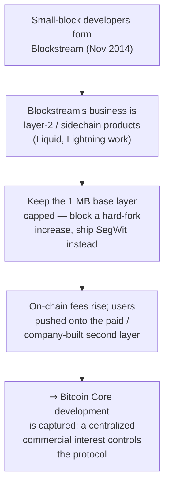
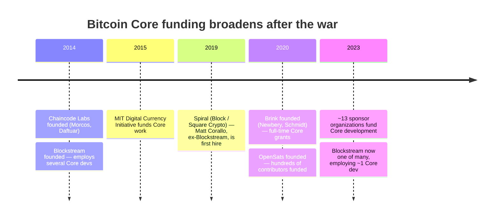

"Blockstream controls Bitcoin." Of all the charges the [block-size war](/BitcoinArchive/entries/analysis/2015-08-15-block-size-war-2015-2017-overview/) left behind, this is the one that has lasted longest. A company that employs many of Bitcoin Core's developers, the story goes, kept the base layer deliberately inconvenient so that the second layer it sells would become indispensable. Something meant to have no centre, taken hold of by a single firm.

The line was not coined by anyone with a grudge against Blockstream. The first to say it was a developer leaving the project, [Mike Hearn](/BitcoinArchive/participants/mike-hearn/):

<!-- audit:quote-skip -->
> "What was meant to be a new, decentralised form of money that lacked 'systemically important institutions' and 'too big to fail' has become something even worse: a system completely controlled by just a handful of people."
>
> — Mike Hearn, ["The resolution of the Bitcoin experiment"](/BitcoinArchive/entries/aftermath/2016-01-14-mike-hearn-resolution-bitcoin-experiment/) (January 14, 2016)

Hearn named "a handful of people," not a single company. What stuck, though, was the version with a company's name on it. A handful of people had quietly become one corporate name. That is the first thing to check.

## 1. The hijacking charge

The most carefully built version of the charge is Roger Ver's 2024 book *Hijacking Bitcoin*, the large-block reply to Jonathan Bier's small-block *The Blocksize War* (2021). Laid out, the claim is a single chain of cause and effect:

By Ver's account, the small-blockers founded Blockstream to earn from the second layer, argued that the base layer should stay capped, and so made that second layer indispensable. Pushed further, the claim is that Bitcoin Core, "a government," and Blockstream worked together to keep the network jammed by holding the limit at 1 MB. Because it is one connected chain, it can be checked joint by joint.

## 2. What the record supports

The first three joints of the chain are on the record.

| Link | What the record shows |
|---|---|
| **Staffing overlap** | Blockstream was founded in November 2014 by Bitcoin Core developers — [Gregory Maxwell](/BitcoinArchive/participants/gregory-maxwell/), [Pieter Wuille](/BitcoinArchive/participants/pieter-wuille/), Matt Corallo, Jorge Timón, Mark Friedenbach — with [Adam Back](/BitcoinArchive/participants/adam-back/) as CEO, and employed several more Core contributors. The overlap between "Blockstream payroll" and "Core committers" was real and visible. |
| **The soft-fork path** | Core declined a hard-fork block-size increase and shipped [SegWit (BIP 141)](/BitcoinArchive/entries/bip/2015-12-21-bip-0141/) — co-authored by Wuille — as a soft fork in 2017. The base-layer block limit was not raised by the route the large-block side wanted; capacity grew via the witness-discount weight accounting instead. |
| **A real layer-2 business** | Blockstream does sell a second-layer product: the Liquid federated sidechain (launched 2018), aimed at exchanges and traders. The company has a commercial interest in second-layer settlement. |

The premises are not invented. The underlying facts are solid. What gives way is the step after them: the move from solid fact to "therefore, a takeover."

## 3. What the record does not support

The chain breaks where "interests overlap" turns into "broke it on purpose." It breaks in three places.

**Lightning is not Blockstream's.** The charge rests on a picture of base-layer congestion driving users onto a paid layer that Blockstream owns. But Lightning is not Blockstream's. Joseph Poon and Thaddeus Dryja proposed it in a 2015 paper, and neither works for Blockstream. There are three implementations: LND (Lightning Labs, the most widely run), Core Lightning (Blockstream), and Eclair (ACINQ). Blockstream maintains one of them, having neither invented the protocol nor any way to charge rent on it. What Blockstream actually sells is Liquid, a low-profile exchange sidechain, not a tollgate on ordinary payments.

**The technical case for small blocks is older than Blockstream.** Satoshi added the 1 MB limit himself, in 2010, as an anti-spam measure, four years before Blockstream existed. The caution about raising it (the cost of running a node, slower block propagation, mining skewing toward a few large operations under bigger blocks) was voiced early by developers with no tie to the company, and most developers still share it. To explain the conservative line by one company's payroll, you would need a separate reason why developers it never employed hold the same line.

**Blockstream has never been most of Core.** Core has had hundreds of contributors over the years. At its 2015-2016 peak Blockstream employed only a few of them; by the mid-2020s, on the company's own public record, that was about one Core developer. The funding base, far from narrowing, widened sharply after 2017:

Today Core is supported by roughly thirteen organizations, Blockstream among them: Chaincode Labs, MIT DCI, Spiral, Brink, OpenSats, the Human Rights Foundation, Btrust, and more. The very people the charge names have moved on to different places. Co-founder Matt Corallo became Spiral's first hire in 2019; Wuille moved to Chaincode Labs. The talent once gathered in one company has scattered across separately funded homes. Whatever "Blockstream controls Bitcoin" pointed to in 2016 has been shrinking year by year.

## 4. "Just talking its book" cuts both ways

The charge has a second pillar, separate from the chain of fact that broke in §3: the motive claim that Blockstream's technical case is just the company talking its own book. This pillar is about motive, not fact, so weigh it on its own.

That move — a commercial interest voids a technical position — swings back on whoever makes it with equal force. [Jihan Wu](/BitcoinArchive/participants/jihan-wu/)'s Bitmain had a stake, through hashrate and hardware, in more on-chain transactions. [Roger Ver](/BitcoinArchive/participants/roger-ver/)'s bitcoin.com had a stake, in brand and traffic, in the large-block chain it called "the real Bitcoin." If a commercial interest can void the other side's technical case, it voids the accusers' own by the same logic. Carry the test all the way through and nothing anyone argued is left standing.

So the interest is worth noting as a reason to doubt a motive — not as evidence of "broke it on purpose." Here too the charge leans on motive in place of the fact that gave way, and that motive lands on the accuser as hard as on the accused. This is not a both-sides draw. It is one more pillar of the charge giving way.

## 5. The verdict the record supports

Split the question in two, and the answer splits with it.

Was there a commercial interest sitting close to Core's development? There was, and the record does not hide it. Blockstream was founded by Core developers, runs a second-layer business, and at the height of the dispute held an unusual number of senior developers on a single payroll. Was one company sitting too close to the reference implementation of a system with no central source of money? The worry was not baseless.

Did Blockstream then control Bitcoin? Did it cripple the base layer on purpose to profit? That the record does not support. For the story to stand, Lightning would have to be Blockstream's tollgate (it is an open protocol with three implementations), the small-block case would have to belong to one company (it is older than the company and shared well beyond it), and Blockstream would have to be most of Core (a few people at peak, about one now, one of some thirteen organizations). Every support the strong charge leans on gives way under the record.

It arrives where [fork-wars §6](/BitcoinArchive/entries/analysis/2015-08-15-bitcoin-fork-wars-as-not-oss/) arrives, and takes up what that analysis left open. The overlap in employment was real; the takeover claim is not what the record supports. And the real concern the charge gestures at, that very few people maintain the software and that its funding was once concentrated, is the more grounded and smaller fact, weaker now than at any time since the war. So "Bitcoin is controlled by Blockstream" does not hold. What holds is quieter: a single reference implementation tends to gather influence into a small circle, so it is worth watching who funds it and who sits inside it. That is the sentence the evidence supports.
