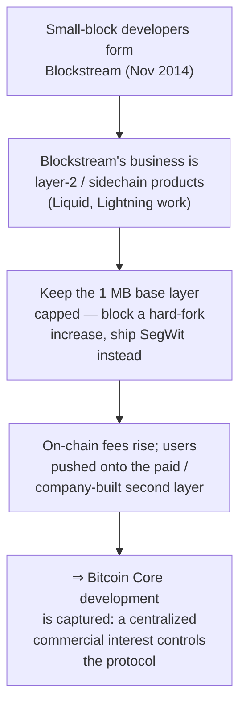
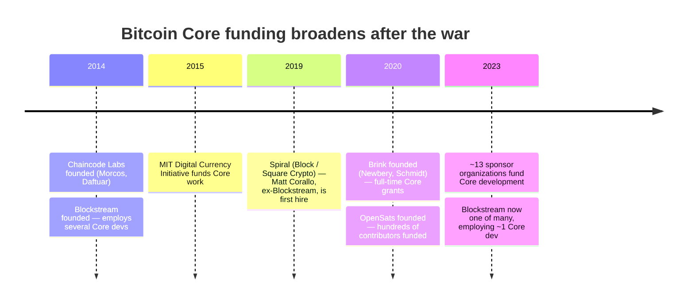

"Blockstream controls Bitcoin." Spend any time in the louder corners of the subject and you will hit that sentence. Of all the charges the [block-size war](/BitcoinArchive/entries/analysis/2015-08-15-block-size-war-2015-2017-overview/) left behind, it is the one that refuses to die. The story runs like this: a company staffed by Bitcoin Core developers kept the base layer deliberately crippled so the second-layer products it sells would become necessary — one firm quietly seizing a thing that was supposed to have no centre.

The sentence was not coined by someone out to cast Blockstream as the villain. A senior developer said it first, on his way out the door:

<!-- audit:quote-skip -->
> "What was meant to be a new, decentralised form of money that lacked 'systemically important institutions' and 'too big to fail' has become something even worse: a system completely controlled by just a handful of people."
>
> — Mike Hearn, ["The resolution of the Bitcoin experiment"](/BitcoinArchive/entries/aftermath/2016-01-14-mike-hearn-resolution-bitcoin-experiment/) (January 14, 2016)

Hearn named "a handful of people," not a company. The version that spread — and still spreads — names the company. A handful of people quietly became a single corporate name. The swap looks small; in the checking, it is everything.

## 1. The hijacking charge

If you are going to break an argument, break its strongest form, not a strawman. The most worked-out version is Roger Ver's 2024 book *Hijacking Bitcoin*, the large-block answer to Jonathan Bier's small-block *The Blocksize War* (2021). Drawn out, the claim is a chain:

In Ver's telling, the small-blockers built Blockstream to profit from layer 2, preached that the base layer must stay capped, and so made that paid layer necessary. At full volume he goes further: Core, "a government," and Blockstream colluded to hold the block size at 1 MB and break the network on purpose. This is not vague hostility. It is a causal chain — and a chain you can test one link at a time.

## 2. The links the record supports

The first three links are real. A rebuttal that denies them loses to the facts.

| Link | What the record shows |
|---|---|
| **Staffing overlap** | Blockstream was founded in November 2014 by Bitcoin Core developers — [Gregory Maxwell](/BitcoinArchive/participants/gregory-maxwell/), [Pieter Wuille](/BitcoinArchive/participants/pieter-wuille/), Matt Corallo, Jorge Timón, Mark Friedenbach — with [Adam Back](/BitcoinArchive/participants/adam-back/) as CEO, and employed several more Core contributors. The overlap between "Blockstream payroll" and "Core committers" was real and visible. |
| **The soft-fork path** | Core declined a hard-fork block-size increase and shipped [SegWit (BIP 141)](/BitcoinArchive/entries/bip/2015-12-21-bip-0141/) — co-authored by Wuille — as a soft fork in 2017. The base-layer block limit was not raised by the route the large-block side wanted; capacity grew via the witness-discount weight accounting instead. |
| **A real layer-2 business** | Blockstream does sell a second-layer product: the Liquid federated sidechain (launched 2018), aimed at exchanges and traders. The company has a commercial interest in second-layer settlement. |

The accusers did not invent their premises. The foundation is solid. What gives way is the next step — the jump from "solid facts" to "therefore, capture."

## 3. What the record does not support

The chain breaks where "overlapping interests" turns into "broke it on purpose." It breaks in three places.

**Lightning is not Blockstream's.** The charge leans on a picture of base-layer congestion herding users onto a paid layer Blockstream owns. But Lightning is not Blockstream's. Joseph Poon and Thaddeus Dryja proposed it in a 2015 paper; neither works for Blockstream. It has three implementations — LND (Lightning Labs, the most widely run), Core Lightning (Blockstream), Eclair (ACINQ) — and Blockstream maintains one of them. It is one implementation of an open protocol the company did not invent and cannot charge rent on. The thing Blockstream actually sells, Liquid, is a low-profile exchange sidechain, not a tollbooth on ordinary payments.

**The small-block case is older than Blockstream and held far beyond it.** Satoshi added the 1 MB limit himself, in 2010, as an anti-spam measure — four years before Blockstream existed. The case for caution about raising it (the cost of running a node, slower block propagation, mining centralization under big blocks) was made by developers with no tie to the company and is the majority position among them. To pin the conservative line on one payroll, you need a separate reason why developers that payroll never touched hold the same line.

**Blockstream was never most of Core, and is now a sliver of it.** Core has had hundreds of contributors. Blockstream employed a handful at its 2015-2016 peak; by the mid-2020s, on its own public record, it employed about one Core developer. The funding base did not narrow — after 2017 it scattered:

By the mid-2020s, Core was funded by roughly thirteen organizations alongside Blockstream — Chaincode Labs, MIT DCI, Spiral, Brink, OpenSats, the Human Rights Foundation, Btrust, and more. The very developers the charge points to scattered too: co-founder Matt Corallo became Spiral's first hire in 2019; Wuille moved to Chaincode Labs. Talent that one company had concentrated split across a dozen separate purses. Whatever "Blockstream controls Bitcoin" pointed at in 2016, it points at a smaller corner of the structure every year.

## 4. The mirror test — the same skepticism, turned on the accusers

Hold the same yardstick up to the side swinging it, or it isn't fair — the mirror the [fork-wars analysis](/BitcoinArchive/entries/analysis/2015-08-15-bitcoin-fork-wars-as-not-oss/) turns the other way. The large-block side was not disinterested either. [Jihan Wu](/BitcoinArchive/participants/jihan-wu/)'s Bitmain had a hashrate-and-hardware stake in on-chain volume; [Roger Ver](/BitcoinArchive/participants/roger-ver/)'s bitcoin.com had a brand-and-traffic stake in the larger-block chain it sold as "real Bitcoin." If commercial alignment voids a technical position, it voids both sides; if it doesn't, it voids neither. To dismiss only one side as "paid to say it" is to be looking away from the mirror.

## 5. The verdict the record supports

Split the question in two and the answer splits with it.

**Was there money sitting close to Core development? — Yes, and the record never hid it.** Blockstream was founded by Core developers, sells a second-layer business, and at the war's peak gathered an unusual share of senior protocol talent onto one payroll. The worry that a single company sat too close to the reference client of a moneyless system was not paranoia. It was worth watching.

**Did Blockstream control Bitcoin — cripple the base layer on purpose to herd users onto products it profits from? — That the record does not support.** The picture needs Lightning to be Blockstream's tollbooth (it is an open protocol with three implementations), the small-block case to be a company line (it is older than the company and held far beyond it), and Blockstream to be most of Core (a minority at peak, about one developer now, one name in a field of thirteen). Every link the strong charge leans on is a link the record cuts.

It ends where [fork-wars §6](/BitcoinArchive/entries/analysis/2015-08-15-bitcoin-fork-wars-as-not-oss/) ends and pushes into what that entry left open: the *staffing fact* is real, the *capture claim* is not what the record supports, and the worry the charge gestures at — a small maintainer set, a funding base once concentrated — is the smaller, real thing, and it is thinner now than at any point since the war. "Bitcoin is centralized by Blockstream" is the wrong sentence. The right one is quieter: a reference-client model gathers influence into a small circle, so watching who funds it and who sits inside it is worth doing. It doesn't make a headline. It is the sentence the evidence will sign.
