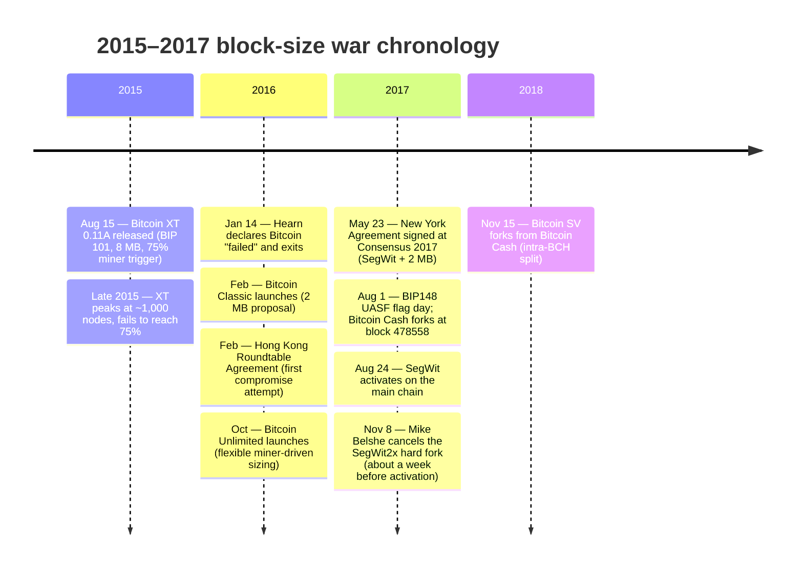
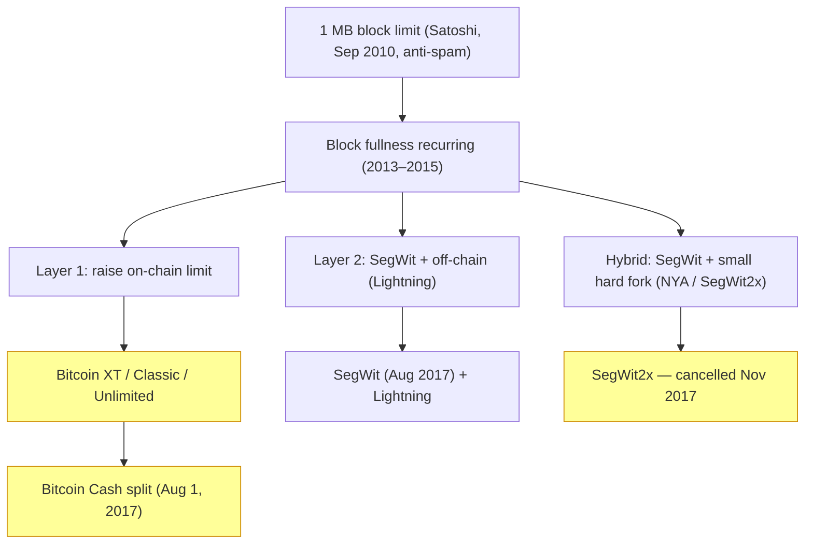

Between August 2015 and November 2017, Bitcoin's open-source process was tested by a sustained dispute over a single parameter: the 1 MB block-size limit that [Satoshi Nakamoto](/BitcoinArchive/participants/satoshi-nakamoto/) had added in September 2010 as a temporary anti-spam measure — though [Ray Dillinger](/BitcoinArchive/participants/ray-dillinger/) has recalled a different, pre-launch origin for the same limit, a discrepancy the documented commit history does not resolve in his favor. The dispute produced four successive fork attempts on the main chain, one persistent chain split, the activation of Segregated Witness, and a permanent change in how Bitcoin protocol upgrades reach consensus. This entry collates the documented sequence by phase, faction, and turning point.

## Timeline

## The three loss-points the dispute pivoted on

The block-size war does not reduce to a single disagreement. Three distinct loss-points kept it from reaching a clean resolution at any earlier stage:

The three loss-points: (a) whether the constraint is throughput or decentralization (Layer 1 vs Layer 2 priority); (b) whether a hard fork can ever be safe (the contested-fork-as-network-split objection); (c) whether off-chain protocols can scale without compromising self-custody (the user-experience question). Each faction's answer to these three loaded the dispute differently.

## The three factions

| Faction | Lead positions | Core proposition | Outcome |
|---|---|---|---|
| **Large-blockers** | [Mike Hearn](/BitcoinArchive/participants/mike-hearn/), [Gavin Andresen](/BitcoinArchive/participants/gavin-andresen/), [Roger Ver](/BitcoinArchive/participants/roger-ver/), [Jihan Wu](/BitcoinArchive/participants/jihan-wu/), [Amaury Séchet](/BitcoinArchive/participants/amaury-sechet/) | The 1 MB limit was a temporary measure that must be lifted; on-chain capacity is the only credible scaling lever; off-chain layers reintroduce intermediary risk | Bitcoin XT / Classic / Unlimited all failed to activate. [Bitcoin Cash](/BitcoinArchive/entries/aftermath/2017-08-01-bitcoin-cash-fork/) split off as a separate chain on August 1, 2017 |
| **Core developers** | Gregory Maxwell, Pieter Wuille, Wladimir van der Laan | A contentious hard fork splits the network; node decentralization must be preserved; scaling is achievable via SegWit + Lightning + soft forks | SegWit activated on the main chain on August 24, 2017. Subsequent main-chain upgrades (Taproot 2021) followed the soft-fork path. The Core repository remained the dominant implementation |
| **NYA compromise group** | [Mike Belshe](/BitcoinArchive/participants/mike-belshe/), Jeff Garzik, Wences Casares, Erik Voorhees, Peter Smith, Jihan Wu | Industry-led negotiation can bundle SegWit (Core's preferred path) with a small hard-fork block-size increase, splitting the difference | First half (SegWit) shipped on August 24, 2017. Second half (2 MB hard fork) [cancelled by Belshe on November 8, 2017](/BitcoinArchive/entries/aftermath/2017-11-08-segwit2x-cancellation/), about a week before the scheduled block 494784 activation |

Pieter Wuille — one of the three Core-developer figures named above — is profiled in more detail in [his biography entry](/BitcoinArchive/participants/pieter-wuille/), which documents the BIP authorship (BIP-32, SegWit, Taproot) and libsecp256k1 work underlying the Core-developer position summarized here, though it does not itself narrate this dispute.

The faction labels are post-hoc and not self-identifications. Several actors crossed between factions over the two-year span — Jihan Wu, for example, signed the New York Agreement, then supported the Bitcoin Cash fork that occurred during the agreement's first-half window. The participants list above names the most prominent figures associated with each faction at the launch of their respective proposals; the underlying constituencies (miners, exchanges, full-node operators, individual holders) had heterogeneous and shifting positions.

## Phase 1: Bitcoin XT and the first public fork (August 2015 – January 2016)

The launch of [Bitcoin XT 0.11A](/BitcoinArchive/entries/aftermath/2015-08-15-bitcoin-xt-launch/) on August 15, 2015 is the chronological start of the war's public-fork phase. Disagreement on the mailing list and on BitcoinTalk had been building since 2013, but XT was the first production-grade Bitcoin Core fork released as installable binaries with a published activation schedule (BIP 101: 8 MB starting January 2016, doubling every two years to 8 GB by 2036, activation at 75% miner support).

XT briefly attracted around 1,000 nodes in late 2015 but never approached the 75% activation threshold. The same miners and exchanges who had publicly endorsed it withheld actual activation signals. By January 2016, XT node count had collapsed below 30.

On January 14, 2016, [Hearn published "The resolution of the Bitcoin experiment"](/BitcoinArchive/entries/aftermath/2016-01-14-mike-hearn-resolution-bitcoin-experiment/) declaring Bitcoin had failed, sold his coins, and exited the ecosystem.

Phase 1's lesson: a miner-trigger hard fork (BIP 101) could not pass without endorsement from a coalition that already included the Core developers, the largest exchanges, and a clear majority of the high-economic-weight nodes. The 75% trigger looked like a high bar but turned out to be unreachable because the actors who controlled most of the signalling weight did not want the change.

## Phase 2: Continued large-block attempts (February 2016 – April 2017)

Bitcoin Classic launched in February 2016 with a similar 2 MB proposal and lower activation bar (75% with a 28-day grace period). Bitcoin Unlimited followed in October 2016 with a flexible miner-driven approach — miners could set their own preferred block-size cap and accept blocks up to that cap. Both projects, like XT, failed to reach activation: Classic peaked at around 6% miner signaling and collapsed; Unlimited reached briefly higher (around 40% at peak) but never the 75%+ supermajority needed for a clean fork.

The Hong Kong Roundtable Agreement, reached in February 2016 between several Core developers and major mining-pool operators, attempted an off-the-record compromise: SegWit would ship first, followed by a 2 MB hard fork "later." The agreement had no enforceable timeline and the hard-fork component was never delivered. By early 2017 the agreement was widely treated as broken by the large-block side.

Phase 2's lesson: protocol activation requires more than a published proposal and a release binary. The Bitcoin Core repository, the largest mining pools, the major exchanges, and the long-tail of full-node operators each had de facto veto power, and only a proposal that passed all four bars could activate.

## Phase 3: The New York Agreement and Bitcoin Cash (May – August 2017)

The New York Agreement (NYA), signed on May 23, 2017 at the Consensus 2017 conference, was the most ambitious compromise attempt of the war. Representatives of 58 major Bitcoin businesses — exchanges, mining pools, payment processors, and Bitcoin-holding companies — committed to bundle two protocol changes:

- **First half:** Activate SegWit on the main chain via the BIP 91 lock-in mechanism within 30 days.
- **Second half:** Hard-fork to a 2 MB block-size limit three months after SegWit activation.

In parallel, a separate movement gathered momentum: BIP148 User-Activated Soft Fork (UASF), in which non-mining full nodes would reject all blocks that did not signal SegWit support starting August 1, 2017. BIP148 was an unusual move — it placed activation pressure on miners from the user-node side rather than the Core-developer side — and was largely seen as a Plan B if NYA failed. NYA's first half (SegWit) reached lock-in via BIP 91 on July 21, 2017, ten days ahead of the BIP148 flag day, which most observers credit to the BIP148 deadline forcing miner cooperation.

On August 1, 2017 — the BIP148 flag day — the [Bitcoin Cash hard fork](/BitcoinArchive/entries/aftermath/2017-08-01-bitcoin-cash-fork/) executed at block 478558, mined by the ViaBTC pool at approximately 12:37 UTC. The fork ran the Bitcoin ABC implementation: 8 MB initial block size, no SegWit, modified difficulty adjustment to allow a small minority-hashrate chain to mine blocks. Bitcoin Cash was the work of Jihan Wu (mining pool support), Roger Ver (public branding), and [Amaury Séchet](/BitcoinArchive/participants/amaury-sechet/) (protocol implementation). Unlike XT / Classic / Unlimited, BCH was structured as a deliberate persistent split rather than a same-chain replacement: replay protection via SIGHASH_FORKID kept transactions valid on only one chain.

SegWit then activated on the main Bitcoin chain on August 24, 2017.

## Phase 4: SegWit2x cancellation and the war's end (October – November 2017)

With Bitcoin Cash off as a separate chain and SegWit live on the main chain, the unresolved question was the NYA's second half: would the main chain undergo a 2 MB hard fork in November as the agreement specified?

The activation block was set at 494784, scheduled for approximately November 16, 2017. In the months leading up to it, opposition coalesced: the Bitcoin Core developers refused to support the upgrade; several large exchanges signaled they would treat the original 1 MB chain as Bitcoin regardless of hashrate distribution; full-node operators ran software (Bitcoin Core 0.15) that would not accept the larger blocks.

On November 8, 2017, [Mike Belshe (BitGo CEO and NYA signatory) published a mailing-list message cancelling the SegWit2x hard fork](/BitcoinArchive/entries/aftermath/2017-11-08-segwit2x-cancellation/), about a week before the scheduled activation. The post was co-signed by Wences Casares, Jihan Wu, Jeff Garzik, Peter Smith, and Erik Voorhees — five of the original NYA signatories. No NYA signer publicly contradicted the cancellation, and no alternative 2 MB hard-fork attempt has been organized since.

The November 8 message is the formal close of the block-size war on the main chain. After that date, Bitcoin's protocol upgrades have evolved exclusively through soft forks: [Taproot](/BitcoinArchive/entries/bip/2020-01-19-bip-0341/) activated in November 2021 via the Speedy Trial mechanism, with no equivalent contested hard-fork campaign.

## Aftermath and structural consequences

**Forks that survived.** [Bitcoin Cash](/BitcoinArchive/entries/currency/2026-07-27-bitcoin-cash-currency-overview/) continues to operate as a separate chain. On November 15, 2018, BCH itself split into Bitcoin ABC and [Bitcoin SV](/BitcoinArchive/entries/aftermath/2018-11-15-bitcoin-sv-fork/) through a contested hash war. Both chains have remained smaller in market value, hashrate, and developer activity than the Bitcoin main chain throughout the post-2017 period.

**The UASF mechanism.** BIP148's User-Activated Soft Fork model — pressure applied by non-mining full nodes rather than by miners — became a permanent governance tool. The 2024 Ordinals / Inscriptions dispute, the 2025 OP_RETURN limit debate, and other later contested changes have all been argued in BIP148-shaped terms: who can force what, given asymmetric power between miners, developers, and full-node operators.

**The soft-fork-only norm.** Since November 2017, no contested hard fork has been attempted on the Bitcoin main chain. Soft forks (Taproot, future drivechains, future quantum-resistance migrations) are the implicit default. The block-size war's signal lesson, internalized by all subsequent upgrade campaigns, is that a contested hard fork requires coalition support across miners, developers, exchanges, and the node-operator long tail — and that coalition has proven unreachable for any change that part of the community treats as Bitcoin-altering rather than Bitcoin-extending.

**The 1 MB-equivalent legacy.** The base block-size limit remains nominally 1 MB; SegWit's weight-based accounting effectively raises it to around 2–4 MB depending on transaction-type mix — see [the block-and-chain design page](/BitcoinArchive/entries/design/2009-01-03-bitcoin-block-chain-design/) for the weight-unit mechanics behind that figure. The on-chain capacity question — whether even this is enough as Bitcoin grows — recurs in 2024–2026 debates about further block-weight expansions, but no proposal of that kind has gained the multi-stakeholder coalition support that all post-2017 main-chain changes have required.

## Position in Bitcoin's governance corpus

The block-size war is the most-cited single episode in arguments about how Bitcoin protocol changes happen. Where the [Bitcoin family-tree analysis](/BitcoinArchive/entries/analysis/2008-10-31-bitcoin-fork-and-altcoin-genealogy/) catalogues the dispute alongside the broader fork-history record, and [the "fork wars as not OSS" analysis](/BitcoinArchive/entries/analysis/2015-08-15-bitcoin-fork-wars-as-not-oss/) reads it through the lens of open-source governance, what follows is the documented sequence itself: the phases, the proposals, the activation outcomes, with dates.

The war's opening and closing events have their own records: [the August 2015 Bitcoin XT launch](/BitcoinArchive/entries/aftermath/2015-08-15-bitcoin-xt-launch/) and [the August 2017 Bitcoin Cash fork](/BitcoinArchive/entries/aftermath/2017-08-01-bitcoin-cash-fork/).