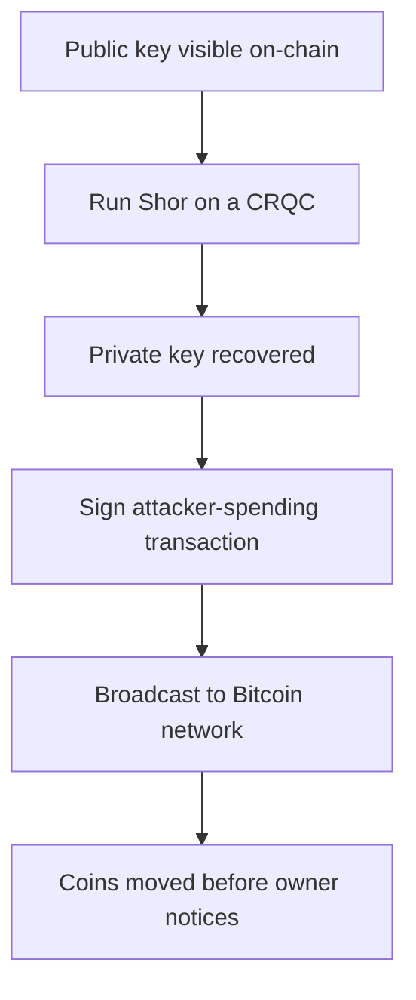
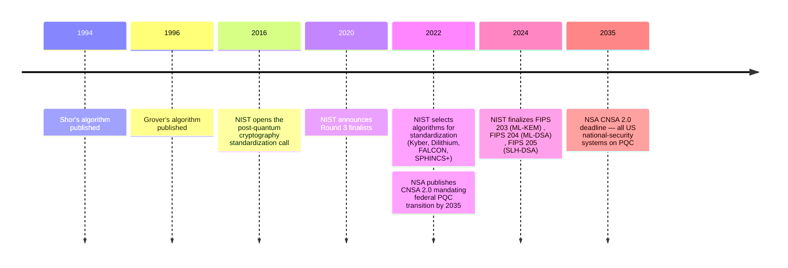

A search engine query for "quantum Bitcoin" returns a steady stream of headlines that read, in effect, *the day Bitcoin breaks is the day the world ends*. This entry takes that framing as its starting point and asks two narrower questions the framing usually conflates: **which Bitcoin assets are actually at risk** from a sufficiently capable quantum computer, and **on what timeline** does that capability arrive. The answers in both cases are more specific — and more bounded — than the headlines suggest.

The entry is not a forecast. The arrival year of a cryptographically relevant quantum computer (CRQC) is not knowable from outside a small group of national labs and hyperscaler research programmes, and even from inside those programmes the estimates span decades. What is documented is the design choices Bitcoin's cryptography made, the institutional record of post-quantum standardization, and the public statements of cryptographers and infrastructure people who have committed to a timeline.

## 1. What a quantum computer actually breaks

Two algorithms matter. They are old (1994 and 1996) and well understood:

- **Shor's algorithm** (1994, formal publication 1997) solves the discrete-logarithm problem in polynomial time on a sufficiently large quantum computer. Bitcoin's signature scheme — ECDSA on the elliptic curve secp256k1 — rests on the assumption that discrete-log on this curve is hard. Shor's algorithm makes that assumption fail: a quantum computer with enough logical qubits and low enough error rates can recover a private key from the corresponding public key.
- **Grover's algorithm** (1996) gives a quadratic speedup for unstructured search. Against SHA-256, this means an attacker can find a preimage in roughly 2^128 quantum operations instead of 2^256 classical operations. 2^128 is still infeasible. Grover *reduces* SHA-256's security; it does not break it.

The asymmetry is the central technical fact of the topic. The signature side of Bitcoin (ECDSA) collapses; the hashing side (SHA-256, RIPEMD-160) bends but does not break. Whatever happens in 2040 or 2060, the proof-of-work mining algorithm itself is not the first thing that fails.

The route from a recovered private key to stolen coins:

The attack only works if the public key has been visible on-chain — a condition that does not hold for every Bitcoin output type.

## 2. What is exposed today

Bitcoin has accumulated several output formats over its life. They expose the public key at different points, and the exposure window is the entire vulnerability surface for a quantum attack on dormant coins. The full per-halving cards and supply curve are on the Archive's [Bitcoin chart page](/BitcoinArchive/chart/) for reference; what matters here is which form the coins are sitting in.

| Output type | Public key on chain when…                              | Quantum exposure                                            |
|---|---|---|
| **P2PK** (Pay-to-Public-Key, 2009-2010 era) | At creation — the public key is the script | **High.** The key is visible from the moment the output is created; any quantum-capable adversary can recover the private key whenever they like. Includes most of the early "Satoshi-era" coins. |
| **P2PKH** (Pay-to-Public-Key-Hash) | At spend — the script holds only `HASH160(pubkey)` until the owner signs | **Low while unspent, high when spent.** Each spend reveals the public key; if the address is then reused, subsequent UTXOs are exposed. |
| **P2WPKH** (Segregated-Witness, BIP 141) | At spend, same as P2PKH | **Low while unspent.** Same exposure pattern as P2PKH. |
| **P2TR** ([Taproot, BIP 341](/BitcoinArchive/entries/bip/2020-01-19-bip-0341/)) | At creation — the 32-byte x-only public key *is* the script | **High.** Taproot deliberately puts the key on-chain to enable key-path spends without revealing the script tree. BIP 341 explicitly notes that this reduces quantum resistance relative to P2WPKH. |
| **P2MR** (Pay-to-Merkle-Root, [BIP 360 draft](/BitcoinArchive/entries/bip/2024-12-17-bip-0360/)) | At spend; the key path is removed, commitment is only the Merkle root of a script tree | **Long-exposure-resistant.** Soft-fork proposal that strips the Taproot key path. Post-quantum signature integration is treated as a separate future proposal. Currently a draft. |

Two consequences follow directly from this table:

- **Coin reuse is the real exposure**, not "Bitcoin" in the abstract. A user who never reuses an address, holds only in P2PKH/P2WPKH, and migrates to a quantum-safe scheme before spending is in a different threat class from a user with P2PK or reused P2PKH outputs.
- **P2TR's design tradeoff is paid in quantum exposure.** Taproot was chosen for spend privacy and aggregation efficiency, not for long-term quantum resistance. The cryptography community accepted this tradeoff knowingly, with the assumption that quantum migration would arrive on a separate, slower clock.

The pool of P2PK coins from the 2009-2010 era — including most of [Satoshi Nakamoto](/BitcoinArchive/participants/satoshi-nakamoto/)'s mined balance — sits in the "high exposure, no migration possible without the keyholder" category. Whether those coins are ever moved is a question Shor's algorithm cannot answer; only the keyholder can.

## 3. The timeline debate

The arrival year of a CRQC capable of running Shor's algorithm against a 256-bit elliptic curve is contested. Two records exist: institutional commitments and public statements.

The institutional record:

The NSA's CNSA 2.0 deadline is the most concrete single number in the debate. Whether one reads it as a *prediction* of when a CRQC will exist or as a *prudential margin* against the chance that one might, the institutional behaviour is consistent: spend the 2020s standardizing post-quantum cryptography; spend the 2030s rolling it out.

The named-individual record (from cryptographers and Bitcoin infrastructure people the Archive holds entries for):

- [Adam Back's November 2025 statement](/BitcoinArchive/entries/aftermath/2025-11-15-adam-back-quantum-threat-timeline/) places the practical quantum threat to Bitcoin at "20-40 years" out, with SLH-DSA-class signatures as the appropriate response. This is the position of one of Bitcoin's named cryptographer-adjacent figures, not a consensus number.
- Industry quantum-hardware roadmaps (IBM, Google) target machines with tens of thousands of physical qubits by the early 2030s. The translation from physical qubits to logical qubits — and from logical qubits to a CRQC running Shor's algorithm on secp256k1 — involves error-correction overheads that are themselves the subject of active research.

The "harvest now, decrypt later" concern raises the timeline question for one specific class of data: anything currently visible on-chain (P2PK, exposed P2TR, revealed P2PKH after spend) is captured *now* by anyone monitoring the chain, and can be attacked *whenever* a CRQC exists. The migration window is not "until a CRQC arrives"; it is "until a CRQC arrives, *minus* the time between now and migration."

## 4. Migration paths

Several proposals address quantum exposure in different ways. The Archive holds the [BIP 360 (P2MR) draft](/BitcoinArchive/entries/bip/2024-12-17-bip-0360/) — a soft-fork output type that behaves like Taproot with the key-path spend removed, committing only to the Merkle root of a script tree. P2MR is resistant to *long-exposure* attacks on elliptic-curve keys (where a public key sits visible on-chain after a spend), but explicitly not to *short-exposure* attacks (where a key revealed in the mempool is recovered before the transaction confirms). BIP 360 itself notes that short-exposure protection would require introducing post-quantum signatures, treated as a separate future proposal. Post-quantum signature schemes themselves — ML-DSA, FALCON, SLH-DSA — would be considerably larger than ECDSA: SLH-DSA signatures are roughly 8-50 KB depending on parameter set, against ECDSA's ~72 bytes.

The proposals trade off along three axes:

- **Signature size.** Lattice schemes (ML-DSA / FALCON) are kilobyte-scale; hash-based (SLH-DSA) is tens of kilobytes; ECDSA is sub-kilobyte. Block-space pressure scales accordingly.
- **Security assumption.** Lattice schemes rest on the hardness of well-studied but younger problems (Module-LWE, Module-SIS). Hash-based schemes (SLH-DSA) rest only on hash-function security and have the smallest "what if this assumption falls" surface. Cryptographers weight these differently.
- **Upgrade compatibility.** A soft-fork hybrid (BIP 360 style) is reversible if the chosen PQC scheme later turns out to be weak; a hard-fork replacement is not. Soft-fork hybrids are preferred for that reason, and they are also slower to deploy because users must opt in.

The migration question for already-issued coins is harder than the question for new coins. New issuance can use a post-quantum scheme by default once one is deployed. Existing P2PK / exposed P2TR / reused P2PKH outputs cannot be migrated *by the protocol* — only by the keyholder signing a transaction with the legitimate private key, while that private key is still uncompromised. Coins whose keyholders are dead, lost, or absent will sit in their current form regardless of what the network does. Several proposals exist for what to do with them — including controversial "use them or lose them" sunset rules — but none has consensus.

## 5. Limits of this entry

The entry presents what the cryptography commits to and what the institutional and named-individual record says. It does not predict an arrival date, and it explicitly does not endorse the "the day Bitcoin breaks is the day the world ends" framing of the title:

- A CRQC's arrival is a research-program outcome whose distribution is not known to outside observers. Estimates from credible sources range from "this decade" (rare, generally from people building the hardware) to "this century or never" (rare, generally from cryptographers concerned about the hardness of error correction). The Archive treats the institutional NSA-2035 line and the named Adam Back 20-40 year line as the two best-documented points.
- Bitcoin's protocol can soft-fork to add post-quantum signature support. That property — not a fixed cryptographic substrate — is what makes the engineering view of this topic differ from the world-ending one.
- The migration risk concentrates on specific UTXO categories, not on Bitcoin as a system. P2PK era coins, exposed P2TR outputs, and reused P2PKH addresses are the high-exposure pool. Coins held in unspent P2PKH/P2WPKH with no reuse, then migrated before a CRQC exists, are in a different threat class.

*[Editor: the title's "world-ending" framing is the framing of the question, not the framing of the answer. The cryptographic record, the standardization record, and the migration-proposal record together describe an engineering problem with a roughly two-decade preparation window — bounded above by the NSA-2035 mandate, bounded below by the absence of a known CRQC today. This entry does not take a position on whether that window is wide enough; it documents the window.]*
