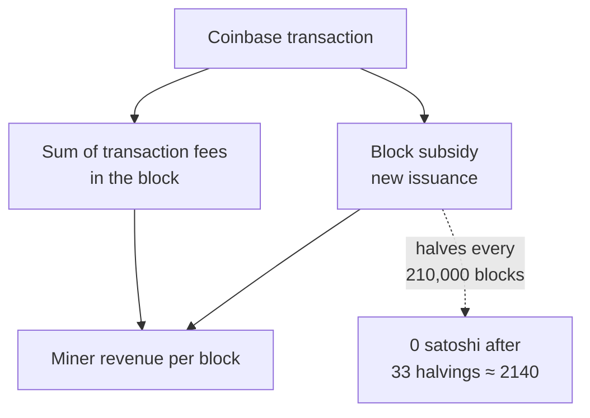

Bitcoin's block subsidy halves every 210,000 blocks. Under the current consensus rules — the rules every full node enforces — there will be 33 halvings, and from roughly the 34th halving onward the integer-satoshi subsidy rounds to zero. Working from a 10-minute target block time and the [January 3, 2009 genesis block](/BitcoinArchive/entries/aftermath/2009-01-03-genesis-block/), the last halving falls around the year 2140. After that point, the only revenue available to a miner who produces a block is the transaction fees the block carries.

This entry sets out what the [Bitcoin whitepaper](/BitcoinArchive/entries/emails/cryptography/2008-10-31-bitcoin-whitepaper-final/) and the consensus code commit Bitcoin to, what Satoshi himself said about the post-subsidy era, and what the documented debate about a fee-only regime looks like. It is not a prediction of network behaviour a century out — no one in 2026 can know what fee markets, hardware economics, or transaction demand will look like in 2140. It is a record of what the design assumes, what it leaves open, and what serious analyses have raised as potential problems.

## 1. What the design commits Bitcoin to

The fee-only regime is not a later interpretation — it is in [Satoshi Nakamoto](/BitcoinArchive/participants/satoshi-nakamoto/)'s original specification. Section 6 of the whitepaper, "Incentive," contains the canonical statement:

> The incentive can also be funded with transaction fees. If the output value of a transaction is less than its input value, the difference is a transaction fee that is added to the incentive value of the block containing the transaction. Once a predetermined number of coins have entered circulation, the incentive can transition entirely to transaction fees and be completely inflation free.

The whitepaper passage describes a two-component block reward, with one component scheduled to vanish:

Two design choices fix this outcome:

- **The halving schedule.** Subsidy starts at 50 BTC, halves every 210,000 blocks. This is enforced by `GetBlockSubsidy()` in Bitcoin Core's `validation.cpp` — the integer-arithmetic right-shift after 33 halvings produces a subsidy of zero satoshis. There is no separate "end of issuance" event; the schedule simply runs out of resolution at the satoshi level. The full per-halving cards, supply curve, and price history are on the Archive's [Bitcoin chart page](/BitcoinArchive/chart/).

- **The 21 million cap.** The cap is not stated as a constant anywhere in the code; it is the *consequence* of summing the geometric series of halvings. The widely cited figure 20,999,999.9769 BTC is what falls out of the arithmetic.

Together these mean Bitcoin cannot reach 2140 with both a subsidy *and* the 21M cap intact. The design forces a choice; the chosen one is to keep the cap and let the subsidy go to zero.

## 2. What Satoshi said about the post-subsidy era

Satoshi's recorded statements on this point are sparse. The whitepaper sentence above is the most direct; the contemporaneous BitcoinTalk discussions are more cautious and treat the transition as an open question rather than a guarantee.

The earliest extended forum thread on subsidy structure is [BitcoinTalk topic 48, "What's with this odd generation?" (February 2010)](/BitcoinArchive/entries/forum/bitcointalk/topic-48/2010-02-14-re-whats-with-this-odd-generation/), where users discovered that some blocks paid more than 50 BTC and learned that the extra amount was the transaction fees the coinbase had swept up. The thread is the first public record of how the two revenue streams compose at the protocol level. It does not contain a statement from Satoshi about the post-2140 case; it documents the mechanism the whitepaper described.

Satoshi made no recorded statement to the effect "fees *will* be sufficient." The whitepaper says they *can* transition; the code makes the transition mandatory; what it does not do is argue that the resulting equilibrium will be safe.

## 3. The security-budget debate

The arguments about whether a fee-only regime is sustainable fall into two main lines.

### 3.1 The sufficiency line

The sufficiency argument is essentially: as the subsidy contracts, blockspace becomes scarcer relative to demand, fees rise, and the aggregate fee revenue per block converges to something close to what the subsidy used to provide. Proponents of this line cite the early halvings — the 2012, 2016, 2020, and 2024 halvings each cut new issuance in half without precipitating a security collapse — as evidence that the network can adapt. The view does not require fees to *match* the historic subsidy in dollar terms; it requires them to fund enough hashpower to make a double-spend attack economically unattractive against the value being transacted.

### 3.2 The instability line

The instability line is most formally stated in **Carlsten, Kalodner, Weinberg, and Narayanan, "On the Instability of Bitcoin Without the Block Reward"** (ACM CCS 2016). The paper argues that even if the *total* fee revenue is large, the *variance* of fee revenue between blocks introduces game-theoretic instabilities the subsidy era did not have:

- **Selfish-mining incentives sharpen.** With a constant subsidy, the cost of withholding a found block to extend a private chain is fixed. With variable fees, a miner who finds a block on top of a high-fee predecessor has an incentive to ignore that predecessor and re-mine it for the fees — a behaviour the paper calls "undercutting."
- **Fee-based forks become rational.** A block whose fees are concentrated in its early transactions can be more profitable to re-mine than to extend.
- **Equilibrium strategies are unstable.** The paper formalises conditions under which no honest-majority strategy is a Nash equilibrium.

The Carlsten result is a theoretical claim about a model, not an empirical observation about a future network. Whether the assumed conditions (in particular, the fee-arrival pattern) hold in 2140 is exactly the question the paper does not answer and cannot answer.

### 3.3 What both lines share

Both positions agree on the structure of the problem: the protocol's long-run security depends on whether transaction fees produce a revenue stream stable enough that a rational miner prefers extending the honest chain to attacking it. They disagree on whether the fee market will deliver that stability without intervention.

## 4. Within the broader monetary-design record

Bitcoin's fixed-supply, declining-subsidy curve is one specific answer to a question pre-Bitcoin cypherpunk monetary designs had also engaged with — and in some cases answered differently.

[Wei Dai](/BitcoinArchive/participants/wei-dai/)'s [b-money proposal (1998)](/BitcoinArchive/entries/aftermath/1998-11-26-wei-dai-pipenet-b-money-announcement/) made monetary expansion explicitly responsive to economic conditions: new money was to be created in proportion to the cost of a standard basket of goods, so the unit of account would track real prices rather than a fixed coin schedule. [Adam Back's contemporaneous critique of b-money](/BitcoinArchive/entries/aftermath/1998-12-06-adam-back-b-money-monetary-critique/) engaged with the economic-policy choices that any such design implicitly takes. Bitcoin's design takes the opposite stance: it commits to a fixed supply schedule and treats the resulting fee market as the policy variable.

Wei Dai himself, in his [2013 retrospective on Bitcoin's monetary policy](/BitcoinArchive/entries/aftermath/2013-04-21-wei-dai-bitcoin-monetary-policy-critique/), recorded his view that the fixed-supply choice was not the design he would have made. That assessment, from the author of one of the protocol's named precursors, is part of the documentary record of the debate — not a verdict on it.

The 2015-2017 [block-size war](/BitcoinArchive/entries/analysis/2015-08-15-bitcoin-fork-wars-as-not-oss/) is sometimes read as the first concrete confrontation between the two positions in this section, because a larger block size raises throughput (and therefore the potential aggregate fee market) at the cost of decentralisation. The war was not fought in those terms publicly; the parties argued about throughput and decentralisation, not about 2140. But the load-bearing question underneath — what makes the network secure once the subsidy is gone — is the same question.

## 5. Limits of this entry

This entry is a record of design commitments and a documented debate. It is not a forecast.

- The arithmetic that produces the figure "around 2140" assumes the 10-minute block target holds and the halving schedule is not altered. Both are true today; both are consensus rules that can in principle be changed by the network. Neither has been seriously proposed for change in any forum the Archive holds.
- The economic arguments in §3 model an idealised game. Actual mining economics in 2140 will depend on hardware cost curves, energy markets, fee demand, and protocol changes that have not happened yet. No paper from 2016 can answer those questions.
- This entry takes no position on whether the fee-only transition will succeed. The Archive's role is to record what Satoshi wrote, what the code commits the network to, and what serious analyses have raised.

*[Editor: the year 2140 is a consequence of consensus rules in force today, not a fixed prophecy. If the network ever altered the block target or the halving schedule, the date would move. The Archive treats 2140 as the date the *current* design produces, in the same way the 21 million cap is the *current* design's consequence rather than a separately enforced number.]*
