This entry is written to be readable without prior background — no prior knowledge of Bitcoin, cryptography, or how computers exchange data is assumed. By the time you reach the bottom, you should be able to read the rest of the Archive without getting lost in jargon. Every key term gets a one-line definition the first time it appears, plus a diagram showing where it fits.

If you want to look up a single word, jump to the [Quick reference glossary](#2-quick-reference-glossary). Otherwise read top-to-bottom — each chapter assumes only what the previous chapters covered.

## 1. What is Bitcoin, exactly?

Bitcoin is an electronic money system that works without a bank in the middle. The dollars in your bank account are entries in a database your bank controls — if the bank goes offline, freezes your account, or makes a mistake, you are stuck. Bitcoin replaces that single controlling bank with **a network of thousands of computers, run by anyone who wants to participate, none of them in charge**.

Each of those computers is called a **node**. Nodes talk to each other directly, not through any central server. That style of network is called **peer-to-peer**, often abbreviated **P2P**.

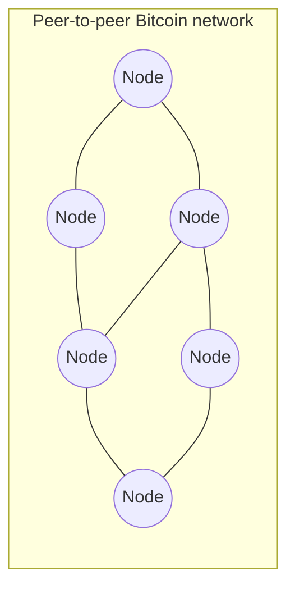

<!-- audit:quote-skip -->
> **Node** — a computer running Bitcoin software, connected to other Bitcoin nodes. Anyone can run one.
> **Peer-to-peer (P2P)** — a network where computers talk to each other directly, with no central server in the middle.

The rules of the system are defined by a short paper [Satoshi Nakamoto](/BitcoinArchive/participants/satoshi-nakamoto/) published in 2008, the [Bitcoin whitepaper](/BitcoinArchive/entries/emails/cryptography/2008-10-31-bitcoin-whitepaper-final/). The software was released two months later, in January 2009, and has been running continuously ever since.

One refinement before we move on. The node described above — the kind that stores the entire blockchain and independently verifies every rule — is called a **full node**. A lighter variant called a **light node**, or **SPV** client (for *simplified payment verification*), only downloads a tiny summary at the top of each block (the **block header**) and asks full nodes whether specific transactions exist. Many phone wallets run on SPV; many others use a still simpler model — querying a central server API operated by the wallet provider — which is even lighter but trusts the provider for everything. The whitepaper's § 8 sketches the SPV idea; the production engineering came years later, driven largely by [Mike Hearn's bitcoinj work](/BitcoinArchive/entries/correspondence/mike-hearn/more-questions/2010-12-30-hearn-to-satoshi-spv-progress/). For the rest of this entry, "node" means full node unless stated otherwise.

The rest of this entry explains, step by step, how that runs-by-itself system actually works.

## 2. Quick reference glossary

Use this as a lookup table. Each term links to the chapter where it is explained with a diagram.

| Term | Meaning |
|---|---|
| [Node](#1-what-is-bitcoin-exactly) | A computer running Bitcoin software |
| [Full node](#1-what-is-bitcoin-exactly) | Node holding the whole blockchain and verifying every rule (assumed kind here) |
| [Light node (SPV)](#1-what-is-bitcoin-exactly) | Node downloading only block headers, trusting full nodes for the rest (typical on phones) |
| [Peer-to-peer (P2P)](#1-what-is-bitcoin-exactly) | Direct computer-to-computer network, no central server |
| [Wallet](#3-what-a-coin-actually-is-the-utxo-model) | Software that holds your keys and lets you send/receive bitcoins |
| [Private key](#3-what-a-coin-actually-is-the-utxo-model) | A secret number; whoever holds it controls the coins |
| [Public key](#3-what-a-coin-actually-is-the-utxo-model) | A number derived from the private key; safe to share |
| [Address](#3-what-a-coin-actually-is-the-utxo-model) | A short text string derived from the public key, for receiving coins |
| [Digital signature](#3-what-a-coin-actually-is-the-utxo-model) | Cryptographic proof that the holder of a private key authorised something |
| [Transaction](#3-what-a-coin-actually-is-the-utxo-model) | A message that moves coins from one or more inputs to one or more outputs |
| [Input](#3-what-a-coin-actually-is-the-utxo-model) | A reference to a previous output you are now spending |
| [Output](#3-what-a-coin-actually-is-the-utxo-model) | A new chunk of coins, locked to a recipient address |
| [UTXO](#3-what-a-coin-actually-is-the-utxo-model) | An unspent output — the actual form a "coin" takes |
| [BTC / satoshi](#3-what-a-coin-actually-is-the-utxo-model) | The unit (1 BTC = 100,000,000 satoshi) |
| [Block](#4-blockchain-the-permanent-record) | A batch of transactions, packaged together |
| [Hash](#4-blockchain-the-permanent-record) | A short fingerprint number computed from any data |
| [Hash function](#4-blockchain-the-permanent-record) | The function that produces a hash; tiny input change = totally different hash |
| [Blockchain](#4-blockchain-the-permanent-record) | All the blocks, chained together by hashes, oldest to newest |
| [Genesis block](#4-blockchain-the-permanent-record) | The very first block, Block 0 |
| [Block height](#4-blockchain-the-permanent-record) | The position number of a block in the chain (Block 0 is height 0) |
| [Miner](#5-mining-issuance-and-validation) | A node that tries to add new blocks |
| [Mining](#5-mining-issuance-and-validation) | The process of trying to add a new block |
| [Nonce](#5-mining-issuance-and-validation) | A number a miner keeps changing to find a valid block hash |
| [Proof-of-work (PoW)](#5-mining-issuance-and-validation) | The puzzle a miner must solve to add a block |
| [Difficulty](#5-mining-issuance-and-validation) | How hard the puzzle currently is |
| [Coinbase transaction](#5-mining-issuance-and-validation) | The special first transaction in a block that creates new bitcoins |
| [Block reward](#5-mining-issuance-and-validation) | New bitcoins minted in the coinbase transaction |
| [Transaction fee](#5-mining-issuance-and-validation) | A small extra amount included with a transaction, paid to the miner |
| [Miner reward](#5-mining-issuance-and-validation) | Block reward + total transaction fees in the block |
| [Halving](#5-mining-issuance-and-validation) | The block reward cut in half every 210,000 blocks (~4 years) |
| [Mempool](#6-mempool-the-waiting-room) | The waiting room of transactions not yet in a block |
| [Confirmation](#6-mempool-the-waiting-room) | One block added on top of yours; more confirmations = more permanent |
| [Consensus](#7-consensus-and-tamper-resistance) | All nodes agreeing on the same blockchain |
| [Verification](#7-consensus-and-tamper-resistance) | A node checking that a transaction or block follows the rules |
| [Double-spending](#7-consensus-and-tamper-resistance) | The attempt to spend the same coin twice; the problem Bitcoin solves |
| [Tampering](#7-consensus-and-tamper-resistance) | Trying to change a block after the fact |
| [Longest chain](#7-consensus-and-tamper-resistance) | The chain with the most accumulated work; the one all honest nodes follow |

## 3. What a coin actually is: the UTXO model

A "bitcoin" is not a coin object sitting somewhere with your name on it. It is much closer to a **receipt**.

Imagine you receive 1 BTC from a friend. What you actually receive is a transaction record on the network that says: *"this 1 BTC chunk is now locked to the address that this private key can unlock."* The chunk is called an **output**. As long as you have not spent it, it is called an **unspent output** — abbreviated **UTXO** (Unspent Transaction Output). Your "balance" is the sum of every UTXO locked to addresses your **wallet** can unlock.

To spend bitcoins, your wallet builds a new **transaction** that:

1. Lists one or more existing UTXOs as **inputs** (the coins you're consuming),
2. Creates one or more new **outputs** (the new chunks of coins, locked to recipient addresses),
3. Signs the whole thing with the **private keys** that control the inputs.

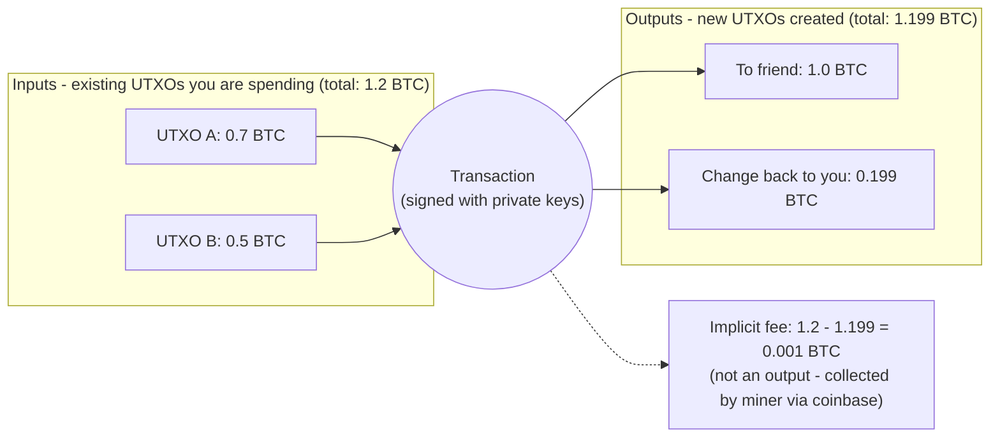

Inputs are always entire UTXOs — you cannot spend "half" of a UTXO. If you owe 1 BTC but your only UTXO is 1.2 BTC, the transaction spends the whole 1.2 BTC, creates one 1.0 BTC output to the recipient, and creates another ~0.199 BTC output back to your own wallet (called **change**). The remaining 0.001 BTC, not assigned to any output, becomes the **transaction fee** the miner who includes this transaction collects (chapter 5).

The amounts use **BTC** as the unit you usually see, but internally Bitcoin counts in **satoshi**: 1 BTC = 100,000,000 satoshi. The smallest unit you can transfer is 1 satoshi, named after the system's author.

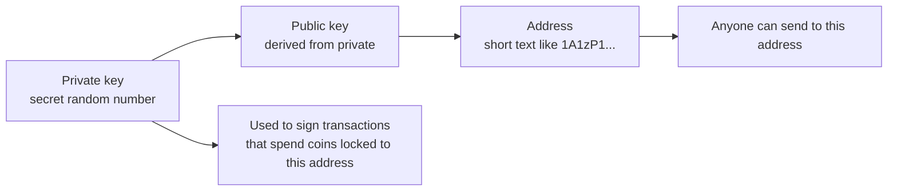

The **private key** is the only thing that matters for control. Lose it, and the coins locked to its address are unrecoverable. The **public key** and **address** are derived from the private key by one-way mathematics; sharing them is safe. The **digital signature** is a piece of data the wallet generates from the private key plus the transaction itself; anyone in the network can verify the signature is valid for that address without ever seeing the private key.

The [Bitcoin whitepaper](/BitcoinArchive/entries/emails/cryptography/2008-10-31-bitcoin-whitepaper-final/) covers this in Section 2 ("Transactions").

## 4. Blockchain: the permanent record

Transactions broadcast across the peer-to-peer network are not immediately final. They are batched into **blocks** — packages of transactions that all became official at roughly the same moment. Blocks are produced about every 10 minutes on average.

Each block contains its own short fingerprint called a **hash**. A hash is computed by a **hash function** — a piece of math that turns any input data (a block, a sentence, a file, anything) into a fixed-size short number. Two important properties of the hash function Bitcoin uses (SHA-256):

- Even a one-character change to the input produces a completely different hash.
- You cannot work backwards from the hash to figure out the input.

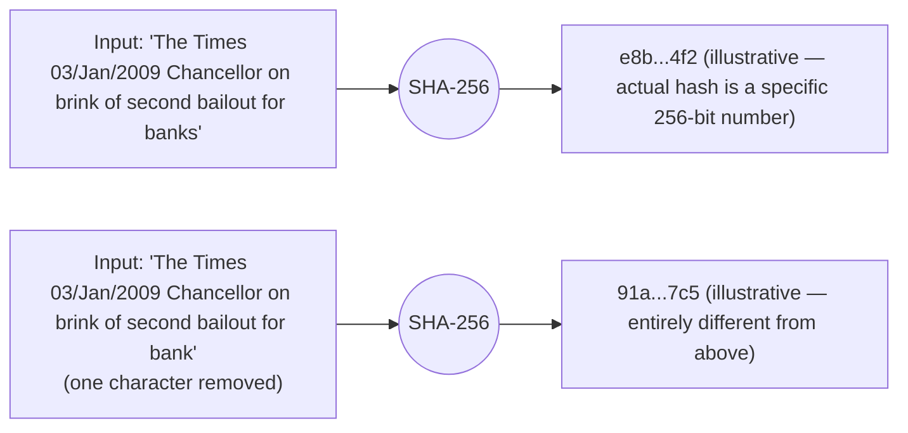

Each new block also includes the hash of the previous block inside itself. That linking is what makes it a **chain**: every block points backwards to the one before it, all the way back to the very first block ever produced.

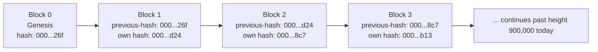

The very first block is called the **[genesis block](/BitcoinArchive/entries/aftermath/2009-01-03-genesis-block/)** (or Block 0). It is special — its parameters were hardcoded into the source by Satoshi rather than mined; the [genesis-block hardcode analysis](/BitcoinArchive/entries/analysis/2009-01-03-genesis-block-hardcode-analysis/) reads the v0.1 source for the details. Every block's position counted from Block 0 is called its **block height**: the genesis is height 0, the next block is height 1, and so on.

The whole linked structure — genesis to the most recent block — is the **blockchain**. Everyone running a node has the same copy of it.

## 5. Mining: issuance and validation

Before going into mining itself, three terms that sound similar but are not the same thing:

- A **node** runs the Bitcoin software and verifies the chain — that is its job.
- A **miner** is a node that *also* spends compute power racing to produce the next block.
- A **wallet** is software that manages your keys and builds transactions; it can live inside a node, talk to a node, or sit on a phone with no full node at all.

Mining is a strictly added activity on top of being a node. A wallet is a separate concern again — a phone wallet usually talks to someone else's node, often via SPV (chapter 1). Bitcoin Core ships all three roles in one program, which is the most common reason these terms get conflated.

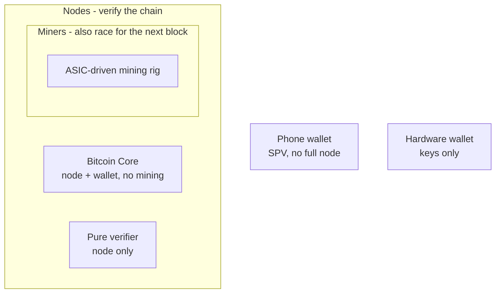

So who decides which transactions go into the next block, and where do new bitcoins come from?

The answer is **mining**. Any node willing to do the work can be a **miner**. Miners collect waiting transactions, package them into a candidate block, and then race to solve a puzzle. The puzzle is: *find a number to put in the block such that the block's hash starts with a certain number of zeros.* That number you keep changing is called the **nonce**. Because the hash function (chapter 4) gives completely unpredictable outputs, the only way to find a winning nonce is to keep trying. This trying-millions-of-numbers process is called **proof-of-work** (often abbreviated **PoW**) — first proposed for spam control in [Adam Back's 1997 Hashcash](/BitcoinArchive/entries/aftermath/1997-03-28-adam-back-hashcash-announcement/), reused in Bitcoin as the core mechanism.

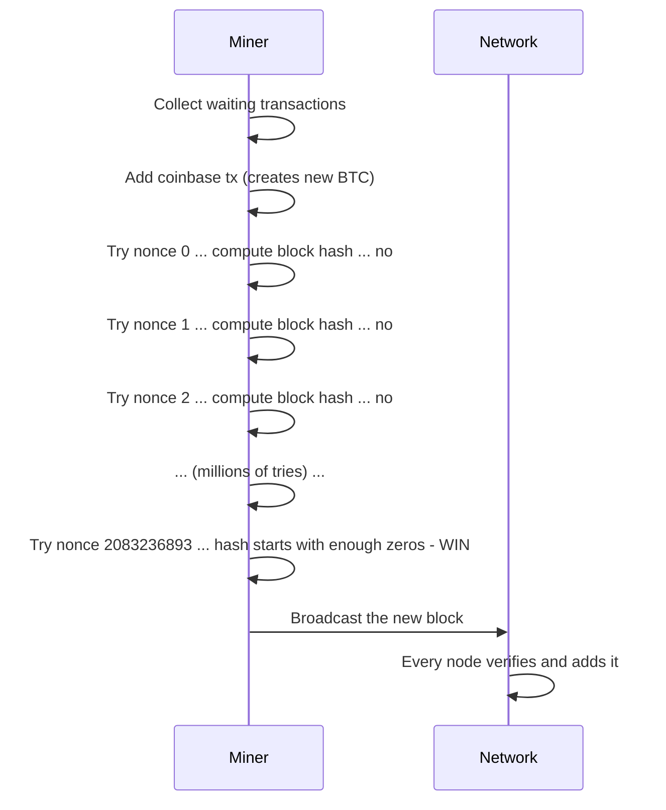

How many leading zeros are required is called the **difficulty**. The network adjusts the difficulty every 2,016 blocks (about every two weeks) so that, regardless of how much total computing power miners throw at the puzzle, a winning block is found roughly every 10 minutes on average.

The miner who wins gets to insert one special transaction at the top of the block — the only transaction in Bitcoin whose input doesn't reference any previous output (it consumes no prior coins). This is the **[coinbase transaction](/BitcoinArchive/entries/aftermath/2009-01-03-genesis-block/)**, and the outputs it creates are the only way new bitcoins ever come into existence. The amount it creates is called the **block reward**. On top of that, the miner also collects all the **transaction fees** attached to the regular transactions they included. Together, those two amounts form the **miner reward**.

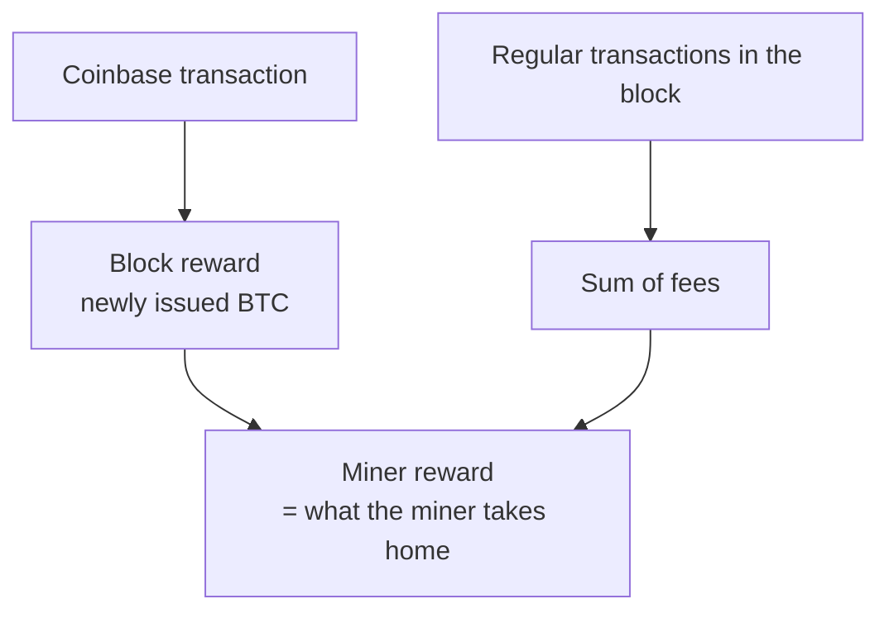

The block reward is not constant. It started at **50 BTC per block** in January 2009 and cuts in half every 210,000 blocks — about every four years. This event is called the **halving** (sometimes written *halvening*). After enough halvings, the block reward becomes 0 satoshi, and miners earn only transaction fees. The total number of bitcoins that will ever exist is the sum of every block reward across this schedule and works out to a hair under **21 million BTC**. The deeper consequences of the schedule are worked through in [the mining-reward exhaustion analysis](/BitcoinArchive/entries/analysis/2026-05-18-mining-reward-exhaustion-fee-only-future/).

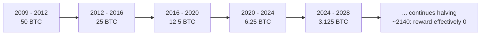

**Why almost no nodes actually mine.** "Any node can be a miner" is true at the protocol level, but in practice almost no nodes do. Modern mining requires industrial-scale **ASIC** hardware (*application-specific integrated circuit* chips that compute Bitcoin's hash function and nothing else, using far less electricity per attempt than any general-purpose computer can). The industrial ASIC era began in 2013, *after* Satoshi's 2011 disappearance — so the Satoshi-era "one-CPU-one-vote" picture is the original design intent, not the operational reality on the ground today. The full story of that drift (along with three other axes where current Bitcoin differs from Satoshi's design) is the companion entry [Satoshi's design intent vs Bitcoin's current reality](/BitcoinArchive/entries/analysis/2026-05-24-satoshi-design-vs-current-reality/).

## 6. Mempool: the waiting room

When you send a transaction, it does not appear in a block instantly. First, it travels through the peer-to-peer network and lands in the **mempool** of each node — the local waiting room of transactions not yet packaged into a block. Miners pick from the mempool when assembling a candidate block, and they tend to pick transactions with higher fees first because fees go directly to them.

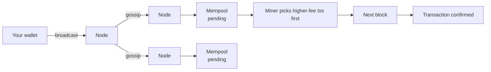

Once your transaction is in a block, it has one **confirmation**. The block that comes after — building on top of yours — adds a second confirmation. Each additional block on top adds another confirmation and makes the transaction exponentially harder to reverse. Six confirmations is the long-standing rule-of-thumb threshold for "essentially final."

## 7. Consensus and tamper-resistance

If anyone with a computer can be a miner, what stops a malicious miner from inventing transactions, undoing yours, or printing themselves a million BTC?

Two design ideas, working together:

**1. Verification by every node.** When a miner broadcasts a new block, every node independently checks: are the signatures on every transaction valid? Are the coins being spent actually unspent UTXOs (not already used)? Does the block hash satisfy the proof-of-work? Does the coinbase reward match the schedule? If any check fails, the node rejects the block. A miner who tries to insert an invalid transaction simply produces a block the rest of the network refuses to accept.

**2. The longest chain wins.** Once in a while, two miners legitimately find a valid block at nearly the same moment. The network briefly has two competing chains. The next block built on either one breaks the tie — the chain that gets the next block first is now the **longest chain** (technically: the chain with the most accumulated proof-of-work), and the orphaned block is dropped. Every honest node always follows whichever chain is longest.

This second rule is what makes **tampering** structurally hopeless. Suppose an attacker wants to change a transaction in a block from 100 blocks ago — maybe to undo a payment they made. Changing the transaction changes the block's hash, which breaks the next block's "previous hash" link, which breaks the block after that, all the way to the tip. The attacker must redo all 100 blocks' proof-of-work from scratch — and meanwhile every honest miner in the world is extending the real chain. The attacker will never catch up unless they control more total computing power than the entire honest network combined.

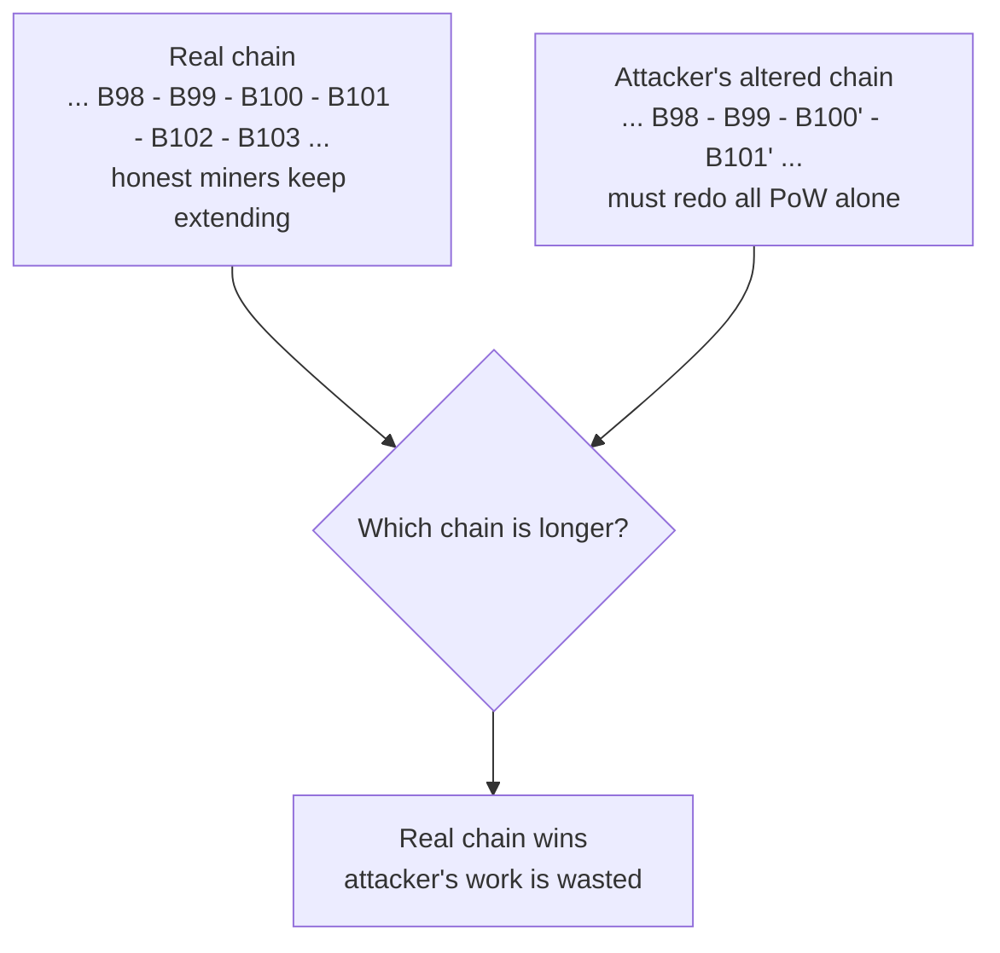

This is also how **double-spending** is prevented. If a malicious user broadcasts two conflicting transactions that try to spend the same UTXO twice, one of them gets into the chain first and the other is rejected by every node (the UTXO is no longer unspent). The race is decided in minutes, not by trust.

The agreement on a single canonical chain across all nodes — emerging from these mechanical rules, with no central coordinator — is what is called **consensus**.

## 8. Where to read next

The chapters above are the model. From here, every term you saw can be followed deeper:

- The [Bitcoin system design overview](/BitcoinArchive/entries/design/2009-01-03-bitcoin-system-design-overview/) — the design-document index that expands every term in this entry across eleven areas (consensus, blockchain, P2P network, wallet, cryptography, transaction, monetary, security, storage, architecture evolution, ecosystem). Start here for a systematic deep dive.
- The [Bitcoin whitepaper](/BitcoinArchive/entries/emails/cryptography/2008-10-31-bitcoin-whitepaper-final/) — the original 8-page description Satoshi published in October 2008. Now that you have the terms, it is short and readable.
- The [genesis block](/BitcoinArchive/entries/aftermath/2009-01-03-genesis-block/) — what Satoshi etched into the very first block, and why.
- The [genesis block hardcode analysis](/BitcoinArchive/entries/analysis/2009-01-03-genesis-block-hardcode-analysis/) — the technical story of how Block 0 was constructed and why its 50 BTC reward can never move.
- [Adam Back's 1997 Hashcash announcement](/BitcoinArchive/entries/aftermath/1997-03-28-adam-back-hashcash-announcement/) — the proof-of-work scheme Bitcoin reused at its core.
- [The mining-reward exhaustion analysis](/BitcoinArchive/entries/analysis/2026-05-18-mining-reward-exhaustion-fee-only-future/) — what happens to miner economics when the block reward eventually reaches zero.
- [The Bitcoin design lineage analysis](/BitcoinArchive/entries/analysis/2008-10-31-bitcoin-design-lineage/) — which parts of Bitcoin came from prior work, which parts were genuinely new.
- [Satoshi's design intent vs Bitcoin's current reality](/BitcoinArchive/entries/analysis/2026-05-24-satoshi-design-vs-current-reality/) — the companion entry that maps the four axes (mining, custody, governance, scaling) where today's Bitcoin diverges from the design above. Read this *after* the protocol chapters here.
- [Mike Hearn's December 2010 SPV progress letter](/BitcoinArchive/entries/correspondence/mike-hearn/more-questions/2010-12-30-hearn-to-satoshi-spv-progress/) — the practical engineering behind light-node wallets.
- [The Bitcoin transaction design](/BitcoinArchive/entries/design/2009-01-03-bitcoin-transaction-design/) — the UTXO model, Bitcoin Script, and what a valid spend looks like, at the design-document level of detail behind the transaction terms above.
