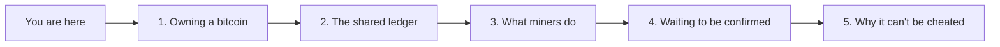

Suppose your bank's computers went dark tomorrow. Your balance, your transaction history, your ability to pay anyone — all of it lives in one company's database, and none of it is yours to touch directly. You are trusting that one institution to keep an accurate ledger and to let you use it.

Bitcoin answers a narrower question than "what if that trust breaks": can a ledger of who-owns-what be kept accurately **without any single keeper**, by thousands of independent computers who don't know or trust each other, using nothing but math and a set of shared rules? [Satoshi Nakamoto](/BitcoinArchive/participants/satoshi-nakamoto/) described how to do this in a short 2008 paper, the [Bitcoin whitepaper](/BitcoinArchive/entries/emails/cryptography/2008-10-31-bitcoin-whitepaper-final/), and the software has been running that answer, unattended, every ten minutes, since January 2009.

This guide assumes nothing about your starting point — not the word "blockchain," not what a cryptographic key is, nothing beyond an everyday familiarity with money and receipts. It is five short pages, each answering one plain-language question:

1. **[What owning a bitcoin actually means](/BitcoinArchive/entries/analysis/2026-09-06-what-owning-a-bitcoin-actually-means/)** — if there's no coin object anywhere, what do you actually hold?
2. **[How transactions become a shared ledger](/BitcoinArchive/entries/analysis/2026-09-06-how-transactions-become-a-shared-ledger/)** — how thousands of computers end up holding the exact same record.
3. **[What miners are actually racing to do](/BitcoinArchive/entries/analysis/2026-09-06-what-miners-are-actually-racing-to-do/)** — where new bitcoins come from, and why it takes a race to get them.
4. **[What happens while a payment is unconfirmed](/BitcoinArchive/entries/analysis/2026-09-06-what-happens-while-a-payment-is-unconfirmed/)** — the waiting room your payment sits in before it's official.
5. **[Why no one can cheat the ledger](/BitcoinArchive/entries/analysis/2026-09-06-why-no-one-can-cheat-the-ledger/)** — the part that makes the whole system trustworthy without a trusted party.

Read them in order the first time; each one leans on the page before it. Once you've been through all five, the short glossary below works as a standalone lookup — every row links to the page that actually explains the term, not just names it.

## Look up a term

| Term | Explained on |
|---|---|
| Wallet, private key, public key, address, signature | [1. Owning a bitcoin](/BitcoinArchive/entries/analysis/2026-09-06-what-owning-a-bitcoin-actually-means/) |
| UTXO, transaction, input, output, change | [1. Owning a bitcoin](/BitcoinArchive/entries/analysis/2026-09-06-what-owning-a-bitcoin-actually-means/) |
| Block, hash, blockchain, genesis block, node | [2. The shared ledger](/BitcoinArchive/entries/analysis/2026-09-06-how-transactions-become-a-shared-ledger/) |
| Peer-to-peer network | [2. The shared ledger](/BitcoinArchive/entries/analysis/2026-09-06-how-transactions-become-a-shared-ledger/) |
| Mining, miner, nonce, proof-of-work, difficulty, block reward, halving | [3. What miners do](/BitcoinArchive/entries/analysis/2026-09-06-what-miners-are-actually-racing-to-do/) |
| Mempool, transaction fee, confirmation | [4. Waiting to be confirmed](/BitcoinArchive/entries/analysis/2026-09-06-what-happens-while-a-payment-is-unconfirmed/) |
| Verification, consensus, longest chain, double-spending | [5. Why it can't be cheated](/BitcoinArchive/entries/analysis/2026-09-06-why-no-one-can-cheat-the-ledger/) |

## Where to go after this

Once the five pages above feel solid, two directions are worth taking:

- The [Bitcoin whitepaper](/BitcoinArchive/entries/emails/cryptography/2008-10-31-bitcoin-whitepaper-final/) itself — nine pages, and considerably more readable once you already have the vocabulary.
- The [Bitcoin system design overview](/BitcoinArchive/entries/design/2009-01-03-bitcoin-system-design-overview/) — the archive's technical design-document series, which goes back through the same ground at implementation depth: exact algorithms, parameter values, and the protocol's evolution since Satoshi's original code.
