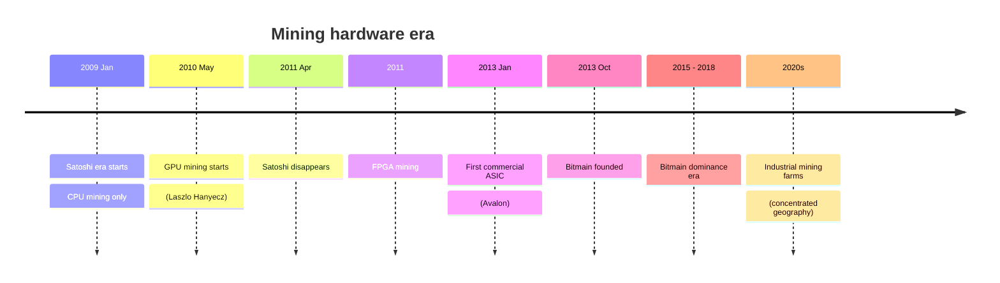
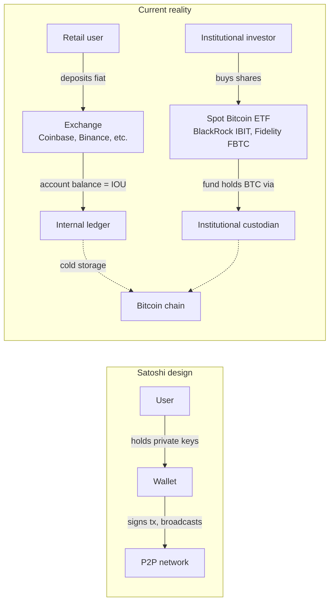
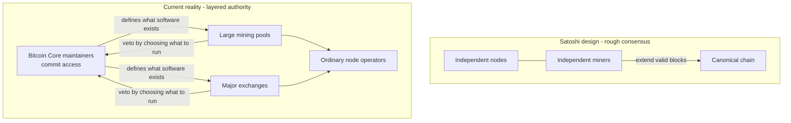
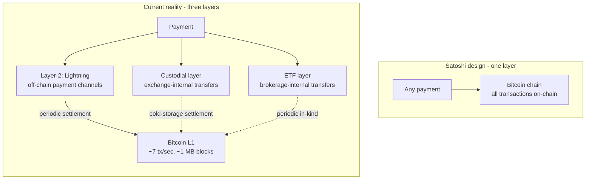

Bitcoin's protocol still runs almost unchanged from the rules [Satoshi Nakamoto](/BitcoinArchive/participants/satoshi-nakamoto/) wrote down in 2008. But the *user experience*, the *economic structure*, and the *governance reality* of the system have drifted considerably from what Satoshi appears to have designed for. Reading the [whitepaper](/BitcoinArchive/entries/emails/cryptography/2008-10-31-bitcoin-whitepaper-final/) or the [visual glossary](/BitcoinArchive/entries/analysis/2026-05-23-how-bitcoin-works-visual-glossary/) gives a faithful picture of the protocol but a misleading picture of what most users actually touch. This entry walks four axes where the gap is largest, with pointers to the records.

| Axis | Satoshi's design | Current reality | Drift started |
|---|---|---|---|
| **Mining** | "one-CPU-one-vote" | ASIC oligopoly | 2010 GPU, 2013 ASIC |
| **Custody** | Each user holds private keys | Exchange IOUs / ETF wrappers | 2011 onwards (Mt. Gox) |
| **Governance** | Rough consensus among nodes | Bitcoin Core maintainers + large miners | Dec 2010 (Satoshi → Gavin handover) |
| **Scaling** | Direct P2P transactions | Layer-2 (SegWit/Lightning) + custodial off-chain | 2010 1 MB cap, 2017 SegWit |

## 1. Mining — "one-CPU-one-vote" → ASIC oligopoly

**Satoshi wrote** (whitepaper § 4, "Proof-of-Work"): *"Proof-of-work is essentially one-CPU-one-vote."* The implicit assumption was that mining would stay on general-purpose computers — anyone with a PC could participate, and the network's defence rested on a wide population of ordinary nodes also producing blocks.

**The reality.** Mining moved off PCs onto purpose-built chips called **ASICs** in 2013. Bitcoin's first commercial ASIC was the Avalon ASIC (January 2013); [Bitmain](/BitcoinArchive/participants/jihan-wu/), founded later that year, became the dominant manufacturer through the 2015 – 2018 era. A modern ASIC computes Bitcoin's hash function tens of millions of times faster per kilowatt-hour than any general-purpose computer, which means a PC running against ASIC competition burns electricity and produces nothing. Mining today is a heavy-industrial activity concentrated in a handful of pools and a handful of geographies, not a participatory side-activity of running a node.

**When the drift started.** GPU mining started in May 2010 (Laszlo Hanyecz, the same developer who later paid 10,000 BTC for pizza). Satoshi pushed back at the time, asking Hanyecz to slow down — see [Laszlo Hanyecz's biography](/BitcoinArchive/participants/laszlo-hanyecz/) for the recorded conversation. FPGA mining followed in 2011, and ASIC mining in 2013. Satoshi disappeared in April 2011, so the entire ASIC era is post-Satoshi — Satoshi saw the GPU drift starting and was uneasy about it, then left.

**The centralisation consequence.** Worked through in [Ray Dillinger's 2018 interview](/BitcoinArchive/entries/aftermath/2018-10-01-ray-dillinger-interview/) and in [the mining-reward exhaustion analysis](/BitcoinArchive/entries/analysis/2026-05-18-mining-reward-exhaustion-fee-only-future/).

## 2. Custody — own your keys → exchange IOUs (and ETF wrappers)

**Satoshi wrote** (whitepaper § 1, "Introduction"): *"What is needed is an electronic payment system based on cryptographic proof instead of trust, allowing any two willing parties to transact directly with each other without the need for a trusted third party."* The design assumes each user holds their own private keys — that is the only way you can sign transactions yourself.

**The reality.** The overwhelming majority of people who "own bitcoin" today do not hold any keys. They have an account balance at an exchange — Coinbase, Binance, Kraken, etc. — which is exactly the "trusted third party" the whitepaper opens by ruling out. Functionally these are bitcoin-denominated IOUs from custodial businesses, indistinguishable from a brokerage account. The community shorthand for this is *"not your keys, not your coins."*

**The institutional limit: spot ETFs.** The trend went further in January 2024 when the US SEC approved the first spot Bitcoin ETFs (BlackRock IBIT, Fidelity FBTC, etc.). ETF shareholders hold no bitcoin at all — only equity in a fund whose custodian holds bitcoin on their behalf. Within months these ETFs collectively held several hundred thousand BTC. This is the custody axis taken to its institutional limit: the "peer-to-peer electronic cash" of the whitepaper has, for most retail and institutional money, become a traditional asset class accessed through brokerage plumbing.

**Why it matters.** When the custodian fails, the IOU does not pay out. The [Mt. Gox bankruptcy in February 2014](/BitcoinArchive/entries/aftermath/2014-02-28-mt-gox-bankruptcy/) lost roughly 850,000 BTC of customer holdings; the [FTX collapse in November 2022](/BitcoinArchive/entries/aftermath/2022-11-11-ftx-collapse/) repeated the pattern with a different generation of operators. In each case the affected users had no protocol-level claim on any coin — they had a contractual claim against an insolvent company. This is the bank-failure mode Bitcoin was designed to make impossible at the protocol level, recreated above the protocol by user choice and product design.

## 3. Governance — distributed consensus → core developers + large miners

**Satoshi wrote** (whitepaper § 5, "Network"): *"They [nodes] vote with their CPU power, expressing their acceptance of valid blocks by working on extending them..."* The picture is of consensus emerging mechanically from the work of many independent operators, with no privileged decision-maker.

**The reality.** Protocol changes today are gated by the Bitcoin Core software's maintainer team (a small group of contributors with commit access). Large mining pools and the major exchange operators effectively veto changes by deciding what software to run. Ordinary node operators participate by choosing which version to install, but the menu of choices is set by a small specialist community.

**When the drift started.** Three inflection points:
- December 2010: [Satoshi handed maintenance authority to Gavin Andresen](/BitcoinArchive/entries/aftermath/2011-04-26-satoshi-final-known-email/), without consulting Gavin first. Gavin in turn added four other developers to the commit list — chosen for being present and helpful rather than through any formal process. That is the seed of the modern Core maintainer team.
- 2015 – 2017: The block size war. See [Bitcoin Fork Wars as Not OSS](/BitcoinArchive/entries/analysis/2015-08-15-bitcoin-fork-wars-as-not-oss/). The conflict was decided by which mining pools ran which client, and the resolution mechanism was a hard fork (Bitcoin Cash) — not the rough consensus Satoshi described.
- January 2016: [Mike Hearn declared the Bitcoin experiment failed](/BitcoinArchive/entries/aftermath/2016-01-14-mike-hearn-resolution-bitcoin-experiment/) and sold all his coins, citing the governance breakdown directly.

## 4. Scaling — direct P2P transactions → layer-2 / off-chain

**Satoshi wrote** (whitepaper § 1, "Introduction"): *"...allowing any two willing parties to transact directly with each other..."*. The implicit model was that ordinary payments would land on chain.

**The reality.** Bitcoin's 1 MB historical block size limit caps the chain at roughly 7 transactions per second (much less under realistic transaction sizes). Routine retail payments cannot fit; even if they could, fees would price them out during peak load. The actual scaling path has been two-layer: SegWit (BIP 141, activated 2017) made room for the Lightning Network, where payments move off chain and only periodic settlements touch the base layer. Custodial exchanges *also* function as scaling layers — internal transfers between two Coinbase accounts never reach the chain.

**The drift began** with the block-size discussion in 2010 (Satoshi's own provisional 1 MB cap, intended as anti-spam) and crystallised through the 2015 – 2017 [fork wars](/BitcoinArchive/entries/analysis/2015-08-15-bitcoin-fork-wars-as-not-oss/). Bitcoin today is not the P2P cash system the whitepaper described; it is a settlement layer under several stacked payment systems with varying degrees of trust.

## What this is not

Pointing out drift is not arguing that Bitcoin failed. Some of these drifts are arguably unavoidable consequences of mass adoption: ASIC specialisation is what any economically valuable proof-of-work attracts, custodial exchanges exist because most people do not want the responsibility of key management, layer-2 scaling is the conservative path that preserves base-layer security. The point of this entry is only that any beginner-level description of Bitcoin that *omits* these four drifts is incomplete — readers will encounter the drifts in practice the moment they actually use a service, and reconciling the gap themselves without a map is harder than acknowledging the gap up front.

The [visual glossary](/BitcoinArchive/entries/analysis/2026-05-23-how-bitcoin-works-visual-glossary/) describes the protocol as Satoshi designed it. This entry is its companion: the protocol is real and runs; the operational reality on top of it is also real, and is not the same thing.
