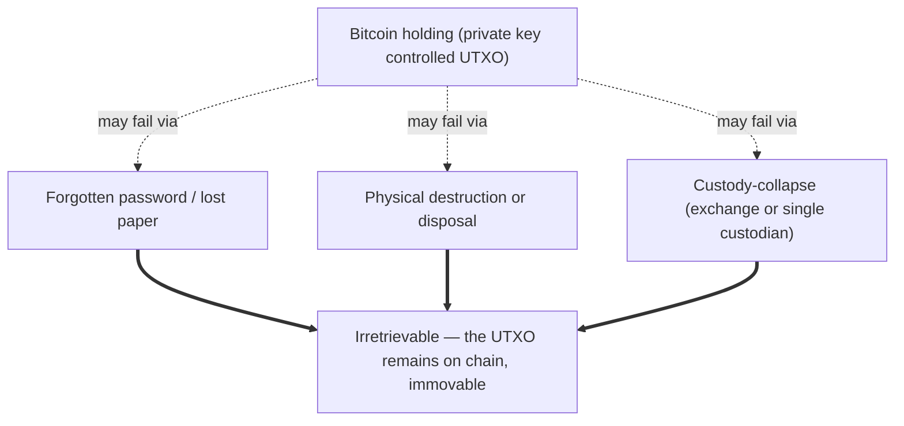

Bitcoin's protocol has no recovery mechanism. There is no support line, no court order, no master key, and no central authority that can re-issue a UTXO whose private key has been destroyed, lost, or never existed in transferable form. This is not a defect: it is a deliberate design choice that flows directly from the whitepaper's elimination of trusted third parties. The cost of that choice is that human losses — through carelessness, through hostile environments, or through fraud — are permanent.

This entry collates the documented "iconic" loss cases that appear repeatedly in the public discourse about lost Bitcoin, grouped by mechanism rather than by chronology or dollar value. The grouping is editorial: roundup-style coverage in mainstream press tends to combine cases that are mechanistically distinct, which obscures the underlying structure.

## The three loss mechanisms

The three mechanisms differ in the location of the failure (the user, the physical world, the intermediary) but are identical from the chain's perspective: the resulting UTXO is undisturbed, the transactional rules around it unchanged, and the coins are functionally outside circulation until some indefinite future date.

### 1. Forgotten password

The most consciously self-inflicted loss mode. The user holds the private key but cannot supply the secret needed to decrypt or unlock the device that stores it.

| Case | Year | Amount | Mechanism |
|---|---|---|---|
| [Stefan Thomas IronKey lockout](/BitcoinArchive/entries/aftermath/2021-01-12-stefan-thomas-7002-btc-ironkey-lockout/) | 2011 onward | 7,002 BTC | IronKey USB drive (10-attempt auto-wipe); password written on paper, paper lost; 8 of 10 attempts exhausted as of 2021 NYT report |

The Thomas case is the canonical exemplar. Common variants — forgotten BIP39 seed phrases, lost paper wallets, encrypted backups without recoverable passphrases — are individually less famous but collectively account for the largest share of dormant Bitcoin under the most commonly cited Chainalysis estimates of long-term lost supply.

### 2. Physical destruction or disposal

The key was present in physical media and the media was lost, destroyed, or rendered inaccessible by physical circumstance.

| Case | Year | Amount | Mechanism |
|---|---|---|---|
| [James Howells Newport landfill](/BitcoinArchive/entries/aftermath/2024-12-03-james-howells-7500-btc-newport-landfill/) | 2013 onward | ~7,500 BTC | Hard drive discarded during home cleanup; landfilled under Newport City Council Docksway site; twelve years of refused excavation petitions and a 2025 UK High Court ruling against the claimant |

This category also includes losses to fire, flood, and accidental hardware-wallet destruction. The Howells case is unique in being unusually well-documented because the disposal was unwitting and the location is precisely known.

### 3. Custody-collapse

The user did not hold the key directly. They entrusted it to an intermediary (an exchange, a custodial wallet service, a sole-key custodian) and the intermediary lost, destroyed, misappropriated, or otherwise failed to deliver the asset.

| Case | Year | Amount | Failure mode |
|---|---|---|---|
| [Mt. Gox bankruptcy](/BitcoinArchive/entries/aftermath/2014-02-28-mt-gox-bankruptcy/) | 2014 | ~850,000 BTC (later revised to ~650,000) | Long-running transaction-malleability theft, operational mismanagement; 2024 partial repayment to creditors a decade later |
| [QuadrigaCX collapse / Cotten death](/BitcoinArchive/entries/aftermath/2019-04-08-quadrigacx-gerald-cotten-death/) | 2018–19 | ~C$250M | Sole-custodian CEO died; later determined by OSC to have been operating a long-running fraud; ~13% creditor recovery |
| [FTX bankruptcy](/BitcoinArchive/entries/aftermath/2022-11-11-ftx-collapse/) | 2022 | ~$8B customer funds | Large-scale misappropriation by founder Sam Bankman-Fried; multi-year imprisonment; partial creditor recovery in progress |

Custody-collapse is the loss mode with the most variety in underlying fault: pure operational failure (Mt. Gox in part), individual fraud disguised as custody (QuadrigaCX, FTX), and external theft against custodian (Mt. Gox in part). Despite the variety in upstream cause, the chain-level outcome is the same — coins moved out of customer control without the customer being able to retrieve them. The Mt. Gox and FTX failures documented above are also the two anchor custody-collapse cases in [Satoshi's design intent vs Bitcoin's current reality](/BitcoinArchive/entries/analysis/2026-05-24-satoshi-design-vs-current-reality/), which reads the same facts through a design-drift lens — the gap between Satoshi's each-user-holds-their-own-keys picture and the exchange-IOU reality that let both collapses happen.

## Contrast: recovered cases

Not every custody-collapse becomes permanent loss. The most prominent counter-example in the iconic-loss canon is the [2016 Bitfinex hack](/BitcoinArchive/entries/aftermath/2022-02-08-bitfinex-hack-morgan-lichtenstein-arrest/), where 119,756 BTC were stolen and 94,000 were ultimately recovered through the 2022 arrest and prosecution of Lichtenstein and Morgan. The Bitfinex case is structurally informative: the recovery happened not because Bitcoin's protocol provided one but because on-chain forensics combined with subpoenas to off-chain custodians (other exchanges holding the launderers' accounts) and a search warrant for the master key list. The protocol's irreversibility was not bypassed; the attackers' off-chain operational mistakes were exploited.

## The irreversibility lesson

The recurring rhetorical point in Bitcoin design discussions — most explicitly in the [Bitcoin wallet design analysis](/BitcoinArchive/entries/design/2009-01-03-bitcoin-wallet-design/) and the [Bitcoin security model overview](/BitcoinArchive/entries/design/2009-01-03-bitcoin-security-model/) — is that irreversibility is the same property that makes Bitcoin censorship-resistant and the same property that makes lost coins lost. The trade-off was made deliberately. The cases above are not bugs in the system; they are the system functioning exactly as designed, applied to the inevitable subset of human users who lose passwords, throw away hard drives, or entrust their assets to fraudulent intermediaries.

## Catalog scope and future entries

The entries linked above are the most-cited iconic cases. The full universe of documented Bitcoin loss is far larger and includes early-era forum loss reports (the [August 2010 BitcoinTalk topic-782 thread "Lost large number of bitcoins"](/BitcoinArchive/entries/forum/bitcointalk/topic-782/2010-08-11-re-lost-large-number-of-bitcoins/) is a representative early example) and correspondence-level loss reports such as Liberty Standard's [November 2009 lost-coin sets](/BitcoinArchive/entries/correspondence/liberty-standard/2009-11-10-lost-six-sets-of-coins/). The overview is designed to accept new cases as they enter the public record — additional hardware-wallet failures, additional custodian collapses, additional rediscoveries of long-lost stories — without re-architecting. Each new case becomes a new individual entry under `aftermath/` and a row in the appropriate mechanism table above.

This iconic-losses overview is anchored on the Mt. Gox bankruptcy as one of its load-bearing reference cases — [the Mt. Gox bankruptcy entry](/BitcoinArchive/entries/aftermath/2014-02-28-mt-gox-bankruptcy/) is referenced repeatedly across the overview as the canonical operational-failure mechanism within the loss catalogue.
