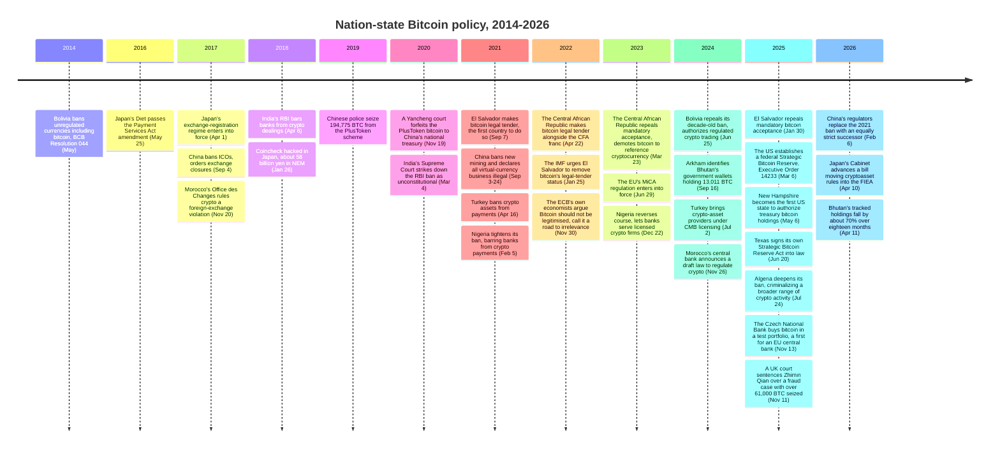

Thirty-odd governments have taken a public position on Bitcoin since 2013, and all but a handful have reversed at least one of those positions. A nationwide ban lifted. A legal-tender mandate got repealed — in two different countries. A mining ban followed years of open tolerance. Two of the jurisdictions this entry tracks never reversed course, for the same reason: neither Japan nor the EU ever banned Bitcoin to begin with.

The governments that banned it hardest are now credited with some of the largest bitcoin stockpiles ever attributed to a state — not because they bought the coins, but because they seized them.

## 1. The reversals

"Reversal" covers more than one shape here: an outright ban lifted (Bolivia), a ban tightened once and then lifted (Nigeria), a central-bank ban struck down by a court rather than repealed by a legislature (India), a legal-tender mandate walked back under external pressure (El Salvador, Central African Republic), a federal government's own turn from law-enforcement forfeiture to a declared holding policy (the United States) — and, moving the opposite way, a formerly-tolerated activity outlawed outright rather than the reverse (China, whose own 2026 notice would go on to formally replace that same ban with an equally strict successor, per §6). Each has its own before-and-after date.

| Jurisdiction | From | To | Reversal date |
|---|---|---|---|
| [China](/BitcoinArchive/entries/aftermath/2021-09-03-china-crypto-mining-ban/) | Mining tolerated (domestic exchanges already banned since 2017) | New mining banned; all virtual-currency business, including offshore exchanges serving China-based users, declared illegal | Sep 2021 |
| Bolivia | Total prohibition (BCB Resolution 044, 2014) | Regulated purchase and sale authorized (BCB Resolution 082) | Jun 25, 2024 |
| Nigeria | Banks barred from touching crypto (2017), then barred from facilitating crypto payments (2021) | Banks permitted to serve licensed virtual-asset service providers | Dec 22, 2023 |
| India | RBI circular bars banks from crypto dealings (2018) | Supreme Court strikes the circular down as unconstitutional (2020); a 30% flat tax on virtual digital assets followed in 2022 | Mar 4, 2020 |
| [El Salvador](/BitcoinArchive/entries/aftermath/2021-09-07-el-salvador-bitcoin-law/) | Bitcoin as mandatory legal tender (2021) | Mandatory acceptance [repealed](/BitcoinArchive/entries/aftermath/2025-01-30-el-salvador-bitcoin-law-reform/) | Jan 30, 2025 |
| Central African Republic | Bitcoin made legal tender alongside the CFA franc (2022) | Mandatory acceptance ended; demoted to "reference cryptocurrency" | Mar 23, 2023 |
| [United States](/BitcoinArchive/entries/aftermath/2025-03-06-us-strategic-bitcoin-reserve/) | Forfeited bitcoin sold off case by case, no coordinated holding policy | Executive Order 14233 declares a federal Strategic Bitcoin Reserve; Treasury directed not to sell | Mar 6, 2025 |

Reversal is common here, not universal. Bangladesh's central bank called virtual-currency transactions unauthorized in December 2017 and reaffirmed the same position in updated guidelines in September 2022. Egypt's Grand Mufti forbade commercial crypto use in a fatwa at the end of 2017, and the central bank restated that bitcoin is not legal tender the following month; nothing since has moved either position. Algeria deepened its 2018 ban in July 2025, criminalizing a wider range of crypto activity than the original law reached. Turkey's April 2021 ban on using crypto assets in payments still stands even after a July 2024 law brought exchanges and custodians under licensing — regulation arrived around the ban, not instead of it.

Morocco sits between the two groups: its central-bank governor announced a draft law in November 2024 to regulate, rather than ban, crypto-assets — eight years after the original 2017 ruling — but as of mid-2026 that draft has not become law. A government can announce a reversal in progress; it has not yet reversed anything.

Two governments never appear in the table above at all, in either direction. Japan and the European Union never banned Bitcoin, so neither one has a reversal to record. §4 covers why.

## 2. Bans, seizures, and the biggest state stockpiles

The country with Bitcoin's most sweeping ban is also credited with one of the largest state-attributed bitcoin balances in the world. Chinese police seized 194,775 BTC from the operators of the PlusToken Ponzi scheme in 2019; a court in Yancheng forfeited the coins to the national treasury on November 19, 2020 — nine months before the same government banned all virtual-currency business outright. The coins did not stay in state hands because Beijing decided bitcoin was worth holding. They arrived as evidence in a fraud prosecution, and a government that has declared the asset illegal has no domestic market to sell them into. [Bitcoin's ownership map](/BitcoinArchive/entries/analysis/2026-07-09-bitcoin-ownership-map/) tracks where that balance, and every other government's, sits today.

One notice from the same sovereign draws the opposite line. Hong Kong published its first regulatory sandbox for virtual-asset trading platforms in November 2018, declared itself "open and inclusive" toward virtual assets in October 2022 — a year the mainland ban was already in force — brought a dual licensing regime into effect in mid-2023, and turned on a stablecoin licensing ordinance in August 2025. When Beijing's regulators replaced the mainland ban with an equally strict successor in February 2026, Hong Kong pressed ahead with its own stablecoin plans regardless. One sovereign, two directions, in the same year.

Two other governments hold large bitcoin balances built the same way — through forfeiture, not purchase — and each has chosen a different disposition for the coins once they arrive.

| Jurisdiction | Source of the holding | Government's disposition | Date |
|---|---|---|---|
| [China](/BitcoinArchive/entries/analysis/2026-07-09-bitcoin-ownership-map/) | PlusToken Ponzi-scheme forfeiture (194,775 BTC) | Ordered forfeited to the national treasury; subsequent custody undisclosed, virtual-currency business remains illegal | Nov 19, 2020 |
| [United States](/BitcoinArchive/entries/aftermath/2025-03-06-us-strategic-bitcoin-reserve/) | Silk Road, the Bitfinex hack, and the Prince Group case, forfeited separately over a decade | Declared a federal Strategic Bitcoin Reserve under Executive Order 14233; Treasury directed not to sell | Mar 6, 2025 |
| United Kingdom | Criminal forfeiture, the Zhimin Qian fraud case | No reserve policy; the government's own position rules out holding bitcoin as a reserve asset | May 2025 |

None of the three American cases was a single event: Silk Road's forfeitures, the 2016 Bitfinex hack recovery, and 2025's Prince Group case each landed in federal custody years apart, on their own separate timelines, before Executive Order 14233 folded the accumulated total into one standing policy — [the fuller chronology](/BitcoinArchive/entries/aftermath/2025-03-06-us-strategic-bitcoin-reserve/) traces each case in turn. Common to all three governments in this table: none of them chose to buy the asset it now holds.

The UK case supplies the largest single seizure of the three. London police recovered a laptop holding 4,741.36 BTC on November 1, 2018 — years before investigators had named a suspect. Zhimin Qian was arrested in April 2024 with wallets worth over £62 million, and by the time a UK court sentenced her to eleven years and eight months in November 2025, the investigation's total seizure across the case had grown past 61,000 BTC. It is one of the largest cryptocurrency forfeitures on record anywhere, inside a government whose own reserves policy, stated the same year, does not contemplate holding bitcoin at all.

## 3. Two legal-tender experiments, two retreats

Only two governments have ever made bitcoin legal tender. Both have since walked back the part that made it mandatory.

| | El Salvador | Central African Republic |
|---|---|---|
| Made bitcoin legal tender | September 2021 — the first country to do so | April 22, 2022 — Law n°22.004, the second country |
| Outside pressure | IMF urged removing the legal-tender status, Jan 25, 2022 | IMF warned of legal, transparency, and economic risks, May 4, 2022 |
| Walked back | Mandatory acceptance repealed, Legislative Assembly reform, Jan 30, 2025 | Mandatory acceptance ended, demoted to "reference cryptocurrency," Mar 23, 2023 (unanimous vote) |

El Salvador's retreat did not touch its own balance sheet. Despite a zero-accumulation condition attached to the government's IMF loan program, [El Salvador's bitcoin reserve](/BitcoinArchive/entries/aftermath/2025-01-30-el-salvador-bitcoin-law-reform/) stood at roughly 7,723 BTC as of July 25, 2026. The mandate to accept bitcoin at checkout is gone. The state's own bitcoin is not.

## 4. The two that never reversed

Two governments do not appear in either table above, because neither one has anything to reverse. Japan has tightened its cryptoasset regime in one direction since 2016. The European Union built a comprehensive framework without ever having banned Bitcoin to begin with. They arrive at the same non-reversal from opposite starting points — a different case from Germany's, below, where a liberal tax stance never amounted to a ban but is now facing its own pressure to reverse.

[Japan's Payment Services Act amendment](/BitcoinArchive/entries/aftermath/2017-04-01-japan-payment-services-act-amendment/) passed the Diet on May 25, 2016, and took effect the following April 1, creating a mandatory registration regime for exchanges. Every step since has added oversight, never removed it: the Coincheck hack of January 26, 2018 (about 58 billion yen in stolen NEM) was followed the next year by a rename from "virtual currency" to "cryptoasset" (May 31, 2019), then a dedicated stablecoin category on June 3, 2022. Japan's first licensed yen-stablecoin issuer, JPYC, registered under that category on August 18, 2025. On April 10, 2026, the Cabinet advanced a bill moving cryptoasset regulation out of the Payment Services Act altogether and into the Financial Instruments and Exchange Act, extending a tightening streak now in its tenth year with still no ban to reverse.

The European Union took the opposite route to the same place. Its Markets in Crypto-Assets Regulation was published in the Official Journal on June 9, 2023, took effect June 29, and reached full application by the end of 2024. It is a single comprehensive law, built without a prior ban to repeal. MiCA's own Recital 22 exempts issuer-less crypto-assets like Bitcoin from the issuer-side obligations the rest of the regulation imposes, which leaves Bitcoin itself sitting just outside what the law actually governs. The skepticism that a ban would have expressed shows up instead in commentary rather than statute: the European Central Bank's own Ulrich Bindseil and Jürgen Schaaf argued in a November 30, 2022 blog post that Bitcoin is neither suitable as a payment system nor as an investment and "should not be legitimised" by regulation, and the position is not confined to Frankfurt. The Bank for International Settlements' Agustín Carstens called Bitcoin "more of a speculative asset" in January 2021, and the BIS's 2022 Annual Economic Report concluded crypto lacks a stable nominal anchor.

| | Japan | European Union |
|---|---|---|
| What triggered each step | An exchange collapse or hack — Mt. Gox, then Coincheck | No single trigger; one comprehensive law, drafted in advance |
| Shape of the regime | A registration regime that adds a new licensed category with each revision | A single regulation with an explicit carve-out for issuer-less assets |
| Direction | Continuous tightening, one law amended repeatedly since 2016 | One law, in force since 2023, not yet amended |
| Bitcoin's own status | Regulated as a cryptoasset since 2019, never banned | Exempted from issuer obligations; the ECB's own economists argue it should not be legitimised |

Japan tightens because something breaks — an exchange collapse, a hack, a stablecoin needing a rulebook — and each fix narrows the regime further without ever reaching for a ban. The EU wrote its rulebook in one motion and then wrote an exemption for the one asset the rulebook was least equipped to describe. Neither government has anything to reverse, and neither arrived there for the same reason.

## 5. 2025: the turn toward reserve assets

The direction changed again in 2025. Instead of banning bitcoin or regulating around it, a cluster of governments began asking whether to hold it.

| Jurisdiction | Action | Date | Outcome |
|---|---|---|---|
| New Hampshire | HB 302 signed, authorizing treasurer bitcoin investment up to 5% — the first such US state law | May 6, 2025 | Enacted; a $100M bitcoin-backed municipal bond was later rejected 3-2 by the Executive Council (Jul 8, 2026) |
| Texas | SB 21, the Texas Strategic Bitcoin Reserve Act, signed | Jun 20, 2025 | Enacted; first purchase made, $5M on the BlackRock ETF IBIT (Nov 20, 2025) |
| Arizona | SB 1025 (full reserve act) vetoed as "untested" for retirement funds | May 2, 2025 | Vetoed |
| Arizona | HB 2749, letting the state hold unclaimed digital assets at no new taxpayer cost | May 7, 2025 | Signed |
| Arizona | HB 2324, routing court-forfeited crypto into a reserve fund | Jul 1, 2025 | Vetoed, citing a law-enforcement disincentive |
| Montana | HB 429, a bitcoin reserve bill | Feb 22, 2025 | Rejected by the House, 59-41 |
| Wyoming | HB 201 | Feb 10, 2025 | Died in committee, 1-7 |
| North Dakota | HB 1184, a reserve study/authorization bill | 2025 | Rejected by the House, 57-32 |
| Utah | HB 230 signed with its bitcoin-reserve provision stripped by the Senate | Mar 25, 2025 | Enacted without the reserve provision |
| Pennsylvania | HB 2664, treasurer investment up to 10% | Introduced Nov 19, 2024 | Not enacted |
| Czech Republic | CNB test portfolio including bitcoin approved, then launched | Oct 30 / Nov 13, 2025 | First EU central bank to hold bitcoin directly |
| Bhutan | Sovereign mining-derived holdings, mostly sold down | 2019-2026 | Peaked at 13,011 BTC (Sep 2024); down to 3,954 BTC (Apr 2026) |

New Hampshire's own legislature shows the range within a single state: the treasurer got the authority in May 2025, and fourteen months later its Executive Council rejected a $100 million bitcoin-backed municipal bond by a 3-2 vote — enacting a bitcoin law and issuing bitcoin-backed debt turned out to be two separate votes. Arizona ran the fullest spread of any single state: a full Strategic Bitcoin Reserve Act vetoed in May 2025, a narrower bill accepting unclaimed digital assets at no taxpayer cost signed days later, and a third bill routing law-enforcement forfeitures into a reserve fund vetoed again in July. One legislature said yes to windfall assets and no, twice, to anything resembling active investment.

The Czech National Bank's test portfolio sits in tension with its own central bank's institutional cousin. The CNB Bank Board approved a one-million-dollar digital-asset test portfolio including bitcoin on October 30, 2025, and launched it two weeks later — the first central bank inside the European Union to hold bitcoin directly, arriving three years after the ECB's own economists argued in print that Bitcoin should not be legitimised and was headed for irrelevance.

Bhutan's stockpile predates the 2025 turn and now moves against it. The state investment arm Druk Holding and Investments began bitcoin mining with the country's hydropower in 2019 and expanded a mining partnership with Bitdeer in 2023; by September 16, 2024, tracked wallets held 13,011 BTC — the fourth-largest national holding anyone had identified. Eighteen months later, about 70% of it was gone: down to 3,954 BTC by April 11, 2026. A government can build one of the largest sovereign bitcoin positions in the world without ever passing a reserve law, and sell most of it just as quietly.

## 6. Limits of this reading

- **This is a live policy area.** Every status recorded above can change again before this entry does. China's February 2026 notice formally repealed the 2021 notice as a specific document, replacing it with an equally strict successor in the same motion — a reminder that even the entries this piece counts as settled can still change form without changing substance.
- **"Overwhelmingly" is not "universally."** Bangladesh, Egypt, Algeria, and Turkey's payments ban are jurisdictions with no reversal on record as of this entry's anchor date. Morocco's draft law is an announced intention, not yet an enacted one.
- **A liberalizing move can face its own reversal pressure.** Germany never banned Bitcoin — a 2013 government answer classified it as a Wirtschaftsgut rather than building a licensing regime from scratch — but a 2023 Bundesfinanzhof ruling making gains tax-free after a one-year holding period is now the target of a November 2025 SPD proposal to abolish that same exemption, unresolved as of this writing.
- **Some figures are disputed even within a single case.** China's custody of the forfeited PlusToken coins has never been publicly accounted for one way or the other; this entry states only what the 2020 forfeiture ruling itself says.
- **The archive's record is a point-in-time snapshot**, anchored to July 28, 2026. Every BTC figure, vote count, and legislative status above is dated for that reason — treat each one as a snapshot, not a running total.

## Significance to Bitcoin

None of the reversals, forfeitures, or reserve declarations above changed a single rule Bitcoin itself runs on. A government can outlaw an exchange, prosecute a named person, and take custody of the specific coins a court ties to their case: all of that operates on the layer where a person or an institution holds keys a state can reach and a court can order surrendered. It is the same layer [Bitcoin's ownership map](/BitcoinArchive/entries/analysis/2026-07-09-bitcoin-ownership-map/) tracks by tracing balances to named holders, seized or otherwise. The 21 million cap, the issuance schedule, and the rule a node checks a block against asked none of these thirty governments for permission, and none of it moved when Bolivia banned bitcoin in 2014 or unbanned it in 2024, when El Salvador wrote "unrestricted legal tender" into a statute or struck the words back out, or when a Yancheng court forfeited 194,775 BTC to a treasury that has still never said what it did with them.

Bitcoin's own [tension between being spent and being held](/BitcoinArchive/entries/analysis/2008-10-31-bitcoin-electronic-cash-vs-digital-gold/) is a design question. Whether a government may hold it, ban it, or seize it from someone else is a policy question, decided thirty different ways and reversed in most of them — and the protocol underneath every one of those thirty decisions kept producing blocks regardless of which way the vote went.
