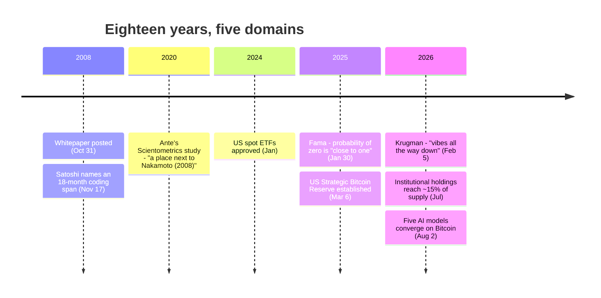

Nine pages, on a mailing list, on October 31, 2008:

<!-- quote: q1 -->
> "I've been working on a new electronic cash system that's fully peer-to-peer, with no trusted third party."

[This archive's own entry for that posting](/BitcoinArchive/entries/aftermath/2008-10-31-bitcoin-whitepaper-publication/) footnotes a novel that calls this sentence the start of a protocol that would overturn, at its root, a concept of money thousands of years old. That is a big claim to hang on nine pages. Eighteen years is long enough to check it against the record instead of against a feeling — so this entry does exactly that, across the five domains that would actually have to move for the claim to hold: money itself, the people who hold it, the field that studies it, the economists whose job is to say whether any of this counts, and the systems now trained on all of it.

## What moved: the money

By July 2026, three categories of institution that did not exist as bitcoin holders when the paper was posted held a combined 3.1 million BTC — roughly 15% of the fixed 21 million supply — according to [this archive's ownership map](/BitcoinArchive/entries/analysis/2026-07-09-bitcoin-ownership-map/): 1,214,016 BTC in US spot ETFs (approved January 2024, none of them existed before that date), 1,264,579 BTC on public-company balance sheets, and 649,954 BTC in the hands of governments. One company, Strategy, went from a first disclosed purchase of 70,470 BTC in 2020 to 843,775 BTC by July 6, 2026 — two-thirds of every public company's combined holding, in one balance sheet.

None of that capital existed to make a philosophical point. A spot ETF exists because an asset manager decided there was a fee to collect on client demand; a corporate treasury exists because a CFO decided it beat sitting in cash. The nine pages made no argument to a CFO. What moved is not agreement with the paper's premise — it's money going toward a scarce asset it could not print more of, at a scale that had no precedent in 2008.

## What moved: the governments

[Thirty-odd governments](/BitcoinArchive/entries/analysis/2026-07-28-bitcoin-nation-state-policy-history/) have taken a public position on Bitcoin since 2013, and most of them reversed at least one of those positions — nearly always in the direction of tolerating or holding it, not banning it further. The clearest reversal: the United States spent a decade selling forfeited bitcoin case by case, then converted the remaining balance into a federal Strategic Bitcoin Reserve under Executive Order 14233 in March 2025, with Treasury directed not to sell. El Salvador made bitcoin legal tender in September 2021, walked back the *mandatory* part in January 2025 under IMF pressure — and kept accumulating its own reserve anyway, untouched by the retreat.

A government does not hold an asset it considers worthless, and it does not write a reserve mandate for a technology it expects to fail. Whatever thirty governments concluded about Bitcoin, "irrelevant" was not it.

## What moved: the field that studies it

Computer science took the paper at face value fastest, and never really stopped. A 2020 *Scientometrics* study by Lennart Ante analyzed 467 blockchain and cryptocurrency articles and their 9,672 cited references from the business and economics literature alone — a separate, later-arriving body of research from the computer-science and cryptography work the paper triggered first. Factor and network analysis sorted that literature into five research strands. The study's own conclusion: twelve years on, "a scientific place next to Nakamoto (2008) is still available for existing, emerging and new research streams." An entire field of published, peer-reviewed research still orients itself by naming its position relative to a nine-page mailing-list post. That is not an opinion about Bitcoin. It is a fact about where an academic field decided its center of gravity sits.

## What did not move: the economists

Here is where the claim should be easiest to confirm, and where it breaks down. The discipline whose actual job is to say whether a concept of money has been overturned is monetary economics — and two of its most publicly prominent Nobel laureates have had sixteen and seventeen years, respectively, to change their minds, and have not.

Eugene Fama, who won the Nobel Memorial Prize in Economic Sciences in 2013, was asked directly on the *Capitalisn't* podcast on January 30, 2025 what probability he'd put on Bitcoin falling to zero within ten years:

<!-- speaker: Eugene Fama -->
> "I would say it's close to one."

He added his own caveat in the same conversation — "the distribution has a long tail. It's very flat" — which is itself a kind of honesty: even his own near-certainty comes with an admission that the tail of outcomes is wide open. That qualifier does not read as a shift in position, but it is not nothing either.

Paul Krugman won the same Nobel prize in 2008 — the same year the whitepaper went out. On February 5, 2026, in his own Substack post titled "Is This Crypto's Fimbulwinter?", he wrote that Bitcoin has made no visible progress toward functioning as money — "Bitcoins are awkward and costly to trade" — and asked bluntly: "aren't 17 years of unsuccessfully trying to turn it into a working form of money enough?" His verdict on what holds the price up: "with crypto there are no fundamentals, it's vibes all the way down."

Two Nobel laureates, sixteen and seventeen years removed from the paper's publication respectively, asked the direct question, and neither one signed on to any overturning of anything. If a "concept of money thousands of years old" had actually been overturned, the people whose career is that concept would be the first to have to say so. They have had the time. They said the opposite.

## What moved: the AI models

On August 2, 2026, this archive ran its own experiment: the same question, put to five AI models from five different labs — OpenAI's GPT, Anthropic's Claude, Google's Gemini, Moonshot AI's Kimi, and xAI's Grok. If you had to invest in exactly one cryptocurrency, which would you choose? [All five, independently, chose Bitcoin](/BitcoinArchive/entries/analysis/2026-08-02-ai-crypto-investment-survey/). Their reasoning converged on the same axes this archive already uses to read the field — no founder, no controlling party, a supply fixed by code rather than by policy — and when those specific structural claims were checked against primary sources, they held up.

Five systems built by five different companies, with nothing to gain from any particular answer, given no constraint but "pick one," picked the same one — for the same reasons this archive already gives for calling Bitcoin digital gold.

| Domain | Did it move? | What the record shows |
|---|---|---|
| Capital (ETFs, corporate treasuries) | Yes | 2.48M BTC combined, ~11.8% of supply, none of it existed as a bitcoin holding before 2020 |
| Governments | Yes | 30-odd jurisdictions took a position; most reversed toward tolerance or reserve-holding, not further restriction |
| Business & economics research | Yes | An entire research field still measures its own position "next to Nakamoto (2008)," 12+ years on |
| Monetary economics (named Nobel laureates) | No | Fama (2025) and Krugman (2026), asked directly, both declined to call any of it an overturning |
| AI models (five, independent) | Yes | Five models from five labs, asked once each, unanimously picked Bitcoin, for structural reasons that checked out |

## What I think actually happened

I don't think the paper overturned the theory of money, and I don't think Fama or Krugman are wrong to say so — Bitcoin still doesn't function as a stable unit of account, and volatility is not a rounding error in that argument, it's the argument. Money's mechanics, as economists study them, look about as unconvinced by Bitcoin in 2026 as they did in 2010.

But the theory of money was never the only thing at stake in those nine pages. What actually moved is narrower and, to me, stranger: for the first time, a scarce asset existed that no institution could print, freeze, or allocate by permission — and within eighteen years, institutions that exist specifically to hold and manage scarce assets built a $300 billion position in it anyway, governments fought each other over whether banning it or hoarding it was the safer bet, an entire research field organized itself around the document that made it possible, and five AI models with no stake in flattering the premise landed on the same asset for structurally accurate reasons. None of that required the economists' blessing, and none of it waited for one. That gap — between what the money did and what the discipline of money said about it — is the actual overturning. Not the theory changing hands. The permission being unnecessary in the first place.

## Limits

- The $300 billion / 3.1 million BTC institutional figure is a point-in-time snapshot (July 2026); see [the ownership map](/BitcoinArchive/entries/analysis/2026-07-09-bitcoin-ownership-map/) for the as-of date on each component and the tracker disagreements behind them.
- "The economists" here means two named, prominent Nobel-winning monetary economists, not a survey of the profession. Other economists have taken more favorable positions; this entry does not claim Fama and Krugman speak for the discipline, only that their prominence and their explicit, dated, on-the-record refusals to endorse a paradigm shift are themselves part of the record.
- Ante (2020) measures the business-and-economics literature specifically; it does not speak to whether monetary theory as a sub-discipline has revised its models in response to Bitcoin, which is a narrower and separate question from whether blockchain research treats the paper as foundational.
