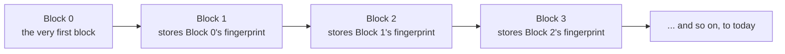

Picture a shared notebook that thousands of strangers each keep their own copy of — and somehow, they never end up disagreeing for long about what's written in it. No single person owns the master copy; anyone can propose adding a page, and everyone else checks it before accepting it into their own copy. That notebook is what Bitcoin actually is. The previous page covered what gets written on its pages — receipts changing hands. This page covers the notebook itself: who keeps it, and what stops the copies from drifting apart.

## Thousands of independent copies

Anyone can run Bitcoin's software on an ordinary computer; each computer that does is called a **node**. Nodes don't go through any central server — they talk directly to each other, passing along anything new they hear about, the way a piece of gossip spreads person to person rather than through an announcement board. This direct, no-middleman style of network has a name: **peer-to-peer**, usually shortened to **P2P**.

<!-- visual: gossip-network -->

Every node independently checks every new page against the same set of rules before accepting it, using its own copy of the notebook to do so. Nobody has to trust any other single node — each one verifies for itself.

## A page you can't quietly rewrite

New transactions aren't written into the notebook one at a time. They're gathered up in batches — a batch is called a **block** — and a new block is added roughly every ten minutes.

What stops someone from sneaking back to page 40 and changing what it says? Each block carries its own short fingerprint, called a **hash**, calculated from everything the block contains. Change even a single character inside the block, and the fingerprint comes out completely different — there's no way to tweak the contents while keeping the same fingerprint, and no way to work backward from a fingerprint to guess the contents.

<!-- visual: hash-fingerprint -->

Here's the part that actually locks the pages together: every block also stores the *previous* block's fingerprint inside itself. Change something on an old page, and that page's fingerprint changes — which no longer matches what the next page says it should be, which breaks that page too, and the one after it, all the way to today. Rewriting history quietly isn't just hard here; the pages are built to make it visible immediately.

That very first page is called the **[genesis block](/BitcoinArchive/entries/aftermath/2009-01-03-genesis-block/)** — nothing came before it to link back to, so it's the one block that had to be special-cased into existence rather than added the normal way. Everything since has been chained on top of it in an unbroken line, which is where the word **blockchain** comes from: a chain of blocks, each one anchored to the last.

So every node ends up agreeing on the same chain, checked page by page, impossible to quietly edit after the fact. That still leaves an open question: who actually gets to add the next page, and why would anyone bother? [The next page](/BitcoinArchive/entries/analysis/2026-09-06-what-miners-are-actually-racing-to-do/) answers that.
