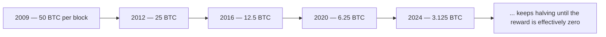

A raffle only works if there's some way to pick a winner nobody could have arranged in advance — a physical drum of numbered balls, tumbled and drawn at random, so no one can rig which number comes up. Bitcoin needed the equivalent of that drum for a very different question: out of everyone who wants to add the next page to the shared notebook, who actually gets to?

## Winning the right to add a page

Anyone running the software can try to add the next block; trying is called **mining**, and a computer doing it is called a **miner**. But a miner can't just add a block whenever it wants — first it has to win a kind of lottery.

The lottery works like this: attach a number, called a **nonce**, to the candidate block, and run the whole thing through the fingerprinting math from [the previous page](/BitcoinArchive/entries/analysis/2026-09-06-how-transactions-become-a-shared-ledger/). If the resulting fingerprint happens to start with enough zeros, that nonce wins and the block is valid. If not, change the nonce and try again. Because fingerprints are completely unpredictable, there's no cleverness that beats guessing — the only strategy is a computer trying billions of numbers per second until one happens to work.

<!-- visual: nonce-search -->

This brute-force lottery is called **proof-of-work**, often shortened to **PoW** — the idea of making people do real, costly work to earn something, originally proposed in 1997 by [Adam Back's Hashcash](/BitcoinArchive/entries/aftermath/1997-03-28-adam-back-hashcash-announcement/) as a way to make email spam expensive, and reused here as the core of the whole system. How many zeros are currently required — the **difficulty** — is automatically adjusted every couple of weeks, tightening or loosening so that, no matter how much total computing power is thrown at the puzzle worldwide, a winner is found roughly every ten minutes on average.

## Where new bitcoins actually come from

Winning the lottery comes with a prize. The winning miner gets to include one special entry at the top of their block — the **coinbase transaction** — which doesn't spend anyone's existing receipts; it simply creates brand new ones out of nothing, payable to the miner. That newly created amount is the **block reward**, and it is the *only* way new bitcoins ever come into existence. On top of it, the miner also keeps any small fee attached to the ordinary transactions in the block.

The reward isn't fixed forever. It started at 50 BTC per block in January 2009 and cuts itself exactly in half roughly every four years, an event called the **halving**.

Run that shrinking schedule out to its end and the total that will ever exist comes to a hair under 21 million BTC — after which miners are paid only from transaction fees, not new issuance.

Winning this lottery today takes specialized computer hardware built to do nothing but this one calculation, running at industrial scale — not the ordinary laptop the raffle analogy might suggest. That shift, and a few others like it, are what separate Bitcoin's day-to-day operation now from how it looked in its very first years; [a companion analysis](/BitcoinArchive/entries/analysis/2026-05-24-satoshi-design-vs-current-reality/) maps the differences for readers who want that comparison.

Winning the lottery gets a block added — but only for a moment. [The next page](/BitcoinArchive/entries/analysis/2026-09-06-what-happens-while-a-payment-is-unconfirmed/) covers what happens to a payment before it even reaches that lottery, and how many blocks it takes before it's genuinely safe to treat as final.
