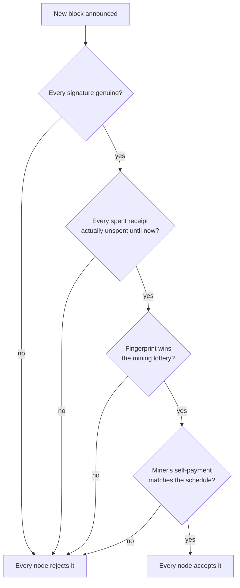

A referee-less game only stays fair if the rules enforce themselves — if breaking them is either impossible or pointless, not just frowned upon. Bitcoin has no referee: no company, no committee, no single server anyone could lean on. So what actually stops a miner from handing themselves a fortune, or undoing someone else's payment?

## Rule one: everyone checks

Every node — not just miners — independently checks every new block the moment it's announced. Is every signature genuine? Is every spent receipt one that genuinely hadn't been spent yet? Does the block's fingerprint actually satisfy [the lottery from the previous page](/BitcoinArchive/entries/analysis/2026-09-06-what-miners-are-actually-racing-to-do/)? Does the miner's self-payment match what the schedule allows?

A miner who tries to slip in an invalid transaction, or pay themselves more than they're owed, doesn't get away with it quietly — they simply produce a block that every other node on the network refuses to add to its own copy. The dishonest block isn't hacked or blocked by some authority; it's just ignored, the way a forged ticket doesn't work at the door no matter how convincing it looks, because the door staff are checking against the real records themselves.

## Rule two: the chain with the most work wins

Every so often, two miners solve the lottery at nearly the same moment, and the network briefly sees two different next-pages proposed at once. There's no dispute to settle by argument — whichever branch has more total lottery-winning effort behind it (usually just whichever one gets *another* block added first) simply becomes the one everyone follows, and the other is quietly dropped.

<!-- visual: chain-race -->

This second rule is what makes rewriting old history genuinely hopeless, not merely difficult. Suppose someone wanted to secretly go back and undo a payment from a hundred blocks ago. As covered on [an earlier page](/BitcoinArchive/entries/analysis/2026-09-06-how-transactions-become-a-shared-ledger/), changing that old block breaks every fingerprint link after it — so the attacker would have to win the mining lottery a hundred times in a row, alone, redoing all of that work from scratch, while every honest miner in the world keeps extending the real chain further ahead in the meantime. The less computing power the attacker controls relative to everyone else, the more of those lotteries in a row they'd need to win just to catch up, and the odds of that shrink toward zero the further behind they start. Controlling anywhere close to half the world's mining power is already a practically impossible bar to clear — and falling short of that, the honest chain pulls further out of reach with every passing minute, not closer. (The [consensus design document](/BitcoinArchive/entries/design/2009-01-03-bitcoin-consensus-design/) works through the actual catch-up odds at different attacker sizes, for readers who want the numbers behind that.)

The same rule is what stops the same receipt being spent twice in two different places at once. Two conflicting payments trying to spend the identical receipt might briefly sit in different waiting rooms across the network, but only one can ever make it into the winning chain; the moment that happens, every node rejects the other for trying to spend a receipt that's no longer there to spend. There's no arbitration process to wait on — it resolves itself within minutes, purely by which branch wins the race.

## What this adds up to

Put the five pages of this guide together, and the shape of the whole system is this: bitcoins behave like receipts, controlled by a lock only their owner can open; those receipts move through transactions that get bundled into blocks, each one fingerprinted and chained to the one before; new blocks are won through a costly lottery rather than handed out by anyone in charge; a sent payment waits its turn before being sealed in, growing safer with every block after it; and the whole thing stays honest because every participant checks the rules for themselves, and the chain with the most work behind it always wins.

None of it depends on trusting a bank, a company, or each other — only on the math and the incentives lining up the same way for everyone. That's the answer to the question this guide opened with.
