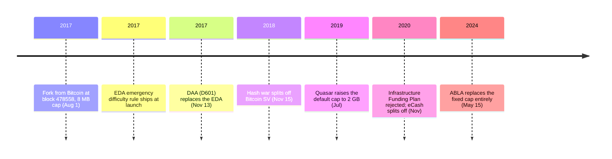

Three days before the fork, Bitcoin ABC's lead developer told Bitcoin Magazine what he thought Bitcoin was for.

<!-- audit:quote-skip -->
> I want bitcoin to be a widely used electronic cash. A cryptocurrency that is used for day-to-day inexpensive stuff, as well as expensive purchases.

Amaury Séchet, July 28, 2017.

Four days later, on August 1, 2017, his team's software accepted a block at height 478558 that broke Bitcoin's 1 MB limit. Everything else about the new chain stayed exactly as it stood at the fork block — Bitcoin's ledger, its 21 million cap, its SHA-256 proof-of-work. Only the block-size rule changed, and the new chain took the name Bitcoin Cash (BCH). What the fork actually rewrote was not the supply table. It was the answer to a narrower question: who gets to change a rule like that again. Over the next three years, that question split the new chain twice.

## The case for a bigger base layer

Bitcoin ABC named its own position in its acronym: "Adjustable Blocksize Cap." Where Bitcoin's main chain met rising transaction demand with Segregated Witness and the Lightning Network — moving activity off the base chain rather than expanding it — Séchet's team proposed to expand the base chain itself. He drew that line carefully, and did not object to the alternative on principle:

<!-- audit:quote-skip -->
> I'm not against Layer 2 technologies themselves, they can add value. I'm just against not growing the base layer.

His objection was to what high fees did to the "electronic cash" half of Bitcoin's own name — the phrase Satoshi's whitepaper put in its own subtitle:

<!-- audit:quote-skip -->
> The second definition in particular doesn't quite work with high fees. If I buy something for $5 and I pay a fee of 50 cents, that's a big deal. Too much friction.

Eight megabytes — eight times Bitcoin's own cap — was the number BCH launched with. Séchet described it as a cautious starting point, not a settled figure:

<!-- audit:quote-skip -->
> Eight megabytes is large enough to make sure we have a mechanism to adjust it by the time we get anywhere close to the limit. On the other hand, you don't want to go unlimited cowboy style.

He named the mechanism he wanted built to replace that starting point, in the same interview:

<!-- audit:quote-skip -->
> After this fork is behind us, we'll make sure to deploy some mechanism to handle the block size so we don't need to play central planners.

That mechanism took nearly seven years to arrive, and it arrived twice.

This fork did not stay a matter of pure engineering. [Why Bitcoin's fork wars were not OSS fork wars](/BitcoinArchive/entries/analysis/2015-08-15-bitcoin-fork-wars-as-not-oss/) traces that shift to three conditions already in place by 2017: a vacuum of designated authority, the economic weight that had accumulated on rule decisions, and the three-layer bond between protocol, software, and the live currency network.

## Inherited supply, a difficulty algorithm invented twice

BCH's supply table needed no design work: 21 million units, halving on the same 210,000-block schedule, mined under the same proof-of-work rule Bitcoin uses. [Bitcoin's fair-launch property](/BitcoinArchive/entries/analysis/2008-10-31-bitcoin-digital-gold-structural-features/) carried over by inheritance rather than by repetition — BCH's coins were not mined without a premine so much as copied, whole, from a ledger that had already settled the question in 2009. [The twelve-chain design comparison](/BitcoinArchive/entries/analysis/2026-07-26-altcoin-count-and-design-comparison/) marks that same line as a conditional pass — inherited state, no new issuance — rather than a clean one. Séchet's team added one new piece of protocol at the fork itself: a SIGHASH_FORKID flag stamped into every BCH transaction, so a payment on one chain could never be replayed as a payment on the other.

What did not carry over was the hashrate to secure the inherited chain. At the moment of the fork, BCH held a small fraction of Bitcoin's total mining power, and Bitcoin's ordinary difficulty adjustment — recalculated every 2,016 blocks — was tuned for a chain with far more of it. Left alone, BCH would have gone hours between blocks. Séchet's team shipped a fix at launch, and then had to replace that fix twice more as it produced problems of its own.

| Algorithm | Active | Mechanism | Problem it solved |
|---|---|---|---|
| EDA (Emergency Difficulty Adjustment) | Aug 1, 2017 – Nov 13, 2017 | Cut difficulty 20% whenever the gap between the 6th-most-recent block and the 12th-most-recent block exceeded 12 hours | Kept blocks arriving at all, on a minority-hashrate chain, in the fork's first days |
| DAA ("D601") | Nov 13, 2017 – present | A 144-block moving average of total work done and time elapsed, retargeted toward a 600-second mean block time | The EDA's own overcorrection — repeated 20% cuts swung difficulty wildly and let BCH mine thousands of blocks ahead of the schedule both chains nominally share |
| ABLA (Adaptive Blocksize Limit Algorithm) | May 15, 2024 – present | An exponentially weighted moving average of recent block sizes, adjusting the cap automatically — a floor of 32 MB, room to double in a year at peak demand, no fixed ceiling | The need for a coordinated hard fork, argued over and voted on, every time the block-size cap needed to move |

The EDA solved the problem it was built for and created a worse one: a chain running ahead of its own issuance clock. The DAA that replaced it on November 13, 2017 was Séchet's own D601 proposal, resistant to timestamp manipulation. Two independent teams tested it against a rival design that performed slightly better in some scenarios; D601 was chosen because it carried the lower risk of splitting the network further. The ABLA that replaced the cap itself, nearly seven years later, is close to the mechanism Séchet described wanting in 2017 — block-size policy that adjusts on its own, so nobody has to sit down and negotiate it.

## No founder, and two splits nobody voted on

Bitcoin Cash has no equivalent of Satoshi — no single person who wrote the fork and then stepped back. Three men answered a different piece of "who is in charge" at launch: Séchet wrote the software; [Roger Ver](/BitcoinArchive/participants/roger-ver/), through bitcoin.com, supplied the public face; [Jihan Wu](/BitcoinArchive/participants/jihan-wu/) committed Bitmain-aligned hashpower to keep the new chain's blocks coming. None of the three held authority over what the other two did.

That arrangement produced two splits over the following three years, both settled by hashrate rather than by agreement.

| Date | Dispute | Result |
|---|---|---|
| Nov 15, 2018 | Bitcoin ABC (Séchet) proposed Canonical Transaction Ordering and new opcodes; nChain (Craig Wright, Calvin Ayre) proposed a 128 MB cap and the restoration of opcodes Bitcoin had disabled | A hash war split the chain. [Bitcoin SV](/BitcoinArchive/entries/aftermath/2018-11-15-bitcoin-sv-fork/) continued separately; the BCH ticker stayed with Bitcoin ABC |
| Nov 2020 | An "Infrastructure Funding Plan" would have directed 8% of mining rewards to a development fund | Most BCH miners and the wider community rejected it. Séchet's team forked off rather than accept the vote, rebranding the new chain eCash (XEC) in 2021 |

Craig Wright's claim to be Satoshi Nakamoto — the claim under which he argued BSV restored Bitcoin's "original protocol" — was rejected by the High Court of England and Wales in [COPA v Wright](/BitcoinArchive/entries/aftermath/2024-03-14-copa-v-wright-ruling/) in March 2024. The BSV chain itself is untouched by that ruling. It still runs the parameters chosen at the 2018 split, independent of what the court decided about the man who argued for them.

## What Séchet and Ver said about Bitcoin

Séchet's own framing of the 2017 fork stayed narrowly technical throughout — a dispute over a number, argued in megabytes. Roger Ver's framing of the same argument did not stay in one place. On November 2, 2018, three months after nChain split away from his own side of the BCH community, Ver drew the line he had been drawing since 2017:

<!-- audit:quote-skip -->
> High fees and full blocks disenfranchise those who need Bitcoin most. BCH is peer to peer electronic cash for the world. BTC is not.

Six years later, out on bail in Spain and fighting a US extradition request, Ver was asked what Bitcoin had become. The failure he described was no longer a number:

<!-- audit:quote-skip -->
> I don't think it was created that way initially, but I am suspicious and I do think the intelligence agencies and other groups have converted it and hijacked it into becoming a financial trap.

Both statements name BTC as the thing that betrayed Satoshi's design. In 2018 the betrayal was a block-size limit pricing out ordinary users. In 2024 the betrayal was a conspiracy that had captured the currency's entire original purpose. The name of the accused chain never changed between the two statements. The argument against it changed completely.

Bitcoin Cash's inherited supply, plotted against Bitcoin and ten other currencies on one normalized index:

<!-- chart: supply-curve-comparison -->

## Significance to Bitcoin

[The governance vacuum Bitcoin has operated under since Satoshi's 2011 departure](/BitcoinArchive/entries/analysis/2015-08-15-bitcoin-fork-wars-as-not-oss/) is the condition BCH inherited at the fork, not a problem the fork fixed. Bitcoin ABC, bitcoin.com, and Bitmain answered "who decides" from three separate, uncoordinated positions in 2017 — the same structural gap that had already turned the 2015–2017 block-size war into an identity contest rather than an ordinary software disagreement. BCH carried that gap forward and, unlike Bitcoin's main chain, settled its own version of it by splitting rather than by soft-fork consensus: twice in three years, against Bitcoin's zero splits across the fifteen years since Satoshi left.

That contrast is not proof that Bitcoin's own stability is guaranteed by anything BCH also inherited — the ledger, the cap, the mining algorithm are identical between the two chains, and only one of them has kept its consensus rules from splitting. What BCH's two splits measure is not the code. It is how much of Bitcoin's fifteen years without a rupture rests on something the fork left behind along with everything else it copied: a development culture that has treated every contentious change, SegWit and Taproot included, as something to activate as a soft fork rather than fight over as a hard one. [Bitcoin's six structural features](/BitcoinArchive/entries/analysis/2008-10-31-bitcoin-digital-gold-structural-features/) list a fixed supply and a departed founder as two separate lines. BCH matches both on paper, and has split twice anyway — which is itself an argument for keeping the two lines separate.
