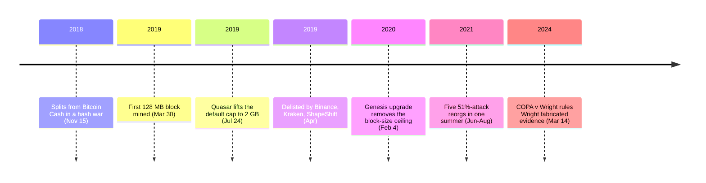

<!-- audit:quote-skip -->
> It's time for Bitcoin to grow up and professionalize.

Steve Shadders, nChain's Director of Solutions & Engineering, said that on November 23, 2018 — eight days after [Bitcoin SV split from Bitcoin Cash](/BitcoinArchive/entries/aftermath/2018-11-15-bitcoin-sv-fork/) in a hash war, and the same day nChain and CoinGeek announced a joint project aiming for one-terabyte blocks and seven million transactions per second. In the summer of 2021, an unidentified miner rewrote parts of Bitcoin SV's own transaction history four times in fifteen days; a fifth attack that August reorganized roughly 100 blocks and reversed 570,000 transactions that had already settled. By late July 2026, CoinGecko put its market capitalization at roughly $274 million, ranked 132nd among the cryptocurrencies it tracks — nowhere near the scale the 2018 ambition described.

The chain calls its design "Satoshi Vision," and its stated purpose is restoration: the block-size limit removed, the disabled opcodes reinstated, the original Bitcoin protocol running again as [Craig Wright](/BitcoinArchive/participants/craig-wright/) and nChain say it was meant to. What that restoration actually inherited, who actually controls it, and how it has actually performed turn out to be three separate questions with three separate answers.

## Restoring "the original protocol," one upgrade at a time

nChain announced its full-node client on August 16, 2018, three months before Bitcoin SV existed as an independent chain. Jimmy Nguyen, nChain's CEO, framed the project as a service to Bitcoin Cash's miners:

<!-- audit:quote-skip -->
> Answering the call of miners, nChain is happy to provide technical capabilities needed to support Bitcoin SV.

The announcement listed exactly what "support" meant: raise the block-size cap from 32 MB to 128 MB, remove the 201-opcode-per-script limit, and restore four operation codes — OP_MUL, OP_LSHIFT, OP_RSHIFT, OP_INVERT — that had been disabled in Bitcoin's own code years earlier. Calvin Ayre's CoinGeek mining operation backed the project from the start.

The November 15, 2018 hash war settled which chain would carry the SV ticker forward; it did not settle how far the block-size increases would go. nChain's own BMG Pool mined the first 128 MB block ever produced on a public blockchain on March 30, 2019; CoinGeek Mining duplicated the feat the next day. On July 24, 2019, the "Quasar" upgrade lifted the default cap to 2 GB. Then, on February 4, 2020, at block 620,538, the "Genesis" upgrade removed the block-size ceiling from the consensus rules altogether — not by deleting the limit, but by converting it into a number each miner sets for themselves.

Genesis changed more than one number. The separate limits that had governed script size, stack size, and the count of non-push operations per transaction were merged into a single "stack memory usage" rule. OP_RETURN's behavior changed too: rather than always failing outright, execution now terminates and validity is decided by the value left on top of the stack — the behavior nChain's own documentation describes as Bitcoin's original design. nLockTime and nSequence reverted to their original purpose. The same upgrade also turned off four other operation codes — OP_2MUL, OP_2DIV, OP_VERIF, OP_VERNOTIF — along with P2SH addresses and the time-lock opcodes OP_CHECKLOCKTIMEVERIFY and OP_CHECKSEQUENCEVERIFY. Restoring "the original" protocol, on Bitcoin SV's own account of it, required removing features that had become standard on every other Bitcoin-derived chain, including the one it split from.

## What Bitcoin SV actually inherited

The 21-million-coin cap is not a number Bitcoin SV chose. [Bitcoin Cash inherited it from Bitcoin at the August 2017 fork](/BitcoinArchive/entries/aftermath/2017-08-01-bitcoin-cash-fork/); Bitcoin SV inherited it from Bitcoin Cash at the November 2018 split. The same chain of custody carried the coin balances. Bitcoin SV did not open an empty ledger and let anyone mine their way up under equal rules from block 1, the way Bitcoin did — it began from a snapshot of Bitcoin Cash's balances at the moment of the fork, itself a snapshot of Bitcoin's balances from fourteen months earlier. Two inherited snapshots are not a premine, in the sense that no one sold shares or mined under different rules than anyone else. They are also not a fair launch in Bitcoin's sense, because no one held nothing at Bitcoin SV's own starting moment either.

Consensus is proof-of-work, on the same SHA-256d hash function Bitcoin uses. The two chains diverge on how fast difficulty is allowed to move. Bitcoin SV kept the difficulty algorithm Bitcoin Cash adopted after its own 2017 fork: rather than Bitcoin's fixed 2016-block retarget window, it recalculates difficulty every block from a weighted moving average of recent hash rate, and bounds a single adjustment to at most +100% or −50%. Bitcoin Core's original algorithm still retargets only once every 2016 blocks, but allows a single adjustment to swing as far as +400% or −75%. On the one axis where Bitcoin SV explicitly claims to be restoring Satoshi's original rules, it is running an algorithm Bitcoin itself never had.

## One company's node, and the attacks that followed

Bitcoin Core's reference implementation is maintained by a loose, unpaid coalition of contributors with no single employer. Bitcoin SV's is not. SV Node is written by nChain, one company, and Craig Wright holds the title of Chief Scientist there. nChain's then-CEO, Jimmy Nguyen, was also founding president of the Bitcoin Association — later the BSV Association — from its founding in 2018: an industry body that promotes the chain but does not write its code.

The Teranode project Shadders described in November 2018 was nChain's answer to what that single-company structure could deliver: a next-generation node built to a stated target of one-terabyte blocks and seven million transactions per second, a throughput figure no other chain in this archive's comparison claims for itself. What Bitcoin SV's actual chain delivered in the summer of 2021 was closer to the opposite of that promise. An unidentified miner ran four separate block-withholding and reorganization attacks — June 24, and July 1, 6, and 9 — with no reported financial losses, according to the Bitcoin Association's own statement. A fifth attack that August was not contained the same way: it reorganized roughly 100 blocks and reversed 570,000 transactions, after the network's hash rate had already fallen by nearly half in the day before. A chain designed around the premise that one well-resourced company could out-engineer Bitcoin's throughput spent its third year unable to keep its own settled history from being rewritten by hash rate rented for the purpose.

## What Craig Wright has said about Bitcoin

In April 2019, Wright threatened to sue an anonymous critic known as hodlonaut and podcaster Peter McCormack for calling him a fraud. Binance's CEO, Changpeng Zhao, said publicly that Wright was "poisoning" the community; within days, Binance, Kraken, and ShapeShift each delisted Bitcoin SV. Kraken's own CEO, Jesse Powell, put the reasoning in a sentence: "It's completely antithetical to what this community is about." A Kraken poll of roughly 70,545 respondents returned 71% in favor of delisting.

That same month, Wright published his own account of which chain deserved the name. On Medium, on May 8, 2019, he wrote:

<!-- audit:quote-skip -->
> BTC is passing off as Bitcoin, it is a fake airdrop copy.

His argument inverts the usual reading of the 2017 split: because Bitcoin Core's side of that fork changed the protocol rules, he argues, Core forfeited the name "Bitcoin" to whichever chain kept the original rules — a title he assigns to the lineage Bitcoin SV would split from a year later. "If the rules of Bitcoin that form the protocol change," he wrote, "you have altered Bitcoin and created something other than Bitcoin."

Wright has made a larger claim than that about his relationship to Bitcoin: since May 2016 he has said, publicly and repeatedly, that he is Satoshi Nakamoto. The UK High Court examined that claim at length in [COPA v Wright](/BitcoinArchive/entries/aftermath/2024-03-14-copa-v-wright-ruling/) and rejected it on March 14, 2024, finding that Wright had forged documents to support it — a history [his biography](/BitcoinArchive/participants/craig-wright/) and [the identity hypothesis built on his own claim](/BitcoinArchive/entries/analysis/2016-05-02-craig-wright-satoshi-identity-hypothesis/) record in full. One month later, in April 2024, Tulip Trading — nChain's holding company, acting on Wright's claim that 111,000 BTC had been stolen from him — discontinued the lawsuit it had run since 2021 against twelve named Bitcoin Core developers over their refusal to help recover the coins. The Bitcoin Legal Defense Fund's statement on the discontinuance did not mince words: developers were "once again free to contribute to this world-changing network without the threat of litigation and harassment."

Bitcoin SV's inherited supply, plotted against Bitcoin and ten other currencies on one normalized index:

<!-- chart: supply-curve-comparison -->

## Significance to Bitcoin

[The six structural features behind Bitcoin's digital-gold claim](/BitcoinArchive/entries/analysis/2008-10-31-bitcoin-digital-gold-structural-features/) split into two layers: a technical layer many chains can claim, and a people-and-organization layer almost none can. Bitcoin SV's own record sorts cleanly along that split. On the technical side, it kept the 21-million cap and Bitcoin's own proof-of-work function — the feature Bitcoin SV shares with Bitcoin most convincingly is the one it did nothing to earn, having inherited both, twice over, from a chain it did not write. On the people-and-organization side, there is nothing to split: one company writes the reference client, and that company's chief scientist is the same person a UK court has found fabricated evidence of being Bitcoin's creator.

[The twelve-chain design comparison](/BitcoinArchive/entries/analysis/2026-07-26-altcoin-count-and-design-comparison/) already marks Bitcoin SV down for low hash rate and repeated reorgs on system decentralization, and gives it no credit at all on people-and-organization decentralization — the same two rows Bitcoin fills in green. The mechanism connecting those two failures is a chain built and controlled by one company confident enough in its own engineering to promise terabyte blocks and seven-million-transaction throughput in public, yet unable in 2021 to stop rented hash rate from rewriting its own settled history. Copying Bitcoin's supply schedule and its hash function was the easy half of "restoring the original protocol." The half Bitcoin SV did not restore is the one Bitcoin never had to write down, because no single company was ever in a position to change it.
