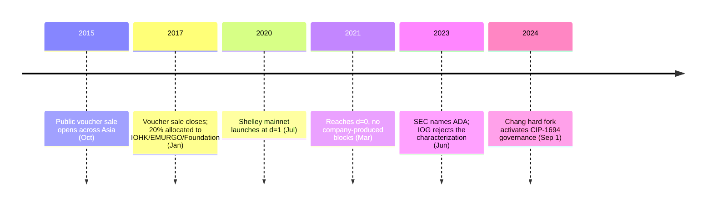

<!-- audit:quote-skip -->
> Using proof of stake for a cryptocurrency is a hotly debated design choice, however because it adds a mechanism to introduce secure voting, has more capacity to scale, and permits more exotic incentive schemes, we decided to embrace it.

Cardano's own design documentation says that about itself. Naming a choice as contested and then making it anyway is not the usual way a monetary design introduces its own consensus mechanism.

The same project turned that contested choice into a running mainnet on July 29, 2020. For the eight months that followed, every block on it still came from the company's own servers.

## What the design documents say Bitcoin got wrong

Cardano's documentation states its departures from Bitcoin by name, and states them as departures rather than as accidents. On architecture, the project separates the ledger that moves value from the layer that runs contract logic:

<!-- audit:quote-skip -->
> Thus, we have chosen the position that the accounting of value should be separated from the story behind why the value was moved.

Settlement goes on one layer, computation on another — the split is deliberate, and it is the reason a Cardano transaction and a Cardano smart contract are not the same kind of object the way they are on a single-layer chain.

The sharper divergence is over identity, and the documentation is unusually blunt about naming Bitcoin as the thing it declined to inherit:

<!-- audit:quote-skip -->
> In the effort to anonymize and disintermediate central actors, Bitcoin and its contemporaries have also discarded the need for stable identities, metadata and reputation in commercial transactions.

Bitcoin's refusal of a stable identity layer is not framed here as a limitation waiting on an engineering fix. It is named as a property Cardano chose not to carry forward. Supply is the one axis where the two chains agree — [the fixed-supply comparison](/BitcoinArchive/entries/analysis/2008-10-31-fixed-supply-vs-adjustable-money/) puts Cardano in the hard-cap cluster alongside Bitcoin and Litecoin. The split runs through consensus and identity, not through scarcity.

## Ouroboros: how the lottery actually runs

Cardano's consensus lives inside a family of protocols called Ouroboros, and the family itself changed shape once. At the 2017 launch, Byron ran on Ouroboros BFT — a federated design in which a small number of IOHK-operated core nodes reached agreement synchronously. Byron gave way to Ouroboros Praos, a stake-weighted, peer-reviewed protocol published at EUROCRYPT 2018, at the July 2020 Shelley mainnet launch — the same launch that opened block production to the public.

The mechanism itself resembles a lottery more than a schedule. Time is divided into one-second slots, and 432,000 of them make up an epoch — about five days of wall-clock time. At the start of each epoch, the blocks accumulated so far hash together into a fresh random seed. Each stake pool operator feeds that seed, their own private key, and the number of the slot they are testing into a verifiable random function. If the output falls under a threshold set by their share of total stake, they win the right to produce a block in that slot. More stake lowers the threshold and raises the odds, but no operator — not even the winning one — can know in advance which slots they will win. A new block arrives roughly every 20 seconds on average.

A second number governs who bothers to run a pool at all: the saturation point, set by a parameter called `k`. A pool's rewards grow with the stake delegated to it only up to that point; delegation past it dilutes the reward rather than growing it.

| When | `k` | Approximate saturation per pool |
|---|---|---|
| July 2020, Shelley launch | 150 | ~212 million ADA |
| December 2020 onward | 500 | under 64 million ADA |
| October 2022, still `k=500` | 500 | ~70 million ADA |
| Proposed, not yet enacted | 1,000 | ~38 million ADA |

The row worth noticing is the one where `k` does not move and the saturation point does anyway. Saturation is set roughly by (the 45 billion cap minus the reserve still unspent) divided by `k`. Staking rewards are paid out of that reserve every epoch, so the reserve shrinks year over year even without touching `k` — which is exactly why the same `k=500` produced a lower saturation point in December 2020 than it did in October 2022. Raising `k` itself, from 150 to 500 that December, cut the saturation point to less than a third in one step — a different kind of change from the drift the table's other rows show.

Where `k` should sit next is no longer IOHK's call to make alone. It is a live governance action, open to the DReps and stake pool operators the chain's own constitution created — the same bodies described below.

## Forty-five billion, sold in four stages, and eight months of one company's blocks

The supply caps at 45 billion ADA — on the scarcity axis, [the twelve-chain design comparison](/BitcoinArchive/entries/analysis/2026-07-26-altcoin-count-and-design-comparison/) places Cardano on the same side of the ledger as Bitcoin. The road to that cap looked nothing alike.

Between October 2015 and January 2017, Cardano ran a public voucher sale in four stages across Asia, selling just over 25.9 billion ADA. Of that total, 5,185,414,108 ADA — 20% — went to IOHK, EMURGO, and the Cardano Foundation. In November 2023, Hoskinson described the sale on X in different terms:

<!-- audit:quote-skip -->
> There was no Cardano ICO. There was an airdrop onto a distribution and then thousands of people who never met each other traded Ada on exchanges and used Cardano for their projects.

Whether "airdrop" is the right word for a sale is a dispute about vocabulary. The allocation underneath the dispute is not contested at all — Cardano publishes the number itself.

Consensus told the same story from a different angle. IOG's own account of the Shelley launch names the parameter that measured it: at `d=1`, decentralization is zero.

<!-- audit:quote-skip -->
> When d=1, all blocks are produced by IOG core nodes, running in Ouroboros Byzantine Fault Tolerance (OBFT) mode.

Shelley launched at `d=1` in July 2020. Cardano reached `d=0` — no company-produced blocks at all — in March 2021, eight months later.

Authority over the protocol's own rules took far longer to leave the same three organizations that had received the 20% allocation. IOHK, EMURGO, and the Cardano Foundation held the keys to Cardano's hard forks for the chain's entire history until the Chang hard fork went live on September 1, 2024, activating a framework called CIP-1694. It created three new governing bodies — a constitutional committee, delegated representatives (DReps), and the stake pool operators themselves — and moved hard-fork authority from the three founding organizations to on-chain votes among them. The Cardano Foundation's own CTO called it the biggest event in the chain's history. The voting mechanics underneath it trace back further, to Project Catalyst, a community-funding experiment that opened its first public round in September 2020.

## What the founder said about Bitcoin

Charles Hoskinson led this design, and for twelve years he has said what he thinks of the chain it was built against — in public, at length, from a position that kept moving. In November 2018, at the StartEngine Summit, he told Bitcoin Magazine:

<!-- audit:quote-skip -->
> Satoshi did something completely magical and wonderful. It's worth a Turing prize. It's an amazing thing.

In the same conversation he drew two lines around that praise:

<!-- audit:quote-skip -->
> This is not money. It's a commodity or a store of value.

<!-- audit:quote-skip -->
> Less than 10 percent of the actors are in charge of the hashrate power of the bitcoin network.

That second line is also the argument for replacing proof-of-work in the first place: if control concentrates under mining anyway, swapping the mechanism is a correction, not a shortcut.

By May 2024 the assessment had turned over completely.

<!-- audit:quote-skip -->
> The industry doesn't need Bitcoin anymore to survive.

<!-- audit:quote-skip -->
> It's a religion, not an ecosystem.

The reversal does not hold its shape for long. [Hoskinson's biography](/BitcoinArchive/participants/charles-hoskinson/) tracks the fuller record, including a November 2024 livestream in which he called Bitcoin the internet's store of value — the 2018 position restated, six months after burying it.

Cardano's approach toward its own cap, plotted against Bitcoin and ten other currencies on one normalized index:

<!-- chart: supply-curve-comparison -->

## Significance to Bitcoin

Cardano's design answers questions Bitcoin's own design leaves closed on purpose: a lottery among staked capital instead of a lottery among burned electricity, an identity layer Bitcoin refused to build, an amendment process routed through named governing bodies instead of rough consensus among anonymous node operators. None of that inherits from Bitcoin's source code — Ouroboros descends from academic proof-of-stake research, which is why Cardano sits outside the technical lineage [the fork-and-altcoin genealogy](/BitcoinArchive/entries/analysis/2008-10-31-bitcoin-fork-and-altcoin-genealogy/) traces.

The same design document that measured Bitcoin's mining power as concentrated among fewer than 10% of participants belongs to a chain that opened its own mainnet at the maximum reading of that same scale: one company, all the blocks. [The two-layer decentralization framework](/BitcoinArchive/entries/analysis/2008-10-31-bitcoin-digital-gold-structural-features/) that separates a chain's technical layer from the people and organizations running it treats these as different axes for a reason — Ouroboros satisfied the technical layer from the day it replaced Byron's federated nodes, while the people-and-organizations layer took until 2024's Chang hard fork to loosen its grip, and even then handed authority to a constitutional committee rather than to no one. Bitcoin's own departure from both axes happened at once, from a founder who left and never came back. Cardano's departure from the second axis is dated, documented, and took years — which makes it the rarer kind of evidence: a competing design's own record of how long decentralization actually takes when it is not there from the first block.
