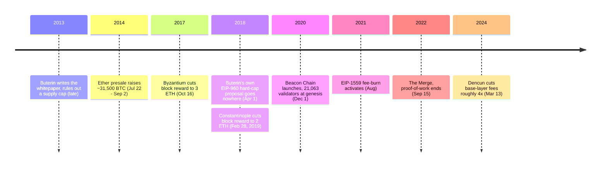

<!-- audit:quote-skip -->
> I propose that we agree on a hard cap for the total quantity of ETH.

Vitalik Buterin wrote that in a GitHub proposal on April 1, 2018, recommending a maximum of 120,204,432 ETH — almost exactly double what his own project had sold in its 2014 presale. EIP-960 went nowhere; GitHub marks the issue closed, stale. The date fell on April Fools' Day, but the text works through the exact reward-unit math a hard fork would have needed, block by block. Nothing about it reads as a joke.

The person proposing that cap had, four years earlier, written the whitepaper that ruled one out by name. That reversal, still sitting there unresolved, is the place to start reading Ethereum's monetary design: an issuance rule with no ceiling, a 2021 mechanism that burns part of every transaction fee, and a 2022 switch in who is even allowed to add new coins. [The twelve-chain design comparison](/BitcoinArchive/entries/analysis/2026-07-26-altcoin-count-and-design-comparison/) already sets Ethereum apart from every other chain in its table, the one design where issuance answers to network usage rather than a fixed schedule — what that table has no room to show is how the number inside that category actually moves.

## What the whitepaper says about itself

Buterin wrote the whitepaper in late 2013, at 19, closing out nearly two years at *Bitcoin Magazine* arguing that Bitcoin's own scripting language couldn't support the applications he wanted to build:

<!-- audit:quote-skip -->
> "I came to a realization that the way they were going about it was somewhat misguided… So I decided that, instead of trying to extend Bitcoin to do all sorts of things, what was actually needed was a brand new platform with a more general-purpose scripting language built from the ground up."

The document that followed — titled *Ethereum: A Next-Generation Smart Contract and Decentralized Application Platform* — rules out a capped supply in its own issuance section, by name:

<!-- audit:quote-skip -->
> "The permanent linear supply growth model reduces the risk of what some see as excessive wealth concentration in Bitcoin, and gives individuals living in present and future eras a fair chance to acquire currency units, while at the same time retaining a strong incentive to obtain and hold ether because the 'supply growth rate' as a percentage still tends to zero over time."

The choice against a ceiling was not a position Ethereum backed into after launch. It is written into the founding document, argued against Bitcoin's own design by name, years before the first supply figure existed.

## How issuance works: no cap, and the EIP-1559 burn

In place of a ceiling, Ethereum's issuance rate has been rewritten three times by hard fork. Under the original proof-of-work rules the block reward was a flat 5 ETH. Byzantium cut it to 3 ETH on October 16, 2017 (EIP-649); Constantinople cut it again to 2 ETH on February 28, 2019 (EIP-1234). Each change is written as a fixed constant taking effect at a specific block — not a formula tied to any measurement of network activity.

EIP-1559, activated in August 2021, added a second force pulling the other way. It split every transaction fee into a base fee and a priority fee (the tip), and instead of paying the base fee to whoever produces the block, the protocol destroys it. The base fee itself is not fixed: it rises when the previous block used more than half its gas target and falls when it used less, moving by at most one-eighth per block so the fee a user pays stays roughly predictable one block ahead. Only the tip reaches the validator; the base fee is gone.

Issuance adds ETH. The burn removes it. Whether total supply grows or shrinks in any given stretch depends on which of the two is larger at that moment — a shape with nothing in common with Bitcoin's curve, which only ever adds coins, on a schedule fixed since 2009, closing in on 21 million and never running in reverse.

## The consensus switch: from mining to staking

On December 1, 2020, Ethereum launched a second chain alongside its mainnet — the Beacon Chain, seeded at genesis with 21,063 validators who had each staked 32 ETH. For nearly two years its only job was to run proof-of-stake validation logic in parallel with the working chain, proving out the consensus rules before anything of value depended on them.

The Merge, on September 15, 2022, ended the parallel run. Ethereum's execution layer — the part holding account balances and contract state — was welded onto the Beacon Chain's consensus layer, and in the same stroke every miner was replaced by a validator. Mining rewards fell to zero; validator rewards absorbed all of the network's new issuance from that block onward.

The rule for picking the canonical chain changed with it. Fork-choice runs on LMD-GHOST, which counts only each validator's most recent vote and follows whichever branch carries the most accumulated support. Finality runs on Casper FFG, which groups blocks into epochs of 32 slots — about 6.4 minutes — and finalizes a checkpoint once two consecutive checkpoints each collect votes from at least two-thirds of all staked ETH. The two mechanisms together are called Gasper, and reversing a checkpoint Gasper has finalized requires controlling at least a third of the entire stake.

The switch cut issuance directly: pre-Merge mining paid out roughly 13,000 ETH a day, and post-Merge validator rewards run about 1,700 ETH a day — an 88 percent drop. Stacked on top of the EIP-1559 burn, the months right after the Merge saw more ETH destroyed in fees than issued in rewards on many days. Supply fell.

It didn't stay that way. The Dencun upgrade, on March 13, 2024, opened cheap dedicated data space for rollups (EIP-4844) and pulled most fee-paying activity off the base chain and onto them. Base-layer fees dropped by roughly a factor of four, and the ETH burned alongside them fell with it. By April 2024 issuance was outrunning the burn again, at the fastest pace since before the Merge. An issuance rule with no ceiling turns out to swing with usage in either direction — that swing, not the cap Bitcoin chose instead, is where Ethereum's supply design places its bet.

## Governance and initial distribution: a foundation, a presale, an active founder

Over 42 days in the summer of 2014 — July 22 to September 2 — Ethereum sold 60 million ETH in a public crowdsale. The price opened at 2,000 ETH per BTC and stepped down to 1,337 ETH per BTC by the close, raising roughly 31,500 BTC, about $18.3 million at the time. Alongside the sale, 5.9 million ETH — 9.9 percent of the amount sold — was minted for 83 early contributors, and an equal 5.9 million went to the newly formed Ethereum Foundation. Total supply at genesis came to 72 million ETH. Buterin's own share of the contributor allocation was the largest of the 83: roughly 553,000 ETH.

On the axis [the digital-gold analysis](/BitcoinArchive/entries/analysis/2008-10-31-bitcoin-digital-gold-structural-features/) calls people-and-organization decentralization, Ethereum sits opposite Bitcoin rather than somewhere near it. Buterin remains publicly active and his positions move the roadmap; the Ethereum Foundation coordinates protocol changes through the Ethereum Improvement Proposal process it administers. A foundation seeded by a presale, and a founder whose opinions still carry weight eleven years on — neither has an equivalent on the other side of this comparison, where the founder left in 2011 and no foundation or company ever formed to fill the space.

## What Buterin has said about Bitcoin

Asked about Bitcoin's proof-of-work at the StartmeupHK festival in Hong Kong in May 2021, Buterin offered his own chain's transition as the answer:

<!-- audit:quote-skip -->
> "Proof-of-stake is a solution to the [environmental issues] of Bitcoin—which needs far less resources to maintain."

The Ethereum Foundation's own estimate for the Merge, made before it happened, put the potential energy saving at up to 99.95 percent; the measured result after September 15, 2022 landed close to that number.

On the other design question, Buterin's clearest statement is the whitepaper's own argument that a "permanent linear supply growth" model avoids the wealth concentration a capped supply invites. Resource consumption and supply design are the two places Buterin returns to whenever he argues against Bitcoin's choices by name, and in both cases the argument takes the same shape: build Ethereum the other way.

## Significance to Bitcoin

Ethereum matters to Bitcoin's record not because it arrived at a different answer from somewhere unrelated, but because it arrived at close to the opposite answer to the same three questions — who decides supply, how consensus gets reached, where the founder stands — and has now run that opposite answer for eleven years. [The fixed-supply analysis](/BitcoinArchive/entries/analysis/2008-10-31-fixed-supply-vs-adjustable-money/) tracks what the bet has actually done to supply in practice: shrinking through 2022 and 2023, growing again by 2024, against Bitcoin's 21 million, which answers to nothing but its own halving schedule.

Of the six features [the digital-gold analysis](/BitcoinArchive/entries/analysis/2008-10-31-bitcoin-digital-gold-structural-features/) sets out — system decentralization, no controlling person or organization, a fair launch, a departed founder, a fixed supply, and first-mover weight — Ethereum holds exactly one: system decentralization. It has a foundation, an active founder, a presale, and no cap on the other five. That Bitcoin's claim to being "digital gold" rests on several properties holding at once, rather than on any one of them alone, is argued most clearly by the chain that has spent the longest time running the opposite of the other five.
