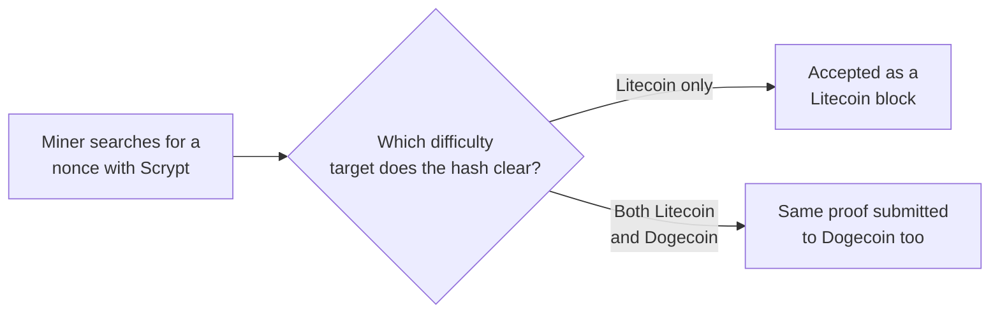
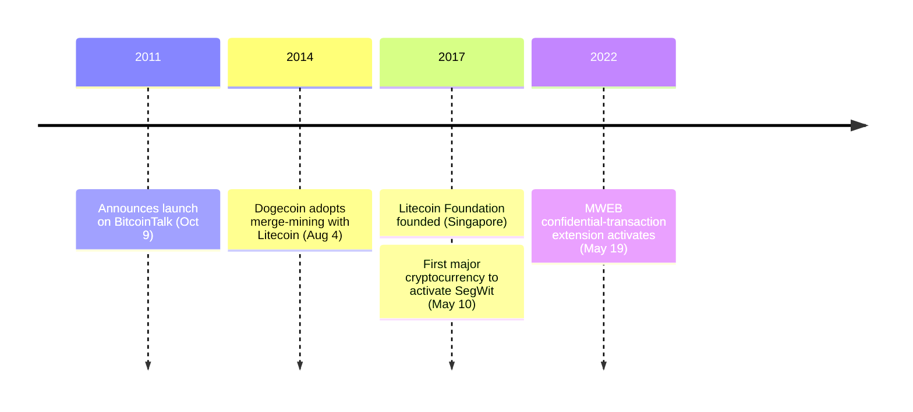

On October 9, 2011, Charlie Lee posted the launch of Litecoin to BitcoinTalk and used the same post to state what he thought he was doing to Bitcoin's code:

<!-- audit:quote-skip -->
> One of the goals of Litecoin is to not change what's working (from Bitcoin) unless there was a good reason to.

Read against the actual diff, that sentence understates the case. Only four settings moved at all, and three of the four moved by exactly the same number: four.

## Four numbers, one ratio

| Parameter | Bitcoin | Litecoin | Ratio |
|---|---|---|---|
| Proof-of-work | SHA-256 | Scrypt | function replaced, not scaled |
| Block interval | 10 minutes | 2.5 minutes | ÷ 4 |
| Supply cap | 21,000,000 | 84,000,000 | × 4 |
| Halving interval | 210,000 blocks | 840,000 blocks | × 4 |

The two scaled intervals cancel out on the calendar. Bitcoin's first halving lands after 210,000 blocks at 10 minutes each — about 2.1 million minutes, or four years. Litecoin's lands after 840,000 blocks at 2.5 minutes each — the same 2.1 million minutes, the same four years. Blocks arrive four times as often; the halving still falls on the date it would have kept under Bitcoin's own clock. The starting block reward carries the identical coincidence forward: 50 LTC, the same number Bitcoin started with.

One setting inside that same announcement did not move at all. Bitcoin retargets its mining difficulty every 2,016 blocks, roughly two weeks; Litecoin kept the identical block count. At four times the block rate, those 2,016 blocks pass in about three and a half days — a difficulty adjustment four times more frequent than Bitcoin's, riding on an interval its own announcement never mentioned changing.

## A design premise that silicon proved wrong

The one change that was not a multiple of four is where Lee's stated caution gave way to an untested design choice. His reasoning, from the same post:

<!-- audit:quote-skip -->
> We really liked Tenebrix's Scrypt proof of work. Using Scrypt allows one to mine Litecoin while also mining Bitcoin.

Scrypt was not built for mining. Colin Percival, the FreeBSD developer who wrote it, designed it in March 2009 as a key-derivation function for his own Tarsnap backup service, specifically to make attacks with custom hardware expensive. Litecoin adopted Percival's own recommended parameters — N=1024, r=1, p=1 — which commit each single hash attempt to roughly 128 kilobytes of working memory, read and rewritten repeatedly before a result comes out. SHA-256 rewards raw arithmetic throughput, and a circuit built for nothing else runs it hundreds of times faster than a general-purpose chip. Scrypt's assumption was that a memory requirement would narrow that gap, because custom silicon does not get cheap memory the way it gets cheap arithmetic.

128 kilobytes turned out to be a small enough requirement that the assumption didn't hold. Chip designers found they could trade memory for extra computation: store every eighth intermediate value instead of every one, and recompute the seven skipped values on demand when the algorithm asks for them. That trades a fixed, ASIC-unfriendly memory cost for a variable, ASIC-friendly compute cost, and the swap favored custom hardware. Scrypt ASICs shipped from 2014 — first KnCMiner, then Bitmain's Antminer L-series — and Litecoin mining was as fully professionalized as Bitcoin's within two years. Bitmain's own rise through that period is [Jihan Wu's record](/BitcoinArchive/participants/jihan-wu/) to tell.

## Borrowing hash rate to keep a fork honest

Scrypt produced one further consequence nobody designed for. When Dogecoin forked Litecoin's codebase in December 2013, it inherited Scrypt along with everything else — and a hash rate too thin to make a 51% attack expensive. In April 2014, Lee proposed the fix: let Dogecoin accept Litecoin's own proof-of-work as its own. Dogecoin's team announced the plan that August, and auxiliary proof-of-work (AuxPoW) went live on the network that September.

The mechanism costs a miner nothing extra. A Litecoin miner is already hashing candidate blocks with Scrypt, hunting for a result under Litecoin's difficulty target. Merge-mining has that same miner commit a Dogecoin block header inside the coinbase transaction it was building anyway. If the resulting hash clears Litecoin's target, it becomes a Litecoin block, exactly as before. If the identical hash also clears Dogecoin's much lower difficulty target, that single proof of work is valid on both chains at once, and the miner is paid twice for one unit of computation. Dogecoin's resistance to a 51% attack has run on Litecoin's hash rate, not its own, ever since.

## Governance, and the chain that adopted SegWit first

No single body can rewrite Litecoin's protocol. In 2017, Lee left his director role at Coinbase to work full time on the Litecoin Foundation, a Singapore-registered nonprofit that funds and promotes development without holding unilateral authority over the code — contributors decide what ships, and the founder remains one voice among them, not the only one.

That governance shape produced Litecoin's sharpest technical first. On May 10, 2017, at block height 1,201,536, Litecoin activated Segregated Witness — the first major cryptocurrency to do so, months ahead of Bitcoin's own SegWit lock-in that August. The ledger itself stayed exactly as transparent as it had been at launch, with one opt-in exception: Mimblewimble Extension Blocks (MWEB), proposed in November 2019 and activated May 19, 2022 at block height 2,257,920, let a holder move coins into a confidential extension block that hides the amount and the counterparties. Nothing changes for anyone who does not opt in. Lee's own description of the privacy on offer stayed characteristically modest:

<!-- audit:quote-skip -->
> For most people, that's good enough. It's the difference between living in a glass house vs living in a house with windows.

## What Lee has kept saying about Bitcoin

Across a decade of interviews, Lee has ranked his own chain second with a consistency unusual among the founders of a competing currency:

<!-- audit:quote-skip -->
> Bitcoin is obviously the soundest form of money around, and Litecoin, I would say, is the second soundest.

By 2025 the ranking had hardened into an image:

<!-- audit:quote-skip -->
> Bitcoin is currency for kings and Litecoin is currency for the people.

The one time Lee changed his own relationship to that ranking was December 20, 2017, when he announced he had sold or given away every LTC he owned. The reason he gave was not price. It was the asymmetry between what he said and what the market did with it:

<!-- audit:quote-skip -->
> Some people even think I short LTC! So in a sense, it is conflict of interest for me to hold LTC and tweet about it because I have so much influence.

Litecoin's supply trajectory sits alongside Bitcoin's and ten other currencies' on a single normalized index:

<!-- chart: supply-curve-comparison -->

## Significance to Bitcoin

Litecoin is a controlled experiment Bitcoin never ran on itself: hold the codebase constant, move four settings by an identical factor, and see what still works. What still works is everything — a coin that halves on Bitcoin's own calendar, mines on a different function, and settles under a Singapore nonprofit instead of no one at all. That result says the specific numbers in Bitcoin's own design — 21 million, 210,000 blocks, 10 minutes — were choices among workable options, not physical constraints the protocol was forced into.

Measured against [the six features Bitcoin Institute uses to read digital-gold status](/BitcoinArchive/entries/analysis/2008-10-31-bitcoin-digital-gold-structural-features/), Litecoin matches Bitcoin on two: a fair, mined-from-block-one launch, and a hard cap it has never revisited. It fails a third by a route no other chain in this record has taken. Satoshi's departure left Bitcoin with no one left to ask; Lee never left, and has spent more than a decade telling audiences that his own coin ranks under Bitcoin's. When his own visibility became the conflict of interest, in December 2017, he did not stop talking — he sold the coin he was talking about. Where Satoshi separated Bitcoin from its founder by disappearing, Lee tried the opposite operation: stay, keep speaking, and hold nothing that the speech could move.
