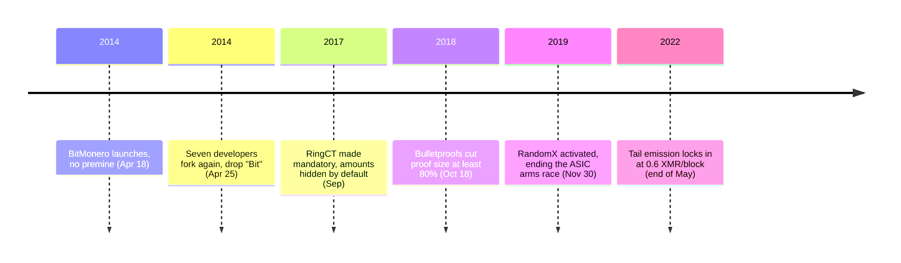

<!-- audit:quote-skip -->
> The reality is that 82% of the coins were already mined before its 'public' release. Even if the premined coins weren't done so maliciously, it still means 82% of the coins in the hands of persons unknown and invisible.

Riccardo Spagni wrote that about Bytecoin — the CryptoNote-based currency Monero forked away from, and the entire reason it exists. His own count put the number at 151 billion of a possible 184 billion BCN, already mined before the coin's existence was known outside the project. A user calling themselves thankful_for_today announced the fork on April 9, 2014, and launched BitMonero nine days later with no premine of its own. The community didn't trust thankful_for_today either: on April 25, seven developers forked again, dropped the "Bit," and kept building as Monero.

Two forks in seventeen days is not a design process so much as a founding principle — whoever holds the supply before launch cannot be trusted to hold it fairly after. [The twelve-chain design comparison](/BitcoinArchive/entries/analysis/2026-07-26-altcoin-count-and-design-comparison/) already places Monero closer to Bitcoin on distribution and system decentralization than any other chain in its table. What that table has no room to show is how far Monero then diverged, on purpose, on the two questions Bitcoin answered the opposite way: whether the ledger should be readable, and whether issuance should ever stop.

## Hiding the ledger: ring signatures, stealth addresses, and RingCT

The CryptoNote document Monero implements sets two conditions for electronic cash and states, without hedging, that Bitcoin clears only one of them:

<!-- audit:quote-skip -->
> Untraceability: for each incoming transaction all possible senders are equiprobable. Unlinkability: for any two outgoing transactions it is impossible to prove they were sent to the same person. ... Unfortunately, Bitcoin does not satisfy the untraceability requirement.

Monero answers untraceability with a ring signature. A sender's real output is pooled with decoy outputs pulled at random from the existing chain, and the signature proves only that some member of that pool authorized the spend — never which one. Since an October 2018 upgrade, a sender no longer picks how large that pool is; the network fixes it for everyone. That fixed size started at 11 and was raised to its current 16 — one real output plus 15 decoys old enough to blend in — at the August 2022 "Fluorine Fermi" hard fork, the largest single increase to the anonymity set the network has made. A node validates the whole ring and cannot tell the real output from the decoys, which is the entire point. Before the 2018 upgrade, ring size was the sender's choice, and a conspicuously small ring was itself a signal to look closer.

Unlinkability is a separate problem, solved a separate way. A published Monero address never receives funds directly — the sender uses the recipient's two public keys plus a fresh random number to compute a brand-new one-time destination address for every payment, and only the recipient's private keys can later recognize and spend from it. Two payments to the same person land at two addresses that look, to everyone but the two parties involved, like payments to two different people.

Amounts were the last piece to fall, and they cost the most to hide. RingCT, activated at block 1,220,516 in January 2017 and made mandatory that September, conceals the transaction amount itself while still letting the network verify that inputs equal outputs — proving a hidden number isn't negative, without revealing the number, takes more data than a plaintext comparison ever would. Bulletproofs, added in the October 18, 2018 hard fork, replaced the earlier range-proof method and cut that cost by at least 80 percent, by Monero's own developers' account.

## Mining: the arms race RandomX ended

The CryptoNote document's second objection to Bitcoin targets mining, and throws Satoshi's own words back at the network:

<!-- audit:quote-skip -->
> Therefore, Bitcoin creates favourable conditions for a large gap between the voting power of participants as it violates the "one-CPU-one-vote" principle since GPU and ASIC owners posses a much larger voting power when compared with CPU owners.

Monero's answer wasn't one algorithm; it was a policy of replacing the algorithm on a schedule. CryptoNight, the proof-of-work function it launched with, leaned on memory bandwidth specifically because memory is expensive to specialize in silicon — the same premise [Litecoin](/BitcoinArchive/entries/aftermath/2011-10-13-litecoin-launch/) built into Scrypt, a premise dedicated hardware eventually defeated on both chains. Once dedicated CryptoNight hardware appeared, Monero's response was to keep tweaking the algorithm's fine details roughly every six months, retiring whatever hardware had just been built for it — a war of attrition rather than a solution.

RandomX, activated November 30, 2019 at block 1,978,433, ended that cycle instead of continuing it. Rather than one fixed set of operations to build a circuit around, RandomX generates a new random program for every hash attempt — a sequence of integer arithmetic, floating-point math, and branches — and runs it against a dataset just over 2 gigabytes that gets fully rebuilt every 2,048 blocks, roughly every 2.8 days. A general-purpose CPU already runs exactly this mix efficiently; a circuit built to accelerate one fixed program has nothing to specialize around, because the program itself keeps changing block to block. Four independent firms — Trail of Bits, X41 D-Sec, Kudelski Security, and QuarksLab — audited the algorithm between May and August 2019, funded jointly by the Monero community and Arweave, before it ever touched mainnet.

## The emission curve, and a 64-bit accident at its ceiling

Monero recomputes its block reward every single block rather than halving on a fixed schedule: subtract every coin already mined from a constant called the money supply, then shift the result right by 20 bits — equivalent to dividing by 2^20 and dropping the remainder. Bitcoin's reward falls in steps, once every 210,000 blocks; Monero's falls by a small amount on every block, a continuous curve rather than a staircase. The CryptoNote document's complaint about Bitcoin's halving was exactly this shape:

<!-- audit:quote-skip -->
> The original intention was to create a limited smooth emission with exponential decay, but in fact we have a piecewise linear emission function whose breakpoints may cause problems to the Bitcoin infrastructure.

The money-supply constant in that formula is 18,446,744,073,709,551,615 — 2^64 minus 1, the largest number a 64-bit unsigned integer can hold. Divided by Monero's smallest unit, one trillionth of an XMR, that constant is a supply of 18,446,744.07 XMR — call it 18.4 million. Bitcoin's 21 million is a number its designer chose. Monero's ceiling is a number nobody chose at all: it is what falls out of picking a 64-bit integer type for the money-supply variable and never revisiting it.

That ceiling was never actually reached. Once the formula's output falls below 0.3 XMR per minute, the code stops shrinking the reward and locks it at that floor — 0.6 XMR per two-minute block. Monero crossed that floor at the end of May 2022 and has paid exactly 0.6 XMR to every block since, with no scheduled end. Bitcoin's supply approaches 21 million and stops. Monero's keeps growing, forever, at a rate that shrinks as a share of the total but never reaches zero.

## No premine, no foundation: funding development without either

Nobody profited from Monero's launch the way Bytecoin's early holders had. There was no presale, no developer allocation, and no company ever held equity in the chain — the same absence [the digital-gold structural reading](/BitcoinArchive/entries/analysis/2008-10-31-bitcoin-digital-gold-structural-features/) treats as one of Bitcoin's own load-bearing features. thankful_for_today, the pseudonymous figure who started it all, disappeared after the April 25 fork and never resurfaced under that name. Unlike Bitcoin, though, several of the developers who forked away — Spagni foremost among them — stayed publicly attached to the project for most of a decade.

Development still had to get paid for, and Monero's answer has no single paymaster. The Community Crowdfunding System lets anyone post a funding proposal in the open, where the community argues over scope and price before a Core Team escrows the donated funds and releases them against completed milestones rather than against a roadmap a foundation board set. Routine costs that don't fit any single proposal are covered by a separate General Fund anyone can donate to directly. No entity decides what gets built; whether a proposal draws enough donations decides it.

## What Spagni has said about Bitcoin

Spagni's own position was never that Bitcoin had failed. It was narrower and harder to dismiss: Bitcoin's transparency is a real property with a real consequence, and Monero is that consequence. He said as much in an October 2018 What Bitcoin Did interview:

<!-- audit:quote-skip -->
> As Bitcoin proved not to be anonymous, there is a significant and obvious use case for Monero.

He pushed the same transparency argument the other direction too — not just that Bitcoin lacks privacy, but that its readability isn't the safety net people assume it is. He made the point to Coin Story in December 2020:

<!-- audit:quote-skip -->
> At the end of the day, Bitcoin is not immune to auditibility risks. And you can see that because there have been two clear inflation bugs on Bitcoin. The first was actually exploited in 2010 when someone created billions of bitcoins... The second one was a little more of an issue and that was the 2018 CVE, which was double spending transaction outputs.

Checked against this archive's own record of both bugs, the claim holds for one and softens for the other — [Spagni's record](/BitcoinArchive/participants/riccardo-spagni/) works through the full comparison. The point survives regardless: a readable ledger is auditable in principle, and Bitcoin's own history shows it was only audited in time once.

Monero's tail emission, plotted against Bitcoin's cap and ten other currencies on one normalized index:

<!-- chart: supply-curve-comparison -->

## Significance to Bitcoin

Monero's ring signatures descend from CryptoNote, not from Bitcoin's own code — [the fork-and-altcoin genealogy](/BitcoinArchive/entries/analysis/2008-10-31-bitcoin-fork-and-altcoin-genealogy/) places it outside Bitcoin's direct lineage entirely. It earns a place in Bitcoin's record anyway, because it is the rare chain that agrees with Bitcoin's answers on distribution and control and still disagrees, in detail and on purpose, everywhere else. No premine, no foundation, no company — Monero matches Bitcoin there. Ledger visibility and terminal supply are the two places it chose the opposite answer, and each choice carried a specific, statable cost: a supply that's harder to audit, and a coin count that never finishes counting. Bitcoin's 21 million is a number a designer chose. Monero's own ceiling was never chosen at all — a rounding artifact of a 64-bit integer, on the one chain in this record that forked away from another specifically because it didn't trust what an unaudited number can hide.
