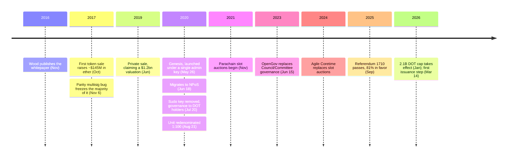

In November 2016, Gavin Wood filed a technical paper under his own name, describing how the network he was about to launch should be governed, and how that governance should eventually end:

<!-- audit:quote-skip -->
> "Governments and diapers must be changed often, and for the same reason."

He credited the line to Twain and aimed it at the two-chamber committee his own paper proposed — a body of bonded validators and a body of client developers, both answerable to a token-holder supermajority empowered to "augment, reparameterise, replace or dissolve" the whole arrangement whenever it stopped working. Token holders did exactly that, twice. In 2023 they dissolved the committee. In September 2025 they reached past it, into a formula Wood's paper had written down and never revisited: how many new DOT the network is allowed to print every year.

## What the whitepaper says about itself

The paper's title is *Polkadot: Vision for a Heterogeneous Multi-Chain Framework*, and its abstract opens by naming what it believes is wrong with every chain that came before it:

<!-- audit:quote-skip -->
> "Present-day blockchain architectures all suffer from a number of issues not least practical means of extensibility and scalability. We believe this stems from tying two very important parts of the consensus architecture, namely canonicality and validity, too closely together."

The preface lists five failures it holds responsible for blockchains never reaching real-world deployment — scalability, isolatability, developability, governance, applicability — and is blunt about its own limits: "In the present work, we aim to address the first two issues: scalability and isolatability." Governance and applicability, named as failures in the same breath, are left for someone else to solve.

The scalability failure gets a number attached. The paper states that the Parity Ethereum client "can process in excess of 3,000 transactions per second when running on performant consumer hardware," while "current real-world blockchain networks are practically limited to around 30 transactions per second" — a hundred-to-one gap the paper blames not on weak software but on consensus design itself, one that it says "applies equally to both proof-of-work (PoW) systems such as Bitcoin and Ethereum" and to proof-of-stake systems alike. Bitcoin is named here as an example of the handicap, not as a target. A few pages later the paper names Bitcoin again, this time as a peer rather than a problem:

<!-- audit:quote-skip -->
> "Polkadot may be considered equivalent to a set of independent chains (e.g. the set containing Ethereum, Ethereum Classic, Namecoin and Bitcoin) except for two very important points: Pooled security; trust-free interchain transactability."

The design that follows is not a rewrite of Bitcoin's rules. It is an attempt to sit a set of chains — Bitcoin among them, unmodified — inside one shared security umbrella.

## The relay chain, four roles, and a name for the election

Polkadot's answer to its own scalability complaint is a division of labor: a central chain, the relay chain, that does nothing but provide shared security and message-passing, and any number of application-specific "parachains" plugged into it. The whitepaper is explicit that the relay chain carries no application logic of its own — parachains do all of that — which inverts Bitcoin's single chain doing both jobs at once.

Four roles run the relay chain, and the paper defines each narrowly. Validators are "the highest charge" — they seal blocks and post the bond that makes misbehavior costly. Nominators back a validator's bond with their own stake and, in the paper's own description, "have no additional role except to place risk capital" — a passive backing role the paper compares directly to mining pools of "current PoW blockchains." Collators maintain a full node for one parachain and hand validators a candidate block plus a proof that it is valid. Fishermen are the odd one out: independent "bounty hunters" who earn a single, one-off reward for catching a validator double-signing or ratifying an invalid block, a reward capped so that no more than a third of validators could be acting maliciously before it pays out in full. The paper gives the whole combination a name — Nominated Proof-of-Stake, NPoS — and expected validators to be re-elected "at most once per day but perhaps as seldom as once per quarter."

| | Bitcoin | Polkadot |
|---|---|---|
| Consensus participants | Anyone who can pay for electricity | A capped set of validators, backed by nominators |
| Block production and finality | One rule (longest chain) does both | Split: BABE produces, GRANDPA finalizes |
| Chains | One | One relay chain plus many parachains |
| Cost of a new chain | None — there is only one chain | Auctioned lease (2021–2024), now purchased execution time |
| Who can change the issuance rule | No one | Token holders, by vote |

What actually shipped refined the paper's own sketch. Block production runs on BABE, a roughly six-second lottery each validator enters per slot; finality runs separately on GRANDPA, which votes on whole chains rather than single blocks once at least two-thirds of validators agree. Six of those four-hour sessions make a twenty-four-hour "era," and the active validator set is re-elected at each era boundary — closer to daily than the paper's quarterly upper bound. Connecting a new parachain to the relay chain also changed shape: from November 2021 through 2024, projects competed for a limited number of slots through DOT-collateralized auctions, locking tokens for the length of the lease and getting nothing else in return for as long as the lease ran. Agile Coretime, live since September 2024, replaced the auction with a purchase: a parachain buys blocks of relay-chain execution time outright, in bulk or on demand, rather than locking capital against a multi-year bet.

## From "roughly 10%" to a vote-imposed cap

The paper's own issuance design set no ceiling at all:

<!-- audit:quote-skip -->
> "funds coming from a token base expansion (up to 100% per year, though more likely around 10%) together with any transaction fees collected"

A market-based mechanism was meant to nudge that expansion rate up or down to hold a target proportion of tokens staked — a target, not a cap, and one the paper's own FAQ calls "unlimited." The same document, in the same breath, states that "Polkadot tokens are neither intended nor designed to be used as a currency."

The chain that eventually launched on May 26, 2020 bore little resemblance to the token-holder government the paper described. Genesis began under a single administrator key, Sudo, running as a proof-of-authority network. NPoS took over on June 18; Sudo was removed on July 20, handing governance to DOT holders for the first time; transfers were enabled on August 18; and three days later, on August 21, holders voted to redenominate the unit itself, one old DOT becoming one hundred new ones.

Issuance then held at a fixed 120 million DOT a year for years. The paper's "roughly 10%" was a proportion of the supply at genesis, and as the base grew, the same fixed number quietly stopped being ten percent of anything. By September 2025, circulating supply had reached roughly 1.6 billion DOT — at which point 120 million a year was already under 8 percent, without anyone having voted on a thing.

That September, token holders voted anyway. Referendum 1710, filed under a track called "Wish For Change," passed with 81 percent in favor. It discarded the open-ended target and imposed a hard ceiling of 2.1 billion DOT, replacing the flat annual mint with a stepped schedule: 13.14 percent of whatever supply remains under the cap, minted every two years. The change took effect in January 2026, and the first step landed on March 14, 2026 — an initial cut of roughly 53.6 percent against what the old schedule would have minted. The referendum's own projection: by 2040, supply lands near 1.91 billion DOT under the new rule against roughly 3.4 billion under the old one. The cap itself is not reached by any single event, the way a Bitcoin halving is; the schedule approaches 2.1 billion asymptotically, with 2160 the estimated year the last fraction of a DOT arrives.

## Governance and initial distribution: an ICO, a frozen two-thirds, and a dissolved committee

Web3 Foundation ran Polkadot's first token sale in October 2017, raising roughly $145 million in ether. Within days, roughly two-thirds of it nearly vanished. A shared code library in Parity's own multi-signature wallet software — Parity being the company Wood co-founded — had a flaw that let one user accidentally delete it, freezing every wallet built on that library at once. More than 500 wallets across several projects were affected; Polkadot's own share came to about $98 million, locked alongside the rest. Web3 Foundation went back to the market in 2019 for a second, private sale — price undisclosed under NDA, tokens locked for roughly five months — and raised a further $43 million to make up the shortfall.

The governance the 2016 paper sketched as two committees under a token-holder supermajority did get built, and did get replaced by the same supermajority. From 2020, Polkadot ran what the network calls Governance V1: a Council, a Technical Committee, and public referenda alongside them — the bicameral shape the whitepaper had described almost exactly. In June 2023, OpenGov retired all of it. Fifteen separate tracks now let DOT holders propose and vote directly, with no council seat standing between a proposal and a decision; a conviction-voting mechanism multiplies a vote's weight by how long the voter is willing to lock their tokens, up to six times for the longest lock available. Referendum 1710 — the vote that rewrote the issuance formula from the 2016 paper — passed on this system, under the exact "supermajority" authority that same paper had named nine years earlier as the only body allowed to change the rules.

## What Wood has said about Bitcoin

Speaking to Real Vision in January 2021, in an interview titled "Polkadot: A Bet Against Maximalism," Wood turned to Bitcoin's mining process directly:

<!-- audit:quote-skip -->
> Bitcoin "uses up the equivalent of ... some small country's energy simply in securing itself."

In the same conversation he raised a second objection, on throughput rather than energy: Bitcoin's advertised ten-minute block target, he said, does not describe how long a payment actually takes to confirm in practice, where a confirmation can run closer to an hour. Both objections are about what Bitcoin costs to run, not about whether its design works. The whitepaper Wood wrote five years earlier had already answered that second question, naming Bitcoin as one of the systems Polkadot considers itself "equivalent to" — a chain worth connecting to, not one whose consensus needed replacing.

Polkadot's supply since Referendum 1710, plotted against Bitcoin's cap and ten other currencies on one normalized index:

<!-- chart: supply-curve-comparison -->

## Significance to Bitcoin

[The digital-gold structural-features analysis](/BitcoinArchive/entries/analysis/2008-10-31-bitcoin-digital-gold-structural-features/) counts a fixed supply as one of six features that, held together, nothing else has matched — and names the party who can change that supply as the sharper test than the cap number itself. Polkadot answers that test in the plainest way available: the party who can change the rule has a name, a wallet, and a voting record. [The fixed-supply-versus-adjustable-money comparison](/BitcoinArchive/entries/analysis/2008-10-31-fixed-supply-vs-adjustable-money/) asks who holds the authority behind any monetary design; Referendum 1710 is that authority exercising itself in the open, on a formula its own author wrote into a whitepaper and handed to a vote. [The twelve-chain design comparison](/BitcoinArchive/entries/analysis/2026-07-26-altcoin-count-and-design-comparison/) already counts this as the clearest instance in its own record of a chain's token holders rewriting their own monetary rule. Bitcoin's 21 million has no comparable vote to win, because it has no comparable voter. Polkadot's 2.1 billion has one, and in September 2025, that voter used it.
