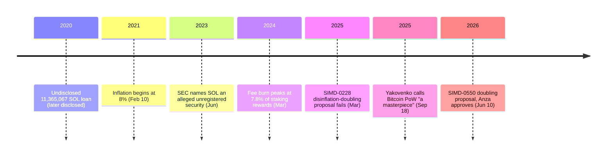

<!-- audit:quote-skip -->
> proof of work is... it is a brilliant—It's a masterpiece. [...] it's a masterpiece in terms of elegance and simplicity. [...] The reason it hasn't been hacked is because it's so simple.

Anatoly Yakovenko said that about Bitcoin's consensus mechanism in September 2025, on the All-In podcast — the same conversation in which he explained why the chain he built runs on something Bitcoin does not have at all: a clock built into consensus itself. Bitcoin's validators agree on the order of the world by watching blocks propagate and picking the chain with the most accumulated work, no clock required. Solana's validators start from one, and the leader schedule, the vote deadlines, and the issuance calendar are all built on top of it.

## A clock inside consensus

Solana calls its clock Proof of History, and the mechanism is a single, continuously running function: a validator feeds SHA-256's own output back into itself, hashing each result to produce the next one. Because every step depends on the step before it, nobody can skip ahead and forge a later value without redoing the entire chain that led to it — the sequence itself is the proof that time passed between any two points on it. Each hash step is a "tick"; a bundle of ticks makes a "slot," and a leader holds four consecutive slots at a time, roughly 1.6 seconds in total at 400 milliseconds per block, publishing only inside the tick range assigned to that slot. Leadership itself is assigned once per epoch — 432,000 slots, roughly two to three days — on a schedule weighted by each validator's stake.

The clock is not the consensus; Tower BFT is. A validator votes for a fork by publishing its public key and the hash of the block it is voting for, and every additional vote on top of an existing one doubles the lockout on every vote already in the stack, so a validator that keeps voting for a fork that turns out wrong pays an escalating cost for changing its mind. A block is "confirmed" once two-thirds of stake has voted for it and "finalized" once thirty-two further slots have voted past it. Where Bitcoin's proof-of-work makes attacking expensive through hardware and electricity, Solana's whitepaper draws the parallel to a different kind of expense directly: a validator's stake is "a capital expense in Proof of Work," committed as collateral and slashable exactly where a miner's rig is sunk cost.

What the shared clock buys Tower BFT is a deadline it can compute without asking anyone — a validator can skip a slow or unresponsive leader's slot on schedule, rather than waiting for the rest of the network to agree the leader has gone quiet. The whitepaper names the gap this closes directly:

<!-- audit:quote-skip -->
> Current publicly available blockchains do not rely on time, or make a weak assumption about the participant's abilities to keep time. [...] The lack of a trusted source of time means that when a message timestamp is used to accept or reject a message, there is no guarantee that every other participant in the network will make the exact same choice.

Bitcoin's validators never had that gap to close in the first place. The tradeoff Solana accepts to buy its clock is stated with the same directness:

<!-- audit:quote-skip -->
> CAP systems that deal with partitions have to pick Consistency or Availability. Our approach eventually picks Availability, but because we have an objective measure of time, Consistency is picked with reasonable human timeouts.

Availability first — a partitioned Solana network keeps producing blocks, where a partitioned Bitcoin network stalls rather than diverges, the conservative choice [the digital-gold structural-features analysis](/BitcoinArchive/entries/analysis/2008-10-31-bitcoin-digital-gold-structural-features/) treats as a property rather than a defect. The number the whitepaper puts on the payoff is exact: "throughput up to 710k transactions per second is possible with today's hardware," analyzed on a 1 gbps network.

## An issuance rate with no ceiling, and two names who can move it

Solana sets no cap at all. Inflation began at 8% on February 10, 2021 — the first epoch's reward distribution paid out 213,841 SOL — and the rate has fallen 15% every year since, heading toward a terminal rate of 1.5% the current schedule reaches sometime around 2032. A validator's staking yield is the inflation rate multiplied by uptime and by one minus its commission, divided by the fraction of all SOL that is staked, so issuance is not a byproduct of the reward — it is the reward. A fee burn offsets a small slice of that — it peaked at 7.8% of staking rewards in March 2024 and usually runs closer to 3%, small enough that a pending change routing fees entirely to block producers would barely move the schedule.

That terminal rate is not fixed the way Bitcoin's 21 million is fixed; it is a parameter, with a procedure for changing it — the same axis [the fixed-supply comparison](/BitcoinArchive/entries/analysis/2008-10-31-fixed-supply-vs-adjustable-money/) traces across fifteen currencies. A proposal to double the disinflation rate from 15% to 30%, filed as Solana Improvement Document (SIMD) 0228, went to a validator vote in March 2025 and failed. It came back as SIMD-0411 in November 2025 and lapsed in January 2026 for a structural reason: a SIMD needs sign-off from both client-implementation teams, Anza and Firedancer, before it can reach a vote at all, and this one got neither. A third version, SIMD-0550, followed in June 2026 with the same doubling, framed around cutting roughly 18.9 million SOL of future emissions; Anza approved it on June 10, and Firedancer's review is still open. Bitcoin's cap holds because no one is left whose sign-off it requires. Solana's terminal rate can be changed, by two entities with names: Anza and Firedancer.

## The price of admission to validate

Running a Bitcoin full node — the thing that lets anyone verify the chain for themselves — has been something an ordinary home computer could do since 2009. Running a Solana validator is a different proposition. The recommended machine carries 192 to 256 GB of RAM, a single-thread-heavy CPU in the Intel Core i9-13900K or AMD Ryzen 9 7950X class, and enterprise NVMe storage rated for petabyte-scale writes, since consumer drives wear out under Solana's write load. A mid-tier validator hosted on a general-purpose cloud provider moves on the order of 100 to 300 terabytes of bandwidth a month and costs roughly $8,600 a month to run, most of it bandwidth — over $100,000 a year before hardware.

The entry cost shows up in who is left to pay it. Active validators fell from more than 2,500 in March 2023 to 791 by the end of 2025's fourth quarter, a roughly 68% decline, and the two largest hosting providers, Teraswitch and Latitude.sh, now account for 43.4% of staked SOL between them. The Nakamoto coefficient — the smallest number of independent entities that would have to collude to control a third of the stake — has fallen from a peak of 34 in August 2023 to 19, where it has stayed roughly flat for the past year. None of this is a claim that Solana is centrally operated — it is a measurement of where the hardware bar has pushed the validator set, a direct consequence of the throughput the clock was built to buy.

## A premine, and a loan that stayed undisclosed

Solana's supply did not start from mining open to everyone on the same terms; it started from an allocation to the Solana Foundation and to early investors, decided before launch. Part of that early accounting was not disclosed at the time it mattered:

<!-- audit:quote-skip -->
> The problem: we did not disclose this information to the public, as well as the size and nature of the loan, during the CoinList auction and subsequent Binance listing.

The loan was 11,365,067 SOL, from the Foundation to a market-making firm, acknowledged in 2020 — after the CoinList auction and the Binance listing had already happened. Solana's own account states the full amount was later removed from circulating supply; a separate company post states that 3,365,067 SOL of it was in fact returned by the market maker into a Foundation-controlled wallet. Both figures are the project's own, describing two different things rather than one superseding the other.

The SEC named SOL among the assets it alleged were unregistered securities in its June 2023 actions against Binance and Coinbase. The Solana Foundation rejected the characterization, the agency later moved to drop SOL from the Binance case, and the Coinbase case was dismissed in February 2025. A chain with no premine, no foundation, and no issuer has no disclosure left to make late. Solana has all three, and the loan is what a late disclosure from a chain with an issuer looks like.

## What the founder said about Bitcoin

Six months before he called proof-of-work a masterpiece, in March 2025, Yakovenko posted the opposite judgment about the asset that mechanism secures:

<!-- audit:quote-skip -->
> BTC has no value. In the best light, it's insurance. [...] It's not an investment, it's a cost, and there is no guarantee it will work.

In July 2026 he took the argument further, against the specific claim that Bitcoin is the one crypto asset with a real basis:

<!-- audit:quote-skip -->
> True tokens exist, as apposed to bad equity or debt. Network rights are unenforceable because no one has the obligation to run your software.

The three statements point at two different things. "Masterpiece" describes the machine — proof-of-work's simplicity as a security property. "No value" and "true tokens exist" describe the holding: whether the asset the machine secures carries any enforceable claim. Yakovenko draws that line through the middle of his own admiration, and the fuller record of where he draws it is in [his biography](/BitcoinArchive/participants/anatoly-yakovenko/).

Solana's tapering issuance, plotted against Bitcoin's cap and ten other currencies on one normalized index:

<!-- chart: supply-curve-comparison -->

## Significance to Bitcoin

Solana's whitepaper opens with a problem Bitcoin's consensus never had to solve: a shared, verifiable notion of time. Bitcoin agrees on order by watching blocks arrive and rewarding the chain with the most work behind it; building a clock in bought Solana its throughput, and with it, a validator hardware bar Bitcoin's full-node model never had to clear. The same trade repeats on the monetary side: an issuance rate with no ceiling, set by a schedule two named client teams can vote to change, against a cap that endures precisely because no one holds that vote over it. [The digital-gold structural-features analysis](/BitcoinArchive/entries/analysis/2008-10-31-bitcoin-digital-gold-structural-features/) names the absence of exactly that kind of nameable authority as one of six features no other chain has assembled at once; Solana's foundation, its premine, and the loan it disclosed late are what the presence of that authority costs. Eleven other chains made the same kind of trade differently, examined further in [the altcoin design comparison](/BitcoinArchive/entries/analysis/2026-07-26-altcoin-count-and-design-comparison/). Yakovenko's own verdict on proof-of-work — a masterpiece, because it is simple — is the same argument stated from the other side: the feature he built Solana away from is the one he says he cannot explain away.
