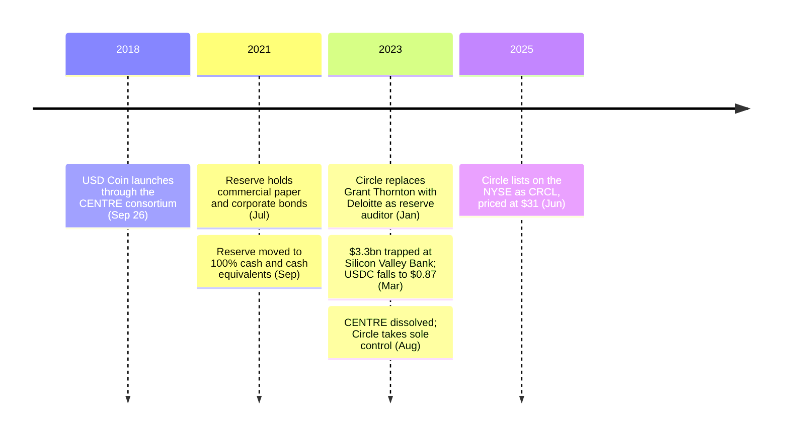

<!-- audit:quote-skip -->
> CENTRE aims to provide the first: a fiat-collateralized approach. One unit of tokenized fiat currency is backed by one unit of reserved fiat. More so than the other approaches to stablecoin development, the fiat-collateralized approach requires meeting firm traditional regulatory requirements, requires issuing members to have strong auditable reserve capability for traditional backing assets (such as fiat banking relationships), and provides less decentralization -- and it is also currently the most robust approach in terms of price stability.

CENTRE wrote that into its own whitepaper before a single unit of USD Coin existed. Circle launched the token on September 26, 2018 through the consortium it had just formed with Coinbase, and the founding document named the cost of stability in the same breath as the stability itself.

An issuer, a reserve, and a redemption desk are the three things Bitcoin's design was built to need none of. USDC's own whitepaper is organized around exactly those three, and by 2026 the result circulates at roughly $73 billion.

## What the whitepaper commits to, in its own words

CENTRE's document surveys the field of possible stablecoin designs and picks one of four by name, stating the trade-off in the open rather than burying it. The alternative it did not choose — full decentralization — gets the same directness:

<!-- audit:quote-skip -->
> CENTRE addresses the centralization tradeoff by envisioning a network of multiple token-issuing members, thus providing multiple reserves and liquidity sources for network users rather than presenting a single collateralization gateway point of failure. This approach is distributed, though it does not purport to be -- or aim to be -- entirely decentralized.

"Distributed, though it does not purport to be entirely decentralized" is not marketing language walked back later; it is the sentence CENTRE chose to publish about its own product on day one. The same document names a Bitcoin-specific use case for the token, and it is the one that actually grew the category:

<!-- audit:quote-skip -->
> A hypothetical investor may choose to protect himself from bitcoin's fluctuating value by trading his bitcoin for US dollar tokens on a supporting exchange, and be certain that the value of those US dollar tokens will not fluctuate.

That sentence describes USDC's largest real use to this day: a parking spot for capital fleeing Bitcoin's own volatility, denominated in the currency Bitcoin was built to need no permission from.

## How minting, redemption, and cross-chain transfer actually work

The 1:1 promise is not automatic; it runs through a specific institutional gate. Circle Mint lets approved institutions deposit US dollars and receive USDC at par, with no spread and no per-transaction fee — but the minimum deposit is $100,000, which routes retail buyers to exchanges and OTC desks instead, each charging whatever spread the venue sets that day. Redemption runs the same path in reverse: an institution sends USDC to Circle and receives a dollar wire back. Two different populations therefore experience two different versions of "1:1" — one frictionless and direct, one mediated by a market maker's price.

Moving USDC between blockchains used to mean locking a coin on one chain and minting a separate wrapped copy on another — two tokens claiming to be the same dollar, with a bridge contract as the single point of failure between them. Circle's Cross-Chain Transfer Protocol, launched in 2023, replaces that with a burn-and-mint sequence: the token is destroyed on the source chain, Circle itself observes and attests to the burn, and the destination chain mints an equivalent amount to the recipient. No wrapped USDC, no second token to reconcile, and no bridge contract holding a pool of assets to steal — but also no step in the sequence that does not pass through Circle's own attestation service. The protocol now spans roughly two dozen networks. Bitcoin has nothing analogous to reconcile, because it has no second ledger issuing the same asset under a different name.

## From a four-member consortium to one company

CENTRE launched in 2018 as, in Circle's own words, "an emerging consortium," with Circle and Coinbase jointly running its governance and splitting the technical work. On August 21, 2023, Circle and Coinbase dissolved it. Circle took sole control of USDC's issuance, its governance, and the smart-contract keys that mint and freeze the token; Coinbase, instead of co-governing a consortium, became an equity holder in Circle, and the two companies moved from splitting revenue only on USDC held on their own platforms to equally sharing the interest income USDC's broader circulation generates. Allaire's own framing of the change:

<!-- audit:quote-skip -->
> Streamline the operations and governance, and enhance the direct accountability of Circle as the issuer.

A network built to have no single collateralization gateway now has one, named in its own press release. Less than two years after that, on June 5, 2025, Circle itself went public on the New York Stock Exchange under the ticker CRCL, pricing its IPO at $31 a share — above the range it had guided to — and closing its first day of trading at $83.23, up roughly 168 percent. The company now holding sole control of USDC's keys answers to a board of directors and an SEC filing calendar, which is the most conventionally centralized structure available to an American issuer.

## The reserve, the auditor, and the two days it didn't hold

USDC's 2018 launch described the token as backed by cash reserves; the reserve's actual composition took three more years to become fully that. An attestation covering July 2021 reported 61% cash and cash equivalents, 13% Yankee certificates of deposit, 12% US Treasuries, 9% commercial paper, and 5% corporate bonds. Circle moved the reserve to 100% cash and cash equivalents that September. In January 2023, Circle replaced Grant Thornton with Deloitte, one of the Big Four, as the firm attesting to the reserve — part of a broader retreat by mid-tier accounting firms from crypto attestation work around the same time.

The test came two months later. On March 11, 2023, Circle disclosed that $3.3 billion of the reserve — about 8% — sat at Silicon Valley Bank, which regulators had just shut down. USDC fell to $0.87. Circle said it would cover any shortfall from its own corporate funds if the deposit was not recovered in full, and Allaire's statement named the stake directly:

<!-- audit:quote-skip -->
> Trust, safety and 1:1 redeemability of all USDC in circulation is of paramount importance to Circle.

The peg came back within about two days, once federal regulators guaranteed that all Silicon Valley Bank depositors — Circle included — would be made whole. A promise and a price are different things, and the gap between them, for those two days, was exactly as wide as the bank's solvency. Bitcoin has no bank to depend on and nothing analogous to guarantee.

## What Allaire has said about Bitcoin

Allaire runs the business built on everything Bitcoin's design refuses, and he has never used that fact to diminish Bitcoin. On CNBC in June 2019:

<!-- audit:quote-skip -->
> Bitcoin thesis is very much that we are going to see continued growth in non-sovereign money and non-sovereign is going to become more important and not less important.

Two months later, on the same network, he located the demand more specifically:

<!-- audit:quote-skip -->
> That's the digital gold thesis, and I think a lot of both institutional accumulators of bitcoin, individuals, very specifically individuals in jurisdictions or environments where the intense concern about capital controls are there.

By 2024:

<!-- audit:quote-skip -->
> Bitcoin itself has become one of the largest and most important alternative investment assets on the planet.

None of it is offered as a setup for writing Bitcoin off later. USDC was never built to replace what Bitcoin does — a bank wire is what it replaces.

## Significance to Bitcoin

Run USDC through [the six structural features behind Bitcoin's digital-gold status](/BitcoinArchive/entries/analysis/2008-10-31-bitcoin-digital-gold-structural-features/) and each one reads negative: an issuer sits where system decentralization would be, one company sits where no controlling organization would be, a dollar deposit sits where a fair launch would be, an active CEO sits where a departed founder would be, a reserve balance sits where a fixed supply would be, and a 2018 launch date sits where first-mover weight would be. USDC isn't a failed attempt at those six features — it was never entered in that race. It is what a dollar looks like after every one of them has been traded away on purpose, in writing, for a currency that does not move.

What makes the record worth keeping is the speed of the trade. In under seven years, USDC went from a four-member consortium promising no single collateralization gateway, to one company holding sole control of the keys, to that same company answering to a stock exchange and a board of directors. Bitcoin has spent seventeen years with no consortium to dissolve and no board to go public, because it was never built with either to begin with.
