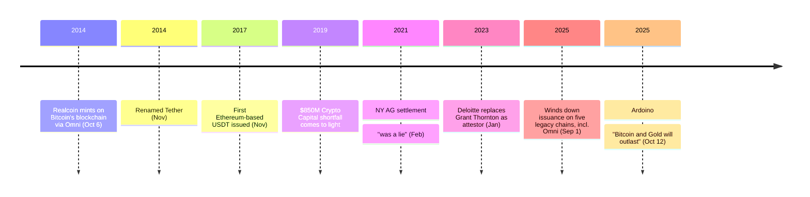

<!-- audit:quote-skip -->
> "This method uses the Bitcoin blockchain, Proof of Reserves, and other audit methods to prove that issued tokens are fully backed and reserved at all times."

Tether wrote that sentence in June 2016, in a whitepaper titled *Tether: Fiat currencies on the Bitcoin blockchain*. The company had already been running for two years by then. Its first tokens went out under the name Realcoin, minted as metadata written directly into Bitcoin's own blockchain on October 6, 2014; the rename to Tether followed that November. Eleven years after the whitepaper, on September 1, 2025, Tether stopped issuing and redeeming USDT on that same layer. It was born on Bitcoin's ledger, and it left Bitcoin's ledger, and almost nothing about the token's actual design changed in between.

## What the whitepaper claims for itself

The 2016 document splits its own architecture into three layers, in its own words:

<!-- audit:quote-skip -->
> "The first layer is the Bitcoin blockchain. The Tether transactional ledger is embedded in the Bitcoin blockchain as meta-data via the embedded consensus system, Omni."

The second layer was Omni, the protocol able to "grant (create) and revoke (destroy) digital tokens represented as meta-data embedded in the Bitcoin blockchain." The third layer was Tether Limited itself, holding the fiat reserves and deciding, on either side of the ledger, whether a dollar became a token or a token became a dollar again. The whitepaper states the point of the whole arrangement directly:

<!-- audit:quote-skip -->
> "Tether Limited is the only party who can issue tethers into circulation (create them) or take them out of circulation (destroy them). This is the main process by which the system solvency is maintained."

No cap sits anywhere in that description, and unlike [every issuance schedule Bitcoin's genealogy has argued over](/BitcoinArchive/entries/analysis/2008-10-31-fixed-supply-vs-adjustable-money/), none was ever proposed. Supply is not a formula; it is a mirror of whatever Tether Limited's reserves hold on a given day. The whitepaper does not dress this up as decentralization:

<!-- audit:quote-skip -->
> "We recognize that our implementation isn't perfectly decentralized since Tether Limited must act as a centralized custodian of reserve assets (albeit tethers in circulation exist as a decentralized digital currency)."

It goes further, listing its own points of failure before anyone else could:

<!-- audit:quote-skip -->
> "We could go bankrupt. Our bank could go insolvent. Our bank could freeze or confiscate the funds. We could abscond with the reserve funds."

The document named a fifth risk beside those four: concentrating all of it into a single point of failure. Five admitted weaknesses, published by the company admitting them, two years into its own operation. One would stop being hypothetical within three years.

## Minting, redemption, and the migration off Bitcoin's own ledger

Almost nobody holding USDT has ever minted or redeemed a token directly with Tether. The company's own fee schedule explains why: a direct request needs an approved account — approval sits at Tether's "sole discretion" — a non-refundable $150 verification deposit, and a $100,000 minimum on either side, plus a 0.1% fee to acquire and the greater of $1,000 or 0.1% to redeem. Everyone under that bar, which is nearly every USDT holder, buys and sells on an exchange instead, trading a supply that direct issuance and redemption have already set rather than touching the mechanism that sets it.

The ledger that mechanism runs on has also moved. USDT stayed exclusively on Bitcoin, via Omni, for barely three years: Tether issued its first Ethereum-based tokens in November 2017, and within about two years Ethereum's share of circulating supply had already overtaken Omni's, whose own supply fell by more than half in a single year while Ethereum's climbed toward $3.5 billion. Tether's live transparency reporting puts total circulating USDT today at roughly $184 billion, third by market capitalization among all cryptocurrencies, issued natively across ten blockchains with bridged versions on several more. Tron and Ethereum between them now carry about 97% of it, each holding close to $89 billion — Tron alone just under half. Omni Layer, the chain the whitepaper was written about, carries none of it: Tether wound down new issuance and redemption there, alongside four other blockchains, on September 1, 2025.

## The freeze function the whitepaper never mentioned

The 2016 whitepaper lists "our bank could freeze or confiscate the funds" as a risk Tether itself might suffer. It says nothing about Tether freezing anyone else's funds, because at the time it couldn't. Every USDT smart contract issued since carries three functions absent from the original design: `addBlackList`, which blocks an address from sending or receiving; `removeBlackList`, which reverses that; and `destroyBlackFunds`, which permanently burns whatever a blacklisted address was holding. A multisignature wallet inside Tether controls all three, and every call is a public, on-chain transaction — nothing about the freeze happens off the record.

The power gets used. In June 2025, Tether said the Department of Justice had acknowledged its help seizing $225 million in USDT tied to a pig-butchering romance-scam operation spanning several jurisdictions — one entry in what the company describes as more than $2.7 billion frozen or blocked in cooperation with over 255 law-enforcement agencies across 55-plus countries. In 2025 alone, one blockchain-security firm's analysis counted $1.26 billion in USDT frozen across Ethereum and Tron, spread over more than 4,100 addresses, the majority of them on Tron and the larger average balances on Ethereum; just over half of that frozen total was burned outright rather than merely locked. A bitcoin sent to any address stays spendable by whoever holds the key, however that address later behaves. USDT carries no equivalent guarantee, and the whitepaper's own silence on the point is the tell: the freeze switch was never part of the design it published.

## Reserves: attestations, not audits

The whitepaper's original promise was specific: "Professional auditors will regularly verify, sign, and publish our underlying bank balance and financial transfer statement." What exists today is not that. Tether publishes a quarterly attestation from BDO Italia — a report confirming reserves matched a claimed figure at one moment — rather than an audit examining the controls behind that figure across a period. No Big Four firm has ever audited Tether's books, and in April 2024 chief executive Paolo Ardoino gave the plainest explanation on record for why:

<!-- audit:quote-skip -->
> "So you are a Big Four auditing firm, and you have the entire banking industry that is your customer. Why would you risk 100,000 customers for a couple of stablecoins?"

The gap between attestation and audit stopped being theoretical once already. Between 2018 and 2019, Tether and Bitfinex — related companies under the same parent — lost access to $850 million held with a Panamanian payment processor, Crypto Capital. New York's attorney general found the two companies moved reserve funds between each other to cover the shortfall without disclosing it to investors. The February 2021 settlement — $18.5 million paid, no admission of wrongdoing, quarterly reserve-composition reporting required for two years — closed with a statement from Attorney General Letitia James naming exactly what the whitepaper had promised wouldn't happen:

<!-- audit:quote-skip -->
> "Tether's claims that its virtual currency was fully backed by U.S. dollars at all times was a lie."

## What Ardoino says about Bitcoin

Tether does not compete with Bitcoin; it holds it. In May 2023 the company announced it would direct up to 15% of its net realized operating profit into Bitcoin purchases, a position held separately from the reserves backing USDT itself. By October 2024, Ardoino put the resulting stash at more than 82,000 BTC, worth roughly $5.8 billion at the time. A year later, in October 2025, he posted eight words on X:

<!-- audit:quote-skip -->
> "Bitcoin and Gold will outlast any other currency."

The same year Tether left Bitcoin's own settlement layer as a place to mint tokens, it kept adding to a Bitcoin position it does not need to run USDT at all — and named Lightning Network, Bitcoin's own second layer, among the platforms it was shifting payment-focused development toward instead of the legacy chains it was sunsetting. One company, walking away from Bitcoin's base layer as an issuance venue while walking deeper into Bitcoin itself as a thing to own.

## Significance to Bitcoin

USDT tests what Bitcoin's design refuses to allow: a single company deciding who may transact at all. [The six structural features behind Bitcoin's claim to being digital gold](/BitcoinArchive/entries/analysis/2008-10-31-bitcoin-digital-gold-structural-features/) rest on there being no such company — no issuer whose reserves set the supply, no administrator able to add an address to a blacklist. USDT inverts nearly the whole list at once: a named issuer, a supply that moves at that issuer's discretion, and a freeze function exercised in full public view on the very ledger transparency is supposed to guarantee. [The twelve-chain design comparison](/BitcoinArchive/entries/analysis/2026-07-26-altcoin-count-and-design-comparison/) places USDT and USDC in the same row for exactly this reason — supply set by an issuer, nothing decentralized about either.

What separates the two stablecoins is not the structure; it is how much of it each issuer shows. [USDC's founder](/BitcoinArchive/participants/jeremy-allaire/) discloses reserve composition on a running basis and put his own company's 2023 de-peg on the public record himself. Tether has shown less, on a slower cadence, and its own chief executive has explained on the record why the firms best positioned to look more closely choose not to. Eleven years after a whitepaper promised regular audits by professionals, what exists in its place is a quarterly attestation — from a company that, having left the blockchain it was built on, now holds more of that blockchain's own asset than most of the chains in this archive's record.
