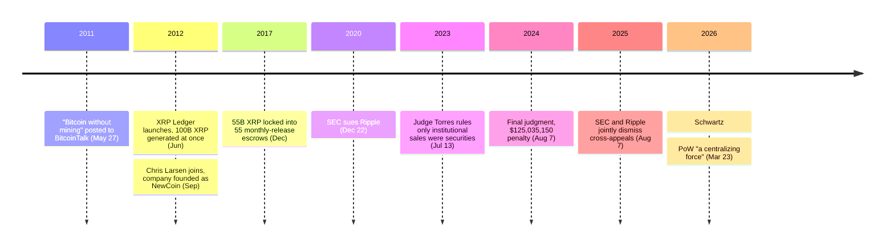

On May 27, 2011, under the heading "Bitcoin without mining," [Jed McCaleb](/BitcoinArchive/participants/jed-mccaleb/) opened a BitcoinTalk thread with a complaint about the system he was about to spend the next year replacing:

<!-- audit:quote-skip -->
> So I've been thinking... bitcoin mining seems like such an unfortunate side effect of the system since it is so wasteful.

By the end of that year he was working with David Schwartz and Arthur Britto on a ledger that removed mining from the design entirely. The code was finished in June 2012, and the genesis ledger it produced already held all 100 billion XRP that will ever exist. No block has minted a single unit since.

## What replacing "waste" actually meant choosing

In place of mining, the three settled on something structurally different: each server on the network keeps its own list of validators it has chosen to trust, and treats a ledger version as settled once enough of that list agrees on it. Chris Larsen joined that September as chief executive, and the company he joined — first called NewCoin, renamed OpenCoin within weeks, renamed again to Ripple Labs the following year — received 80 of the 100 billion units as a gift from its three founders. The remaining 20 billion stayed in the founders' own hands. Bitcoin's supply reaches its miners over sixteen years and counting; XRP's supply had its destination decided before the ledger had processed a second transaction.

McCaleb's own account of that trade is direct about what it cost, in the same breath as what it bought:

<!-- audit:quote-skip -->
> Bitcoin is obviously extremely decentralized, and there's no central company driving it forward, and that's a really awesome model, but it's very hard to replicate.

The 2014 paper that formalized the mechanism — written by Schwartz, Noah Youngs, and Arthur Britto, after McCaleb had already left to build what became Stellar — names the same trade in more technical language:

<!-- audit:quote-skip -->
> ...we present a novel consensus algorithm that circumvents this requirement by utilizing collectively-trusted subnetworks within the larger network. We show that the "trust" required of these subnetworks is in fact minimal and can be further reduced with principled choice of the member nodes.

"Collectively-trusted" is the phrase Bitcoin's own design has no equivalent for. A Bitcoin node verifies; it does not need to trust its peers to be anything other than self-interested. An XRP Ledger server needs a list of validators it has decided won't collude — and the paper's own claim is not that the trust requirement disappears, only that it shrinks.

## How eighty percent of a chosen list decides anything

A server on the XRP Ledger does not mine; it maintains a Unique Node List (UNL) — its own roster of validators it has chosen to trust — and roughly every three to five seconds it puts one question to that roster: what set of transactions happened since the last ledger closed? Validators propose candidate sets, compare notes, and revise their proposals across several rounds until one version clears a fixed bar: agreement from at least 80% of the validators on that server's own list. Below 20% disagreement, the ledger keeps advancing. Above it, the network stops rather than risk confirming something wrong — the protocol's own documentation states plainly that forcing an invalid transaction through would take "over 80% of trusted validators" colluding at once.

Nothing requires any operator to use a particular list. In practice, almost none build their own. The default configuration ships with a list jointly published by Ripple and the XRP Ledger Foundation, and any operator who never touches that setting is trusting whichever validators those two publishers recommended. What that concentrates matters more than how many validators exist in total: as of July 2023, per the Ledger's own FAQ, the network ran more than 150 validators, only 35 of them on the default list — and Ripple itself operated exactly one of those 35. The company that was gifted 80% of the supply does not need to run the list. It only needs to be trusted to have helped choose it.

## A hundred billion, and where each share of it went

The XRP Ledger's supply curve has no curve. Bitcoin's 21 million units are mined out gradually, over thirty-three halvings ending near the year 2140; XRP's 100 billion existed in full the moment the genesis ledger closed, three months before the company that would hold most of them even had a settled name.

| Event | XRP | Share of the genesis supply | Date |
|---|---|---|---|
| Entire supply generated at genesis | 100,000,000,000 | 100% | June 2012 |
| Gifted to the newly founded company | 80,000,000,000 | 80% | September 2012 |
| Retained personally by the three founders | 20,000,000,000 | 20% | September 2012 |
| Locked into 55 monthly-release escrows | 55,000,000,000 | 55% | December 2017 |
| Burned cumulatively via transaction fees | ~14,000,000 | ~0.014% | 2012–present |

By December 2017, five years of gradual sales had thinned what the company still held, and rather than keep selling entirely at its own discretion, Ripple bound most of the remainder to a schedule the ledger itself would enforce. Fifty-five billion XRP — 55% of the entire genesis supply — went into 55 separate escrow contracts, each releasing exactly 1 billion XRP a month for the next 55 months. Whatever Ripple doesn't use from a given month's release does not return to free circulation; it re-escrows into a new contract scheduled for whichever future month has no release queued yet, so the monthly ceiling holds even in months when Ripple spends less than the maximum.

The other supply-side mechanism runs in the opposite direction, at a scale small enough to be almost decorative. Every transaction on the ledger destroys a minimum of 10 drops — 0.00001 XRP — and that minimum rises automatically as network load rises, which is the entire anti-spam design: flooding the ledger gets expensive fast. The destroyed XRP goes to no one. Not a miner, not a validator, not Ripple — the documentation is explicit that "the transaction cost is not paid to any party." Since genesis, that mechanism has burned a little over 14 million XRP total, about 0.014% of the original 100 billion. Bitcoin's fee pays whoever assembles the winning block; XRP's fee pays for nothing. Neither figure moves the supply enough to register next to the 80 billion gifted that September.

## What the people who built it have said about Bitcoin

The people who built the XRP Ledger have never argued that Bitcoin's technology fails. What they argue is that one specific piece of it costs more than it should. Chris Larsen, Ripple's co-founder and executive chairman, made the case as friendly advice in April 2021, on Earth Day, urging Bitcoin to give up the one thing his own chain never adopted:

<!-- audit:quote-skip -->
> We should see PoW for what it is — a brilliantly designed technology that is becoming outdated in today's world.

Brad Garlinghouse, Ripple's chief executive, has made a sharper version of the same argument twice. In 2018, at a Stifel conference in Boston, he named a concentration he said the market wasn't pricing into Bitcoin's decentralization story:

<!-- audit:quote-skip -->
> Bitcoin is really controlled by China. There are four miners in China that control over 50 percent of Bitcoin.

Two years later, at a Wall Street Journal event in Davos, he drew the line the archive's [twelve-chain design comparison](/BitcoinArchive/entries/analysis/2026-07-26-altcoin-count-and-design-comparison/) finds among nearly every builder who has criticized Bitcoin's mining — technical admiration paired with ownership skepticism:

<!-- audit:quote-skip -->
> I'm bullish on BTC as a store of value, but not for payments.

The newest entry in the record belongs to David Schwartz, who stepped down as Ripple's Chief Technology Officer at the end of 2025 after fourteen years in the role. On March 23, 2026, after the mining pool Foundry USA had mined seven consecutive Bitcoin blocks, he wrote the sharpest reversal of the group's usual compliment:

<!-- audit:quote-skip -->
> It really demonstrates a point that I've made several times which is that bitcoin's decentralization doesn't come from its use of PoW, rather PoW is a centralizing force bitcoin has to keep fighting against.

Schwartz is naming the exact thing the XRP Ledger's own design removed. Mining opens participation to anyone who can pay for hardware and electricity, then concentrates power in whoever can pay for the most of both. The XRP Ledger never ran that experiment; it built its trust into a shorter, visible list instead. Neither side claims the concentration problem disappears. They disagree only about where it shows up.

## Five years in federal court

The gap the initial distribution created — a company holding most of a supply it did not have to earn — eventually became a legal question rather than just a design one.

| Date | What happened |
|---|---|
| December 22, 2020 | SEC sues Ripple Labs, Larsen, and Garlinghouse over $1.3 billion in XRP sales since 2013 |
| July 13, 2023 | Judge Torres rules XRP is not inherently a security; institutional sales were, exchange sales to anonymous buyers were not |
| August 7, 2024 | Final judgment: a $125,035,150 penalty, far below what the SEC had sought, plus an injunction against future unregistered institutional sales |
| August 7, 2025 | SEC and Ripple jointly dismiss their cross-appeals, closing the case |

Judge Analisa Torres's July 2023 ruling turned on a distinction the complaint hadn't offered: not what XRP is, but who bought it and how.

<!-- audit:quote-skip -->
> XRP, as a digital token, is not in and of itself, a "contract, transaction or scheme" that embodies the Howey requirements of an investment contract.

An institutional buyer negotiating directly with Ripple knew whose success their purchase depended on; a retail buyer on an exchange, matched anonymously against other sellers, had no way to know whether the XRP in their wallet had ever touched Ripple at all. The court's own summary of the undisputed record states the design intent behind the supply those buyers were trading, in the same order:

<!-- audit:quote-skip -->
> They aimed to create a faster, cheaper, and more energy-efficient alternative to the bitcoin blockchain, the first blockchain ledger which was introduced in 2009. ... When the XRP Ledger launched in 2012, its source code generated a fixed supply of 100 billion XRP.

Thirteen months after that ruling, Torres set the final penalty and enjoined Ripple from future unregistered sales to institutions, without a blanket ban on institutional sales themselves. Both sides appealed; both sides eventually withdrew. The case closed on August 7, 2025, four years and seven months after it was filed.

XRP's flat supply curve, plotted against Bitcoin's cap and ten other currencies on one normalized index:

<!-- chart: supply-curve-comparison -->

## Significance to Bitcoin

[Bitcoin's claim to being "digital gold"](/BitcoinArchive/entries/analysis/2008-10-31-bitcoin-digital-gold-structural-features/) rests on six features held at once, and the XRP Ledger is not a partial match on some of them — it is a clean inversion of nearly all of them, by the same original decision. Bitcoin's supply reaches whoever does the work, over thirty-three halvings and sixteen years; XRP's reached whoever the founders decided to gift it to, before the ledger had a second user. Bitcoin's rules change only through rough consensus among anonymous node operators; the XRP Ledger's default validator list is a recommendation from two named organizations that almost every server operator accepts without editing — which is why Ripple itself needs to run only one of the thirty-five validators on that list. The company already held the more valuable role: co-author of which thirty-five to trust in the first place.

None of that makes the engineering claim false. A ledger that closes in three to five seconds without competing for hash power is a real, working answer to a real cost, and Schwartz's own admiration for proof-of-work's simplicity is on the record even as he argues it does not explain Bitcoin's decentralization. What the design cannot do is what Bitcoin's own history did by deciding nothing in advance: the XRP Ledger's consensus mechanism and its ownership structure were chosen by the same three people in the same year, which means the technical answer to "who agrees on the ledger" and the financial answer to "who profits from it" both point back to the company that built the list. The SEC's five-year case was never really a dispute about a hundred billion units of code. It was a dispute about whether a decision that concentrated that thoroughly, in September 2012, could still be sold as if it hadn't.
