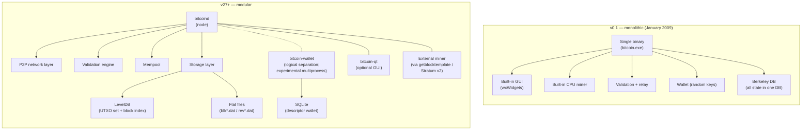
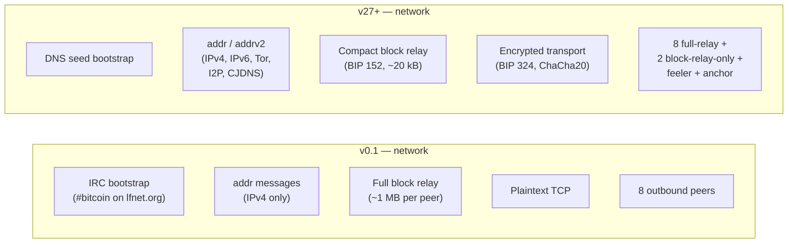
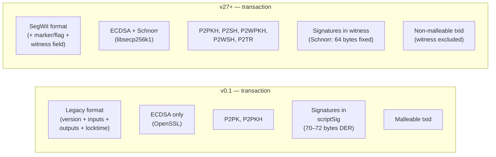
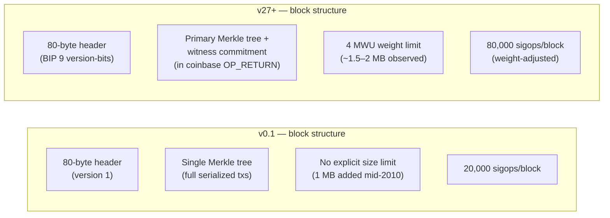
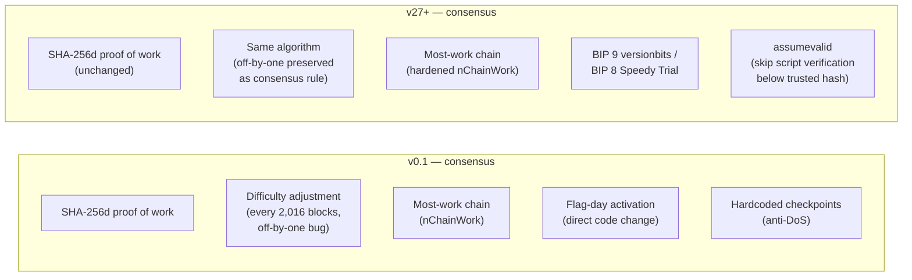
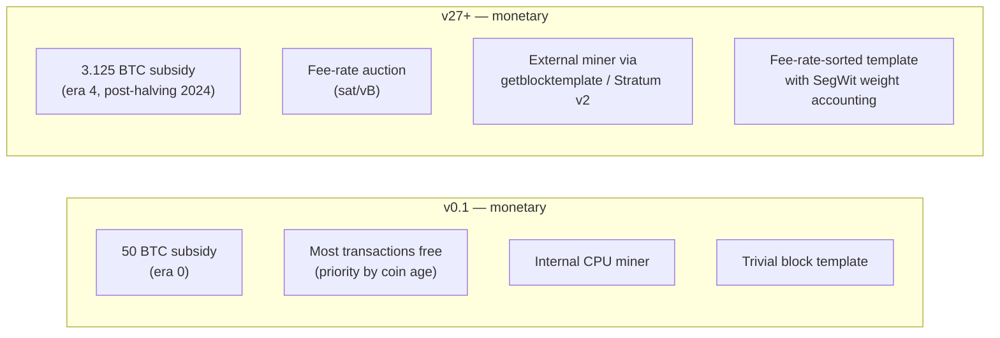
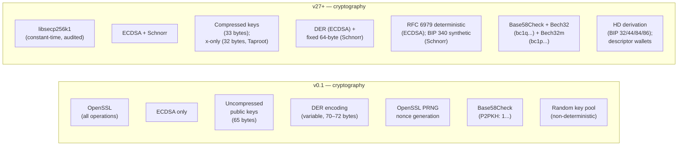
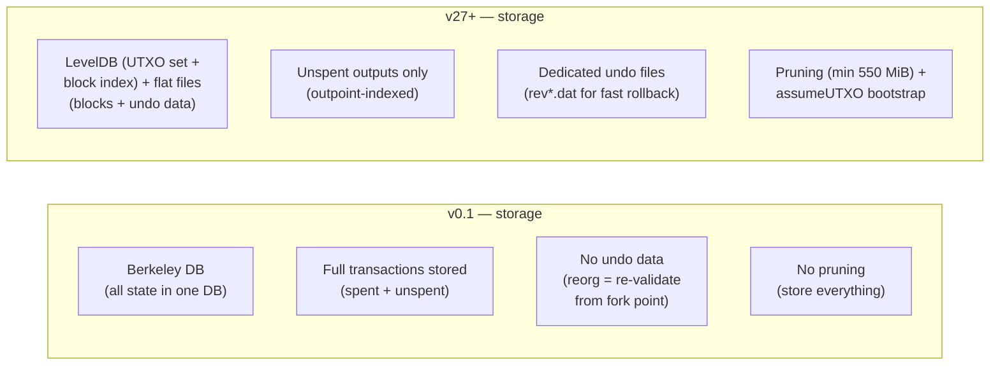
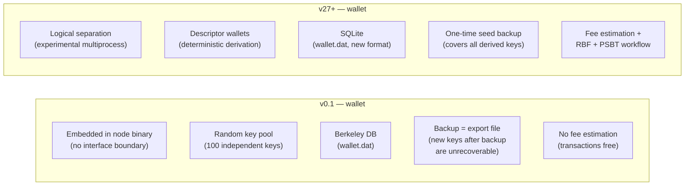
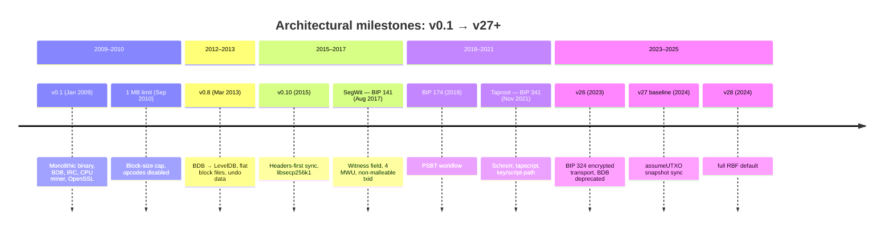

## What this page is

This page is **L2 #9 — Architecture evolution (Satoshi era vs v27+)** in the [design-document series](/BitcoinArchive/entries/design/2009-01-03-bitcoin-system-design-overview/) — the first of three cross-cutting deep dives. Where each L1 page examines one subsystem end-to-end with a brief "two-era comparison" section at the bottom, this page puts those comparisons side by side across all eight domains and adds the split-architecture diagrams that no single domain page can provide.

**Scope.** Every comparison uses two fixed reference points: Satoshi's v0.1 release (January 3, 2009) and modern Bitcoin Core v27+ baseline. Intermediate versions are mentioned only when they introduced a structural change. The page does not cover design drift at the social or economic layer — those are analyzed in the [design-intent vs current-reality entry](/BitcoinArchive/entries/analysis/2026-05-24-satoshi-design-vs-current-reality/). Each section below contains a split diagram (v0.1 left, v27+ right) and a comparison table, matching the L1 numbering.

## 1. System-wide architecture

The most visible change between v0.1 and v27+ is architectural decomposition. Satoshi shipped a single binary that fused the wallet, the miner, the GUI, the validation engine, and the network layer into one process backed by a single database. Modern Bitcoin Core separates these concerns into distinct modules, processes, and storage backends.

| Aspect | v0.1 (January 2009) | v27+ baseline |
|---|---|---|
| **Binary** | Single executable: wallet + miner + GUI + node | `bitcoind` (node), `bitcoin-wallet` (wallet), `bitcoin-qt` (GUI) — separate binaries |
| **Process model** | One process, one address space | Logically separated; experimental multiprocess work in progress (not yet default) |
| **Database** | Berkeley DB for all persistent state | LevelDB (UTXO set, block index) + flat files (blocks) + SQLite (wallet) |
| **Mining** | Internal CPU miner, same process | External via `getblocktemplate` (BIP 22/23); Stratum v2 in ecosystem |
| **Interfaces** | None at launch; basic JSON-RPC added shortly after | JSON-RPC (full read/write), REST (read-only), ZMQ (push notifications) |
| **Cryptography library** | OpenSSL (ECDSA/secp256k1); Crypto++ (SHA-256) | libsecp256k1 (ECDSA/Schnorr), internal SHA-256 with hardware acceleration |

## 2. Network layer

| Feature | v0.1 | v27+ baseline | Key BIP / version |
|---|---|---|---|
| **Peer discovery** | IRC channel + `addr` | DNS seeds + `addrv2` + `peers.dat` cache | BIP 155 (addrv2, v22) |
| **Address types** | IPv4 only | IPv4, IPv6, Tor v3, I2P, CJDNS | BIP 155 |
| **Outbound peers** | 8 full-relay | 8 full-relay + 2 block-relay-only + feeler + anchor | v19+ (block-relay-only) |
| **Block relay** | Full block to every peer (~1–2 MB) | Compact blocks: header + short IDs (~20 kB) | BIP 152 (v0.13) |
| **Transport** | Plaintext TCP | Opportunistic encrypted transport (ChaCha20-Poly1305) | BIP 324 (v26, default v27) |
| **Initial sync** | Sequential: one block at a time | Headers-first: parallel block download | v0.10 |
| **Eclipse resistance** | Minimal | Outbound rotation, diverse eviction, anchor peers, block-relay-only peers | v19+ |

*Detailed treatment: [L1 #1 — P2P network design](/BitcoinArchive/entries/design/2009-01-03-bitcoin-p2p-network-design/)*

## 3. Transaction layer

| Feature | v0.1 | v27+ baseline | Key BIP / version |
|---|---|---|---|
| **Format** | Legacy: version + inputs + outputs + locktime | SegWit: + marker/flag + witness | BIP 141 (2017) |
| **Transaction ID** | SHA-256d of full serialized transaction | `txid` excludes witness; `wtxid` includes it | BIP 141 |
| **Malleability** | Possible — third parties can alter scriptSig | Fixed — witness excluded from txid | BIP 141 |
| **Script types** | P2PK, P2PKH | P2PKH, P2SH, P2WPKH, P2WSH, P2TR | BIP 16, 141, 341 |
| **Signature scheme** | ECDSA via OpenSSL | ECDSA + Schnorr via libsecp256k1 | BIP 340 (2021) |
| **Opcodes** | Full set (including later-disabled) | Reduced set; tapscript re-enables selected opcodes | BIP 342 |
| **Timelocks** | Absolute locktime only | Absolute + relative (BIP 68) + script-level (`OP_CLTV`, `OP_CSV`) | BIP 65, 68, 112, 113 |
| **Replace-by-Fee** | Not implemented; first-seen | Full RBF default | BIP 125 (v0.12 opt-in; v24 option added; v28 default) |
| **Coin selection** | Simple largest-first | BnB + knapsack + single-random-draw; waste metric | v27+ |

*Detailed treatment: [L1 #2 — Transaction design](/BitcoinArchive/entries/design/2009-01-03-bitcoin-transaction-design/)*

## 4. Block and chain layer

| Feature | v0.1 | v27+ baseline | Key BIP / version |
|---|---|---|---|
| **Header format** | 80 bytes, version 1 | 80 bytes, same structure; BIP 9 signaling bits | BIP 9 |
| **Block version** | Always 1 | Version-bits (`0x20000000` base + signal bits) | BIP 9 (2016) |
| **Merkle tree** | Single tree over full serialized transactions | Primary tree (stripped txs) + witness commitment in coinbase | BIP 141 |
| **Size limit** | No limit in v0.1; 1 MB added 2010 | 4 MWU weight limit | BIP 141 (2017) |
| **Witness discount** | Does not exist | Witness bytes at 1/4 weight (1 WU vs 4 WU) | BIP 141 |
| **Coinbase data** | Arbitrary up to 100 bytes | BIP 34: block height prefix required | BIP 34 (2013) |
| **Sigop limit** | 20,000 per block | 80,000 per block (weight-adjusted); tapscript counts differently | BIP 141, 342 |

*Detailed treatment: [L1 #3 — Block and chain design](/BitcoinArchive/entries/design/2009-01-03-bitcoin-block-chain-design/)*

## 5. Consensus layer

| Feature | v0.1 | v27+ baseline | Key BIP / version |
|---|---|---|---|
| **Hash function** | SHA-256d (double SHA-256) | Same | — |
| **Chain selection** | Most-work chain (`nChainWork`) | Same rule; persistent tracking hardened | — |
| **Difficulty adjustment** | Every 2,016 blocks; off-by-one bug | Same algorithm; bug preserved (fixing = hard fork) | — |
| **Soft fork activation** | Direct code change (flag day) | BIP 9 versionbits / BIP 8 Speedy Trial | BIP 9, BIP 8 |
| **Script validation** | Combined scriptSig + scriptPubKey execution | Separated evaluation; SegWit witness programs; tapscript | BIP 141, 342 |
| **Timestamp rule** | Must be > previous block timestamp | Median-time-past (MTP): > median of previous 11 blocks | BIP 113 |
| **Checkpoints** | Hardcoded block hashes | `assumevalid` replaces most checkpoint functionality | v0.14+ |

*Detailed treatment: [L1 #4 — Consensus design](/BitcoinArchive/entries/design/2009-01-03-bitcoin-consensus-design/)*

## 6. Monetary and incentive layer

| Feature | v0.1 | v27+ baseline | Key BIP / version |
|---|---|---|---|
| **Total supply cap** | 20,999,999.9769 BTC | Same — consensus-frozen constant | — |
| **Subsidy calculation** | `nSubsidy >>= (nHeight / 210000)` | Same arithmetic; zero-guard for shift ≥ 64 | — |
| **Fee behavior** | Most transactions free; priority by coin age | Fee-rate auction (sat/vB); coin-age priority removed | — |
| **CPFP** | Not implemented | Ancestor-aware mempool; package evaluation | v0.13+ |
| **Block template** | Internal miner; trivial ordering | `getblocktemplate` (BIP 22/23); fee-rate sorted | BIP 22, 23 |
| **Witness discount** | Does not exist | Witness bytes at 1/4 weight | BIP 141 |

*Detailed treatment: [L1 #5 — Monetary design](/BitcoinArchive/entries/design/2009-01-03-bitcoin-monetary-design/)*

## 7. Cryptography layer

| Feature | v0.1 | v27+ baseline | Key BIP / version |
|---|---|---|---|
| **Cryptography library** | OpenSSL | libsecp256k1 (constant-time, formally reviewed) | v0.10 (2015) |
| **Signature schemes** | ECDSA only | ECDSA (legacy/SegWit v0) + Schnorr (Taproot) | BIP 340 (2021) |
| **Key format** | Uncompressed public keys (65 bytes) | Compressed (33 bytes); x-only (32 bytes, Taproot) | BIP 340 |
| **Signature malleability** | Possible — `s` value alterable | Low-S rule (BIP 146) for ECDSA; Schnorr non-malleable | BIP 146 |
| **Nonce generation** | OpenSSL PRNG | RFC 6979 deterministic (ECDSA); BIP 340 synthetic (Schnorr) | RFC 6979 |
| **Hash functions** | SHA-256, SHA-256d, RIPEMD-160 via OpenSSL | Same algorithms; internal with hardware acceleration (SHA-NI, ARMv8-A) | — |
| **Sighash algorithm** | Legacy sighash (quadratic in inputs) | BIP 143 (SegWit v0, linear) + BIP 341 (Taproot, epoch-tagged) | BIP 143, 341 |

*Detailed treatment: [L1 #6 — Cryptography design](/BitcoinArchive/entries/design/2009-01-03-bitcoin-cryptography-design/)*

## 8. Storage layer

| Feature | v0.1 | v27+ baseline | Key version |
|---|---|---|---|
| **Primary database** | Berkeley DB (all state) | LevelDB (UTXO set + block index); flat files (blocks) | v0.8 (2013) |
| **UTXO storage** | Full transactions with spent-flag vector | Only unspent outputs; outpoint-indexed, compact serialization | v0.8 |
| **Coins cache** | No separate cache; BDB handled reads/writes | Dedicated in-memory write-back cache (default 450 MiB) | v0.15+ |
| **Block storage** | Single BDB database | Sequential flat files (`blk*.dat`, ~128 MiB each) | v0.8 |
| **Undo data** | Not stored; reorg = re-validation from fork point | Dedicated `rev*.dat` files for fast rollback | v0.8 |
| **Pruning** | Not available | Available; minimum retention 550 MiB | v0.11 (2015) |
| **assumeUTXO** | Not available | Snapshot-based bootstrap with background verification | v27+ |
| **Disk size** | Negligible (chain was tiny) | ~650+ GB archival; ~10 GB pruned; ~7 GB coins DB | — |

*Detailed treatment: [L1 #7 — Storage design](/BitcoinArchive/entries/design/2009-01-03-bitcoin-storage-design/)*

## 9. Wallet and interface layer

| Feature | v0.1 | v27+ baseline | Key BIP / version |
|---|---|---|---|
| **Architecture** | Embedded in single binary | Logically separated; experimental multiprocess in progress (not yet default) | v27+ |
| **Key generation** | Random key pool (100 independent keys) | Descriptor wallets: deterministic from master seed | BIP 380+ (default v23) |
| **Key storage** | Berkeley DB (`wallet.dat`) | SQLite (`wallet.dat`, new format) | v26 (BDB deprecated for new wallets) |
| **Backup model** | Export file after every new key | Descriptor backup covers all derived keys (raw BIP 32 seed, not BIP 39) | BIP 32 + descriptors |
| **Signing** | Internal, same process | Internal, PSBT (BIP 174/370), or hardware wallet via HWI | BIP 174 (2018) |
| **Multi-device signing** | Not supported | PSBT workflow: create → update → sign → combine → finalize | BIP 174, 370 |
| **Fee bumping** | Not available | Replace-by-Fee (`bumpfee`), CPFP | BIP 125 |
| **Interfaces** | None at launch; basic JSON-RPC added shortly after | JSON-RPC (full), REST (read-only), ZMQ (push notifications) | — |
| **Process model** | Monolithic (wallet + node + miner + GUI) | Modular binaries: `bitcoind`, `bitcoin-wallet`, `bitcoin-qt`; runtime process separation experimental | v27+ |

*Detailed treatment: [L1 #8 — Wallet design](/BitcoinArchive/entries/design/2009-01-03-bitcoin-wallet-design/)*

## 10. Structural migration timeline

## 11. What changed vs what did not

Fifteen years of development transformed the implementation, but the consensus-critical core remains exactly as Satoshi shipped it.

**Unchanged since v0.1:**

- SHA-256d proof of work
- most-work chain selection
- 2,016-block difficulty adjustment (including the original off-by-one bug)
- UTXO model
- 21 million supply cap
- 210,000-block halving interval
- coinbase maturity (100 blocks)
- secp256k1 curve
- 10-minute target block interval
- permissionless participation

**Transformed since v0.1:**

- storage engine (BDB → LevelDB + flat files + SQLite)
- cryptography library (OpenSSL → libsecp256k1)
- signature schemes (ECDSA only → ECDSA + Schnorr)
- block capacity (no limit → 1 MB → 4 MWU)
- transaction format (legacy → SegWit)
- script system (full opcodes + concatenated execution → reduced set + separated evaluation + tapscript)
- key management (random pool → HD derivation + descriptors)
- peer transport (plaintext → encrypted)
- peer discovery (IRC → DNS seeds + addrv2)
- mining interface (internal CPU → external via getblocktemplate)
- initial sync (sequential → headers-first + assumeUTXO)
- fee market (free → fee-rate auction with RBF/CPFP)
- process architecture (monolithic → modular)
- soft fork activation (flag day → BIP 9/8)

## 12. Limits of this page

This page compares two reference points across all domains but does not replace the domain pages. For full treatment of any subsystem, see the L1 page linked at the bottom of each section above.

Out of scope:

- **Social and economic drift** (mining centralization, custody, governance, scaling — see the [design-intent vs current-reality analysis](/BitcoinArchive/entries/analysis/2026-05-24-satoshi-design-vs-current-reality/))
- **Security model** (threat analysis, 51% attack economics — see [L2 #11 Security model](/BitcoinArchive/entries/design/2009-01-03-bitcoin-security-model/))
- **Ecosystem** (Lightning, sidechains, Ordinals — see [L2 #10 Ecosystem](/BitcoinArchive/entries/design/2009-01-03-bitcoin-ecosystem-design/))
- **Satoshi's coding style** (see the [Satoshi code analysis](/BitcoinArchive/entries/analysis/2009-01-09-satoshi-code-analysis/) and [Windows development environment](/BitcoinArchive/entries/analysis/2009-01-09-satoshi-windows-development-environment/) entries)
