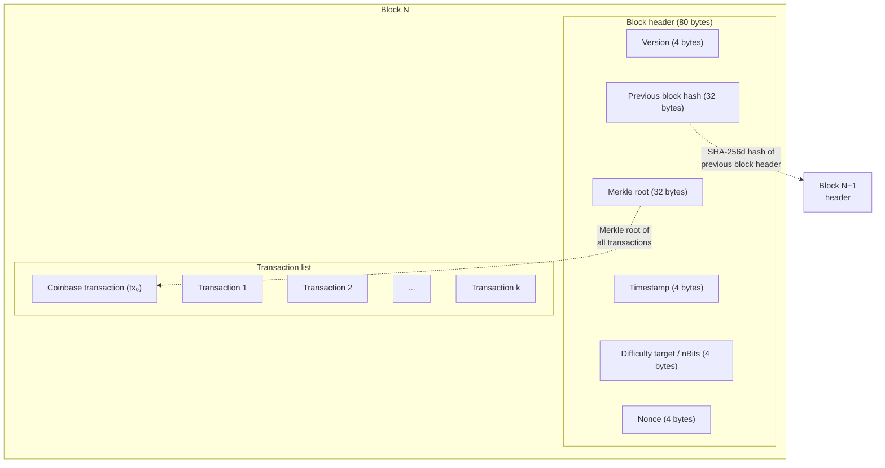
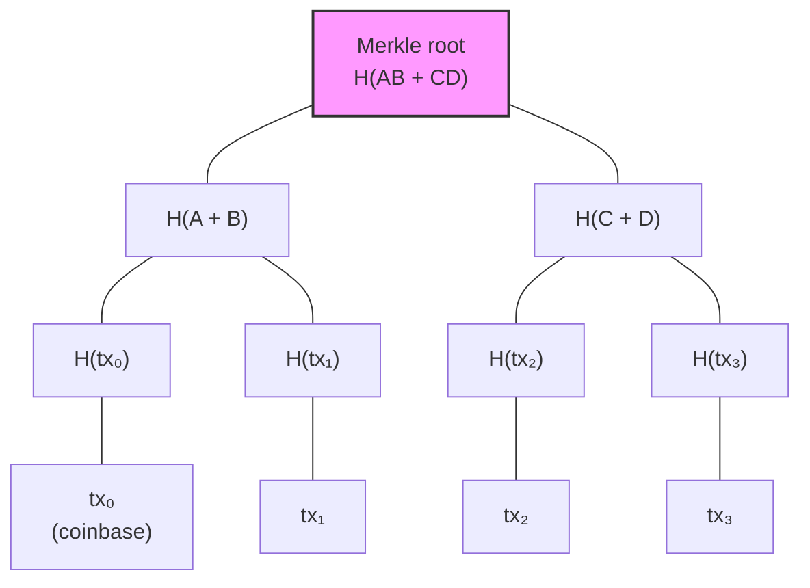
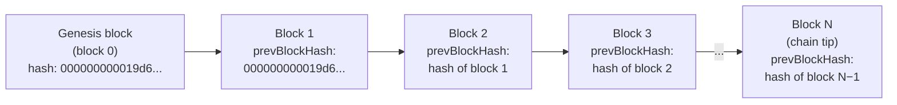
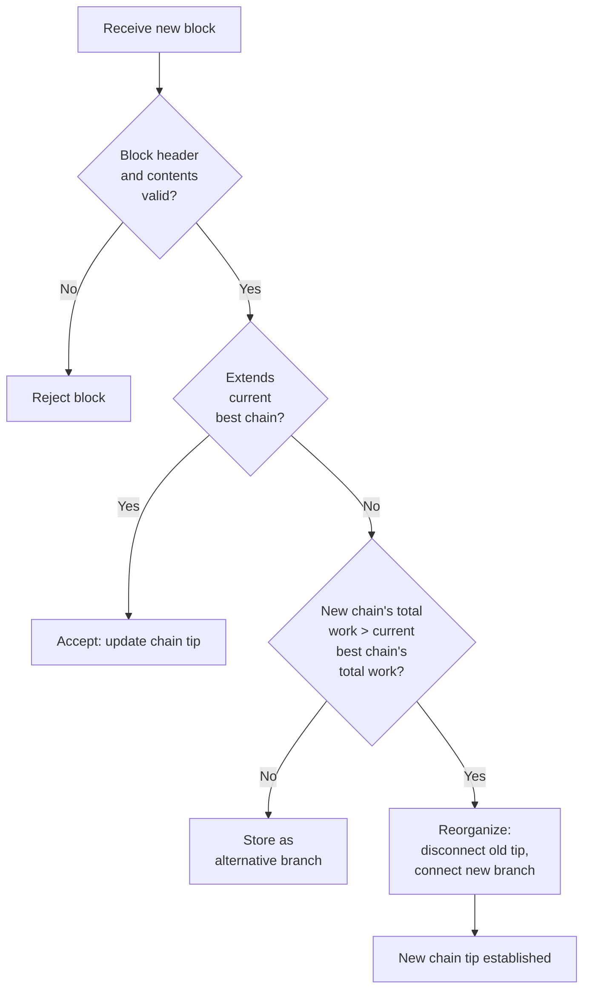

## Introduction

This page is **L1 #3 — Block & chain design** in the [design-document series](/BitcoinArchive/entries/design/2009-01-03-bitcoin-system-design-overview/). It covers the block and chain layer: how transactions are batched into blocks, how blocks are linked into a chain, and how nodes select the authoritative chain tip.

The [transaction design page](/BitcoinArchive/entries/design/2009-01-03-bitcoin-transaction-design/) described individual transactions — inputs, outputs, scripts, and signatures. This page moves one level up: the structures that make those transactions permanent and globally ordered.

Three questions organize the material:

1. **What is a block?** A timestamped container that commits a set of transactions under a single proof-of-work seal.
2. **What is a chain?** A sequence of blocks, each referencing its predecessor's hash, forming an append-only ledger.
3. **Which chain wins?** The chain with the most accumulated proof-of-work — not the chain with the most blocks.

Where behavior differs between the Satoshi-era implementation (v0.1, January 2009) and modern Bitcoin Core (v27+ baseline), both are noted.

For the exact v0.1 boundary between the block header hash, the Merkle root, and full block serialization, see the [source-level serialization analysis](/BitcoinArchive/entries/analysis/2009-01-09-bitcoin-v01-serialization-boundaries/).

## 1. Block structure

A block consists of two parts: a compact 80-byte **header** that summarizes the block, and a **transaction list** that contains every transaction included in the block. Only the header is needed for chain-level validation; the full transaction list is needed for content-level validation.

### Block anatomy

### Header field breakdown

| Field | Size | Description |
|---|---|---|
| **Version** | 4 bytes | Block format version. Encodes soft-fork signaling bits (BIP 9) in v27+ baseline. |
| **Previous block hash** | 32 bytes | SHA-256d hash of the preceding block's header. Links this block to the chain. The genesis block uses a zero hash. |
| **Merkle root** | 32 bytes | Root hash of the Merkle tree built from all transactions in the block. Commits the transaction set to the header. |
| **Timestamp** | 4 bytes | Unix epoch time set by the miner. Must be greater than the median of the previous 11 blocks and no more than 2 hours ahead of network-adjusted time. |
| **nBits** | 4 bytes | Compact encoding of the target threshold. The block's header hash must be less than or equal to this target. Recalculated every 2,016 blocks. |
| **Nonce** | 4 bytes | Arbitrary value the miner iterates to search for a valid proof-of-work. The 4-byte space (2³² values) is often exhausted, requiring changes to the coinbase or timestamp to continue searching. |

### Block version evolution

| Era | Version(s) | Significance |
|---|---|---|
| **Satoshi v0.1** | 1 | Only version. No signaling mechanism. |
| **BIP 34 (2013)** | 2 | Block height required in the coinbase; first use of version to enforce consensus rules. |
| **BIP 66 (2015)** | 3 | Strict DER signature encoding. |
| **BIP 65 (2015)** | 4 | `OP_CHECKLOCKTIMEVERIFY` enabled. |
| **BIP 9 (2016–)** | Bit-field in top 3 bits = `001`, remaining 29 bits signal individual proposals | Version-bits mechanism: multiple soft forks can be signaled simultaneously. Used for SegWit (bit 1), Taproot (bit 2), and others. |
| **v27+ baseline** | Version-bits standard | All modern blocks use BIP 9 version-bits signaling. The base value is `0x20000000` with proposal-specific bits set. |

## 2. Merkle tree

The Merkle root in the block header is a cryptographic commitment to every transaction in the block. It is constructed as a binary hash tree: leaf nodes are transaction hashes, and each internal node is the SHA-256d hash of its two children concatenated together.

### Merkle tree construction

**Odd-count rule.** If a tree level has an odd number of nodes, the last node is duplicated to form a pair. This ensures the tree is always a complete binary tree.

### Why Merkle trees

| Benefit | Mechanism |
|---|---|
| **SPV proofs** | A lightweight client can verify that a transaction is included in a block by checking only log₂(n) hashes (the Merkle path) instead of downloading all n transactions. |
| **Efficient verification** | Changing any single transaction invalidates the Merkle root. A node can detect a corrupted or tampered block without re-validating every transaction from scratch — the path from the altered leaf to the root will not match. |
| **Compact commitment** | The entire transaction set is committed to the header as a single 32-byte hash. The header remains 80 bytes regardless of whether the block contains 1 transaction or 10,000. |

### SegWit witness commitment

Modern Bitcoin Core (v27+ baseline) adds a second Merkle tree: the **witness Merkle tree**, whose root is committed inside the coinbase transaction's `OP_RETURN` output (BIP 141). This commits the witness data (signatures, scripts) that the primary Merkle root excludes. Satoshi's v0.1 had no witness concept; the single Merkle tree committed the complete serialized transactions including signatures.

## 3. Chain structure

A blockchain is a singly linked list of blocks, where each block's header contains the SHA-256d hash of the previous block's header. This chain of hashes makes the ledger append-only: altering any historical block would change its hash, breaking the link from the next block, and cascading through every subsequent block to the chain tip.

### Chain of blocks

**Immutability through cascading hashes.** Each header hash is computed over all 80 bytes of the header, which includes `prevBlockHash`. Changing a single byte in block 2's transaction list changes block 2's Merkle root, which changes block 2's header hash, which invalidates block 3's `prevBlockHash`, and so on. An attacker who modifies a historical block must redo the proof-of-work for that block and every subsequent block — an exponentially increasing cost.

### Fork scenarios

| Scenario | Cause | Resolution |
|---|---|---|
| **Natural fork (stale block)** | Two miners find valid blocks at approximately the same height and broadcast them to different parts of the network. | The network temporarily splits. Nodes follow whichever chain accumulates the most total proof-of-work. The losing block becomes stale; its transactions return to the mempool. |
| **Orphan block** | A block arrives before its parent. The node cannot validate it because the chain of hashes is incomplete. | The node stores it temporarily. When the parent arrives and validates, the orphan is reconnected. In v27+ baseline, the term "orphan" refers specifically to blocks whose parent is unknown, distinct from stale blocks. |
| **Deliberate fork (soft/hard fork)** | A protocol upgrade changes consensus rules, causing nodes running different software to disagree on block validity. | Soft fork: old nodes still accept new-rule blocks. Hard fork: the chain splits permanently unless one side abandons its fork. |

A documented real-world instance of blocks losing the race for the chain tip: in January 2009, [Dustin Trammell reported four mined blocks marked "Generated (not accepted)"](/BitcoinArchive/entries/aftermath/2009-01-12-trammell-to-satoshi-upgrade-issues/) after a v0.1.0 communications bug prevented his node from broadcasting them in time to compete for the winning chain.

## 4. Chain selection rule

Bitcoin's chain selection rule is the **most-work chain rule**: among all valid chains a node is aware of, the node follows the chain with the greatest total accumulated proof-of-work. This is commonly — and inaccurately — called the "longest chain rule." Chain length (block count) and chain work are not the same: if the difficulty adjusts between blocks, two chains of the same height can have different total work. The protocol selects on work, not height.

### Chain selection decision process

### Chain selection vs fork resolution

| Aspect | Chain selection | Fork resolution |
|---|---|---|
| **Trigger** | Every new block received | Two or more competing chain tips exist simultaneously |
| **Metric** | Total accumulated proof-of-work (`nChainWork`) | Same metric — the fork is resolved by chain selection |
| **Scope** | Global: always comparing all known valid chains | Local to the fork point: which branch from the fork has more work |
| **Outcome** | The node's best chain tip is updated (or not) | One branch wins; the other becomes stale. Transactions from the stale branch return to the mempool if still valid. |
| **Speed** | Typically resolved within 1–2 blocks | Same — most natural forks resolve when the next block extends one branch |

**Why "most work" and not "most blocks."** The difficulty target adjusts every 2,016 blocks. If an attacker produced blocks at a lower difficulty (e.g., on a minority fork before a difficulty adjustment takes effect), those blocks contribute less proof-of-work per block. A chain with fewer blocks but higher per-block difficulty can have more total work — and the protocol would correctly select it. Bitcoin Core tracks this as `nChainWork`, a 256-bit integer that accumulates the work contribution of each block.

## 5. Block size and weight

Satoshi's v0.1 had no explicit block-size limit. A 1 MB maximum block size was added in 2010 (initially as an anti-spam measure). SegWit (BIP 141, activated August 2017) replaced the byte-size cap with a **weight** system that discounts witness data, effectively raising the maximum block capacity while maintaining backward compatibility. The multi-year dispute that preceded this change is documented in [the block-size war overview](/BitcoinArchive/entries/analysis/2015-08-15-block-size-war-2015-2017-overview/).

### Legacy size vs SegWit weight

| Metric | Legacy (pre-SegWit) | SegWit (v27+ baseline) |
|---|---|---|
| **Limit** | 1,000,000 bytes (1 MB) hard cap | 4,000,000 weight units (4 MWU) |
| **Calculation** | `size = total serialized bytes` | `weight = (non-witness bytes × 4) + (witness bytes × 1)` |
| **Effective maximum** | 1 MB per block | ~1.5–2.0 MB observed (varies with witness-to-non-witness ratio) |
| **Theoretical maximum** | 1 MB | ~4 MB (a block consisting almost entirely of witness data) |
| **Coinbase-only block** | ~250 bytes | ~1,000 weight units |
| **Fee-market effect** | All bytes cost the same in block space | Witness bytes are 75% cheaper, incentivizing SegWit adoption |

**Satoshi era vs v27+ baseline.**

| Aspect | Satoshi era | v27+ baseline |
|---|---|---|
| **Block-size limit** | No explicit limit in v0.1; 1 MB cap added September 2010 | Replaced by 4 MWU weight limit (BIP 141) |
| **Size enforcement** | `MAX_BLOCK_SIZE` constant checked against raw byte count | `MAX_BLOCK_WEIGHT` checked against calculated weight |
| **Witness data** | Does not exist | Discounted at 1 WU per byte (vs 4 WU for non-witness) |
| **Sigop limit** | No limit in v0.1; 20,000 added September 2010 | 80,000 sigops per block (weight-scaled); tapscript counts differently |

## 6. Coinbase transaction

Every block's first transaction is the **coinbase transaction** — the only transaction type that creates new bitcoin. It has no inputs referencing previous UTXOs; instead, it has a single input with a null previous-transaction hash and an arbitrary data field.

**Structure:**

- **Input:** Null prevout (32 zero bytes + index `0xFFFFFFFF`), plus a `coinbase` data field (2–100 bytes). The miner may write arbitrary data here. Since BIP 34, the first bytes must encode the block height.
- **Outputs:** One or more outputs distributing the block reward (subsidy + fees) to the miner's chosen addresses.

**Block reward schedule:**

| Halving | Blocks | Subsidy | Period |
|---|---|---|---|
| 0 | 0 – 209,999 | 50 BTC | 2009–2012 |
| 1 | 210,000 – 419,999 | 25 BTC | 2012–2016 |
| 2 | 420,000 – 629,999 | 12.5 BTC | 2016–2020 |
| 3 | 630,000 – 839,999 | 6.25 BTC | 2020–2024 |
| 4 | 840,000 – 1,049,999 | 3.125 BTC | 2024–2028 |

The subsidy halves every 210,000 blocks (approximately every 4 years) and asymptotically approaches zero. The total supply is capped at 20,999,999.9769 BTC (commonly rounded to 21 million).

**Coinbase maturity.** Coinbase outputs cannot be spent until 100 blocks have been mined on top of them. This rule protects against chain reorganizations that would invalidate the coinbase and leave downstream transactions without a valid input.

**Notable coinbase data.** Satoshi embedded the text `The Times 03/Jan/2009 Chancellor on brink of second bailout for banks` in the genesis block's coinbase — a reference to a *Times* headline that serves as both a timestamp proof and a statement about the financial system Bitcoin was designed to circumvent.

## 7. Two-era comparison

| Feature | Satoshi era (v0.1, Jan 2009) | Modern Bitcoin Core, v27+ baseline |
|---|---|---|
| **Header format** | 80 bytes, version 1 | 80 bytes, same structure; version field carries BIP 9 signaling bits |
| **Block version** | Always 1 | BIP 9 version-bits (`0x20000000` base + signal bits) |
| **Merkle tree** | Single tree over full serialized transactions | Primary tree (over stripped transactions) + witness commitment in coinbase |
| **Chain selection** | Block-height comparison (`nBestHeight`) | Most-work chain, tracked via `nChainWork` (256-bit integer, since v0.3.3) |
| **Block-size limit** | No limit in v0.1; 1 MB added in 2010 | 4 MWU weight limit (BIP 141) |
| **Coinbase data** | Arbitrary up to 100 bytes | BIP 34: block height prefix required; remaining bytes arbitrary |
| **Coinbase maturity** | 100 blocks | Same |
| **Witness commitment** | Not applicable | Coinbase `OP_RETURN` output commits witness Merkle root (BIP 141) |
| **Sigop limit** | No limit in v0.1; 20,000 added 2010 | 80,000 per block (weight-adjusted); tapscript uses different counting |
| **Block relay** | Full block broadcast to all peers | Compact blocks (BIP 152): header + short transaction IDs; receiving node reconstructs from mempool |

## 8. Limits of this page

This page covers the block and chain layer in isolation. The following topics are out of scope and addressed in their respective domain pages within the [design-document series](/BitcoinArchive/entries/design/2009-01-03-bitcoin-system-design-overview/):

- **Transaction structure and UTXO model** — how the transactions inside each block are constructed, validated, and chained. Covered in the [transaction design page](/BitcoinArchive/entries/design/2009-01-03-bitcoin-transaction-design/).
- **Mining and proof-of-work** — the hash puzzle that produces valid blocks, the difficulty adjustment algorithm, and block template construction.
- **Consensus rules beyond chain selection** — soft fork activation mechanisms (BIP 9, BIP 8), the consensus–policy boundary, and the full set of block validity rules.
- **Network-layer block relay** — how `inv`, `getdata`, `headers`, `block`, and `cmpctblock` messages propagate blocks across the P2P network.
- **Storage and chain state** — how validated blocks are persisted to disk (block files, undo data) and how the UTXO set is maintained in LevelDB.
- **SPV client implementation** — the practical use of Merkle proofs by lightweight wallets (this page describes the Merkle tree structure; the SPV protocol itself is a network-layer topic).

[The storage design](/BitcoinArchive/entries/design/2009-01-03-bitcoin-storage-design/) covers how the chain is written to disk. [The consensus design](/BitcoinArchive/entries/design/2009-01-03-bitcoin-consensus-design/) covers the longest-chain rule that runs on top of the structure documented here.
