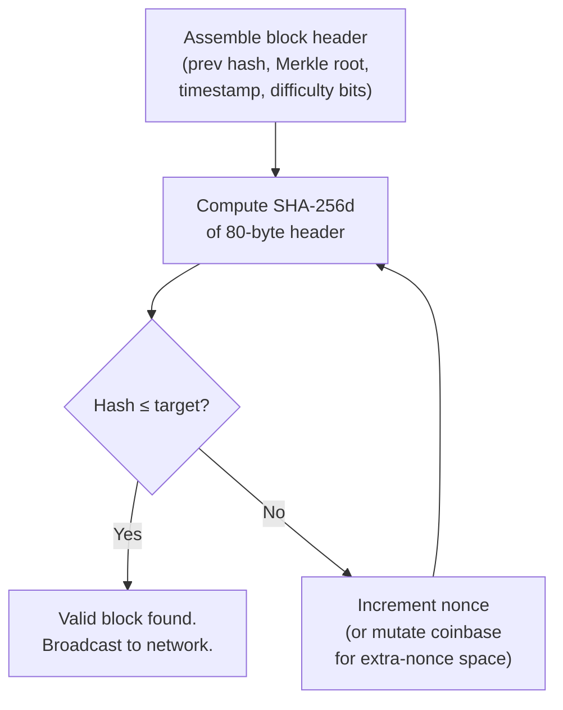
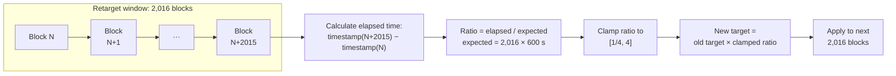
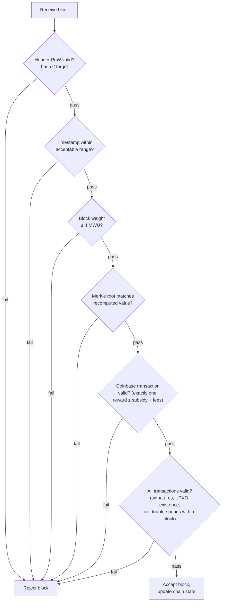
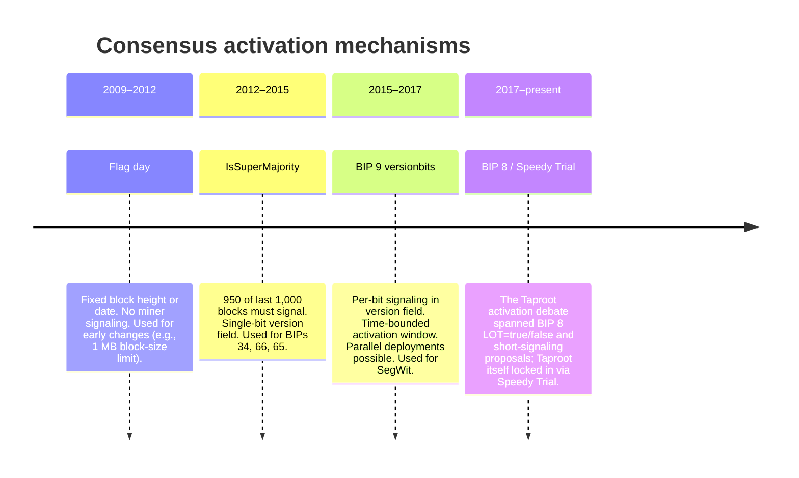

## Introduction

This page is **L1 #4 — Consensus design** in the [design-document series](/BitcoinArchive/entries/design/2009-01-03-bitcoin-system-design-overview/). It is the direct successor to the [block and chain design](/BitcoinArchive/entries/design/2009-01-03-bitcoin-block-chain-design/) page. Where that page describes the data structures — headers, Merkle trees, the chain of hashes — this page describes the rules that determine which chains are valid and which chain tip wins.

Consensus is Bitcoin's substitute for a central authority. Every full node independently evaluates every block against the same set of deterministic rules. No block is accepted on trust; no node defers to another node's judgment. The result is a system in which thousands of machines converge on a single transaction history without coordination, voting, or leadership election.

The page covers five areas: the proof-of-work puzzle that makes block production costly, the difficulty adjustment that regulates block frequency, the validation rules that define a legal block, the fork-handling logic that resolves competing chains, and the finality model that quantifies confirmation security.

Where behavior differs between the Satoshi-era implementation (v0.1, January 2009) and modern Bitcoin Core (v27+ baseline), both are noted.

## 1. Proof of work

Proof of work is the mechanism that makes block production computationally expensive. A miner must find a nonce (and other mutable header fields) such that the SHA-256d hash of the 80-byte block header falls below a network-wide target value. Because SHA-256 is a one-way function, the only known strategy is brute-force iteration.

### Mining loop

The double-SHA-256 (SHA-256d) operation applies SHA-256 twice in sequence: `SHA-256(SHA-256(header))`. Satoshi chose this construction to mitigate length-extension attacks inherent to single-pass SHA-256.

### Proof-of-work parameters

| Parameter | Value | Notes |
|---|---|---|
| **Hash function** | SHA-256d (double SHA-256) | Unchanged since v0.1 |
| **Input** | 80-byte block header | Version, prev hash, Merkle root, timestamp, bits, nonce |
| **Nonce field** | 32 bits (4 bytes) | Provides ~4.3 billion candidates per header configuration |
| **Extra nonce** | Coinbase transaction data | Mutating the coinbase changes the Merkle root, refreshing the nonce search space |
| **Target representation** | `nBits` compact format (4 bytes) | Encodes the 256-bit target as a 3-byte mantissa with a 1-byte exponent |
| **Difficulty 1 target** | `0x00000000FFFF...` (truncated) | The baseline target against which all difficulty values are expressed as ratios |
| **Valid hash criterion** | `hash ≤ target` | Lower target = higher difficulty = harder to find a valid hash |

## 2. Difficulty adjustment

Bitcoin targets a 10-minute average interval between blocks. Because total network hash rate fluctuates — new miners join, old hardware retires, energy costs shift — the protocol adjusts the target value every 2,016 blocks (approximately every two weeks).

### Retarget cycle

### Adjustment parameters

| Parameter | Value | Notes |
|---|---|---|
| **Target block time** | 600 seconds (10 minutes) | Chosen by Satoshi as a trade-off between confirmation speed and orphan rate |
| **Retarget period** | 2,016 blocks | At the target rate, this spans exactly 14 days |
| **Expected window time** | 1,209,600 seconds (14 days) | 2,016 × 600 |
| **Maximum upward adjustment** | 4× (target becomes 4× easier) | Prevents a sudden hash-rate drop from stalling the chain indefinitely |
| **Maximum downward adjustment** | 1/4× (target becomes 4× harder) | Prevents a hash-rate surge from making blocks dangerously fast |
| **Adjustment granularity** | Integer arithmetic on 256-bit target | No floating-point; deterministic across all implementations |

*[Context: A historical difficulty chart is available as a separate interactive component. The chart shows the progression from difficulty 1 at the genesis block to values exceeding 10¹³ by 2024, illustrating the exponential growth of network hash rate over fifteen years.]*

### Satoshi-era bugs

Two known issues in the original difficulty adjustment code have persisted as consensus rules for the network's entire history:

- **Off-by-one error.** The retarget calculation uses the timestamp of block N (the first block of the window) and block N+2,015 (the last), measuring across 2,015 intervals rather than 2,016. The actual retarget window is therefore one block shorter than intended. At a 10-minute target, this produces a systematic bias of roughly 0.05%.

- **Timewarp vulnerability.** Because the adjustment algorithm only examines the timestamps of two blocks (first and last in the window), a majority-hash-rate miner can manipulate the timestamp of the last block in each window to make the chain appear slower than it actually is, gradually reducing difficulty while producing blocks faster than the target rate. This attack is theoretical against an honest majority but becomes feasible for a sustained >50% attacker. A soft-fork fix (the "timewarp attack mitigation") has been proposed as part of the [Great Consensus Cleanup](https://github.com/bitcoin/bips/blob/master/bip-0054.md) — see [the time-warp attack analysis](/BitcoinArchive/entries/analysis/2009-01-09-bitcoin-time-warp-attack/) for the full mechanics — but the proposal has not yet gained the operator consensus needed to activate.

## 3. Block validation rules

When a node receives a new block, it applies a deterministic sequence of checks before accepting the block into its local chain state. Every check must pass; a single failure causes the entire block to be rejected.

### Validation decision tree

### Validation checks

| Check | Rule | Introduced |
|---|---|---|
| **Header proof of work** | SHA-256d hash of header ≤ target encoded in `nBits` | v0.1 |
| **Timestamp range** | Must be > median of previous 11 blocks (MTP) and < node's local time + 2 hours | v0.1 (MTP rule formalized later) |
| **Block weight** | ≤ 4,000,000 weight units (4 MWU) | BIP 141 (2017); replaces the v0.1-era 1 MB byte-size limit |
| **Merkle root** | Header's Merkle root must match the root recomputed from the block's transaction list | v0.1 |
| **Coinbase validity** | Exactly one coinbase; output value ≤ block subsidy + sum of transaction fees; must include block height in scriptSig (BIP 34) | v0.1; BIP 34 added 2013 |
| **Transaction validity** | Every input references an existing, unspent output; all scripts evaluate to true; no input is spent twice within the block | v0.1 |
| **Signature operations** | Total sigops across all transactions ≤ limit (legacy: 20,000; SegWit: weighted) | v0.1; SegWit revised counting |
| **Transaction finality** | All transactions satisfy locktime and sequence constraints | v0.1; BIP 68/113 added relative timelocks |

## 4. Fork types and handling

A fork occurs whenever two or more blocks share the same parent — the chain splits into competing branches. Forks arise from three distinct causes, each with different characteristics and resolution mechanisms.

### Fork comparison

```mermaid
flowchart TD
    subgraph Natural["Natural fork\n(propagation delay)"]
        NA["Two miners find blocks\nat nearly the same time"]
        NA --> NB["Both blocks are valid\nand reference the same parent"]
        NB --> NC["Resolved automatically:\nnext block extends one branch,\nmaking it the most-work chain"]
    end

    subgraph Soft["Soft fork\n(rule tightening)"]
        SA["New rule makes some\npreviously valid blocks invalid"]
        SA --> SB["Upgraded nodes enforce\nstricter rules"]
        SB --> SC["Non-upgraded nodes still accept\nall new blocks (backward compatible)"]
        SC --> SD["No permanent split if\nmajority of hash rate upgrades"]
    end

    subgraph Hard["Hard fork\n(rule relaxation or change)"]
        HA["New rule makes some\npreviously invalid blocks valid"]
        HA --> HB["Upgraded nodes accept\nblocks that old nodes reject"]
        HB --> HC["Permanent chain split\nunless all nodes upgrade"]
    end
```

### Notable forks

| Event | Year | Type | Mechanism | Outcome |
|---|---|---|---|---|
| **Value overflow incident** | 2010 | Emergency soft fork | Patched `CheckTransaction` to reject outputs > 21 M BTC | Chain reorganized; invalid block orphaned within hours |
| **BIP 66 (strict DER)** | 2015 | Soft fork | `IsSuperMajority` (950/1000 blocks) | Enforced canonical signature encoding |
| **SegWit (BIP 141)** | 2017 | Soft fork | BIP 9 versionbits | Introduced witness discount, fixed malleability, enabled script versioning |
| **Block size → BCH** | 2017 | Hard fork | Disagreement on scaling path | Bitcoin Cash split; incompatible 8 MB block-size rule created a permanent chain divergence |
| **Taproot (BIP 341)** | 2021 | Soft fork | Speedy Trial (modified BIP 9) | Added Schnorr signatures, Tapscript, and MAST |

The value overflow incident above is the clearest real-world instance of this emergency-soft-fork mechanism in action — see [the incident write-up](/BitcoinArchive/entries/aftermath/2010-08-15-value-overflow-incident/) for how the patch was deployed and the invalid block orphaned within hours.

The August 2017 Bitcoin Cash split listed above is the fully-documented instance of the hard-fork pattern described in this section — see [the Bitcoin Cash fork entry](/BitcoinArchive/entries/aftermath/2017-08-01-bitcoin-cash-fork/) for the block height, launch parameters, and aftermath of that specific divergence.

### Chain selection rule

When a node encounters competing chain tips, it selects the **most-work chain** — the chain with the greatest cumulative proof of work (tracked internally as `nChainWork`). This is commonly but incorrectly described as the "longest chain"; in practice, a shorter chain with higher-difficulty blocks can have more total work than a longer chain with lower-difficulty blocks. The most-work rule ensures that the chain backed by the greatest expenditure of computational energy wins.

## 5. Consensus rule evolution

Bitcoin's consensus rules are not static. They evolve through carefully staged activation mechanisms that allow the network to adopt new rules without requiring simultaneous coordination of all participants.

### Activation mechanism timeline

### Activation parameters comparison

| Mechanism | Signaling method | Threshold | Timeout behavior | Used for |
|---|---|---|---|---|
| **Flag day** | None (hardcoded height/time) | N/A | Activates unconditionally at the specified point | 1 MB limit, early patches |
| **IsSuperMajority** | Block `nVersion` ≥ N | 950/1,000 blocks | No explicit timeout; stays pending until threshold is met | BIP 34, BIP 66, BIP 65 |
| **BIP 9 versionbits** | Individual bit in `nVersion` | 95% of retarget period (1,916/2,016) | Fails if not locked in before end date; bit becomes available for reuse | CSV (BIP 68/112/113), SegWit (BIP 141) |
| **BIP 8 (LOT=true)** | Individual bit in `nVersion` | 95% of retarget period | Mandatory lock-in at timeout (miners cannot prevent activation) | Proposed during Taproot activation debate; not the mechanism ultimately used |
| **BIP 8 (LOT=false)** | Individual bit in `nVersion` | 95% of retarget period | Fails at timeout (same as BIP 9) | Proposed but not deployed standalone |
| **Speedy Trial** | Individual bit in `nVersion` | 90% of retarget period | Short signaling window; no mandatory lock-in at timeout | Taproot (BIP 341) |

## 6. Finality model

Bitcoin provides **probabilistic finality**, not absolute finality. A confirmed transaction becomes exponentially harder to reverse with each subsequent block, but no finite number of confirmations makes reversal mathematically impossible.

### Confirmation depth vs. attack probability

The table below reproduces the analysis from [Section 11 of the whitepaper](/BitcoinArchive/entries/emails/cryptography/2008-10-31-bitcoin-whitepaper-final/), showing the probability that an attacker with a given fraction of network hash rate can catch up and overtake the honest chain after a transaction has reached a given confirmation depth.

| Confirmations | q = 10% | q = 15% | q = 20% | q = 25% | q = 30% |
|---|---|---|---|---|---|
| 1 | 0.2045 | 0.2891 | 0.3669 | 0.4375 | 0.5000 |
| 2 | 0.0509 | 0.0965 | 0.1552 | 0.2309 | 0.3190 |
| 3 | 0.0131 | 0.0334 | 0.0682 | 0.1267 | 0.2138 |
| 4 | 0.0034 | 0.0117 | 0.0304 | 0.0706 | 0.1448 |
| 5 | 0.0009 | 0.0042 | 0.0137 | 0.0397 | 0.0989 |
| 6 | 0.0002 | 0.0015 | 0.0062 | 0.0225 | 0.0680 |

At 6 confirmations (approximately 1 hour), an attacker controlling 10% of network hash rate has a 0.02% chance of reversing the transaction. Against a 30% attacker, the same depth still carries a 6.8% reversal probability — which is why high-value transactions often wait for more confirmations.

### Why Bitcoin has no absolute finality

In Byzantine fault tolerant (BFT) consensus systems such as Tendermint or HotStuff, a block is considered final once a supermajority (typically 2/3) of validators signs it. After that point, the block cannot be reverted without violating the protocol's safety guarantee.

Bitcoin's design makes a fundamentally different trade-off:

| Property | Bitcoin (Nakamoto consensus) | BFT systems |
|---|---|---|
| **Finality type** | Probabilistic — reversal probability decreases exponentially with depth | Deterministic — final after supermajority vote |
| **Participant set** | Open — any machine can mine without permission | Closed — validator set is known and bounded |
| **Fault tolerance** | Tolerates < 50% adversarial hash rate | Tolerates < 1/3 adversarial validators |
| **Liveness under partition** | Continues producing blocks (may fork temporarily) | Halts until supermajority reconnects |
| **Reversal cost** | Proportional to the cumulative proof of work buried atop the transaction | Requires corrupting ≥ 1/3 of the validator set |

Bitcoin chose probabilistic finality because it enables an open, permissionless participant set — the defining property that makes the system censorship-resistant. A closed-membership BFT system can provide instant finality but requires knowing who the participants are, which reintroduces the trust assumption Bitcoin was designed to eliminate.

## 7. Two-era comparison

| Feature | Satoshi era (v0.1, Jan 2009) | Modern Bitcoin Core, v27+ baseline |
|---|---|---|
| **Hash function** | SHA-256d (double SHA-256) | Same |
| **Chain selection** | Most-work chain (`nChainWork`) | Same rule; implementation hardened with persistent `nChainWork` tracking |
| **Difficulty adjustment** | Every 2,016 blocks; off-by-one bug present | Same algorithm; off-by-one preserved as consensus (fixing it would be a hard fork) |
| **Block size limit** | None in v0.1; 1 MB added mid-2010 | 4 MWU weight limit (BIP 141); ~1.5–2 MB observed |
| **Coinbase maturity** | 100-block maturity rule | Same |
| **Soft fork activation** | Direct code change (flag day) | BIP 9 versionbits / BIP 8 Speedy Trial |
| **Script validation** | Combined scriptSig + scriptPubKey execution | Separated evaluation; SegWit witness programs; Taproot script-path spending |
| **Timestamp validation** | Must be > previous block timestamp | Median-time-past (MTP) rule: must be > median of previous 11 blocks |
| **Checkpoints** | Hardcoded block hashes as anti-DoS measure | `assumevalid` (skip script verification below a trusted block hash) replaces most checkpoint functionality |
| **Header-first sync** | Not available; blocks downloaded and validated sequentially | Headers-first synchronization (download all headers, then request blocks in parallel) |
| **Cryptography library** | OpenSSL for SHA-256 and ECDSA | Internal SHA-256 (with hardware acceleration); libsecp256k1 for ECDSA/Schnorr |

## 8. Limits of this page

This page covers the consensus layer in isolation. The following topics are out of scope and addressed in their respective domain pages within the [design-document series](/BitcoinArchive/entries/design/2009-01-03-bitcoin-system-design-overview/):

- **Block data structures** — header format, Merkle tree construction, and coinbase layout are covered in the [block and chain design](/BitcoinArchive/entries/design/2009-01-03-bitcoin-block-chain-design/) page.
- **Mining economics** — block template construction, fee-market dynamics, pool protocols, and the issuance schedule. The [mining reward exhaustion analysis](/BitcoinArchive/entries/analysis/2026-05-18-mining-reward-exhaustion-fee-only-future/) examines the long-term transition to a fee-only security budget.
- **Transaction validation details** — UTXO lookup, Script evaluation, and signature verification are covered in the [transaction design](/BitcoinArchive/entries/design/2009-01-03-bitcoin-transaction-design/) page.
- **Network-layer block propagation** — how blocks travel across the P2P network, compact block relay (BIP 152), and Eclipse/Sybil resistance.
- **Security model** — 51% attack economics, selfish mining, and the full threat model are deferred to the L2 security-model deep dive.

The consensus-rule design here is the load-bearing reference for several sibling design-document entries. [The P2P network design](/BitcoinArchive/entries/design/2009-01-03-bitcoin-p2p-network-design/) positions itself explicitly beneath the consensus layer and defers all block-validation and consensus-rule scope here, treating consensus as the rule set the transport layer carries. [The monetary design](/BitcoinArchive/entries/design/2009-01-03-bitcoin-monetary-design/) sits at the intersection of the transaction and consensus pages and defers all proof-of-work, difficulty-adjustment, and validation scope to this entry. And [the security-model L2 deep dive](/BitcoinArchive/entries/design/2009-01-03-bitcoin-security-model/) cites the consensus-design finality analysis as its evidence for double-spend mitigation and defers proof-of-work mechanics to it as the foundational reference.
