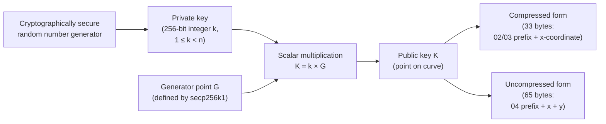
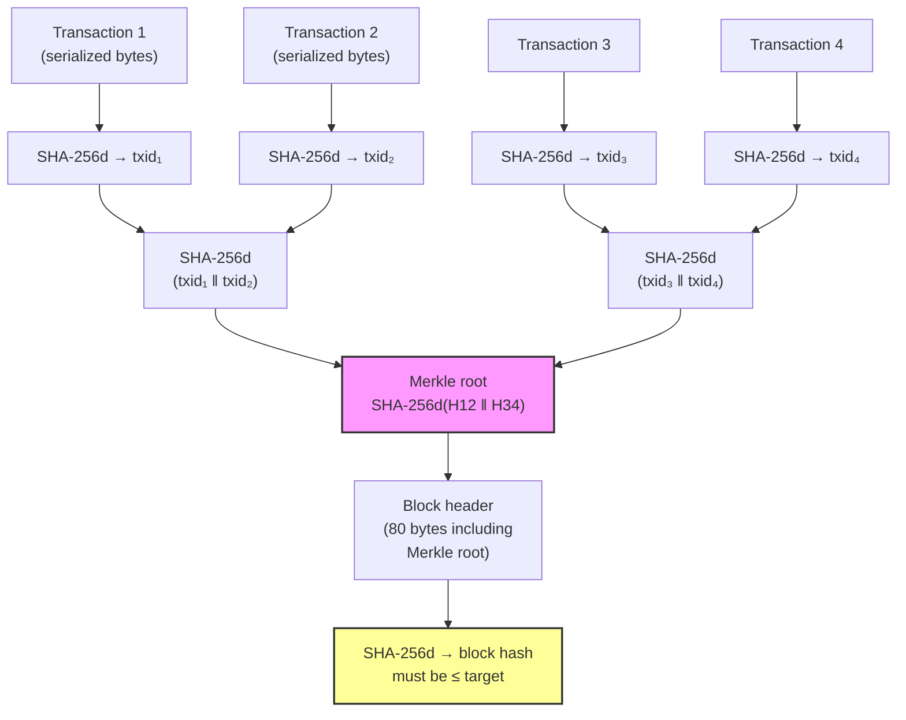
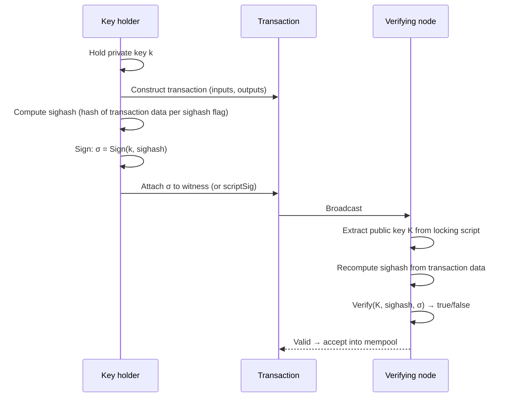
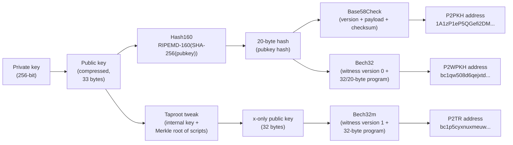
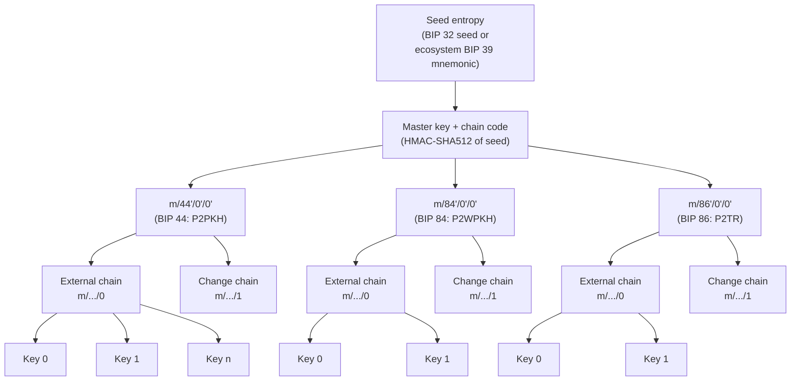

## Introduction

This page is **L1 #6 — Cryptography design** in the [design-document series](/BitcoinArchive/entries/design/2009-01-03-bitcoin-system-design-overview/). It covers the cryptographic primitives that underpin every layer of Bitcoin: the keys that represent ownership, the signatures that authorize spending, the hash functions that bind blocks and transactions together, and the derivation schemes that turn a single secret into a tree of addresses.

An important distinction: Bitcoin is a system built on **cryptography**, not **encryption**. The blockchain is public. Transactions are broadcast in the clear. No message is encrypted at the protocol level. What cryptography provides instead is **authentication** — proof that a transaction was authorized by the holder of a specific private key — and **integrity** — proof that data has not been tampered with.

The one exception is BIP 324 (v2 transport protocol), which encrypts peer-to-peer traffic to resist passive surveillance; that is a network-layer concern covered in the P2P design page, not a transaction-layer primitive.

The page depends on the [transaction design page](/BitcoinArchive/entries/design/2009-01-03-bitcoin-transaction-design/), which describes how inputs, outputs, and scripts consume the cryptographic primitives described here. Where behavior differs between the Satoshi-era implementation (v0.1, January 2009) and modern Bitcoin Core (v27+ baseline), both are noted.

### The v0.1 implementation trail

The whitepaper states the design at the protocol level; the v0.1 source shows where those primitives entered the program. `CKey` constructs an OpenSSL `EC_KEY` on `secp256k1`, then delegates signing and verification to `ECDSA_sign` and `ECDSA_verify` in `src/key.h` at the pinned commit `4184ab2`, lines 49–136. Address derivation is equally explicit: `PubKeyToAddress` in `src/base58.h`, lines 117–200, applies `Hash160`, prepends version byte `0`, and adds the four-byte `Hash` check before Base58 encoding. The script interpreter exposes the hash opcodes and reaches `OP_CHECKSIG`; its `SignatureHash` routine in `src/script.cpp`, lines 818–897, rewrites the transaction according to the hash type, serializes it, and hashes that result.

This is an implementation record, not evidence of why Satoshi chose each boundary. The code establishes what v0.1 did; the design rationale must still be separated from the behavior that can be observed in the source.

## 1. Elliptic-curve cryptography

Bitcoin's ownership model rests on elliptic-curve cryptography (ECC). A private key is a random 256-bit integer. The corresponding public key is a point on the secp256k1 curve, derived by scalar multiplication of the private key with the curve's generator point. The multiplication is computationally easy; reversing it — recovering the private key from the public key — is the elliptic-curve discrete logarithm problem (ECDLP), believed to be intractable for classical computers at this key size.

### Key generation flow

### secp256k1 curve parameters

| Parameter | Value | Notes |
|---|---|---|
| **Curve equation** | y² = x³ + 7 (mod p) | Weierstrass short form; a = 0, b = 7 |
| **Field prime (p)** | 2²⁵⁶ − 2³² − 977 | A prime chosen for efficient modular arithmetic |
| **Group order (n)** | FFFFFFFF FFFFFFFF FFFFFFFF FFFFFFFE BAAEDCE6 AF48A03B BFD25E8C D0364141 | The number of points on the curve; private keys must be in [1, n−1] |
| **Generator point (G)** | Defined in SEC 2 standard | Fixed base point for all key derivation |
| **Cofactor (h)** | 1 | The group has prime order — every non-identity point is a generator |
| **Key size** | 256 bits (private), 256 or 512 bits (public) | Compressed public key: 33 bytes; uncompressed: 65 bytes |
| **Security level** | ~128 bits (classical) | Breaking ECDLP requires ~2¹²⁸ operations with best known classical algorithms |

**Why secp256k1.** Satoshi chose secp256k1 over the more widely deployed NIST P-256 (secp256r1). The secp256k1 parameters are constructed from simple, non-random values, which makes it verifiable that no backdoor was embedded in the curve constants — a concern that gained prominence after the Dual_EC_DRBG incident demonstrated that NIST-endorsed cryptographic parameters could harbor deliberately planted weaknesses. The curve's structure also enables a ~30% speedup in signature verification through endomorphism optimization, which libsecp256k1 exploits.

## 2. Hash functions

Bitcoin uses several hash constructions across its protocol. None are used for encryption; all serve as commitment or integrity mechanisms.

### Where each hash is used

| Hash function | Output size | Where used in Bitcoin |
|---|---|---|
| **SHA-256** (single) | 256 bits | Merkle tree internal nodes (paired with SHA-256d at the root); BIP 340 Schnorr signature challenges; BIP 32 HMAC-SHA512 child key derivation uses SHA-512 internally |
| **SHA-256d** (double SHA-256) | 256 bits | Block header hashing (proof of work), transaction ID (txid), Merkle root computation, `OP_HASH256` |
| **RIPEMD-160** | 160 bits | Used after SHA-256 in the Hash160 construction: `RIPEMD-160(SHA-256(data))`. Produces the 20-byte payload for P2PKH and P2WPKH addresses, `OP_HASH160` |
| **SHA-512** | 512 bits | HMAC-SHA512 in BIP 32 HD key derivation (producing both child key and chain code from a single operation) |
| **Tagged hashes** | 256 bits | BIP 340/341 prefix each SHA-256 input with a domain-specific tag to prevent cross-protocol hash collisions (e.g., `SHA-256(SHA-256("BIP0340/challenge") ‖ SHA-256("BIP0340/challenge") ‖ data)`) |

### Hash chain: from transaction to proof of work

**Why double hashing.** SHA-256d applies SHA-256 twice in sequence: `SHA-256(SHA-256(data))`. Satoshi chose this construction to neutralize length-extension attacks. Single-pass SHA-256, like all Merkle–Damgård hashes, allows an attacker who knows `H(m)` to compute `H(m ‖ padding ‖ m')` without knowing `m`. The second hash pass destroys this property because the output of the first pass is a fixed-length input to the second.

## 3. Digital signatures

Signatures are the mechanism by which a spender proves control of the private key that corresponds to the public key committed in a UTXO's locking script. Bitcoin has used two signature schemes.

### Signing and verification flow

### ECDSA vs Schnorr

| Property | ECDSA (v0.1, 2009) | Schnorr (BIP 340, Taproot 2021) |
|---|---|---|
| **Signature size** | 70–72 bytes (DER-encoded, variable) | 64 bytes (fixed) |
| **Encoding** | DER (variable-length ASN.1) | Fixed 64-byte `(R‖s)` |
| **Verification equations** | One per signature | One per signature; natively batch-verifiable |
| **Key aggregation** | Not natively supported; requires complex multi-round protocols | MuSig2: n-of-n participants produce a single 64-byte signature indistinguishable from a solo spend |
| **Linearity** | Non-linear — signature components do not add simply | Linear — `s₁ + s₂` yields a valid signature for the combined public key |
| **Provable security** | Requires the generic group model or additional assumptions | Provably secure under the discrete logarithm assumption in the random oracle model |
| **Malleability** | Signature malleable (third party can produce a different valid signature for the same message) | Non-malleable by construction |
| **Sighash scheme** | Legacy sighash (quadratic hashing for large transactions) | BIP 341 sighash (linear, epoch-tagged) |
| **Cryptography library** | OpenSSL (consensus-critical through v0.11); libsecp256k1 (wallet signing from v0.10, consensus verification from v0.12) | libsecp256k1 Schnorr module |
| **Script context** | `OP_CHECKSIG`, `OP_CHECKMULTISIG` | `OP_CHECKSIG` (tapscript variant), `OP_CHECKSIGADD` |

**The OpenSSL exit.** Satoshi's v0.1 relied on OpenSSL for ECDSA signing, ECDSA verification, random number generation, and the SHA-256d/RIPEMD-160 hashing inside `Hash()`/`Hash160()` — but not for the mining hot path: `BlockSHA256()` in `main.cpp` called a bundled Crypto++ implementation (Wei Dai's `sha.cpp`/`sha.h`) instead, bypassing OpenSSL for speed.

Bitcoin Core's move to libsecp256k1, a purpose-built library offering constant-time operations (side-channel resistance), deterministic nonce generation (RFC 6979), and significantly faster batch verification, happened in two stages, [detailed in a dedicated entry](/BitcoinArchive/entries/aftermath/2016-01-15-libsecp256k1-replaces-openssl-bitcoin-core-v012/): v0.10 (February 2015) made it the default for wallet signing, but consensus-critical ECDSA verification stayed on OpenSSL until v0.12 (January 2016) — the change that actually eliminated the class of consensus bugs caused by OpenSSL version differences in DER signature parsing, a risk the BIP 66 strict-DER soft fork had patched around in the interim.

## 4. Address derivation

A Bitcoin address is a human-readable encoding of a locking-script payload. It is not stored on the blockchain; the network operates on raw scriptPubKey bytes. The address is a user-interface convenience that adds error detection and identifies the script type.

### Address derivation pipeline

### Address format comparison

| Format | Prefix | Introduced | Encoding | Error detection | Locking script | Typical size |
|---|---|---|---|---|---|---|
| **P2PKH** | `1` | v0.1 (2009) | Base58Check | 4-byte SHA-256d checksum | `OP_DUP OP_HASH160 <20-byte hash> OP_EQUALVERIFY OP_CHECKSIG` | 25–34 characters |
| **P2SH** | `3` | BIP 16 (2012) | Base58Check | 4-byte SHA-256d checksum | `OP_HASH160 <20-byte hash> OP_EQUAL` | 34 characters |
| **P2WPKH** | `bc1q` | BIP 141/173 (2017) | Bech32 | 6-character BCH code | Witness v0 + 20-byte key hash | 42 characters |
| **P2WSH** | `bc1q` | BIP 141/173 (2017) | Bech32 | 6-character BCH code | Witness v0 + 32-byte script hash | 62 characters |
| **P2TR** | `bc1p` | BIP 341/350 (2021) | Bech32m | 6-character BCH code (modified constant) | Witness v1 + 32-byte x-only key | 62 characters |

**Base58Check → Bech32 → Bech32m.** Base58Check uses a character set that omits visually ambiguous characters (`0`, `O`, `I`, `l`) and includes a 4-byte checksum. Bech32 (BIP 173) switched to a lowercase-only alphanumeric set optimized for QR codes and replaced the checksum with a BCH error-correcting code capable of detecting up to 4 errors and reliably detecting longer error bursts. Bech32m (BIP 350) corrected a length-mutation weakness discovered in Bech32 by modifying the checksum constant, and is used for all witness versions ≥ 1 (starting with Taproot's v1).

## 5. HD wallets

Early Bitcoin wallets generated keys independently — each key was a fresh random number with no structural relationship to any other key. Losing a backup taken before a new key was generated meant losing that key's funds permanently.

BIP 32 (2012) introduced **hierarchical deterministic** (HD) derivation: a single master secret produces an entire tree of keys, all recoverable from one backup.

### HD derivation tree

### BIP 32 / 39 / 44 roles

| BIP | Year | Role | Mechanism |
|---|---|---|---|
| **BIP 32** | 2012 | Hierarchical deterministic key derivation | Defines the math: HMAC-SHA512 to derive child keys from a parent key + chain code. Supports hardened derivation (child cannot be used to recover parent) and normal derivation (allows watch-only wallets from an extended public key). |
| **BIP 39** | 2013 | Mnemonic seed phrase | Encodes initial entropy as 12–24 English words. Widely adopted by third-party wallets; **Bitcoin Core does not use BIP 39 natively** — it derives keys from raw entropy via BIP 32. Included here because the ecosystem convention is pervasive. |
| **BIP 44** | 2014 | Multi-account structure | Standardizes the derivation path: `m / purpose' / coin_type' / account' / change / address_index`. Purpose 44 = P2PKH. |
| **BIP 49** | 2017 | P2SH-wrapped SegWit paths | Purpose 49 = P2SH-P2WPKH (backward-compatible SegWit addresses starting with `3`). |
| **BIP 84** | 2017 | Native SegWit paths | Purpose 84 = P2WPKH (Bech32 addresses starting with `bc1q`). |
| **BIP 86** | 2021 | Taproot paths | Purpose 86 = P2TR (Bech32m addresses starting with `bc1p`). |

**Descriptor wallets (v27+ baseline).** Modern Bitcoin Core replaces the implicit BIP 44/49/84/86 derivation conventions with **output descriptors** (BIP 380+): explicit, composable expressions that fully specify how a wallet derives addresses and constructs locking scripts. A descriptor like `wpkh([fingerprint/84'/0'/0']xpub.../0/*)` is unambiguous — it declares the script type, the key origin, and the derivation range in a single string. This eliminates the ambiguity of "which BIP path does this wallet use?" that plagued the BIP 39/44 era.

## 6. Quantum threat considerations

All of Bitcoin's signature security — ECDSA and Schnorr alike — rests on the hardness of the elliptic-curve discrete logarithm problem. A sufficiently large quantum computer running Shor's algorithm would break this assumption, allowing an attacker to derive private keys from public keys. The threat, the timeline, and the proposed migration paths are analyzed in detail in the [quantum threat analysis](/BitcoinArchive/entries/analysis/2026-05-18-bitcoin-quantum-threat/).

**What is at risk and what is not:**

| Primitive | Quantum attack | Impact on Bitcoin |
|---|---|---|
| **ECDSA / Schnorr (secp256k1)** | Shor's algorithm solves ECDLP in polynomial time | An attacker with a cryptographically relevant quantum computer could derive the private key from any exposed public key and spend the associated funds |
| **SHA-256 (proof of work)** | Grover's algorithm provides a quadratic speedup (2²⁵⁶ → 2¹²⁸ effective preimage resistance) | 128 bits of preimage resistance remains well above the security threshold; proof of work is not broken |
| **RIPEMD-160 / Hash160 (addresses)** | Grover reduces preimage resistance from 2¹⁶⁰ to 2⁸⁰ | Funds behind an unrevealed public-key hash (never-spent P2PKH/P2WPKH) are protected by the hash, not the ECDLP. The hash provides a second barrier, though 2⁸⁰ operations is below comfortable long-term margins |
| **HD derivation (BIP 32)** | HMAC-SHA512 uses symmetric-key construction | Grover halves the effective security, but the 256-bit key space remains at 2¹²⁸ — no practical threat |

## 7. Two-era comparison

| Feature | Satoshi era (v0.1, Jan 2009) | Modern Bitcoin Core, v27+ baseline |
|---|---|---|
| **Curve** | secp256k1 | Same |
| **Key format** | Uncompressed public keys (65 bytes) standard | Compressed (33 bytes) standard; Taproot uses x-only (32 bytes) |
| **Signature scheme** | ECDSA only | ECDSA (legacy/SegWit v0) + Schnorr (Taproot, BIP 340) |
| **Signature encoding** | DER (variable, 70–72 bytes) | DER for ECDSA; fixed 64-byte for Schnorr |
| **Signature malleability** | Possible — third parties could alter `s` value | Low-S rule (BIP 146) for ECDSA; Schnorr non-malleable by design |
| **Key aggregation** | Not available | MuSig2 (n-of-n Schnorr aggregation into one key + one signature) |
| **Cryptography library** | OpenSSL | libsecp256k1 (constant-time, deterministic nonces, formally reviewed) |
| **Nonce generation** | OpenSSL PRNG | RFC 6979 deterministic nonces (ECDSA); BIP 340 synthetic nonces (Schnorr) |
| **Hash functions** | SHA-256d/RIPEMD-160 via OpenSSL (`Hash()`/`Hash160()`); mining's block-hash SHA-256 via bundled Crypto++ (Wei Dai) | Same algorithms; internal implementations with hardware acceleration (SHA-NI, ARMv8-A) |
| **Address format** | Base58Check (P2PKH: `1...`) | Base58Check (legacy), Bech32 (P2WPKH/P2WSH: `bc1q...`), Bech32m (P2TR: `bc1p...`) |
| **Key management** | Random key pool (non-deterministic) | HD derivation (BIP 32/44/84/86); descriptor wallets (BIP 380+). Core uses raw BIP 32 seed, not BIP 39 |
| **Backup model** | Export `wallet.dat`; new keys require new backups | Descriptor backup covers all derived keys (Bitcoin Core uses raw BIP 32 seed, not BIP 39 mnemonic) |
| **Sighash algorithm** | Legacy sighash (quadratic in number of inputs) | BIP 143 sighash (SegWit v0, linear) + BIP 341 sighash (Taproot, epoch-tagged) |

## 8. Limits of this page

This page covers Bitcoin's cryptographic primitives in isolation. The following topics are out of scope and addressed in their respective domain pages within the [design-document series](/BitcoinArchive/entries/design/2009-01-03-bitcoin-system-design-overview/):

- **Script evaluation** — how locking and unlocking scripts consume signatures and hashes at runtime. Covered in the [transaction design page](/BitcoinArchive/entries/design/2009-01-03-bitcoin-transaction-design/).
- **Proof-of-work mining** — how SHA-256d is used in the block-header hash puzzle and how difficulty adjusts. Covered in the [consensus design page](/BitcoinArchive/entries/design/2009-01-03-bitcoin-consensus-design/).
- **Merkle tree construction** — how transaction hashes are assembled into the block header commitment. Covered in the [block and chain design page](/BitcoinArchive/entries/design/2009-01-03-bitcoin-block-chain-design/).
- **BIP 324 encrypted transport** — the v2 P2P protocol that encrypts node-to-node traffic. This is a network-layer concern, not a transaction-layer primitive.
- **Quantum migration proposals** — BIP 360 (P2MR / QuBit) and post-quantum signature candidates. Covered in the [quantum threat analysis](/BitcoinArchive/entries/analysis/2026-05-18-bitcoin-quantum-threat/).
- **Threshold and multisignature schemes** — FROST, MuSig2 protocol details, and k-of-n constructions beyond the scope of this primitives overview.

These primitives are what [the security model](/BitcoinArchive/entries/design/2009-01-03-bitcoin-security-model/) builds its threat model on, and what every transaction in [the transaction design](/BitcoinArchive/entries/design/2009-01-03-bitcoin-transaction-design/) consumes.
