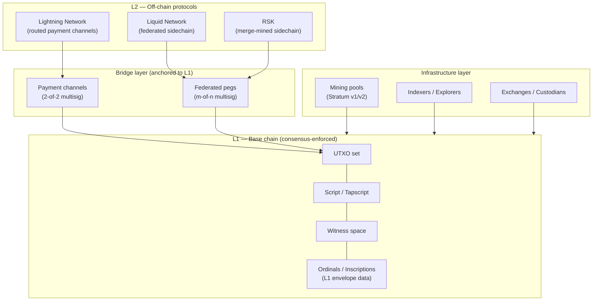
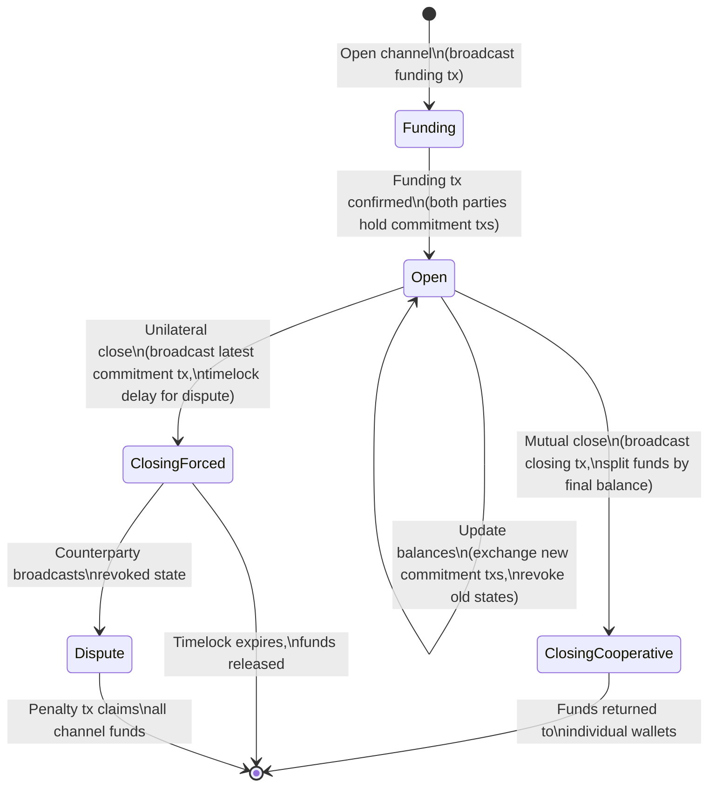
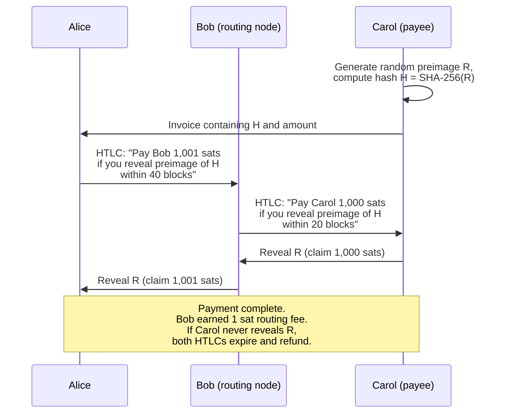
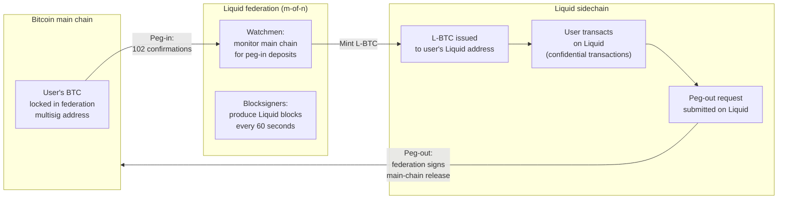
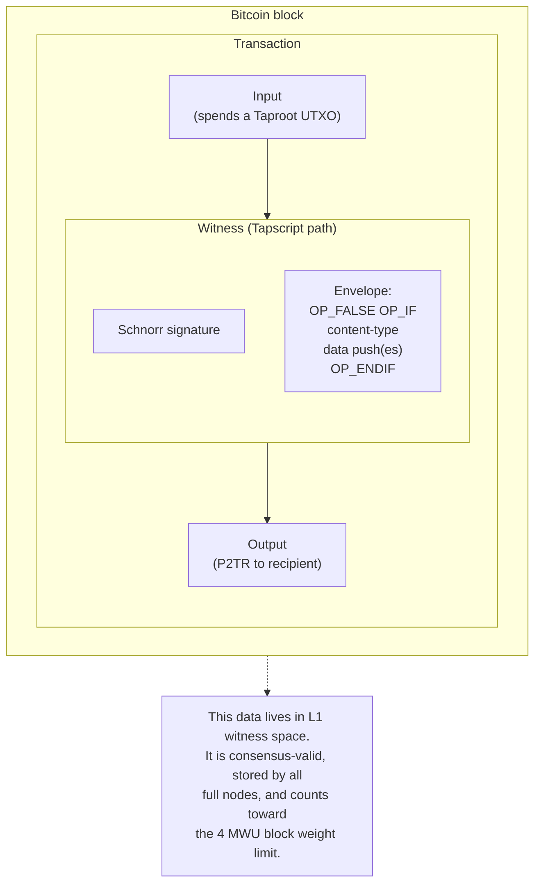
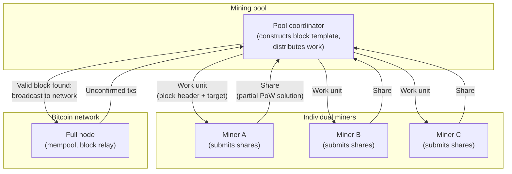

## Introduction

This page is **L2 #10 — Ecosystem design (Layer 2, sidechains)** in the [design-document series](/BitcoinArchive/entries/design/2009-01-03-bitcoin-system-design-overview/). It covers the ecosystem that has grown around Bitcoin's base chain: payment-channel networks, federated sidechains, on-chain envelope structures, and collaborative mining architectures. These systems share a single dependency — the most-work chain maintained by Bitcoin's [consensus rules](/BitcoinArchive/entries/design/2009-01-03-bitcoin-consensus-design/) — but they differ fundamentally in where they execute, what trust model they assume, and how they settle back to L1.

**A critical classification note.** Ordinals and Inscriptions are sometimes grouped with "Layer 2" in popular discussion. They are not. They are L1 envelope structures — data embedded directly in on-chain witness space, validated and stored by every full node, and subject to L1 consensus rules. This page maintains the distinction throughout. An Inscription occupies block weight in the same way a payment output does; a Lightning payment does not.

Where behavior differs between the Satoshi-era implementation (v0.1, January 2009) and modern Bitcoin Core (v27+ baseline), both are noted.

## 1. Ecosystem layer map

The diagram below classifies the major ecosystem components by their relationship to Bitcoin's base chain. The vertical axis represents trust and settlement distance: systems higher in the stack settle less frequently on L1 and may introduce additional trust assumptions.

| Layer | Settlement | Trust model | Examples |
|---|---|---|---|
| **L1 base chain** | Every block (consensus-enforced) | Trustless — every full node validates | Transactions, Ordinals/Inscriptions, OP_RETURN data |
| **Bridge** | On-chain open/close transactions | Trustless (channels) or federated (pegs) | 2-of-2 funding outputs, Liquid federation multisig |
| **L2 off-chain** | Periodic settlement to L1 | Varies — channel counterparty, federation, or merge-mining | Lightning Network, Liquid, RSK |
| **Infrastructure** | Operational — not consensus-relevant | Service-level trust with the operator | Mining pools, block explorers, exchanges |

## 2. Lightning Network design

The Lightning Network is a routed payment-channel network. Two parties lock funds in a shared on-chain output and then exchange signed-but-unbroadcast transactions to update their balances without touching the blockchain. Payments route across multiple channels using hash-time-locked contracts (HTLCs), enabling any Lightning user to pay any other Lightning user without a direct channel between them.

### Channel lifecycle

### Multi-hop payment routing (HTLC)

When Alice pays Carol through an intermediary (Bob), the payment uses a chain of HTLCs that lock atomically: either every hop settles or none does.

### Lightning Network properties

| Property | Design choice |
|---|---|
| **Funding** | 2-of-2 multisig output on L1; requires one on-chain transaction to open |
| **Capacity** | Bounded by the funding output amount; cannot exceed on-chain deposit |
| **Updates** | Off-chain: parties exchange signed commitment transactions; no block confirmation needed |
| **Revocation** | Old states are revoked by sharing revocation keys; broadcasting a revoked state triggers a penalty |
| **Routing** | Source-routed via onion-encrypted HTLC paths (BOLT 4); sender selects the route |
| **Privacy** | Intermediary nodes see only their hop, not the full path; sender and receiver are hidden from routing nodes |
| **Finality** | Sub-second for successful payments; dispute resolution requires on-chain settlement with timelocks |
| **L1 dependency** | Relies on `OP_CHECKLOCKTIMEVERIFY`, `OP_CHECKSEQUENCEVERIFY`, and SegWit malleability fix (BIP 141) |

### L1 prerequisites

The Lightning Network could not operate on Satoshi's v0.1 implementation. It depends on three post-launch additions to Bitcoin's base chain:

| Prerequisite | BIP | Activation | Why Lightning needs it |
|---|---|---|---|
| **SegWit** | BIP 141 | 2017 | Fixes transaction malleability — child transactions (commitment txs) can reference the funding txid before it confirms, without risk of the txid changing |
| **CLTV** | BIP 65 | 2015 | `OP_CHECKLOCKTIMEVERIFY` enforces absolute timelocks in HTLC refund paths |
| **CSV** | BIP 68/112 | 2016 | `OP_CHECKSEQUENCEVERIFY` enforces relative timelocks for revocation delay windows |

CLTV was not devised specifically for Lightning — see [Peter Todd's BIP 65 proposal](/BitcoinArchive/entries/aftermath/2014-10-01-peter-todd-bip-65-checklocktimeverify/) for the original specification of `OP_CHECKLOCKTIMEVERIFY`, later adopted as the timelock primitive non-interactive payment channels depend on.

## 3. Sidechains: Liquid and federated pegs

A sidechain is a separate blockchain that is pegged to Bitcoin: coins move from the main chain to the sidechain (peg-in) and back (peg-out) through a bridge mechanism. The sidechain can define its own block time, transaction format, and feature set while using BTC-denominated value.

### Peg-in / peg-out flow (Liquid)

### Sidechain comparison

| Property | Liquid Network | RSK (Rootstock) |
|---|---|---|
| **Consensus** | Federated (functionary consortium signs blocks) | Merge-mined with Bitcoin (same PoW secures both chains) |
| **Block time** | ~60 seconds | ~30 seconds |
| **Peg mechanism** | m-of-n federation multisig (Liquid functionaries) | m-of-n federation (PowPeg hardware security modules) |
| **Peg-in confirmations** | 102 Bitcoin blocks (~17 hours) | 100 Bitcoin blocks (~17 hours) |
| **Trust assumption** | Honest majority of federation members | Honest majority of federation + merge-mining hash rate |
| **Feature additions** | Confidential transactions, issued assets | EVM-compatible smart contracts |
| **Native asset** | L-BTC (1:1 peg to BTC) | RBTC (1:1 peg to BTC) |
| **Trade-off** | Faster finality and privacy at the cost of federation trust | Smart-contract capability at the cost of federation trust |

**Why not trustless two-way pegs?** Bitcoin's script system cannot verify another chain's proof of work or state transitions. A fully trustless two-way peg would require a soft fork adding validation logic for the sidechain's consensus rules — a proposal that has been discussed (Drivechain / BIP 300) but not activated. Existing sidechains therefore rely on federated multisig as the bridge, introducing a trust assumption absent from L1.

## 4. L1 extensions: Ordinals and Inscriptions

Ordinals and Inscriptions are **not Layer 2**. They operate entirely within Bitcoin's L1 consensus rules, using existing witness space to embed arbitrary data into individual satoshis. Every full node processes, validates, and stores this data as part of the canonical block.

### How Inscriptions use witness space

### Ordinal theory: satoshi-level identity

The Ordinal protocol assigns a sequential number to every satoshi based on the order in which it was mined. This numbering is a convention layer — the Bitcoin protocol itself does not distinguish individual satoshis. Ordinal-aware software tracks satoshi movement through transactions using a first-in-first-out (FIFO) mapping of input satoshis to output satoshis.

| Concept | Mechanism | Consensus status |
|---|---|---|
| **Ordinal number** | Sequential index assigned to each satoshi by mining order | Convention only — Bitcoin consensus treats all satoshis identically |
| **Inscription** | Arbitrary data (image, text, JSON) embedded in Tapscript witness via `OP_FALSE OP_IF ... OP_ENDIF` envelope | Consensus-valid — the data is part of a valid witness and counts toward block weight |
| **Sat tracking** | FIFO assignment of input satoshis to output positions | Convention only — depends on off-chain indexer interpretation |
| **Rarity model** | Named rarity tiers (common, uncommon, rare, epic, legendary, mythic) based on position relative to halvings and difficulty adjustments | Convention only — no on-chain enforcement |

### Why Ordinals/Inscriptions are not L2

| Criterion | L2 systems (Lightning, sidechains) | Ordinals/Inscriptions |
|---|---|---|
| **Where execution happens** | Off-chain (separate state machine or channel) | On-chain (standard Tapscript witness execution) |
| **Block weight consumption** | None (only opening/closing txs touch L1) | Full — every byte counts toward the 4 MWU limit |
| **Full-node storage** | None for channel updates; sidechain blocks stored separately | Stored by every Bitcoin full node as part of the block |
| **Consensus validation** | L1 validates only anchor transactions | L1 validates the entire envelope as part of script execution |
| **Settlement model** | Periodic settlement to L1 | No settlement needed — already on L1 |

## 5. Mining pools

Solo mining has been impractical for individual participants since approximately 2011. Mining pools allow miners to combine hash rate, find blocks collectively, and split rewards proportionally. The pool is an infrastructure-layer participant — it does not change consensus rules, but it concentrates block-template construction authority in pool operators.

### Pool architecture

### Pool protocols: Stratum v1 vs Stratum v2

| Property | Stratum v1 (2012) | Stratum v2 (2023+) |
|---|---|---|
| **Template construction** | Pool builds the block template; miners hash the header | Miners can build their own templates (Job Declaration protocol) |
| **Transport** | Plaintext JSON over TCP | Binary framing with optional noise-protocol encryption |
| **Transaction selection** | Pool operator selects which transactions to include | With Job Declaration: individual miners select transactions |
| **Censorship resistance** | Pool operator has sole authority over block content | Miners can independently construct block content |
| **Efficiency** | Higher bandwidth (JSON encoding overhead) | Lower bandwidth (binary encoding, ~3x reduction) |
| **Adoption** | Near-universal as of 2025 | Growing; supported by Ocean, Demand Pool, and others |

### Reward distribution methods

| Method | How it works | Variance for miner |
|---|---|---|
| **PPS (Pay Per Share)** | Pool pays a fixed amount per valid share, regardless of whether the pool finds a block | Zero variance — pool absorbs all risk |
| **FPPS (Full Pay Per Share)** | Like PPS, but also distributes estimated transaction fees per share | Zero variance — includes fee component |
| **PPLNS (Pay Per Last N Shares)** | Reward distributed proportionally among shares submitted in the window before a block is found | Higher variance — payment depends on pool finding blocks |
| **Solo (via pool)** | Miner gets the entire block reward if their share solves the block; nothing otherwise | Maximum variance — equivalent to solo mining with pool infrastructure |

## 6. Ecosystem layer comparison

The table below provides a structural comparison across the four ecosystem categories covered in this page, evaluated against a consistent set of design properties.

| Property | Lightning Network | Liquid (sidechain) | Ordinals/Inscriptions | Mining pools |
|---|---|---|---|---|
| **Layer classification** | L2 (off-chain) | L2 (separate chain) | L1 (on-chain envelope) | Infrastructure |
| **Trust model** | Channel counterparty (trustless with dispute) | Federation (m-of-n multisig) | Trustless (consensus-validated) | Pool operator (custodial during reward cycle) |
| **L1 block weight** | Minimal (open/close only) | Minimal (peg-in/peg-out only) | Full (every byte on-chain) | N/A — pools produce L1 blocks |
| **Transaction throughput** | Millions per second (theoretical) | ~60 per second | Bounded by L1 block weight | N/A |
| **Finality** | Sub-second (payment) | ~120 seconds (2 Liquid blocks) | ~60 minutes (6 Bitcoin confirmations) | N/A |
| **Privacy** | Onion-routed (sender/receiver hidden from intermediaries) | Confidential Transactions (amounts hidden) | Fully public (on-chain data) | Varies by pool |
| **Required soft forks** | SegWit (BIP 141), CLTV (BIP 65), CSV (BIP 68/112) | None (federation uses standard multisig) | Taproot (BIP 341) for Tapscript envelope | None |
| **Failure mode** | Force-close channel on-chain; funds recoverable | Federation failure: peg-out unavailable until quorum restored | N/A — data is immutably on-chain | Pool goes offline: miners switch pools; no fund loss |

## 7. Limits of this page

This page covers ecosystem-layer systems at the design level. The following topics are out of scope and addressed in their respective domain pages within the [design-document series](/BitcoinArchive/entries/design/2009-01-03-bitcoin-system-design-overview/):

- **Transaction structure and UTXO model** — the L1 primitives that Lightning channels and sidechain pegs build upon. Covered in the [transaction design](/BitcoinArchive/entries/design/2009-01-03-bitcoin-transaction-design/) page.
- **Taproot and Tapscript mechanics** — how witness programs and script-path spends work at the opcode level. Covered in the [transaction design](/BitcoinArchive/entries/design/2009-01-03-bitcoin-transaction-design/) page.
- **P2P gossip and block relay** — how transactions and blocks propagate across the network before reaching miners or Lightning nodes. Covered in the [P2P network design](/BitcoinArchive/entries/design/2009-01-03-bitcoin-p2p-network-design/) page.
- **Proof-of-work and difficulty adjustment** — the consensus mechanism that secures the base chain on which all ecosystem layers depend. Covered in the [consensus design](/BitcoinArchive/entries/design/2009-01-03-bitcoin-consensus-design/) page.
- **Fee market and block-template construction** — the economic dynamics that determine transaction inclusion priority.
