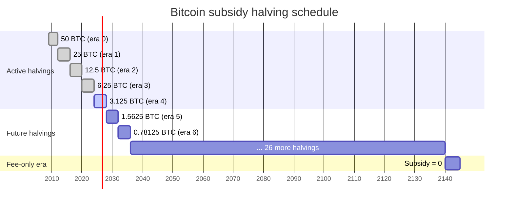
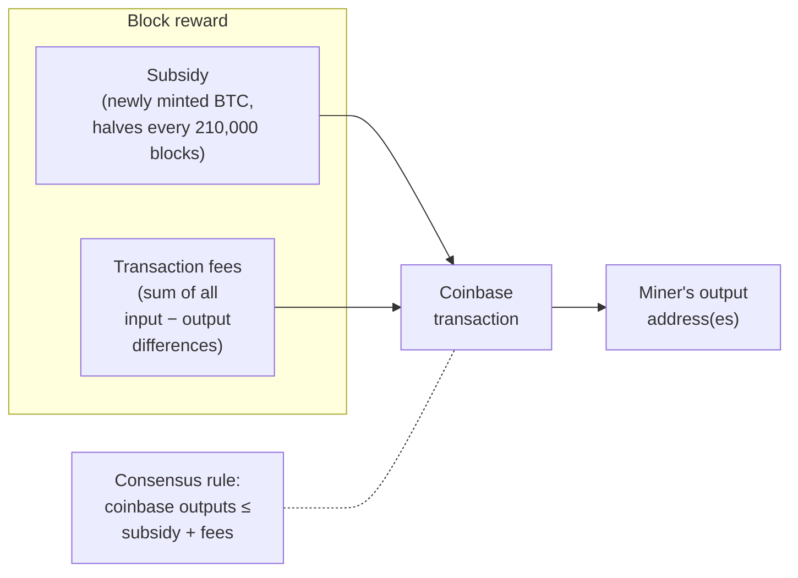
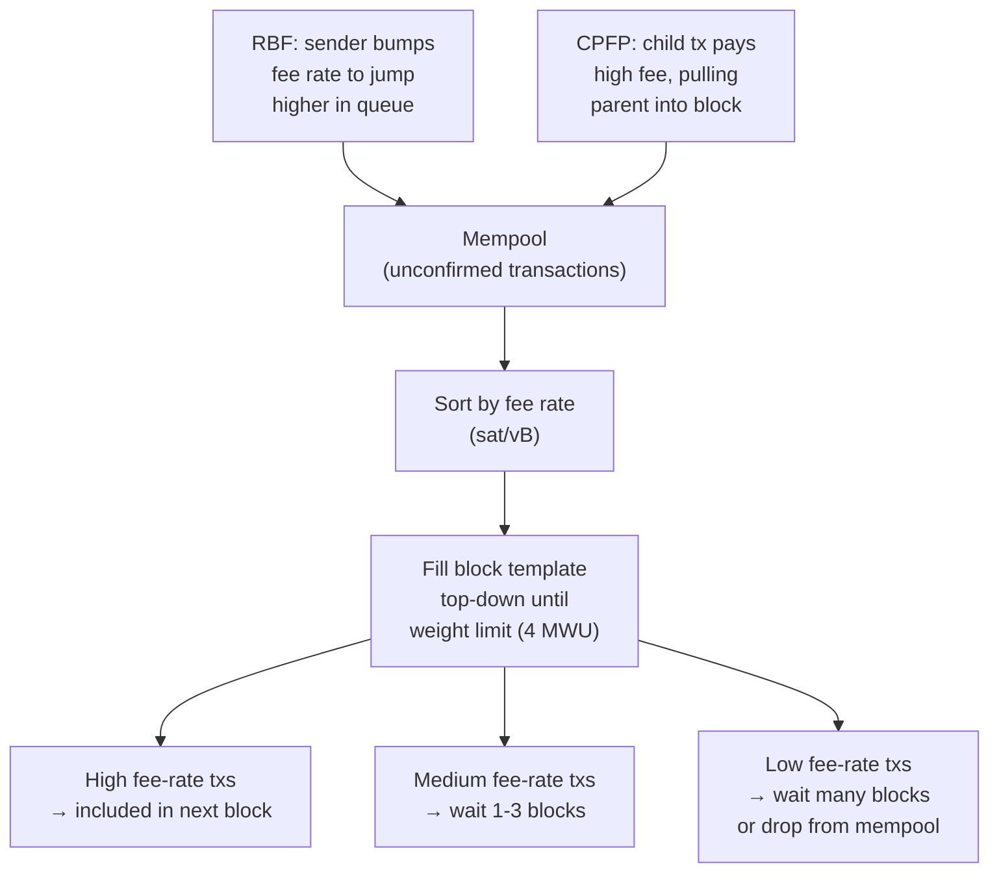
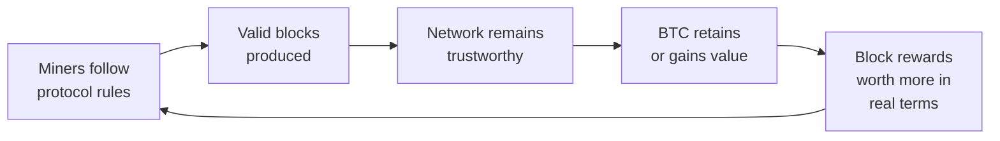
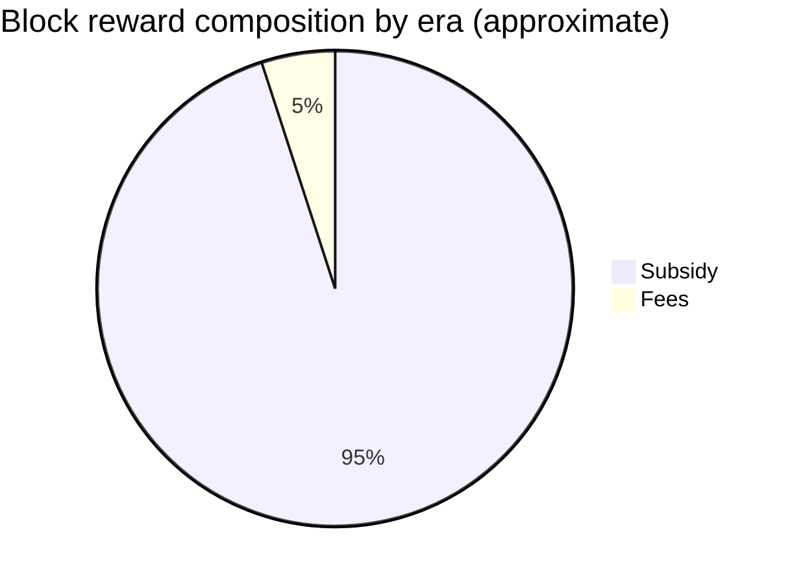

## Introduction

This page is **L1 #5 — Monetary design** in the [design-document series](/BitcoinArchive/entries/design/2009-01-03-bitcoin-system-design-overview/). It covers Bitcoin's monetary layer: the rules that govern coin creation, the economic mechanisms that compensate miners, and the incentive structure that makes honest participation more profitable than attack.

The [transaction design](/BitcoinArchive/entries/design/2009-01-03-bitcoin-transaction-design/) page explains how value is represented and transferred. The [consensus design](/BitcoinArchive/entries/design/2009-01-03-bitcoin-consensus-design/) page explains how nodes agree on a single chain. This page sits at the intersection: how much new value enters the system per block, who receives it, and why rational miners choose to follow the rules.

Four questions organize the material:

1. **How many bitcoins will ever exist?** Exactly 20,999,999.9769 BTC — the result of a geometric series with 33 halvings and integer-satoshi truncation.
2. **What does a miner earn per block?** A block reward composed of the subsidy (new coins) plus the sum of transaction fees.
3. **How do fees work?** A decentralized auction where transactions compete for limited block space based on fee rate.
4. **Why mine honestly?** Because the expected return from following the protocol exceeds the expected return from any known attack, given the capital cost of hash rate.

Where behavior differs between the Satoshi-era implementation (v0.1, January 2009) and modern Bitcoin Core (v27+ baseline), both are noted.

## 1. The 21 million cap

Bitcoin's total supply is bounded by a geometric series. The block subsidy starts at 50 BTC and halves every 210,000 blocks (approximately every four years at the 10-minute target rate). Because the subsidy is denominated in satoshis (integer arithmetic, 1 BTC = 100,000,000 satoshis) and integer division truncates remainders, the subsidy reaches zero after 33 halvings.

The total supply is:

**210,000 × (50 + 25 + 12.5 + 6.25 + … ) = 210,000 × 99.99999999 ≈ 20,999,999.9769 BTC**

The last satoshi of new issuance enters circulation around block 6,929,999 (approximately year 2140). After that block, the subsidy is zero and miners earn only transaction fees.

<!-- chart: supply-animated -->

### Halving timeline

### Halving epochs

| Era | Block range | Approx. dates | Subsidy per block | New BTC in era | Cumulative supply (BTC) | % of final supply |
|---|---|---|---|---|---|---|
| 0 | 0 – 209,999 | Jan 2009 – Nov 2012 | 50 BTC | 10,500,000 | 10,500,000 | 50.00% |
| 1 | 210,000 – 419,999 | Nov 2012 – Jul 2016 | 25 BTC | 5,250,000 | 15,750,000 | 75.00% |
| 2 | 420,000 – 629,999 | Jul 2016 – May 2020 | 12.5 BTC | 2,625,000 | 18,375,000 | 87.50% |
| 3 | 630,000 – 839,999 | May 2020 – Apr 2024 | 6.25 BTC | 1,312,500 | 19,687,500 | 93.75% |
| 4 | 840,000 – 1,049,999 | Apr 2024 – ~2028 | 3.125 BTC | 656,250 | 20,343,750 | 96.88% |
| 5 | 1,050,000 – 1,259,999 | ~2028 – ~2032 | 1.5625 BTC | 328,125 | 20,671,875 | 98.44% |
| … | … | … | … halves each era | … | … | … |
| 32 | 6,720,000 – 6,929,999 | ~2136 – ~2140 | 1 sat (0.00000001) | 0.021 BTC | ~20,999,999.9769 | ~100% |
| 33+ | 6,930,000+ | ~2140+ | 0 | 0 | 20,999,999.9769 | 100% |

The front-loading is extreme: 75% of all bitcoins were issued by mid-2016, within the first seven years. By era 4 (the present era as of 2024), over 96% of all supply has already been mined.

### Satoshi-era arithmetic

The `GetBlockValue` function in v0.1 computes the subsidy using a right bit-shift:

`nSubsidy = 50 * COIN` → `nSubsidy >>= (nHeight / 210000)`

This is integer division by powers of two. The same logic persists in modern Bitcoin Core's `GetBlockSubsidy` (in `validation.cpp`), with one guard added: if the shift count exceeds 63, the subsidy is explicitly set to zero. The arithmetic has been a consensus-frozen constant since genesis.

## 2. Coinbase reward structure

Every block contains exactly one **coinbase transaction** — the first transaction in the block, which has no inputs. Its outputs distribute the block reward: the sum of the subsidy (newly minted coins) and all transaction fees collected from the block's other transactions.

### Reward composition

### Coinbase constraints

| Constraint | Rule | Notes |
|---|---|---|
| **Exactly one per block** | The first transaction must be coinbase; no other transaction may be coinbase | v0.1 onward |
| **No inputs** | Coinbase has no previous output references; the "input" is a freeform data field | The data field is used for extra nonce, pool identification, and BIP 34 height encoding |
| **Output cap** | Total coinbase output value ≤ subsidy + sum of transaction fees | A miner who claims more than the allowed reward produces an invalid block |
| **Maturity** | Coinbase outputs cannot be spent until 100 confirmations have passed | Prevents chain reorganizations from invalidating already-spent newly minted coins |
| **Height in coinbase** (BIP 34) | The coinbase scriptSig must start with the serialized block height | Activated 2013; ensures every coinbase transaction is unique, preventing txid collisions |

A miner may claim **less** than the full reward. Any unclaimed fees are permanently destroyed — they reduce the effective supply. Several early blocks (mined by Satoshi and early miners) have coinbase outputs below the maximum, either by accident or by design.

## 3. Fee market design

When block space demand exceeds supply, transactions compete for inclusion by offering fees. The fee market is a decentralized, continuous auction with no auctioneer — each miner independently selects which transactions to include, typically prioritizing by fee rate (satoshis per virtual byte).

### Fee-based transaction prioritization

### Fee mechanisms

| Mechanism | Description | Introduced | How it works |
|---|---|---|---|
| **Fee rate** | Satoshis per virtual byte (sat/vB) | Implicit from v0.1 | Higher fee rate = higher priority in the block template. Virtual bytes account for SegWit's witness discount. |
| **Replace-by-Fee (RBF)** | Sender replaces an unconfirmed transaction with a higher-fee version | BIP 125 (opt-in, v0.12); `-mempoolfullrbf` option v24.0; **full RBF default since v28.0** | The replacement must pay a strictly higher fee rate and cover the relay cost of the original. |
| **Child-Pays-for-Parent (CPFP)** | A child transaction spends a low-fee parent's output with a high enough fee to make the package attractive | Mempool ancestor tracking (2016+) | Miners evaluate packages: including the child requires including the parent, so the combined fee rate determines priority. |
| **Fee estimation** | Node-side algorithm predicts the fee rate needed for confirmation within a target number of blocks | `estimatesmartfee` (v0.15+) | Tracks historical confirmation times in fee-rate buckets. Returns a conservative estimate for a given confirmation target. |
| **Package relay** | Relay low-fee parent transactions alongside their high-fee children as a single unit | Under deployment (v28+) | Ensures CPFP works across the relay network, not just at the mining node. |

### Satoshi-era fee behavior

In v0.1, most transactions paid no fee at all. The client included a priority metric based on coin age (coin value × number of confirmations since the coin was created) that gave free relay and inclusion to "high-priority" transactions. As block space remained abundant through 2012, fees were economically irrelevant. The fee market only became meaningful after blocks began filling consistently (2015–2017).

## 4. Miner incentive model

Bitcoin's security rests on the assumption that mining honestly — extending the most-work chain with valid blocks — is more profitable than any alternative strategy. Section 6 of the [whitepaper](/BitcoinArchive/entries/emails/cryptography/2008-10-31-bitcoin-whitepaper-final/) presents this as a game-theoretic argument: a rational miner with significant hash power earns more by collecting block rewards than by attempting to defraud the network.

### Incentive analysis

| Strategy | Required hash rate | Expected revenue | Risk / cost | Outcome |
|---|---|---|---|---|
| **Honest mining** | Any share | Block reward × (share of total hash rate) — stable, predictable income | Hardware + energy cost | Sustainable; positive expected value if operational cost < revenue |
| **Selfish mining** | ~25–33% (Eyal-Sirer 2014; depends on network connectivity) | Temporarily higher share of blocks by withholding and releasing at strategic moments | Wastes orphaned blocks during failed attempts; requires sustained hash-rate majority | Marginal gain at extreme cost; network difficulty adjusts, reducing advantage over time |
| **Double-spend attack** | >50% for reliable success | Reverse a confirmed payment after receiving goods/services | Enormous capital cost; risk of detection and market collapse (BTC price drop destroys attacker's own holdings) | Economically irrational for large miners whose assets are denominated in BTC |
| **Transaction censorship** | >50% sustained | Exclude specific transactions from all future blocks | Same capital cost as double-spend; censored transactions simply wait for honest blocks | Ineffective unless attacker holds permanent majority; honest minority still includes censored transactions |

### The self-reinforcing loop

The incentive model creates a positive feedback cycle:

As Satoshi wrote in the whitepaper: "If a greedy attacker is able to assemble more CPU power than all the honest nodes, he would have to choose between using it to defraud people by stealing back his payments, or using it to generate new coins. He ought to find it more profitable to play by the rules."

This argument is strongest when the block subsidy dominates the reward. As the subsidy diminishes through halvings, the incentive model increasingly depends on transaction fees — a transition examined in [§ 7](#7-the-fee-only-future) and in the dedicated [mining reward exhaustion analysis](/BitcoinArchive/entries/analysis/2026-05-18-mining-reward-exhaustion-fee-only-future/).

## 5. Halving events and economic transitions

Each halving is a discrete monetary-policy event: the rate of new supply issuance drops by 50% overnight. The table below records the four halvings that have occurred, with market and network context at the time.

| Halving | Date | Block height | Subsidy before → after | Subsidy per block, post (USD ~) | BTC price (approx.) | Network hash rate (approx.) | Notable context |
|---|---|---|---|---|---|---|---|
| **1st** | Nov 28, 2012 | 210,000 | 50 → 25 BTC | ~$300 | ~$12 | ~25 TH/s | First ASIC miners arriving; GPU era ending |
| **2nd** | Jul 9, 2016 | 420,000 | 25 → 12.5 BTC | ~$8,100 | ~$650 | ~1.5 EH/s | SegWit debate underway; [Ethereum](/BitcoinArchive/entries/forum/bitcointalk/topic-428589/2014-01-23-vbuterin-ethereum-welcome-to-the-beginning/) launched one year prior |
| **3rd** | May 11, 2020 | 630,000 | 12.5 → 6.25 BTC | ~$54,000 | ~$8,600 | ~120 EH/s | Institutional adoption accelerating |
| **4th** | Apr 19, 2024 | 840,000 | 6.25 → 3.125 BTC | ~$200,000 | ~$64,000 | ~600 EH/s | Spot Bitcoin ETFs approved in US (Jan 2024); Ordinals/inscriptions driving fee spikes |

Each halving forces a structural adjustment in the mining industry. Miners whose operational costs exceed revenue at the new subsidy level must either find cheaper energy, upgrade to more efficient hardware, or shut down. Historically, hash rate has dipped briefly after each halving before resuming growth — evidence that the surviving mining fleet is more cost-efficient than its predecessor.

### Subsidy dominance erosion

In eras 0–3, the subsidy constituted over 95% of the average block reward. Fee share has grown measurably since 2017 as blocks fill consistently, and spiked above 50% during periods of extreme demand (SegWit activation congestion in late 2017, Ordinals inscription waves in 2023–2024). The long-term trend is toward fee dominance as the subsidy approaches zero.

## 6. The fee-only future

Around the year 2140, the block subsidy reaches zero. From that point forward, miners' sole revenue source is transaction fees. Whether fees alone can sustain sufficient proof-of-work security is the subject of ongoing debate — a central open question in Bitcoin's long-term monetary design.

### The security-budget question

The concern: if block rewards drop too low, the cost of attacking the network (acquiring >50% hash rate) falls proportionally. A fee-only regime must generate enough total fee revenue per block to keep the cost of a 51% attack prohibitively expensive.

Satoshi's original position, expressed in [Section 6 of the whitepaper](/BitcoinArchive/entries/emails/cryptography/2008-10-31-bitcoin-whitepaper-final/) and in subsequent forum posts, was that transaction fees would replace the subsidy smoothly:

<!-- speaker: Satoshi Nakamoto -->
<!-- audit:quote-skip -->
> "In a few decades when the reward gets too small, the transaction fee will become the main compensation for nodes."

### Arguments on both sides

| Position | Argument | Key reference |
|---|---|---|
| **Fees will suffice** | As Bitcoin adoption grows, demand for block space grows. Even small per-transaction fees, multiplied across thousands of transactions per block, can match or exceed current subsidy-era revenue. Layer-2 systems (Lightning) reduce on-chain volume but drive periodic settlement transactions with high fees. | Satoshi's whitepaper §6; market evidence from 2017 and 2023–2024 fee spikes |
| **Fees may not suffice** | Fee revenue is volatile — it depends on demand cycles, not on a predictable schedule. Without a guaranteed minimum reward, miners face uncertain income, and the network faces uncertain security. Game-theoretic models suggest that fee-only mining introduces new instabilities (selfish mining becomes more attractive when rewards are variable). | Carlsten et al., "On the Instability of Bitcoin Without the Block Reward" (ACM CCS 2016) |

This question is explored in depth in the [mining reward exhaustion analysis](/BitcoinArchive/entries/analysis/2026-05-18-mining-reward-exhaustion-fee-only-future/), which examines the documented debate and the game-theoretic models. The separate [fixed supply vs adjustable money analysis](/BitcoinArchive/entries/analysis/2008-10-31-fixed-supply-vs-adjustable-money/) places the 21 million cap in the broader context of monetary-design alternatives, including Wei Dai's elastic-supply proposal in b-money and the fiat baseline of central-bank discretion. [The digital-gold structural analysis](/BitcoinArchive/entries/analysis/2008-10-31-bitcoin-digital-gold-structural-features/) reads the same cap from the opposite end: not how it is enforced but why it endures. It argues that the property making Bitcoin 'digital gold' is the cap's political survival, which rests on the network's decentralization rather than on the halving arithmetic alone.

## 7. Two-era comparison

| Feature | Satoshi era (v0.1, Jan 2009) | Modern Bitcoin Core, v27+ baseline |
|---|---|---|
| **Total supply cap** | 20,999,999.9769 BTC (geometric series, integer truncation) | Same — consensus-frozen constant |
| **Subsidy calculation** | `nSubsidy = 50 * COIN; nSubsidy >>= (nHeight / 210000)` | Same arithmetic; explicit zero-guard for shift ≥ 64 added |
| **Halving interval** | 210,000 blocks | Same |
| **Coinbase maturity** | 100-block maturity rule | Same |
| **Coinbase height** | Not required | Required (BIP 34, activated 2013) — block height serialized in coinbase scriptSig |
| **Fee behavior** | Most transactions free; priority based on coin age | Fee-rate auction (sat/vB); coin-age priority removed |
| **Fee estimation** | None — fees were negligible | `estimatesmartfee` — bucket-based mempool fee estimation |
| **Replace-by-Fee** | Not implemented; first-seen policy | Opt-in RBF (BIP 125, v0.12); **full RBF default since v28.0** |
| **CPFP** | Not implemented | Ancestor-aware mempool; package evaluation for mining |
| **Package relay** | Not applicable | Under deployment (v28+) — relay parent+child as unit |
| **Block template** | Internal miner; trivial ordering | `getblocktemplate` (BIP 22/23); fee-rate-sorted mempool; SegWit weight accounting |
| **Witness discount** | Does not exist | Witness bytes at 1/4 weight (BIP 141) — incentivizes efficient use of block space |

## 8. Limits of this page

This page covers the monetary and incentive layer in isolation. The following topics are out of scope and addressed in their respective domain pages within the [design-document series](/BitcoinArchive/entries/design/2009-01-03-bitcoin-system-design-overview/):

- **Proof-of-work mechanics** — the SHA-256d hash puzzle, difficulty adjustment algorithm, and block validation rules are covered in the [consensus design](/BitcoinArchive/entries/design/2009-01-03-bitcoin-consensus-design/) page.
- **Transaction structure** — UTXO model, Script evaluation, and signature verification are covered in the [transaction design](/BitcoinArchive/entries/design/2009-01-03-bitcoin-transaction-design/) page.
- **Block template construction** — how miners assemble candidate blocks from the mempool, including transaction ordering and weight optimization.
- **Mining pool protocols** — Stratum v1/v2, share accounting, and pool payout models.
- **Layer-2 fee dynamics** — how Lightning Network channel opens/closes and submarine swaps interact with on-chain fee markets.
- **Security model** — 51% attack economics, selfish mining game theory, and the full threat model are deferred to the L2 security-model deep dive.

This monetary design is treated as the load-bearing structural reference by [the mining-reward-exhaustion analysis](/BitcoinArchive/entries/analysis/2026-05-18-mining-reward-exhaustion-fee-only-future/), which positions itself as the post-issuance counterpart of the monetary-design framework documented here.
