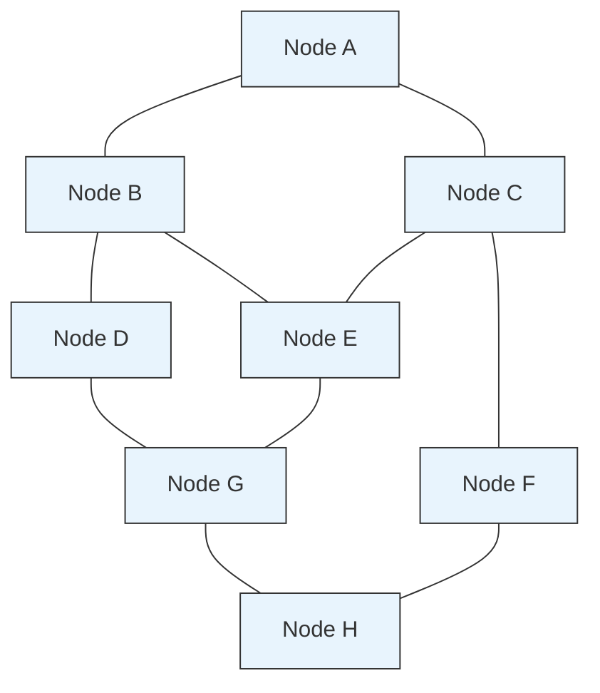
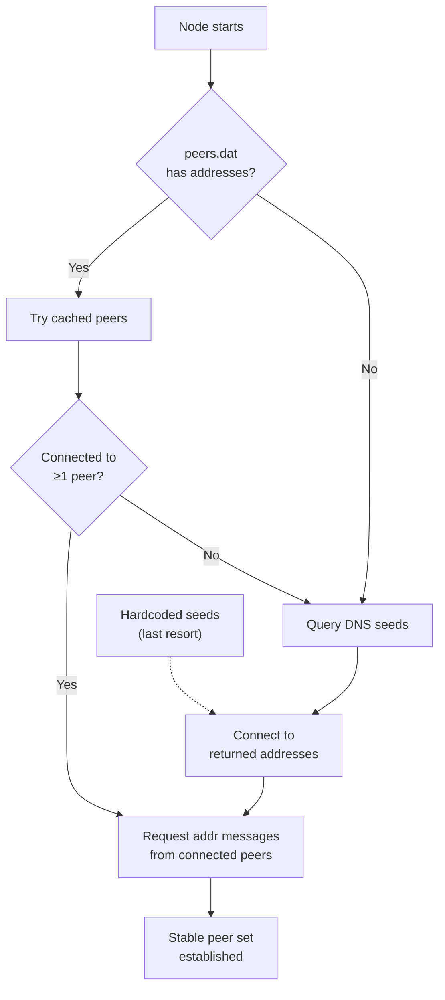
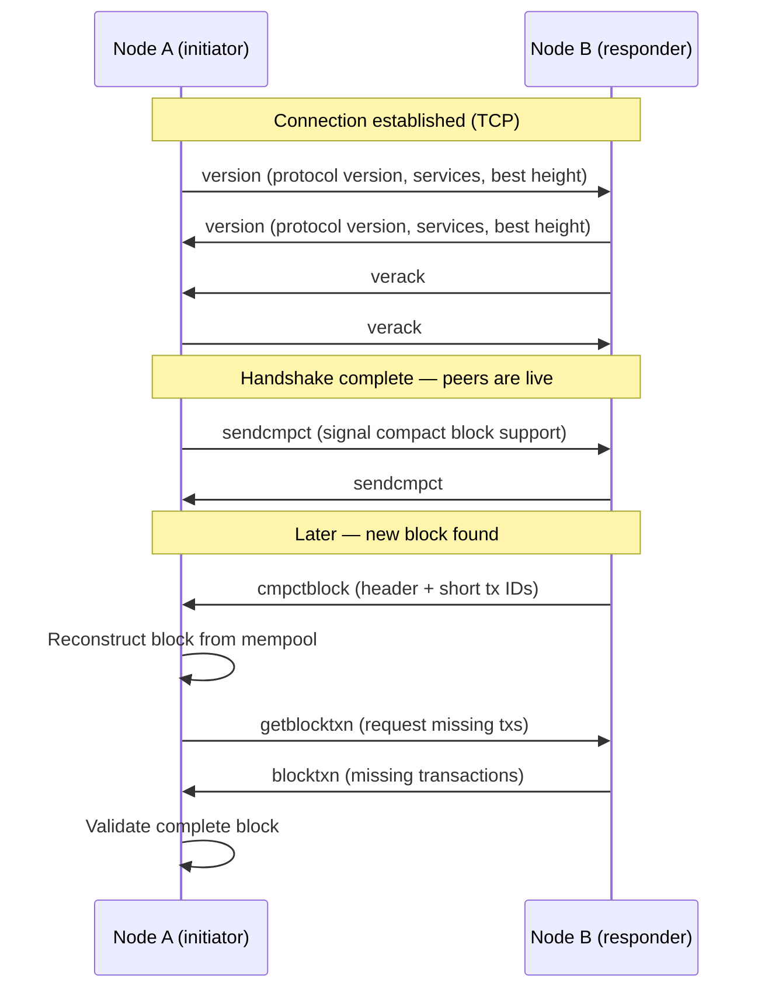
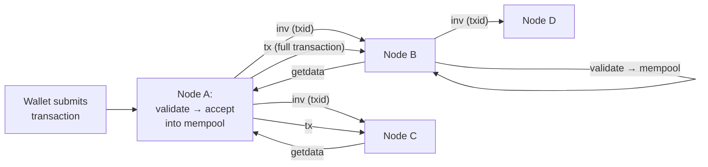
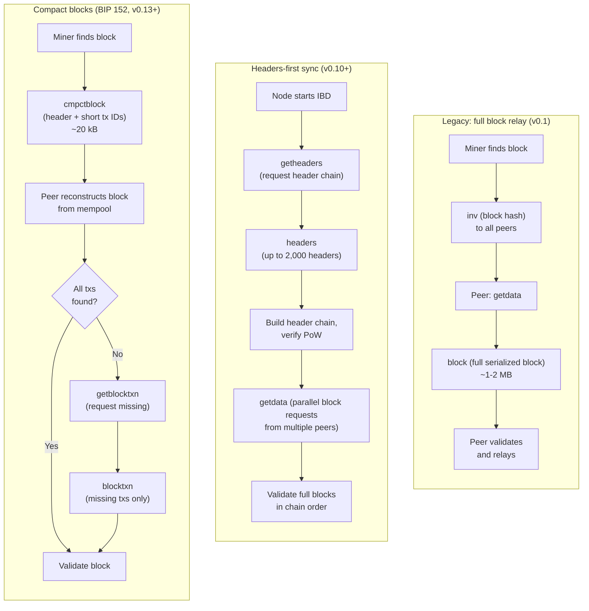

## Introduction

This page is **L1 #1 — P2P network design** in the [design-document series](/BitcoinArchive/entries/design/2009-01-03-bitcoin-system-design-overview/). It covers the network layer end-to-end: how nodes discover each other, how they exchange messages, and how transactions and blocks propagate across the peer-to-peer gossip network.

The network layer sits beneath the consensus, transaction, and block layers. It provides the transport over which everything else operates — without reliable peer-to-peer communication, the deterministic validation rules described in the [consensus design](/BitcoinArchive/entries/design/2009-01-03-bitcoin-consensus-design/), [transaction design](/BitcoinArchive/entries/design/2009-01-03-bitcoin-transaction-design/), and [block and chain design](/BitcoinArchive/entries/design/2009-01-03-bitcoin-block-chain-design/) pages would have no data to act on.

Where behavior differs between the Satoshi-era implementation (v0.1, January 2009) and modern Bitcoin Core (v27+ baseline), both are noted.

## 1. Network topology

Bitcoin uses an **unstructured gossip network**. Nodes form a random mesh of TCP connections and relay data to their peers, who relay it to theirs. There is no central server, no routing table, no distributed hash table (DHT), and no hierarchy among nodes. Every full node is equally authoritative.

| Property | Design choice |
|---|---|
| **Structure** | Unstructured random graph — no DHT, no supernode hierarchy |
| **Connections per node** | Each node maintains a small set of peers (default: 11 outbound + up to 125 inbound in v27+) |
| **Relay model** | Store-and-forward gossip — each node independently validates before relaying |
| **Redundancy** | Messages propagate across multiple paths; no single link is critical |
| **Partition resistance** | Random peer selection makes targeted network splits difficult |

**Why gossip and not structured routing.** A DHT or hierarchical topology would reduce message redundancy but would also introduce single points of failure and make the network easier to partition. Bitcoin's flat gossip model ensures that an attacker must compromise a large fraction of a node's peers to control what it sees — the foundation of Eclipse attack resistance.

## 2. Node discovery

A new node joining the network faces a bootstrap problem: it needs to find at least one existing peer, but it has no prior knowledge of the network's membership.

### Discovery mechanisms

| Mechanism | Era | How it works |
|---|---|---|
| **IRC bootstrap** | v0.1 (2009) | Nodes joined a specific IRC channel (`#bitcoin` on irc.lfnet.org) and announced their IP addresses. Other nodes read the channel to find peers. Removed in v0.8.2 (2013). |
| **Hardcoded seed nodes** | v0.1 → present | A list of known-reliable IP addresses compiled into the binary. Used as a last resort when DNS seeds and cached peers are unavailable. |
| **DNS seeds** | v0.6+ (2012) | Hostnames (e.g., `seed.bitcoin.sipa.be`) that resolve to IP addresses of currently active nodes. The primary bootstrap method in modern Bitcoin Core. |
| **`addr` / `addrv2` relay** | v0.1 → present | Connected peers exchange `addr` messages containing IP addresses of other known nodes. `addrv2` (BIP 155, v22.0+) extends this to support Tor v3, I2P, and CJDNS addresses. |
| **Local peer database** | v0.1 → present | The node persists known peer addresses to `peers.dat` and attempts reconnection on restart. Over time, a healthy node accumulates thousands of addresses. |

### Bootstrap sequence (v27+ baseline)

**Satoshi era vs v27+ baseline.** The original v0.1 client relied on IRC as the primary discovery mechanism — a simple but centralized approach vulnerable to IRC server downtime and channel bans. Modern Bitcoin Core replaces IRC with DNS seeds operated by independent community members. The DNS seed operators run crawler software that continually probes the network, and their DNS records reflect only nodes that are currently reachable and running compatible protocol versions.

## 3. Connection management

Each node maintains two classes of TCP connections: **outbound** connections the node initiates, and **inbound** connections other nodes initiate to it.

| Connection type | Direction | Default limit (v27+) | Purpose |
|---|---|---|---|
| **Full-relay outbound** | Outgoing | 8 | Primary peers for relaying transactions and blocks |
| **Block-relay-only outbound** | Outgoing | 2 | Relay blocks only (no transaction/addr relay); increases block connectivity without leaking mempool information |
| **Feeler** | Outgoing (short-lived) | 1 at a time | Tests whether a candidate address is reachable; disconnects immediately after a successful handshake |
| **Inbound** | Incoming | Up to 125 | Connections from other nodes; the node does not control who connects |
| **Anchor** | Outgoing (persistent) | 2 (from block-relay-only set) | Saved across restarts to maintain at least two trusted outbound peers; resists Eclipse attacks on restart |

**Outbound vs inbound: an asymmetry by design.** A node trusts its own outbound connections more than inbound connections because it chose the outbound peers itself. An attacker who wants to isolate a node (Eclipse attack) must either control all outbound peers — which requires predicting or manipulating the node's address selection — or flood the node with attacker-controlled inbound connections. The low outbound count (10 total) and the independent address-selection algorithm make the former difficult; inbound eviction logic makes the latter expensive to sustain.

### Eviction

When a node's inbound slots are full and a new inbound connection arrives, the node runs an eviction algorithm to decide whether to drop an existing peer. The algorithm protects peers with desirable properties:

- Low latency (recently sent useful data)
- Long connection duration
- Diverse network groups (different /16 subnets, different autonomous systems)
- Recently relayed a valid block or transaction

This diversity-preserving eviction makes it costly for an attacker to monopolize a node's inbound slots, because the attacker's connections are unlikely to outcompete honest peers on all protected dimensions simultaneously.

## 4. Message protocol

All communication between peers uses a binary message protocol. Every message carries a 24-byte header (4-byte network magic + 12-byte command name + 4-byte payload length + 4-byte checksum) followed by the payload.

### Version handshake and block relay

### Key message types

| Message | Payload | Role |
|---|---|---|
| `version` | Protocol version, services bitmask, best block height, node timestamp | Initiates handshake; peers exchange capabilities |
| `verack` | Empty | Acknowledges the `version` message; completes the handshake |
| `inv` | List of inventory vectors (type + hash) | Announces known transactions or blocks without sending the data |
| `getdata` | List of inventory vectors | Requests the full data for announced items |
| `tx` | Serialized transaction | Delivers a transaction in response to `getdata` |
| `block` | Serialized full block | Delivers a full block (legacy relay mode) |
| `headers` | Up to 2,000 block headers | Delivers block headers for headers-first synchronization |
| `getheaders` | Locator hashes + stop hash | Requests a range of block headers |
| `cmpctblock` | Header + short transaction IDs (BIP 152) | Compact block announcement; receiver reconstructs from mempool |
| `getblocktxn` | Block hash + indices of missing transactions | Requests transactions not found in the receiver's mempool |
| `blocktxn` | Block hash + missing transactions | Delivers the transactions requested by `getblocktxn` |
| `addr` / `addrv2` | List of peer addresses with timestamps | Propagates known peer addresses across the network |
| `ping` / `pong` | Nonce | Latency measurement and liveness check |
| `feefilter` | Minimum fee rate (satoshis per kB) | Tells the peer not to relay transactions below this fee rate |
| `sendheaders` | Empty | Requests that the peer announce new blocks via `headers` messages instead of `inv` |

**Satoshi era vs v27+ baseline.** The v0.1 protocol defined 12 message types and relayed full blocks to every peer. Modern Bitcoin Core (v27+ baseline) supports 27+ message types and uses compact blocks (BIP 152) as the default relay method, reducing block relay bandwidth by roughly 90% for well-connected nodes with overlapping mempools.

## 5. Transaction relay

When a node accepts a transaction into its mempool, it announces the transaction to its peers via the gossip network.

The relay process follows an **announce-then-request** pattern:

1. **Announce.** The node sends an `inv` message containing the transaction's hash to each peer.
2. **Request.** A peer that has not seen this hash responds with `getdata`.
3. **Deliver.** The announcing node sends the full `tx` message.
4. **Validate and propagate.** The receiving peer validates the transaction independently. If valid, it accepts the transaction into its own mempool and repeats the announce cycle to its peers.

**Privacy-preserving relay.** To prevent network observers from tracing a transaction back to the originating node, Bitcoin Core adds a random delay before announcing each transaction to each peer (Poisson-distributed timer). Each peer receives the announcement at a slightly different time and from a potentially different set of earlier relayers, making origin inference difficult.

**Fee filter.** The `feefilter` message (BIP 133) allows a node to tell its peers its minimum acceptable fee rate. Peers then skip announcing transactions below that threshold, reducing bandwidth waste for transactions the receiving node would reject anyway.

**Orphan transactions.** A transaction that references an input whose parent transaction is unknown is called an orphan. The node holds orphans in a limited cache. If the parent transaction arrives later, the orphan is re-evaluated. If the cache fills, the oldest orphan is evicted. This mechanism handles transactions that arrive out of order but prevents memory exhaustion from invalid orphan floods.

## 6. Block propagation

Block propagation is the most latency-sensitive operation in the network. Slow propagation increases the stale-block rate and gives better-connected miners an advantage, undermining the fairness of the mining competition.

### Propagation modes

| Mode | Bandwidth per block | Latency | When used |
|---|---|---|---|
| **Legacy full-block relay** | ~1–2 MB (entire block) | High — full serialization + transfer | Satoshi era (v0.1); still available as fallback |
| **Headers-first sync** | Headers: 80 bytes each; blocks: full size, but requested in parallel | Moderate — parallelism compensates for full-block size | Initial block download (IBD) — syncing from genesis to chain tip |
| **Compact blocks (BIP 152)** | ~20 kB typical (header + short IDs); missing txs on demand | Low — most transactions already in mempool | Steady-state block relay between synced nodes (v27+ default) |

**How compact blocks achieve ~90% savings.** When two peers have similar mempools (the common case for well-connected nodes), the receiver already has most of the block's transactions. The `cmpctblock` message sends only the block header and a 6-byte short ID for each transaction. The receiver matches these IDs against its mempool, reconstructs the block locally, and requests only the handful of transactions it is missing. For a 2,000-transaction block, the `cmpctblock` message is roughly 20 kB instead of 1–2 MB.

**High-bandwidth vs low-bandwidth mode (BIP 152).** Compact blocks operate in two modes. In high-bandwidth mode, the sending peer pushes the `cmpctblock` immediately upon validation — without waiting for the receiver to request it via `inv`/`getdata`. A node typically designates three peers for high-bandwidth mode to minimize relay latency for new blocks. In low-bandwidth mode, the standard announce-then-request pattern is used with `inv` first, trading latency for bandwidth savings with the remaining peers.

## 7. Transport layer: plaintext vs encrypted

In the Satoshi-era design, all peer-to-peer communication was transmitted in plaintext. Any network observer — an ISP, a state-level adversary, or a man-in-the-middle on a local network — could read every message, identify which transactions a node was relaying, map the network topology, and selectively drop or delay messages.

**BIP 324 v2 transport** (supported since v26.0, enabled by default in v27+) introduces an opportunistic encrypted transport layer between peers that both support it.

| Aspect | Satoshi era (v0.1) | v27+ baseline (BIP 324) |
|---|---|---|
| **Transport** | Plaintext TCP | Opportunistic encrypted transport (v2 protocol) |
| **Confidentiality** | None — all messages readable by any network observer | Messages encrypted with ChaCha20-Poly1305; content opaque to observers |
| **Authentication** | None | Optional session-ID comparison allows manual peer authentication; counters man-in-the-middle attacks |
| **Packet structure** | Fixed 24-byte header with plaintext command name | Variable-length encrypted packets; command IDs are single-byte (not readable externally) |
| **Detectability** | Easily identifiable as Bitcoin traffic by network magic bytes | Designed to look like random bytes; resists traffic-analysis classification |
| **Backward compatibility** | N/A | Nodes negotiate v2 at connection start; fall back to v1 (plaintext) if the peer does not support it |

**Why encrypted transport matters.** Plaintext communication gives network-level adversaries three capabilities Bitcoin's design does not intend them to have: (1) **surveillance** — an ISP can log which transactions a node relays, correlating with IP addresses; (2) **targeted censorship** — a state actor can identify and block Bitcoin traffic by pattern-matching the protocol's distinctive header; (3) **man-in-the-middle manipulation** — an intermediary can selectively delay blocks or transactions to advantage specific miners or partition specific nodes. Encrypted transport does not eliminate all of these threats (a persistent adversary can still observe connection patterns), but it raises the cost substantially.

## 8. Two-era comparison

| Feature | Satoshi era (v0.1, Jan 2009) | Modern Bitcoin Core, v27+ baseline |
|---|---|---|
| **Peer discovery** | IRC channel bootstrap + `addr` messages | DNS seeds + `addr`/`addrv2` relay + `peers.dat` cache |
| **Supported address types** | IPv4 only | IPv4, IPv6, Tor v3 (onion), I2P, CJDNS (via `addrv2`, BIP 155) |
| **Outbound connections** | 8 full-relay | 8 full-relay + 2 block-relay-only + feeler + anchor connections |
| **Inbound connections** | Up to ~125 | Up to 125, with diversity-preserving eviction algorithm |
| **Message types** | ~7 (version, verack, addr, inv, getdata, block, tx) | 27+ message types |
| **Transaction relay** | Direct `tx` push after `inv` | Announce-then-request with Poisson-timed delays, wtxid relay, `feefilter` |
| **Block relay** | Full block broadcast to every peer | Compact blocks (BIP 152); high-bandwidth and low-bandwidth modes |
| **Initial sync** | Sequential: download and validate one block at a time | Headers-first: download all headers, then request blocks in parallel |
| **Transport** | Plaintext TCP | Opportunistic encrypted transport (BIP 324, ChaCha20-Poly1305) |
| **Eclipse resistance** | Minimal — small peer set, no eviction diversity | Outbound peer rotation, diverse eviction, anchor connections, block-relay-only peers |
| **Protocol versioning** | Version 1 | Incremental protocol versions negotiated during handshake; service bits advertise capabilities |

## 9. Limits of this page

This page covers the network layer in isolation. The following topics are out of scope and addressed in their respective domain pages within the [design-document series](/BitcoinArchive/entries/design/2009-01-03-bitcoin-system-design-overview/):

- **Transaction validation and UTXO model** — what makes a transaction valid before it enters the mempool. Covered in the [transaction design](/BitcoinArchive/entries/design/2009-01-03-bitcoin-transaction-design/) page.
- **Block validation and consensus rules** — the deterministic checks a node applies to every block received from the network. Covered in the [consensus design](/BitcoinArchive/entries/design/2009-01-03-bitcoin-consensus-design/) page.
- **Block structure and Merkle trees** — how transactions are committed inside a block header. Covered in the [block and chain design](/BitcoinArchive/entries/design/2009-01-03-bitcoin-block-chain-design/) page.
- **Mining and proof-of-work** — block template construction, the hash puzzle, and pool protocols.
- **Eclipse and Sybil attack economics** — the full threat model for network-level attacks. Deferred to the L2 security-model deep dive.
- **Mempool policy details** — package relay, Replace-by-Fee mechanics, and fee-rate bucket estimation.
